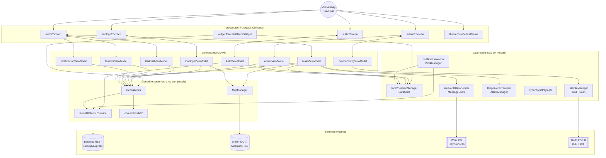

# Módulo `:mobile`

## Descripción

El módulo `:mobile` es la aplicación principal para smartphones del ecosistema **EcoViñedos**. Es la herramienta central de gestión para administradores, enólogos y trabajadores de campo: visualización de datos en tiempo real de las parcelas, control de riego, gestión de la bodega (cava), configuración de hardware IoT vía Bluetooth y sincronización con Wear OS y Smart TV.

**Responsabilidades principales:**
- **Gestión administrativa:** registro y edición de parcelas, usuarios y eventos turísticos.
- **Monitoreo agrícola:** telemetría (humedad, temperatura, Brix, pH) en tableros y gráficos.
- **Control de riego:** activación manual/automática de electroválvulas vía MQTT, con persistencia local del tiempo restante y alarmas del sistema.
- **Configuración de hardware:** flujo guiado BLE para vincular nodos ESP32 a la red WiFi del viñedo.
- **Notificaciones:** alertas proactivas (WorkManager + AlarmManager) sobre condiciones críticas y fin de riego.
- **Widget de escritorio:** Glance Widget con estado de parcela y control de riego rápido.
- **Enoturismo y cava:** gestión de eventos turísticos y monitoreo de secciones de bodega.
- **Vinculación de TV:** emparejamiento de un Smart TV mediante código de sesión.

---

## Tecnologías y Dependencias

| Categoría | Tecnología | Uso en el módulo |
|---|---|---|
| UI | Jetpack Compose + Material Design 3 | Todas las pantallas (`presentation/*`) |
| Red | Retrofit 2.11 + OkHttp (logging-interceptor) | Consumo de la API REST (delegado a `:shared`) |
| Persistencia local | Jetpack DataStore (Preferences) | `SessionManager` (token, rol, IP MQTT) |
| Persistencia local | Room 2.6.1 (declarada) | Base para futura caché local |
| Concurrencia | Kotlin Coroutines + `kotlinx-coroutines-play-services` | ViewModels, `MessageClient` |
| Background | WorkManager 2.9.0 | `NotificationWorker` (sondeo cada 15 min) |
| Background | `AlarmManager` del sistema | `RiegoAlarmReceiver` (fin de riego exacto) |
| Hardware | Bluetooth LE (API nativa Android) | `BleManager`, `DeviceConfigViewModel` |
| Wearables | Google Play Services Wearable (`MessageClient`/`NodeClient`) | `WearableDataSender`, `MainViewModel` |
| Widgets | Jetpack Glance + Glance AppWidget + Glance Material3 | `presentation/widget/*` |
| Mensajería IoT | Eclipse Paho MQTT v3 | `MqttManager` (módulo `:shared`) |
| QR | ZXing Android Embedded 4.3.0 | Vinculación de Smart TV (`LinkTvScreen`) |
| Navegación | Navigation-Compose 2.8.5 | `MainActivity` (grafo de navegación) |
| Serialización | Gson | Payloads MQTT/Wearable |

**Configuración de build** (`mobile/build.gradle.kts`):
- `namespace` / `applicationId`: `mx.utng.ecoviedos`
- `compileSdk = 37`, `minSdk = 24`, `targetSdk = 35`
- `versionCode = 2`, `versionName = "1.1"`
- Depende del módulo `:shared` (`implementation(project(":shared"))`)

---

## Estructura Completa del Módulo

```text
mobile/
├── build.gradle.kts                          # Config Gradle del módulo (SDK, firma, dependencias)
└── src/
    ├── androidTest/java/mx/utng/ecoviedos/
    │   └── ExampleInstrumentedTest.kt         # Test instrumentado de plantilla (sin uso real)
    ├── test/java/mx/utng/ecoviedos/
    │   └── ExampleUnitTest.kt                 # Test unitario de plantilla (sin uso real)
    └── main/
        ├── AndroidManifest.xml                # Permisos, activities, receivers, widget provider
        ├── ic_launcher-playstore.png
        ├── java/mx/utng/ecoviedos/
        │   ├── MainActivity.kt                # Entry point + NavHost (grafo de navegación)
        │   ├── data/
        │   │   ├── NotificationWorker.kt      # CoroutineWorker: sondeo periódico de notificaciones
        │   │   ├── RiegoAlarmReceiver.kt       # BroadcastReceiver: notifica fin de riego (AlarmManager)
        │   │   ├── WearableDataSender.kt       # Envío de parcelas al reloj vía MessageClient
        │   │   ├── ble/
        │   │   │   └── BleManager.kt           # Escaneo/conexión/GATT con nodos ESP32
        │   │   ├── local/
        │   │   │   └── SessionManager.kt       # DataStore: token, userId, nombre, rol, IP MQTT
        │   │   └── sync/
        │   │       ├── BitacoraSyncPayload.kt  # DTO de sincronización offline de bitácora
        │   │       └── RiegoSyncPayload.kt     # DTO de sincronización offline de riego
        │   ├── presentation/
        │   │   ├── admin/
        │   │   │   ├── AddEventScreen.kt              # Alta de eventos de enoturismo (con imagen)
        │   │   │   ├── AddParcelScreen.kt              # Alta/edición de parcelas y umbrales
        │   │   │   ├── AdminPanelScreen.kt             # Menú principal de administración
        │   │   │   ├── AdminViewModel.kt               # CRUD de parcelas y usuarios
        │   │   │   ├── DeviceConfigScreen.kt           # Wizard BLE (3 pasos: escaneo/WiFi/vínculo)
        │   │   │   ├── DeviceConfigViewModel.kt        # Máquina de estados del flujo BLE
        │   │   │   ├── LinkTvScreen.kt                 # Escaneo QR y vínculo de sesión con TV
        │   │   │   ├── ParcelManagementScreen.kt       # Listado/gestión de parcelas
        │   │   │   ├── SampleRecordsScreen.kt          # Listado de muestras de laboratorio (mock)
        │   │   │   ├── SettingsScreen.kt               # Configuración de IP del broker MQTT
        │   │   │   ├── TourismManagementScreen.kt      # Gestión de eventos turísticos
        │   │   │   └── UserManagementScreen.kt         # CRUD de usuarios y roles
        │   │   ├── auth/
        │   │   │   ├── AuthViewModel.kt                # Login y recuperación de contraseña
        │   │   │   ├── ForgotPasswordScreen.kt         # Solicitud de código de recuperación
        │   │   │   ├── LoginScreen.kt                  # Pantalla de inicio de sesión
        │   │   │   ├── ResetPasswordScreen.kt          # Formulario de nueva contraseña
        │   │   │   └── VerifyCodeScreen.kt             # Verificación de código de 6 dígitos
        │   │   ├── enologo/
        │   │   │   ├── CavaManagementScreen.kt         # CRUD de cavas y secciones
        │   │   │   ├── CavaStateScreen.kt              # Estado en tiempo real de la cava
        │   │   │   ├── EnologoDashboardScreen.kt       # Panel resumen para el rol enólogo
        │   │   │   ├── EnologoMainScreen.kt            # Contenedor de navegación del perfil enólogo
        │   │   │   ├── EnologoPanelScreen.kt           # Menú de opciones del enólogo
        │   │   │   └── EnologoViewModel.kt             # Datos de cavas/eventos + MQTT de secciones
        │   │   ├── main/
        │   │   │   ├── DashboardScreen.kt              # Dashboard con índice de madurez y alertas
        │   │   │   ├── HistorialViewModel.kt           # Consulta de histórico de sensores/riegos
        │   │   │   ├── HistoryScreen.kt                # Bitácora histórica y resúmenes diarios
        │   │   │   ├── IrrigationScreen.kt             # Centro de control de riego por parcela
        │   │   │   ├── MainScreen.kt                   # Scaffold con bottom navigation
        │   │   │   ├── MainViewModel.kt                # Estado global: parcelas, MQTT, riego, alarmas
        │   │   │   ├── MaturationScreen.kt             # Índice de maduración por variedad
        │   │   │   ├── MuestraViewModel.kt             # Registro/consulta de muestras de laboratorio
        │   │   │   ├── NotificacionViewModel.kt        # Lista y contador de notificaciones
        │   │   │   ├── NotificationScreen.kt           # Bandeja de notificaciones del usuario
        │   │   │   ├── ParcelDetailsScreen.kt          # Detalle completo de una parcela
        │   │   │   └── RegisterSampleScreen.kt         # Formulario de registro de muestra (Brix/pH)
        │   │   ├── theme/
        │   │   │   ├── Color.kt                        # Paleta de colores (modo oscuro)
        │   │   │   └── Theme.kt                        # `EcoViedosTheme` (MaterialTheme)
        │   │   └── widget/
        │   │       ├── ParcelaGlanceWidget.kt          # Glance AppWidget: estado + control de riego
        │   │       ├── ParcelaGlanceWidgetReceiver.kt  # Receiver del widget (registro en manifest)
        │   │       ├── ToggleRiegoAction.kt            # ActionCallback: enciende/apaga riego vía MQTT
        │   │       └── WidgetConfigurationActivity.kt  # Configuración inicial del widget
        │   └── utils/
        │       └── UriPathHelper.kt                    # Conversión de `Uri` a `MultipartBody.Part`
        ├── keepRules/
        │   └── rules.keep
        └── res/
            ├── drawable/                       # Iconografía (fondo/foreground de launcher, widget)
            ├── layout/                          # `activity_main.xml`, `glance_default_layout.xml`
            ├── mipmap-*/                        # Iconos de la app en distintas densidades
            ├── values/ · values-night/          # Strings, colores y temas (claro/oscuro)
            └── xml/                             # Backup rules, data extraction, `parcela_widget_info.xml`
```

---

## Diagrama de Arquitectura y Flujo de Datos



**Flujo de comunicación resumido:**

1. **HTTP/REST** — `Repositories` (en `:shared`) usan `RetrofitClient` para CRUD contra el backend Node.js. El token JWT persistido en `SessionManager` se adjunta como header `Authorization: Bearer`.
2. **MQTT** — `MqttManager` (en `:shared`) se conecta al broker y publica/suscribe en tópicos `vinedo/parcela/{id}/stats|riego|control` para telemetría y control de riego en tiempo real; `MainViewModel` y `EnologoViewModel` consumen estos eventos.
3. **BLE** — `BleManager` escanea, conecta por GATT y escribe/lee características (`SERVICE_UUID`, `CONFIG_CHAR_UUID`, `STATUS_CHAR_UUID`) para configurar la red WiFi de un nodo ESP32 recién instalado.
4. **Wearable Data Layer** — `WearableDataSender` serializa la lista de parcelas (Gson) y la envía por `MessageClient` a los relojes Wear OS conectados.
5. **Background** — `NotificationWorker` (WorkManager, cada 15 min) sondea notificaciones no leídas; `RiegoAlarmReceiver` (AlarmManager, hora exacta) avisa cuando el riego debe finalizar, incluso con la app cerrada.
6. **Widget** — `ParcelaGlanceWidget` lee `SessionManager` y el repositorio de parcelas para pintar el estado en la pantalla de inicio; `ToggleRiegoAction` abre una conexión MQTT efímera para encender/apagar el riego desde el widget.

---

## Clases y Componentes Principales

| Clase / Archivo | Tipo | Responsabilidad |
|---|---|---|
| `MainActivity` | Activity | Orquestador de navegación (`NavHost`), permisos de notificación, programa `NotificationWorker`. |
| `MainViewModel` | ViewModel | Estado global de parcelas, cliente MQTT, temporizador de riego, alarmas y sincronización con Wear OS. |
| `AdminViewModel` | ViewModel | CRUD de parcelas y usuarios; registra eventos en la bitácora. |
| `AuthViewModel` | ViewModel | Login, solicitud/verificación de código y restablecimiento de contraseña. |
| `DeviceConfigViewModel` | ViewModel | Máquina de estados (`BleUiState`) del flujo de vinculación BLE. |
| `EnologoViewModel` | ViewModel | Carga de cavas/eventos y actualización en tiempo real de secciones vía MQTT. |
| `HistorialViewModel` | ViewModel | Consulta histórico de sensores, resúmenes diarios y riegos por parcela. |
| `MuestraViewModel` | ViewModel | Registro y consulta de muestras de laboratorio (Brix, pH, acidez). |
| `NotificacionViewModel` | ViewModel | Lista de notificaciones y contador de no leídas. |
| `BleManager` | Data | Escaneo, conexión GATT, envío/lectura de características BLE. |
| `SessionManager` | Data | Persistencia reactiva de sesión (DataStore Preferences). |
| `WearableDataSender` | Data | Envío de datos al reloj vía `MessageClient`. |
| `NotificationWorker` | Data (Worker) | Sondeo periódico de notificaciones en segundo plano. |
| `RiegoAlarmReceiver` | Data (Receiver) | Notificación exacta de fin de riego. |
| `ParcelaGlanceWidget` | Widget | Renderiza el estado de una parcela en la pantalla de inicio. |
| `ToggleRiegoAction` | Widget | Acción del widget para alternar el riego vía MQTT. |
| `UriPathHelper` | Utils | Convierte un `Uri` de galería en `MultipartBody.Part` para subir imágenes. |

---


## Código Fuente Completo (documentado, en el orden del árbol de directorios)

A continuación se incluye el código fuente íntegro de cada archivo Kotlin del módulo `:mobile`, en el mismo orden en que aparecen en el árbol de la sección anterior. El código conserva su documentación KDoc original; en los archivos que no la traían en el repositorio se añadieron comentarios explicativos para dejar clara la responsabilidad de cada clase/función.

### `MainActivity.kt`
**Ubicación:** `mobile/src/main/java/mx/utng/ecoviedos/MainActivity.kt`

```kotlin
package mx.utng.ecoviedos

import android.Manifest
import android.content.Intent
import android.content.pm.PackageManager
import android.os.Build
import android.os.Bundle
import androidx.activity.ComponentActivity
import androidx.core.content.ContextCompat
import androidx.activity.compose.setContent
import androidx.compose.foundation.layout.fillMaxSize
import androidx.compose.material3.MaterialTheme
import androidx.compose.material3.Surface
import androidx.compose.runtime.collectAsState
import androidx.compose.runtime.getValue
import androidx.compose.ui.Modifier
import androidx.lifecycle.viewmodel.compose.viewModel
import androidx.navigation.compose.NavHost
import androidx.navigation.compose.composable
import androidx.navigation.compose.rememberNavController
import androidx.navigation.navArgument
import androidx.work.ExistingPeriodicWorkPolicy
import androidx.work.PeriodicWorkRequestBuilder
import androidx.work.WorkManager
import mx.utng.ecoviedos.data.NotificationWorker
import mx.utng.ecoviedos.presentation.auth.LoginScreen
import mx.utng.ecoviedos.presentation.auth.ForgotPasswordScreen
import mx.utng.ecoviedos.presentation.auth.VerifyCodeScreen
import mx.utng.ecoviedos.presentation.auth.ResetPasswordScreen
import mx.utng.ecoviedos.presentation.main.MainScreen
import mx.utng.ecoviedos.presentation.main.MainViewModel
import mx.utng.ecoviedos.presentation.main.HistorialViewModel
import mx.utng.ecoviedos.presentation.main.ParcelDetailsScreen
import mx.utng.ecoviedos.presentation.main.RegisterSampleScreen
import mx.utng.ecoviedos.presentation.main.NotificationScreen
import mx.utng.ecoviedos.presentation.admin.AdminPanelScreen
import mx.utng.ecoviedos.presentation.admin.AdminViewModel
import mx.utng.ecoviedos.presentation.admin.AddParcelScreen
import mx.utng.ecoviedos.presentation.admin.ParcelManagementScreen
import mx.utng.ecoviedos.presentation.admin.SampleRecordsScreen
import mx.utng.ecoviedos.presentation.admin.UserManagementScreen
import mx.utng.ecoviedos.presentation.admin.SettingsScreen
import mx.utng.ecoviedos.presentation.admin.DeviceConfigScreen
import mx.utng.ecoviedos.presentation.admin.DeviceConfigViewModel
import mx.utng.ecoviedos.presentation.admin.TourismManagementScreen
import mx.utng.ecoviedos.presentation.admin.AddEventScreen
import mx.utng.ecoviedos.presentation.admin.LinkTvScreen
import mx.utng.ecoviedos.presentation.enologo.EnologoMainScreen
import mx.utng.ecoviedos.presentation.enologo.CavaStateScreen
import mx.utng.ecoviedos.presentation.enologo.CavaManagementScreen
import mx.utng.ecoviedos.presentation.theme.EcoViedosTheme

/**
 * Actividad principal de la aplicación móvil EcoViñedos.
 *
 * Esta clase se encarga de:
 * 1. Inicializar el sistema de navegación basado en Jetpack Compose.
 * 2. Gestionar los ciclos de vida de la actividad y los intents entrantes.
 * 3. Solicitar permisos necesarios (como notificaciones).
 * 4. Programar tareas en segundo plano mediante [WorkManager].
 * 5. Proveer los [ViewModel] principales a la jerarquía de UI.
 */
class MainActivity : ComponentActivity() {
    /**
     * Maneja los nuevos intents recibidos mientras la actividad está en ejecución.
     * Útil para la navegación desde notificaciones.
     */
    override fun onNewIntent(intent: Intent) {
        super.onNewIntent(intent)
        setIntent(intent) // Actualizar el intent para que NavHost lo vea
    }

    /**
     * Punto de entrada de la actividad donde se configura el contenido de Compose y los servicios iniciales.
     */
    override fun onCreate(savedInstanceState: Bundle?) {
        super.onCreate(savedInstanceState)
        
        scheduleNotificationWorker()

        if (Build.VERSION.SDK_INT >= Build.VERSION_CODES.TIRAMISU) {
            if (ContextCompat.checkSelfPermission(this, Manifest.permission.POST_NOTIFICATIONS) != PackageManager.PERMISSION_GRANTED) {
                requestPermissions(arrayOf(Manifest.permission.POST_NOTIFICATIONS), 101)
            }
        }

        setContent {
            EcoViedosTheme {
                Surface(
                    modifier = Modifier.fillMaxSize(),
                    color = MaterialTheme.colorScheme.background
                ) {
                    val navController = rememberNavController()
                    
                    // Inicializar ViewModels para persistencia durante la sesión
                    val mainViewModel: MainViewModel = viewModel()
                    val adminViewModel: AdminViewModel = viewModel()
                    val configViewModel: DeviceConfigViewModel = viewModel()
                    val historialViewModel: HistorialViewModel = viewModel()
                    
                    // Conectar ViewModels para el testeo local
                    adminViewModel.setMainViewModel(mainViewModel)

                    val token by mainViewModel.sessionToken.collectAsState(initial = "loading")
                    val userRol by mainViewModel.sessionRol.collectAsState(initial = "")

                    if (token != "loading") {
                        NavHost(
                            navController = navController,
                            startDestination = when {
                                token.isNullOrBlank() -> "login"
                                userRol == "enologo" -> "enologo_panel"
                                else -> "main"
                            }
                        ) {
                            composable("login") {
                                LoginScreen(
                                    onLoginSuccess = { rol ->
                                        if (rol == "enologo") {
                                            navController.navigate("enologo_panel") {
                                                popUpTo("login") { inclusive = true }
                                            }
                                        } else {
                                            navController.navigate("main") {
                                                popUpTo("login") { inclusive = true }
                                            }
                                        }
                                    },
                                    onForgotPassword = { navController.navigate("forgot_password") }
                                )
                            }
                            composable("enologo_panel") {
                                EnologoMainScreen(
                                    mainViewModel = mainViewModel,
                                    onLogout = {
                                        mainViewModel.logout()
                                        navController.navigate("login") {
                                            popUpTo("enologo_panel") { inclusive = true }
                                        }
                                    },
                                    onNavigateToAddActivity = { navController.navigate("add_event") },
                                    onNavigateToEditActivity = { id -> navController.navigate("add_event?id=$id") },
                                    onNavigateToLinkSensor = { id, name -> 
                                        navController.navigate("device_config?targetId=$id&targetName=$name&type=CAVA")
                                    }
                                )
                            }
                            composable("cava_state") {
                                CavaStateScreen(onNavigateBack = { navController.popBackStack() })
                            }
                            composable("cava_management") {
                                CavaManagementScreen(
                                    onNavigateBack = { navController.popBackStack() },
                                    onNavigateToLinkSensor = { id, name -> 
                                        navController.navigate("device_config?targetId=$id&targetName=$name&type=CAVA")
                                    },
                                    mainViewModel = mainViewModel
                                )
                            }
                            composable("forgot_password") {
                                ForgotPasswordScreen(
                                    onNavigateBack = { navController.popBackStack() },
                                    onCodeSent = { email -> 
                                        navController.navigate("verify_code/$email")
                                    }
                                )
                            }
                            composable("verify_code/{email}") { backStackEntry ->
                                val email = backStackEntry.arguments?.getString("email") ?: ""
                                VerifyCodeScreen(
                                    email = email,
                                    onNavigateBack = { navController.popBackStack() },
                                    onCodeVerified = { code ->
                                        navController.navigate("reset_password/$email/$code")
                                    }
                                )
                            }
                            composable("reset_password/{email}/{code}") { backStackEntry ->
                                val email = backStackEntry.arguments?.getString("email") ?: ""
                                val code = backStackEntry.arguments?.getString("code") ?: ""
                                ResetPasswordScreen(
                                    email = email,
                                    code = code,
                                    onPasswordReset = {
                                        navController.navigate("login") {
                                            popUpTo("forgot_password") { inclusive = true }
                                        }
                                    }
                                )
                            }
                            composable("main") {
                                val navigateTo = intent.getStringExtra("navigate_to")
                                val initialTab = if (navigateTo == "riego") 2 else 0
                                // Limpiar el extra para que no se repita en recomposiciones
                                intent.removeExtra("navigate_to")
                                
                                MainScreen(
                                    viewModel = mainViewModel,
                                    historialViewModel = historialViewModel,
                                    initialTab = initialTab,
                                    onNavigateToAdmin = { navController.navigate("admin") },
                                    onNavigateToParcelDetails = { id -> navController.navigate("parcel_details/$id") },
                                    onNavigateToNotifications = { navController.navigate("notifications") },
                                    onLogout = {
                                        mainViewModel.logout()
                                        navController.navigate("login") {
                                            popUpTo("main") { inclusive = true }
                                        }
                                    }
                                )
                            }
                            composable("admin") {
                                val userRol by mainViewModel.sessionRol.collectAsState(initial = "")
                                AdminPanelScreen(
                                    onNavigateBack = { navController.popBackStack() },
                                    onNavigateToParcelManagement = { navController.navigate("parcel_management") },
                                    onNavigateToTourismManagement = { navController.navigate("tourism_management") },
                                    onNavigateToEnologoMode = { navController.navigate("enologo_panel") },
                                    onNavigateToLinkTv = { navController.navigate("link_tv") },
                                    onNavigateToSamples = { }, // Ya no se usa desde aquí
                                    onNavigateToUsers = { navController.navigate("users") },
                                    onNavigateToSettings = { navController.navigate("settings") },
                                    onNavigateToDeviceConfig = { navController.navigate("device_config") },
                                    onLogout = {
                                        mainViewModel.logout()
                                        navController.navigate("login") {
                                            popUpTo("main") { inclusive = true }
                                        }
                                    },
                                    userRol = userRol ?: ""
                                )
                            }
                            composable("link_tv") {
                                LinkTvScreen(
                                    onNavigateBack = { navController.popBackStack() },
                                    onNavigateToEnologo = {
                                        navController.navigate("enologo_panel") {
                                            popUpTo("admin") { inclusive = false }
                                        }
                                    },
                                    mainViewModel = mainViewModel
                                )
                            }
                            composable("tourism_management") {
                                TourismManagementScreen(
                                    onNavigateBack = { navController.popBackStack() },
                                    onNavigateToAdd = { navController.navigate("add_event") },
                                    onNavigateToEdit = { id -> navController.navigate("add_event?id=$id") }
                                )
                            }
                            composable(
                                route = "add_event?id={id}",
                                arguments = listOf(
                                    navArgument("id") {
                                        nullable = true
                                        defaultValue = null
                                    }
                                )
                            ) { backStackEntry ->
                                val id = backStackEntry.arguments?.getString("id")
                                AddEventScreen(
                                    onNavigateBack = { navController.popBackStack() },
                                    eventId = id
                                )
                            }
                            composable("parcel_details/{id}") { backStackEntry ->
                                val id = backStackEntry.arguments?.getString("id") ?: ""
                                val userRol by mainViewModel.sessionRol.collectAsState(initial = "")
                                ParcelDetailsScreen(
                                    parcelId = id,
                                    onNavigateBack = { navController.popBackStack() },
                                    onNavigateToRegisterSample = { navController.navigate("register_sample/$id") },
                                    mainViewModel = mainViewModel,
                                    userRol = userRol ?: ""
                                )
                            }
                            composable("register_sample/{id}") { backStackEntry ->
                                val id = backStackEntry.arguments?.getString("id") ?: ""
                                RegisterSampleScreen(
                                    parcelId = id,
                                    onNavigateBack = {
                                        mainViewModel.cargarParcelas()
                                        navController.popBackStack()
                                    }
                                )
                            }
                            composable("parcel_management") {
                                ParcelManagementScreen(
                                    onNavigateBack = { navController.popBackStack() },
                                    onNavigateToAdd = { navController.navigate("add_parcel") },
                                    onNavigateToEdit = { id -> navController.navigate("add_parcel?id=$id") },
                                    viewModel = mainViewModel,
                                    adminViewModel = adminViewModel
                                )
                            }
                            composable(
                                route = "device_config?targetId={targetId}&targetName={targetName}&type={type}",
                                arguments = listOf(
                                    navArgument("targetId") { nullable = true; defaultValue = null },
                                    navArgument("targetName") { nullable = true; defaultValue = null },
                                    navArgument("type") { nullable = true; defaultValue = "PARCELA" }
                                )
                            ) { backStackEntry ->
                                val targetId = backStackEntry.arguments?.getString("targetId")
                                val targetName = backStackEntry.arguments?.getString("targetName")
                                val type = backStackEntry.arguments?.getString("type") ?: "PARCELA"
                                
                                DeviceConfigScreen(
                                    onNavigateBack = { navController.popBackStack() },
                                    onNavigateToAddParcel = { navController.navigate("add_parcel") },
                                    mainViewModel = mainViewModel,
                                    configViewModel = configViewModel,
                                    preselectedId = targetId,
                                    preselectedName = targetName,
                                    linkType = type
                                )
                            }
                            composable("settings") {
                                SettingsScreen(
                                    onNavigateBack = { navController.popBackStack() },
                                    viewModel = mainViewModel
                                )
                            }
                            composable("users") {
                                UserManagementScreen(
                                    onNavigateBack = { navController.popBackStack() },
                                    adminViewModel = adminViewModel
                                )
                            }
                            composable(
                                route = "add_parcel?id={id}",
                                arguments = listOf(
                                    navArgument("id") {
                                        nullable = true
                                        defaultValue = null
                                    }
                                )
                            ) { backStackEntry ->
                                val id = backStackEntry.arguments?.getString("id")
                                AddParcelScreen(
                                    onNavigateBack = { navController.popBackStack() },
                                    adminViewModel = adminViewModel,
                                    parcelId = id,
                                    mainViewModel = mainViewModel
                                )
                            }
                            composable("samples") {
                                SampleRecordsScreen(onNavigateBack = { navController.popBackStack() })
                            }
                            composable("notifications") {
                                NotificationScreen(onNavigateBack = { navController.popBackStack() })
                            }
                        }
                    }
                }
            }
        }
    }

    /**
     * Programa la tarea periódica de sincronización de notificaciones.
     * Se ejecuta cada 15 minutos para verificar nuevas alertas desde el servidor.
     */
    private fun scheduleNotificationWorker() {
        val workRequest = PeriodicWorkRequestBuilder<NotificationWorker>(
            15, java.util.concurrent.TimeUnit.MINUTES
        ).build()

        WorkManager.getInstance(this).enqueueUniquePeriodicWork(
            "NotificationSync",
            ExistingPeriodicWorkPolicy.KEEP,
            workRequest
        )
    }
}
```

### `data/NotificationWorker.kt`
**Ubicación:** `mobile/src/main/java/mx/utng/ecoviedos/data/NotificationWorker.kt`

```kotlin
package mx.utng.ecoviedos.data

import android.app.NotificationChannel
import android.app.NotificationManager
import android.app.PendingIntent
import android.content.Context
import android.content.Intent
import android.os.Build
import android.util.Log
import androidx.core.app.NotificationCompat
import androidx.work.CoroutineWorker
import androidx.work.WorkerParameters
import androidx.work.ListenableWorker
import kotlinx.coroutines.flow.first
import mx.utng.ecoviedos.MainActivity
import mx.utng.ecoviedos.data.local.SessionManager
import mx.utng.ecoviedos.data.remote.RetrofitClient

/**
 * Trabajador en segundo plano encargado de la sincronización de notificaciones.
 *
 * Utiliza [CoroutineWorker] de la biblioteca AndroidX WorkManager para realizar consultas
 * periódicas al servidor y verificar si hay nuevas notificaciones sin leer para el usuario actual.
 *
 * @param appContext Contexto de la aplicación.
 * @param workerParams Parámetros de configuración del trabajador.
 */
class NotificationWorker(
    appContext: Context,
    workerParams: WorkerParameters
) : CoroutineWorker(appContext, workerParams) {

    /**
     * Ejecuta la lógica de sincronización.
     *
     * 1. Recupera el token de sesión.
     * 2. Consulta las notificaciones mediante [RetrofitClient.notificacionService].
     * 3. Filtra las notificaciones con estado "no leida".
     * 4. Muestra una notificación del sistema si existen nuevos mensajes.
     *
     * @return [ListenableWorker.Result.success] si se procesó correctamente,
     * [ListenableWorker.Result.retry] en caso de error de red.
     */
    override suspend fun doWork(): ListenableWorker.Result {
        val sessionManager = SessionManager(applicationContext)
        val token = sessionManager.token.first()

        if (token.isNullOrBlank()) {
            return ListenableWorker.Result.success()
        }

        return try {
            val response = RetrofitClient.notificacionService.obtenerMisNotificaciones("Bearer $token")
            if (response.isSuccessful && response.body() != null) {
                val newNotifications = response.body()!!.filter { it.estado == "no leida" }
                
                if (newNotifications.isNotEmpty()) {
                    val mostRecent = newNotifications.first()
                    showNotification(
                        mostRecent.titulo, 
                        if (newNotifications.size > 1) "Tienes ${newNotifications.size} avisos nuevos" else mostRecent.mensaje
                    )
                }
            }
            ListenableWorker.Result.success()
        } catch (e: Exception) {
            Log.e("NotificationWorker", "Error checking notifications", e)
            ListenableWorker.Result.retry()
        }
    }

    /**
     * Construye y despliega una notificación push en el sistema Android.
     *
     * @param title Título descriptivo de la alerta.
     * @param message Cuerpo del mensaje a mostrar.
     */
    private fun showNotification(title: String, message: String) {
        val context = applicationContext
        val channelId = "system_notifications"
        val notificationManager = context.getSystemService(Context.NOTIFICATION_SERVICE) as NotificationManager

        if (Build.VERSION.SDK_INT >= Build.VERSION_CODES.O) {
            val channel = NotificationChannel(channelId, "Avisos del Viñedo", NotificationManager.IMPORTANCE_DEFAULT)
            notificationManager.createNotificationChannel(channel)
        }

        val intent = Intent(context, MainActivity::class.java).apply {
            flags = Intent.FLAG_ACTIVITY_NEW_TASK or Intent.FLAG_ACTIVITY_CLEAR_TASK
            putExtra("navigate_to", "notifications")
        }
        
        val pendingIntent = PendingIntent.getActivity(
            context, 0, intent,
            PendingIntent.FLAG_UPDATE_CURRENT or PendingIntent.FLAG_IMMUTABLE
        )

        val notification = NotificationCompat.Builder(context, channelId)
            .setSmallIcon(android.R.drawable.ic_dialog_info)
            .setContentTitle(title)
            .setContentText(message)
            .setPriority(NotificationCompat.PRIORITY_HIGH)
            .setAutoCancel(true)
            .setContentIntent(pendingIntent)
            .build()

        notificationManager.notify(999, notification)
    }
}
```

### `data/RiegoAlarmReceiver.kt`
**Ubicación:** `mobile/src/main/java/mx/utng/ecoviedos/data/RiegoAlarmReceiver.kt`

```kotlin
package mx.utng.ecoviedos.data

import android.app.NotificationChannel
import android.app.NotificationManager
import android.app.PendingIntent
import android.content.BroadcastReceiver
import android.content.Context
import android.content.Intent
import android.os.Build
import androidx.core.app.NotificationCompat
import mx.utng.ecoviedos.MainActivity
import mx.utng.ecoviedos.R

class RiegoAlarmReceiver : BroadcastReceiver() {
    override fun onReceive(context: Context, intent: Intent) {
        val parcelaId = intent.getStringExtra("parcela_id") ?: return
        val parcelaNombre = intent.getStringExtra("parcela_nombre") ?: "Parcela"
        val modo = intent.getStringExtra("modo") ?: "AUTO"

        val channelId = "riego_notifications"
        val notificationManager = context.getSystemService(Context.NOTIFICATION_SERVICE) as NotificationManager

        if (Build.VERSION.SDK_INT >= Build.VERSION_CODES.O) {
            val channel = NotificationChannel(channelId, "Notificaciones de Riego", NotificationManager.IMPORTANCE_HIGH)
            notificationManager.createNotificationChannel(channel)
        }

        val message = if (modo == "AUTO") {
            "El riego automático en $parcelaNombre ha finalizado."
        } else {
            "¡Tiempo agotado en $parcelaNombre! Debes detener el riego manual."
        }

        val launchIntent = Intent(context, MainActivity::class.java).apply {
            flags = Intent.FLAG_ACTIVITY_NEW_TASK or Intent.FLAG_ACTIVITY_CLEAR_TASK
            putExtra("navigate_to", "riego")
        }
        val pendingIntent = PendingIntent.getActivity(
            context, parcelaId.hashCode(), launchIntent, 
            PendingIntent.FLAG_UPDATE_CURRENT or PendingIntent.FLAG_IMMUTABLE
        )

        val notification = NotificationCompat.Builder(context, channelId)
            .setSmallIcon(android.R.drawable.stat_sys_warning)
            .setContentTitle("Riego: $parcelaNombre")
            .setContentText(message)
            .setPriority(NotificationCompat.PRIORITY_HIGH)
            .setAutoCancel(true)
            .setContentIntent(pendingIntent)
            .build()

        notificationManager.notify(parcelaId.hashCode(), notification)
    }
}
```

### `data/WearableDataSender.kt`
**Ubicación:** `mobile/src/main/java/mx/utng/ecoviedos/data/WearableDataSender.kt`

```kotlin
package mx.utng.ecoviedos.data

import android.content.Context
import android.util.Log
import com.google.android.gms.wearable.Wearable
import com.google.gson.Gson
import mx.utng.ecoviedos.domain.model.Parcela

class WearableDataSender(private val context: Context) {
    private val messageClient = Wearable.getMessageClient(context)
    private val nodeClient = Wearable.getNodeClient(context)
    private val gson = Gson()

    fun sendParcelas(parcelas: List<Parcela>) {
        val json = gson.toJson(parcelas)
        val data = json.toByteArray(Charsets.UTF_8)

        nodeClient.connectedNodes.addOnSuccessListener { nodes ->
            if (nodes.isEmpty()) {
                Log.w("WearableDataSender", "No hay relojes conectados para enviar mensaje")
            }
            nodes.forEach { node ->
                messageClient.sendMessage(node.id, "/parcelas_message", data)
                    .addOnSuccessListener { 
                        Log.d("WearableDataSender", "¡MENSAJE ENVIADO INSTANTÁNEAMENTE A: ${node.displayName}!") 
                    }
                    .addOnFailureListener { e -> 
                        Log.e("WearableDataSender", "Fallo al enviar mensaje", e) 
                    }
            }
        }
    }
}
```

### `data/ble/BleManager.kt`
**Ubicación:** `mobile/src/main/java/mx/utng/ecoviedos/data/ble/BleManager.kt`

```kotlin
package mx.utng.ecoviedos.data.ble

import android.annotation.SuppressLint
import android.bluetooth.*
import android.bluetooth.le.ScanCallback
import android.bluetooth.le.ScanResult
import android.content.Context
import android.os.Build
import android.os.Handler
import android.os.Looper
import android.util.Log
import java.util.*

/**
 * Gestor de comunicaciones Bluetooth Low Energy (BLE).
 * 
 * Centraliza la lógica de escaneo, conexión GATT, lectura/escritura de características
 * y recepción de notificaciones desde dispositivos periféricos (ESP32).
 * 
 * @property context Contexto de la aplicación necesario para acceder a los servicios de sistema.
 */
class BleManager(private val context: Context) {

    companion object {
        // UUIDs: Asegúrate de que coincidan con BluetoothConfig.h en tu ESP32
        val SERVICE_UUID: UUID = UUID.fromString("4fafc201-1fb5-459e-8fcc-c5c9c331914b")
        val CONFIG_CHAR_UUID: UUID = UUID.fromString("beb5483e-36e1-4688-b7f5-ea07361b26a8")
        val STATUS_CHAR_UUID: UUID = UUID.fromString("0b9a3f9e-2a2c-4c9a-9d7a-5a9f0b0e2b0d")
        private const val TAG = "BleManager"
    }

    private val bluetoothManager = context.getSystemService(Context.BLUETOOTH_SERVICE) as BluetoothManager
    private val adapter = bluetoothManager.adapter

    /**
     * Verifica si el adaptador Bluetooth está encendido.
     * 
     * @return true si el Bluetooth está disponible y activo.
     */
    fun isBluetoothEnabled(): Boolean = adapter?.isEnabled == true

    private var bluetoothGatt: BluetoothGatt? = null

    private var onDeviceDiscovered: ((BluetoothDevice) -> Unit)? = null
    private var onConnectionStateChanged: ((Int) -> Unit)? = null
    private var onDataSent: ((Boolean) -> Unit)? = null
    private var onNotificationReceived: ((String) -> Unit)? = null

    /**
     * Callback invocado por el sistema durante el escaneo BLE.
     */
    private val scanCallback = object : ScanCallback() {
        @SuppressLint("MissingPermission")
        override fun onScanResult(callbackType: Int, result: ScanResult) {
            val device = result.device
            val name = result.scanRecord?.deviceName ?: device.name

            if (name != null) {
                Log.d(TAG, "Dispositivo encontrado: $name [${device.address}]")
                onDeviceDiscovered?.invoke(device)
            }
        }

        override fun onScanFailed(errorCode: Int) {
            Log.e(TAG, "Error de escaneo: $errorCode")
        }
    }

    /**
     * Callback principal para el manejo de la conexión GATT y descubrimiento de servicios.
     */
    private val gattCallback = object : BluetoothGattCallback() {
        @SuppressLint("MissingPermission")
        override fun onConnectionStateChange(gatt: BluetoothGatt, status: Int, newState: Int) {
            if (status != BluetoothGatt.GATT_SUCCESS) {
                val errorMsg = when(status) {
                    133 -> "Error 133: El sistema BLE está saturado o el dispositivo rechazó la conexión. Intenta reiniciar el Bluetooth del celular."
                    8 -> "Error 8: Timeout de conexión. El dispositivo está fuera de rango o apagado."
                    1 -> "Error 1 (GATT_ERROR): El dispositivo no respondió a la solicitud de conexión."
                    else -> "Error GATT: status=$status"
                }
                Log.e(TAG, errorMsg)
                disconnect()
                onConnectionStateChanged?.invoke(BluetoothProfile.STATE_DISCONNECTED)
                return
            }

            if (newState == BluetoothProfile.STATE_CONNECTED) {
                Log.i(TAG, "GATT Conectado. Solicitando MTU mayor...")
                gatt.requestMtu(512) 
            } else if (newState == BluetoothProfile.STATE_DISCONNECTED) {
                Log.i(TAG, "GATT Desconectado.")
                onConnectionStateChanged?.invoke(newState)
            }
        }

        @SuppressLint("MissingPermission")
        override fun onMtuChanged(gatt: BluetoothGatt, mtu: Int, status: Int) {
            Log.i(TAG, "MTU cambiado a: $mtu, status: $status")
            gatt.discoverServices()
        }

        override fun onServicesDiscovered(gatt: BluetoothGatt, status: Int) {
            if (status == BluetoothGatt.GATT_SUCCESS) {
                Log.i(TAG, "Servicios descubiertos con éxito.")
                val service = gatt.getService(SERVICE_UUID)
                if (service != null) {
                    Log.i(TAG, "Servicio EcoViñedos encontrado.")
                    onConnectionStateChanged?.invoke(BluetoothProfile.STATE_CONNECTED)
                } else {
                    Log.e(TAG, "Servicio EcoViñedos NO encontrado en este dispositivo.")
                    disconnect()
                    onConnectionStateChanged?.invoke(BluetoothProfile.STATE_DISCONNECTED)
                }
            }
        }

        override fun onCharacteristicWrite(gatt: BluetoothGatt, characteristic: BluetoothGattCharacteristic, status: Int) {
            if (characteristic.uuid == CONFIG_CHAR_UUID) {
                Log.d(TAG, "Escritura completada. Status: $status")
                onDataSent?.invoke(status == BluetoothGatt.GATT_SUCCESS)
            }
        }

        @Deprecated("Deprecated in Java")
        override fun onCharacteristicChanged(gatt: BluetoothGatt, characteristic: BluetoothGattCharacteristic) {
            if (characteristic.uuid == STATUS_CHAR_UUID) {
                val data = String(characteristic.value).trim().replace("\u0000", "")
                Log.d(TAG, "Notificación recibida: $data")
                onNotificationReceived?.invoke(data)
            }
        }

        override fun onCharacteristicChanged(gatt: BluetoothGatt, characteristic: BluetoothGattCharacteristic, value: ByteArray) {
            if (characteristic.uuid == STATUS_CHAR_UUID) {
                val data = String(value).trim().replace("\u0000", "")
                Log.d(TAG, "Notificación recibida (v2): $data")
                onNotificationReceived?.invoke(data)
            }
        }
    }

    /**
     * Inicia el escaneo de dispositivos de bajo consumo.
     * 
     * @param onDiscovered Callback invocado cada vez que se detecta un dispositivo válido.
     */
    @SuppressLint("MissingPermission")
    fun startScan(onDiscovered: (BluetoothDevice) -> Unit) {
        onDeviceDiscovered = onDiscovered
        val scanner = adapter.bluetoothLeScanner
        if (scanner != null) {
            Log.d(TAG, "Iniciando escaneo real...")
            scanner.startScan(scanCallback)
        } else {
            Log.e(TAG, "El escáner BLE no está disponible (¿Bluetooth apagado?)")
        }
    }

    /**
     * Detiene el escaneo activo de dispositivos BLE.
     */
    @SuppressLint("MissingPermission")
    fun stopScan() {
        adapter.bluetoothLeScanner?.stopScan(scanCallback)
    }

    /**
     * Inicia una solicitud de conexión GATT con un dispositivo específico.
     * 
     * @param address Dirección MAC del dispositivo.
     * @param onStateChange Callback para notificar cambios en el estado de la conexión.
     */
    @SuppressLint("MissingPermission")
    fun connect(address: String, onStateChange: (Int) -> Unit) {
        onConnectionStateChanged = onStateChange
        disconnect()
        
        val device = adapter.getRemoteDevice(address)
        Log.d(TAG, "Intentando conectar a ${device.address}...")

        Handler(Looper.getMainLooper()).postDelayed({
            bluetoothGatt = if (Build.VERSION.SDK_INT >= Build.VERSION_CODES.M) {
                device.connectGatt(context, false, gattCallback, BluetoothDevice.TRANSPORT_LE)
            } else {
                device.connectGatt(context, false, gattCallback)
            }
        }, 500)
    }

    /**
     * Envía una cadena JSON al dispositivo mediante la característica de configuración.
     * 
     * @param json Contenido a enviar.
     * @param onResult Callback que indica si la escritura fue exitosa.
     */
    @SuppressLint("MissingPermission")
    fun sendConfig(json: String, onResult: (Boolean) -> Unit) {
        onDataSent = onResult
        val service = bluetoothGatt?.getService(SERVICE_UUID)
        val characteristic = service?.getCharacteristic(CONFIG_CHAR_UUID)

        if (characteristic != null) {
            Log.d(TAG, "Enviando JSON: $json")
            characteristic.value = json.toByteArray()
            characteristic.writeType = BluetoothGattCharacteristic.WRITE_TYPE_DEFAULT
            val success = bluetoothGatt?.writeCharacteristic(characteristic) ?: false
            if (!success) onResult(false)
        } else {
            Log.e(TAG, "No se encontró la característica de configuración.")
            onResult(false)
        }
    }

    /**
     * Habilita las notificaciones asíncronas para la característica de estado del nodo.
     * 
     * @param onReceived Callback invocado cada vez que llega un nuevo mensaje del nodo.
     */
    @SuppressLint("MissingPermission")
    fun enableStatusNotifications(onReceived: (String) -> Unit) {
        onNotificationReceived = onReceived
        val service = bluetoothGatt?.getService(SERVICE_UUID)
        val characteristic = service?.getCharacteristic(STATUS_CHAR_UUID)

        if (characteristic != null) {
            bluetoothGatt?.setCharacteristicNotification(characteristic, true)
            val descriptor = characteristic.getDescriptor(UUID.fromString("00002902-0000-1000-8000-00805f9b34fb"))
            if (descriptor != null) {
                descriptor.value = BluetoothGattDescriptor.ENABLE_NOTIFICATION_VALUE
                bluetoothGatt?.writeDescriptor(descriptor)
                Log.d(TAG, "Notificaciones habilitadas para estado.")
            }
        }
    }

    /**
     * Cierra la conexión GATT activa y libera los recursos del adaptador.
     */
    @SuppressLint("MissingPermission")
    fun disconnect() {
        bluetoothGatt?.disconnect()
        bluetoothGatt?.close()
        bluetoothGatt = null
        Log.d(TAG, "Conexión cerrada y recursos liberados.")
    }
}
```

### `data/local/SessionManager.kt`
**Ubicación:** `mobile/src/main/java/mx/utng/ecoviedos/data/local/SessionManager.kt`

```kotlin
package mx.utng.ecoviedos.data.local

import android.content.Context
import androidx.datastore.preferences.core.edit
import androidx.datastore.preferences.core.stringPreferencesKey
import androidx.datastore.preferences.preferencesDataStore
import kotlinx.coroutines.flow.Flow
import kotlinx.coroutines.flow.map

private val Context.dataStore by preferencesDataStore(name = "sesion")

/**
 * Gestor de la sesión persistente del usuario utilizando Jetpack DataStore Preferences.
 *
 * Esta clase encapsula el acceso a los datos de autenticación y configuración local,
 * proporcionando flujos reactivos ([Flow]) para observar cambios en tiempo real.
 *
 * @param context Contexto necesario para acceder al DataStore.
 */
class SessionManager(private val context: Context) {
    companion object {
        /** Clave para almacenar el token de autenticación JWT. */
        val TOKEN_KEY = stringPreferencesKey("token")
        /** Clave para el identificador único del usuario en la base de datos. */
        val USER_ID_KEY = stringPreferencesKey("userId")
        /** Clave para el nombre completo del usuario. */
        val NOMBRE_KEY = stringPreferencesKey("nombre")
        /** Clave para el rol asignado (e.g., "admin", "enologo", "trabajador"). */
        val ROL_KEY = stringPreferencesKey("rol")
        /** Clave para la dirección IP del broker MQTT configurado manualmente. */
        val MQTT_IP_KEY = stringPreferencesKey("mqttIp")
    }

    /**
     * Almacena de forma persistente la información de sesión tras un inicio de sesión exitoso.
     *
     * @param token Token JWT recibido del servidor.
     * @param userId Identificador del usuario.
     * @param nombre Nombre del usuario para mostrar en la UI.
     * @param rol Rol del usuario para control de acceso.
     */
    suspend fun guardarSesion(token: String, userId: String, nombre: String, rol: String) {
        context.dataStore.edit { prefs ->
            prefs[TOKEN_KEY] = token
            prefs[USER_ID_KEY] = userId
            prefs[NOMBRE_KEY] = nombre
            prefs[ROL_KEY] = rol
        }
    }

    /**
     * Guarda la dirección IP del servidor MQTT.
     *
     * @param ip Dirección IP o nombre de dominio del broker.
     */
    suspend fun guardarMqttIp(ip: String) {
        context.dataStore.edit { prefs ->
            prefs[MQTT_IP_KEY] = ip
        }
    }

    /** Flujo que emite el token de sesión actual. */
    val token: Flow<String?> = context.dataStore.data.map { it[TOKEN_KEY] }
    /** Flujo que emite el ID del usuario actual. */
    val userId: Flow<String?> = context.dataStore.data.map { it[USER_ID_KEY] }
    /** Flujo que emite el rol del usuario actual. */
    val rol: Flow<String?> = context.dataStore.data.map { it[ROL_KEY] }
    /** Flujo que emite la IP del broker MQTT configurada. */
    val mqttIp: Flow<String?> = context.dataStore.data.map { it[MQTT_IP_KEY] }

    /**
     * Elimina todos los datos de la sesión actual, efectivamente cerrando la sesión del usuario.
     */
    suspend fun cerrarSesion() {
        context.dataStore.edit { it.clear() }
    }
}
```

### `data/sync/BitacoraSyncPayload.kt`
**Ubicación:** `mobile/src/main/java/mx/utng/ecoviedos/data/sync/BitacoraSyncPayload.kt`

```kotlin
package mx.utng.ecoviedos.data.sync

data class BitacoraSyncPayload(
    val id: Int,
    val idParcela: String,
    val fecha: Long, // epoch millis
    val titulo: String,
    val descripcion: String,
    val audio: String?
)
```

### `data/sync/RiegoSyncPayload.kt`
**Ubicación:** `mobile/src/main/java/mx/utng/ecoviedos/data/sync/RiegoSyncPayload.kt`

```kotlin
package mx.utng.ecoviedos.data.sync

data class RiegoSyncPayload(
    val id: Int,
    val idParcela: String,
    val fecha: Long,
    val duracion: Int,
    val litros: Float,
    val estado: String
)
```

### `presentation/admin/AddEventScreen.kt`
**Ubicación:** `mobile/src/main/java/mx/utng/ecoviedos/presentation/admin/AddEventScreen.kt`

```kotlin
package mx.utng.ecoviedos.presentation.admin

import android.net.Uri
import androidx.activity.compose.rememberLauncherForActivityResult
import androidx.activity.result.contract.ActivityResultContracts
import androidx.compose.foundation.background
import androidx.compose.foundation.clickable
import androidx.compose.foundation.layout.*
import androidx.compose.foundation.rememberScrollState
import androidx.compose.foundation.shape.RoundedCornerShape
import androidx.compose.foundation.text.KeyboardOptions
import androidx.compose.foundation.verticalScroll
import androidx.compose.material.icons.Icons
import androidx.compose.material.icons.automirrored.filled.ArrowBack
import androidx.compose.material.icons.filled.AddAPhoto
import androidx.compose.material.icons.filled.Save
import androidx.compose.material3.*
import androidx.compose.runtime.*
import androidx.compose.ui.Alignment
import androidx.compose.ui.Modifier
import androidx.compose.ui.draw.clip
import androidx.compose.ui.graphics.Color
import androidx.compose.ui.platform.LocalContext
import androidx.compose.ui.text.font.FontWeight
import androidx.compose.ui.text.input.KeyboardType
import androidx.compose.ui.unit.dp
import androidx.lifecycle.viewmodel.compose.viewModel
import kotlinx.coroutines.launch
import mx.utng.ecoviedos.data.remote.EventoRequest
import mx.utng.ecoviedos.data.remote.RetrofitClient
import mx.utng.ecoviedos.presentation.main.MainViewModel
import mx.utng.ecoviedos.utils.UriPathHelper

@OptIn(ExperimentalMaterial3Api::class)
@Composable
fun AddEventScreen(
    onNavigateBack: () -> Unit,
    eventId: String? = null,
    tourismViewModel: TourismViewModel = viewModel(),
    mainViewModel: MainViewModel = viewModel()
) {
    var title by remember { mutableStateOf("") }
    var description by remember { mutableStateOf("") }
    var type by remember { mutableStateOf("EVENT") }
    var cupo by remember { mutableStateOf("0") }
    var precio by remember { mutableStateOf("0") }
    var location by remember { mutableStateOf("") }
    var imageUrl by remember { mutableStateOf("") }
    
    val context = LocalContext.current
    val coroutineScope = rememberCoroutineScope()
    val isEdit = eventId != null
    val token by mainViewModel.sessionToken.collectAsState(initial = "")
    val events by tourismViewModel.eventos.collectAsState()
    val isLoading by tourismViewModel.isLoading.collectAsState()
    var isUploading by remember { mutableStateOf(false) }

    LaunchedEffect(eventId, events) {
        if (isEdit && events.isNotEmpty()) {
            events.find { it._id == eventId }?.let { event ->
                title = event.titulo
                description = event.descripcion
                type = event.tipo
                cupo = event.cupo.toString()
                precio = event.precio.toString()
                imageUrl = event.imagenUrl ?: ""
                location = event.ubicacion ?: ""
            }
        }
    }

    val imagePickerLauncher = rememberLauncherForActivityResult(
        contract = ActivityResultContracts.GetContent()
    ) { uri: Uri? ->
        uri?.let {
            coroutineScope.launch {
                isUploading = true
                try {
                    val part = UriPathHelper.prepareMultipart(context, it, "image")
                    if (part != null) {
                        val response = RetrofitClient.uploadService.uploadImage("Bearer $token", part)
                        if (response.isSuccessful) {
                            imageUrl = response.body()?.imageUrl ?: ""
                        }
                    }
                } catch (e: Exception) {
                    // Handle error
                } finally {
                    isUploading = false
                }
            }
        }
    }

    Scaffold(
        topBar = {
            TopAppBar(
                title = { Text(if (isEdit) "Editar Actividad" else "Nueva Actividad", fontWeight = FontWeight.Bold) },
                navigationIcon = {
                    IconButton(onClick = onNavigateBack) {
                        Icon(Icons.AutoMirrored.Filled.ArrowBack, contentDescription = "Regresar")
                    }
                },
                colors = TopAppBarDefaults.topAppBarColors(
                    containerColor = Color(0xFF1A1C18),
                    titleContentColor = Color.White,
                    navigationIconContentColor = Color.White
                )
            )
        },
        containerColor = Color(0xFF1A1C18)
    ) { padding ->
        Column(
            modifier = Modifier
                .padding(padding)
                .fillMaxSize()
                .padding(24.dp)
                .verticalScroll(rememberScrollState())
        ) {
            // Selector de Imagen
            Box(
                modifier = Modifier
                    .fillMaxWidth()
                    .height(200.dp)
                    .clip(RoundedCornerShape(12.dp))
                    .background(Color(0xFF2A2D26))
                    .clickable { imagePickerLauncher.launch("image/*") },
                contentAlignment = Alignment.Center
            ) {
                if (isUploading) {
                    CircularProgressIndicator(color = Color(0xFFB4F391))
                } else if (imageUrl.isBlank()) {
                    Column(horizontalAlignment = Alignment.CenterHorizontally) {
                        Icon(Icons.Default.AddAPhoto, contentDescription = null, tint = Color.Gray, modifier = Modifier.size(48.dp))
                        Text("Subir Imagen", color = Color.Gray)
                    }
                } else {
                    Text("Imagen cargada con éxito", color = Color(0xFFB4F391))
                    // Aquí podrías usar Coil para mostrar la previa
                }
            }

            Spacer(modifier = Modifier.height(24.dp))

            OutlinedTextField(
                value = title,
                onValueChange = { title = it },
                label = { Text("Título") },
                modifier = Modifier.fillMaxWidth(),
                colors = OutlinedTextFieldDefaults.colors(focusedTextColor = Color.White, unfocusedTextColor = Color.White, focusedBorderColor = Color(0xFFB4F391)),
                enabled = !isLoading
            )

            Spacer(modifier = Modifier.height(16.dp))

            OutlinedTextField(
                value = description,
                onValueChange = { description = it },
                label = { Text("Descripción") },
                modifier = Modifier.fillMaxWidth().height(120.dp),
                colors = OutlinedTextFieldDefaults.colors(focusedTextColor = Color.White, unfocusedTextColor = Color.White, focusedBorderColor = Color(0xFFB4F391)),
                enabled = !isLoading
            )

            Spacer(modifier = Modifier.height(16.dp))

            Row(modifier = Modifier.fillMaxWidth(), horizontalArrangement = Arrangement.spacedBy(16.dp)) {
                OutlinedTextField(
                    value = precio,
                    onValueChange = { precio = it },
                    label = { Text("Precio (MXN)") },
                    modifier = Modifier.weight(1f),
                    keyboardOptions = KeyboardOptions(keyboardType = KeyboardType.Number),
                    colors = OutlinedTextFieldDefaults.colors(focusedTextColor = Color.White, unfocusedTextColor = Color.White, focusedBorderColor = Color(0xFFB4F391)),
                    enabled = !isLoading
                )
                OutlinedTextField(
                    value = cupo,
                    onValueChange = { cupo = it },
                    label = { Text("Cupo") },
                    modifier = Modifier.weight(1f),
                    keyboardOptions = KeyboardOptions(keyboardType = KeyboardType.Number),
                    colors = OutlinedTextFieldDefaults.colors(focusedTextColor = Color.White, unfocusedTextColor = Color.White, focusedBorderColor = Color(0xFFB4F391)),
                    enabled = !isLoading
                )
            }

            Spacer(modifier = Modifier.height(16.dp))

            OutlinedTextField(
                value = location,
                onValueChange = { location = it },
                label = { Text("Ubicación / Punto de encuentro") },
                modifier = Modifier.fillMaxWidth(),
                colors = OutlinedTextFieldDefaults.colors(focusedTextColor = Color.White, unfocusedTextColor = Color.White, focusedBorderColor = Color(0xFFB4F391)),
                enabled = !isLoading
            )

            Spacer(modifier = Modifier.height(24.dp))

            Text("Categoría", color = Color.White, fontWeight = FontWeight.SemiBold)
            Row(modifier = Modifier.fillMaxWidth(), horizontalArrangement = Arrangement.spacedBy(16.dp)) {
                FilterChip(
                    selected = type == "EVENT",
                    onClick = { type = "EVENT" },
                    label = { Text("Evento") },
                    enabled = !isLoading
                )
                FilterChip(
                    selected = type == "TOURISM",
                    onClick = { type = "TOURISM" },
                    label = { Text("Turismo") },
                    enabled = !isLoading
                )
            }

            Spacer(modifier = Modifier.height(32.dp))

            Button(
                onClick = { 
                    token?.let {
                        coroutineScope.launch {
                            try {
                                val request = EventoRequest(
                                    titulo = title,
                                    descripcion = description,
                                    tipo = type,
                                    precio = precio.toDoubleOrNull() ?: 0.0,
                                    cupo = cupo.toIntOrNull() ?: 0,
                                    imagenUrl = imageUrl,
                                    ubicacion = location
                                )
                                if (isEdit) {
                                    tourismViewModel.actualizarEvento(it, eventId!!, request) {
                                        onNavigateBack()
                                    }
                                } else {
                                    tourismViewModel.crearEvento(it, request) {
                                        onNavigateBack()
                                    }
                                }
                            } catch (e: Exception) {}
                        }
                    }
                },
                modifier = Modifier.fillMaxWidth().height(56.dp),
                colors = ButtonDefaults.buttonColors(containerColor = Color(0xFFB4F391), contentColor = Color.Black),
                enabled = title.isNotBlank() && description.isNotBlank() && !isLoading && !isUploading
            ) {
                if (isLoading) {
                    CircularProgressIndicator(modifier = Modifier.size(24.dp), color = Color.Black)
                } else {
                    Icon(Icons.Default.Save, contentDescription = null)
                    Spacer(modifier = Modifier.width(8.dp))
                    Text(if (isEdit) "Guardar Cambios" else "Publicar Actividad", fontWeight = FontWeight.Bold)
                }
            }
        }
    }
}
```

### `presentation/admin/AddParcelScreen.kt`
**Ubicación:** `mobile/src/main/java/mx/utng/ecoviedos/presentation/admin/AddParcelScreen.kt`

```kotlin
package mx.utng.ecoviedos.presentation.admin

import androidx.compose.foundation.layout.*
import androidx.compose.foundation.rememberScrollState
import androidx.compose.foundation.verticalScroll
import androidx.compose.material.icons.Icons
import androidx.compose.material.icons.automirrored.filled.ArrowBack
import androidx.compose.material.icons.filled.Info
import androidx.compose.material.icons.filled.Save
import androidx.compose.material3.*
import androidx.compose.runtime.*
import androidx.compose.ui.Modifier
import androidx.compose.ui.graphics.Color
import androidx.compose.ui.text.font.FontWeight
import androidx.compose.ui.unit.dp
import androidx.lifecycle.viewmodel.compose.viewModel
import mx.utng.ecoviedos.presentation.main.MainViewModel

@OptIn(ExperimentalMaterial3Api::class)
@Composable
fun AddParcelScreen(
    onNavigateBack: () -> Unit,
    adminViewModel: AdminViewModel = viewModel(),
    parcelId: String? = null,
    mainViewModel: MainViewModel = viewModel()
) {
    val parcelToEdit = remember(parcelId) {
        if (parcelId != null) {
            mainViewModel.parcelas.value.find { it.id == parcelId }
        } else null
    }

    var nombre by remember { mutableStateOf(parcelToEdit?.nombreParcela ?: "") }
    var variedad by remember { mutableStateOf(parcelToEdit?.variedad ?: "") }
    var area by remember { mutableStateOf(parcelToEdit?.areaM2?.toString() ?: "") }
    var umbralHumedad by remember { mutableStateOf(parcelToEdit?.umbralHumedad?.toInt()?.toString() ?: "30") }
    var umbralTemp by remember { mutableStateOf(parcelToEdit?.umbralTemp?.toInt()?.toString() ?: "25") }
    var umbralHumedadSuelo by remember { mutableStateOf(parcelToEdit?.umbralHumedadSuelo?.toInt()?.toString() ?: "40") }
    var humedadOptimaSuelo by remember { mutableStateOf(parcelToEdit?.humedadOptimaSuelo?.toInt()?.toString() ?: "70") }
    var consumoAguaM2 by remember { mutableStateOf(parcelToEdit?.consumoAguaM2?.toString() ?: "3.0") }
    var tipoRiego by remember { mutableStateOf(parcelToEdit?.tipoRiego ?: "MANUAL") }
    var activa by remember { mutableStateOf(parcelToEdit?.activa ?: true) }

    // Validaciones
    val areaNum = area.toIntOrNull() ?: 0
    val humNum = umbralHumedad.toFloatOrNull() ?: -1f
    val tempNum = umbralTemp.toFloatOrNull() ?: -100f
    val humSueloMinNum = umbralHumedadSuelo.toFloatOrNull() ?: -1f
    val humSueloOptNum = humedadOptimaSuelo.toFloatOrNull() ?: -1f
    val consumoNum = consumoAguaM2.toFloatOrNull() ?: 0f

    val isFormValid = nombre.isNotBlank() && 
                     variedad.isNotBlank() && 
                     areaNum > 0 && 
                     humNum in 0f..100f && 
                     tempNum in -20f..60f &&
                     humSueloMinNum in 0f..100f &&
                     humSueloOptNum in humSueloMinNum..100f &&
                     consumoNum > 0f

    val uiState by adminViewModel.uiState.collectAsState()
    val estaGuardando = uiState is AddParcelUiState.Loading

    // Navega de regreso solo cuando el backend confirma que se guardó
    LaunchedEffect(uiState) {
        if (uiState is AddParcelUiState.Success) {
            adminViewModel.resetState()
            onNavigateBack()
        }
    }

    Scaffold(
        topBar = {
            TopAppBar(
                title = { Text(if (parcelId == null) "Nueva Parcela" else "Editar Parcela", fontWeight = FontWeight.Bold) },
                navigationIcon = {
                    IconButton(onClick = onNavigateBack) {
                        Icon(Icons.AutoMirrored.Filled.ArrowBack, contentDescription = "Regresar")
                    }
                },
                colors = TopAppBarDefaults.topAppBarColors(
                    containerColor = Color(0xFF1A1C18),
                    titleContentColor = Color.White,
                    navigationIconContentColor = Color.White
                )
            )
        },
        floatingActionButton = {
            ExtendedFloatingActionButton(
                onClick = {
                    if (isFormValid && !estaGuardando) {
                        if (parcelId == null) {
                            adminViewModel.addParcel(
                                nombre,
                                variedad,
                                areaNum,
                                humNum,
                                tempNum,
                                humSueloMinNum,
                                humSueloOptNum,
                                consumoNum,
                                tipoRiego
                            )
                        } else {
                            adminViewModel.updateParcel(
                                parcelId,
                                nombre,
                                variedad,
                                areaNum,
                                humNum,
                                tempNum,
                                humSueloMinNum,
                                humSueloOptNum,
                                consumoNum,
                                activa,
                                tipoRiego
                            )
                        }
                    }
                },
                containerColor = if (isFormValid) Color(0xFFB4F391) else Color.Gray,
                contentColor = Color(0xFF1A1C18),
                icon = {
                    if (estaGuardando) {
                        CircularProgressIndicator(modifier = Modifier.size(20.dp), strokeWidth = 2.dp)
                    } else {
                        Icon(Icons.Default.Save, contentDescription = null)
                    }
                },
                text = { Text(if (estaGuardando) "Guardando..." else if (parcelId == null) "Guardar Parcela" else "Actualizar Parcela") }
            )
        },
        containerColor = Color(0xFF1A1C18)
    ) { padding ->
        Column(
            modifier = Modifier
                .fillMaxSize()
                .padding(padding)
                .padding(16.dp)
                .verticalScroll(rememberScrollState()),
            verticalArrangement = Arrangement.spacedBy(16.dp)
        ) {
            Text(
                "Información General",
                style = MaterialTheme.typography.titleMedium,
                color = Color(0xFFB4F391)
            )

            OutlinedTextField(
                value = nombre,
                onValueChange = { nombre = it },
                label = { Text("Nombre de la Parcela") },
                modifier = Modifier.fillMaxWidth(),
                isError = nombre.isBlank(),
                supportingText = { if (nombre.isBlank()) Text("El nombre es obligatorio") },
                colors = OutlinedTextFieldDefaults.colors(
                    focusedBorderColor = Color(0xFFB4F391),
                    unfocusedBorderColor = Color.Gray,
                    focusedLabelColor = Color(0xFFB4F391),
                    unfocusedLabelColor = Color.Gray,
                    focusedTextColor = Color.White,
                    unfocusedTextColor = Color.White
                )
            )

            OutlinedTextField(
                value = variedad,
                onValueChange = { variedad = it },
                label = { Text("Variedad de Uva") },
                modifier = Modifier.fillMaxWidth(),
                isError = variedad.isBlank(),
                supportingText = { if (variedad.isBlank()) Text("La variedad es obligatoria") },
                colors = OutlinedTextFieldDefaults.colors(
                    focusedBorderColor = Color(0xFFB4F391),
                    unfocusedBorderColor = Color.Gray,
                    focusedLabelColor = Color(0xFFB4F391),
                    unfocusedLabelColor = Color.Gray,
                    focusedTextColor = Color.White,
                    unfocusedTextColor = Color.White
                )
            )

            OutlinedTextField(
                value = area,
                onValueChange = { area = it },
                label = { Text("Área (m²)") },
                modifier = Modifier.fillMaxWidth(),
                isError = areaNum <= 0,
                supportingText = { if (areaNum <= 0) Text("Debe ser un número positivo") },
                colors = OutlinedTextFieldDefaults.colors(
                    focusedBorderColor = Color(0xFFB4F391),
                    unfocusedBorderColor = Color.Gray,
                    focusedLabelColor = Color(0xFFB4F391),
                    unfocusedLabelColor = Color.Gray,
                    focusedTextColor = Color.White,
                    unfocusedTextColor = Color.White
                )
            )

            Text("Tipo de Válvula / Riego", color = Color(0xFFB4F391), style = MaterialTheme.typography.labelLarge)
            Row(verticalAlignment = androidx.compose.ui.Alignment.CenterVertically) {
                RadioButton(
                    selected = tipoRiego == "MANUAL",
                    onClick = { tipoRiego = "MANUAL" },
                    colors = RadioButtonDefaults.colors(selectedColor = Color(0xFFB4F391))
                )
                Text("Manual", color = Color.White)
                Spacer(Modifier.width(16.dp))
                RadioButton(
                    selected = tipoRiego == "AUTO",
                    onClick = { tipoRiego = "AUTO" },
                    colors = RadioButtonDefaults.colors(selectedColor = Color(0xFFB4F391))
                )
                Text("Auto", color = Color.White)
            }

            if (parcelId != null) {
                Row(
                    verticalAlignment = androidx.compose.ui.Alignment.CenterVertically,
                    modifier = Modifier.fillMaxWidth()
                ) {
                    Text("Parcela Activa", color = Color.White, modifier = Modifier.weight(1f))
                    Switch(
                        checked = activa,
                        onCheckedChange = { activa = it },
                        colors = SwitchDefaults.colors(
                            checkedThumbColor = Color(0xFFB4F391),
                            checkedTrackColor = Color(0xFF384B2F)
                        )
                    )
                }
            }

            Spacer(modifier = Modifier.height(8.dp))
            Text(
                "Configuración de Umbrales",
                style = MaterialTheme.typography.titleMedium,
                color = Color(0xFFB4F391)
            )

            Row(modifier = Modifier.fillMaxWidth(), horizontalArrangement = Arrangement.spacedBy(16.dp)) {
                OutlinedTextField(
                    value = umbralHumedad,
                    onValueChange = { umbralHumedad = it },
                    label = { Text("Humedad Mín (%)") },
                    modifier = Modifier.weight(1f),
                    isError = humNum !in 0f..100f,
                    colors = OutlinedTextFieldDefaults.colors(
                        focusedBorderColor = Color(0xFFB4F391),
                        unfocusedBorderColor = Color.Gray,
                        focusedLabelColor = Color(0xFFB4F391),
                        unfocusedLabelColor = Color.Gray,
                        focusedTextColor = Color.White,
                        unfocusedTextColor = Color.White
                    )
                )

                OutlinedTextField(
                    value = umbralTemp,
                    onValueChange = { umbralTemp = it },
                    label = { Text("Temp Máx (°C)") },
                    modifier = Modifier.weight(1f),
                    isError = tempNum !in -20f..60f,
                    colors = OutlinedTextFieldDefaults.colors(
                        focusedBorderColor = Color(0xFFB4F391),
                        unfocusedBorderColor = Color.Gray,
                        focusedLabelColor = Color(0xFFB4F391),
                        unfocusedLabelColor = Color.Gray,
                        focusedTextColor = Color.White,
                        unfocusedTextColor = Color.White
                    )
                )
            }

            Row(modifier = Modifier.fillMaxWidth(), horizontalArrangement = Arrangement.spacedBy(16.dp)) {
                OutlinedTextField(
                    value = umbralHumedadSuelo,
                    onValueChange = { umbralHumedadSuelo = it },
                    label = { Text("H. Suelo Mín (%)") },
                    modifier = Modifier.weight(1f),
                    isError = humSueloMinNum !in 0f..100f,
                    colors = OutlinedTextFieldDefaults.colors(
                        focusedBorderColor = Color(0xFFB4F391),
                        unfocusedBorderColor = Color.Gray,
                        focusedLabelColor = Color(0xFFB4F391),
                        unfocusedLabelColor = Color.Gray,
                        focusedTextColor = Color.White,
                        unfocusedTextColor = Color.White
                    )
                )

                OutlinedTextField(
                    value = humedadOptimaSuelo,
                    onValueChange = { humedadOptimaSuelo = it },
                    label = { Text("H. Suelo Ópt (%)") },
                    modifier = Modifier.weight(1f),
                    isError = humSueloOptNum < humSueloMinNum,
                    colors = OutlinedTextFieldDefaults.colors(
                        focusedBorderColor = Color(0xFFB4F391),
                        unfocusedBorderColor = Color.Gray,
                        focusedLabelColor = Color(0xFFB4F391),
                        unfocusedLabelColor = Color.Gray,
                        focusedTextColor = Color.White,
                        unfocusedTextColor = Color.White
                    )
                )
            }

            OutlinedTextField(
                value = consumoAguaM2,
                onValueChange = { consumoAguaM2 = it },
                label = { Text("Consumo Agua (L/h por m²)") },
                modifier = Modifier.fillMaxWidth(),
                isError = consumoNum <= 0f,
                supportingText = { Text("Valor recomendado: 3.0 L/h") },
                colors = OutlinedTextFieldDefaults.colors(
                    focusedBorderColor = Color(0xFFB4F391),
                    unfocusedBorderColor = Color.Gray,
                    focusedLabelColor = Color(0xFFB4F391),
                    unfocusedLabelColor = Color.Gray,
                    focusedTextColor = Color.White,
                    unfocusedTextColor = Color.White
                )
            )

            // Mensaje de error si la creación falla en el backend
            if (uiState is AddParcelUiState.Error) {
                Card(
                    colors = CardDefaults.cardColors(containerColor = Color(0xFF4B2F2F).copy(alpha = 0.4f)),
                    modifier = Modifier.fillMaxWidth()
                ) {
                    Text(
                        (uiState as AddParcelUiState.Error).mensaje,
                        modifier = Modifier.padding(16.dp),
                        color = Color(0xFFFFB4AB),
                        style = MaterialTheme.typography.bodySmall
                    )
                }
            }

            Card(
                colors = CardDefaults.cardColors(containerColor = Color(0xFF384B2F).copy(alpha = 0.3f)),
                modifier = Modifier.fillMaxWidth()
            ) {
                Row(modifier = Modifier.padding(16.dp)) {
                    Icon(Icons.Default.Info, contentDescription = null, tint = Color(0xFFB4F391))
                    Spacer(modifier = Modifier.width(12.dp))
                    Text(
                        "Estos umbrales se usarán para generar alertas automáticas en el panel de control y en el reloj.",
                        style = MaterialTheme.typography.bodySmall,
                        color = Color.White.copy(alpha = 0.7f)
                    )
                }
            }
        }
    }
}
```

### `presentation/admin/AdminPanelScreen.kt`
**Ubicación:** `mobile/src/main/java/mx/utng/ecoviedos/presentation/admin/AdminPanelScreen.kt`

```kotlin
package mx.utng.ecoviedos.presentation.admin

import androidx.compose.foundation.layout.*
import androidx.compose.foundation.lazy.grid.GridCells
import androidx.compose.foundation.lazy.grid.LazyVerticalGrid
import androidx.compose.foundation.lazy.grid.items
import androidx.compose.material.icons.Icons
import androidx.compose.material.icons.automirrored.filled.ArrowBack
import androidx.compose.material.icons.filled.Science
import androidx.compose.material.icons.filled.Map
import androidx.compose.material.icons.filled.Router
import androidx.compose.material.icons.filled.People
import androidx.compose.material.icons.filled.Settings
import androidx.compose.material.icons.filled.Logout
import androidx.compose.material.icons.filled.Explore
import androidx.compose.material.icons.filled.Monitor
import androidx.compose.material3.*
import androidx.compose.runtime.Composable
import androidx.compose.ui.Alignment
import androidx.compose.ui.Modifier
import androidx.compose.ui.graphics.Color
import androidx.compose.ui.graphics.vector.ImageVector
import androidx.compose.ui.text.font.FontWeight
import androidx.compose.ui.unit.dp
import androidx.compose.ui.unit.sp

@OptIn(ExperimentalMaterial3Api::class)
@Composable
fun AdminPanelScreen(
    onNavigateBack: () -> Unit,
    onNavigateToParcelManagement: () -> Unit,
    onNavigateToTourismManagement: () -> Unit,
    onNavigateToEnologoMode: () -> Unit,
    onNavigateToLinkTv: () -> Unit,
    onNavigateToSamples: () -> Unit,
    onNavigateToUsers: () -> Unit,
    onNavigateToSettings: () -> Unit,
    onNavigateToDeviceConfig: () -> Unit,
    onLogout: () -> Unit,
    userRol: String
) {
    val allOptions = listOf(
        AdminOption("Gestión Parcelas", Icons.Default.Map, onNavigateToParcelManagement, "Registra o edita parcelas"),
        AdminOption("Turismo y Eventos", Icons.Default.Explore, onNavigateToTourismManagement, "Gestionar eventos del viñedo"),
        AdminOption("Modo Enólogo", Icons.Default.Science, onNavigateToEnologoMode, "Control de cava y producción"),
        AdminOption("Vincular TV", Icons.Default.Monitor, onNavigateToLinkTv, "Conectar una Smart TV"),
        AdminOption("Configurar Nodo", Icons.Default.Router, onNavigateToDeviceConfig, "Vincular hardware IoT"),
        AdminOption("Usuarios", Icons.Default.People, onNavigateToUsers, "Gestionar personal"),
        AdminOption("Configuración", Icons.Default.Settings, onNavigateToSettings, "Ajustes del sistema")
    )

    // Solo el superusuario o administrador puede ver y acceder a la gestión de usuarios
    val adminOptions = allOptions.filter { option ->
        when (option.title) {
            "Usuarios" -> userRol == "superusuario"
            "Modo Enólogo" -> true // Todos los admin/super/enologo pueden entrar si llegaron aquí, pero filtramos por rol antes
            else -> true
        }
    }

    Scaffold(
        topBar = {
            CenterAlignedTopAppBar(
                title = { Text("Panel de Administración", fontWeight = FontWeight.Bold) },
                navigationIcon = {
                    IconButton(onClick = onNavigateBack) {
                        Icon(Icons.AutoMirrored.Filled.ArrowBack, contentDescription = "Regresar")
                    }
                },
                actions = {
                    IconButton(onClick = onLogout) {
                        Icon(Icons.Default.Logout, contentDescription = "Salir", tint = Color(0xFFFFB4AB))
                    }
                },
                colors = TopAppBarDefaults.centerAlignedTopAppBarColors(
                    containerColor = Color(0xFF1A1C18),
                    titleContentColor = Color.White,
                    navigationIconContentColor = Color.White,
                    actionIconContentColor = Color.White
                )
            )
        },
        containerColor = Color(0xFF1A1C18)
    ) { padding ->
        Column(
            modifier = Modifier
                .fillMaxSize()
                .padding(padding)
                .padding(16.dp)
        ) {
            Text(
                "Bienvenido, Administrador",
                style = MaterialTheme.typography.headlineSmall,
                color = Color.White,
                fontWeight = FontWeight.Bold
            )
            Text(
                "Control central de Eco-Viñedo",
                style = MaterialTheme.typography.bodyMedium,
                color = Color.Gray
            )

            Spacer(modifier = Modifier.height(32.dp))

            LazyVerticalGrid(
                columns = GridCells.Fixed(2),
                horizontalArrangement = Arrangement.spacedBy(16.dp),
                verticalArrangement = Arrangement.spacedBy(16.dp),
                modifier = Modifier.fillMaxSize()
            ) {
                items(adminOptions) { option ->
                    AdminCard(option)
                }
            }
        }
    }
}

data class AdminOption(
    val title: String,
    val icon: ImageVector,
    val onClick: () -> Unit,
    val description: String
)

@Composable
fun AdminCard(option: AdminOption) {
    ElevatedCard(
        onClick = option.onClick,
        modifier = Modifier.fillMaxWidth().height(160.dp),
        colors = CardDefaults.elevatedCardColors(
            containerColor = Color(0xFF384B2F)
        )
    ) {
        Column(
            modifier = Modifier.fillMaxSize().padding(16.dp),
            horizontalAlignment = Alignment.Start,
            verticalArrangement = Arrangement.SpaceBetween
        ) {
            Icon(
                option.icon,
                contentDescription = null,
                tint = Color(0xFFB4F391),
                modifier = Modifier.size(32.dp)
            )
            Column {
                Text(
                    option.title,
                    fontWeight = FontWeight.Bold,
                    color = Color.White,
                    fontSize = 16.sp
                )
                Text(
                    option.description,
                    color = Color.White.copy(alpha = 0.6f),
                    fontSize = 12.sp,
                    lineHeight = 16.sp
                )
            }
        }
    }
}
```

### `presentation/admin/AdminViewModel.kt`
**Ubicación:** `mobile/src/main/java/mx/utng/ecoviedos/presentation/admin/AdminViewModel.kt`

```kotlin
package mx.utng.ecoviedos.presentation.admin

import android.app.Application
import androidx.lifecycle.AndroidViewModel
import androidx.lifecycle.viewModelScope
import kotlinx.coroutines.flow.MutableStateFlow
import kotlinx.coroutines.flow.StateFlow
import kotlinx.coroutines.flow.asStateFlow
import kotlinx.coroutines.flow.first
import kotlinx.coroutines.launch
import mx.utng.ecoviedos.data.local.SessionManager
import mx.utng.ecoviedos.data.remote.BitacoraRequest
import mx.utng.ecoviedos.data.remote.ParcelaRequest
import mx.utng.ecoviedos.data.remote.UsuarioRequest
import mx.utng.ecoviedos.data.remote.UsuarioResponse
import mx.utng.ecoviedos.data.repository.ParcelaRepository
import mx.utng.ecoviedos.data.repository.UsuarioRepository
import mx.utng.ecoviedos.data.repository.BitacoraRemoteRepository
import mx.utng.ecoviedos.presentation.main.MainViewModel

/**
 * Estados posibles para la interfaz de creación y edición de parcelas.
 */
sealed class AddParcelUiState {
    data object Idle : AddParcelUiState()
    data object Loading : AddParcelUiState()
    data object Success : AddParcelUiState()
    data class Error(val mensaje: String) : AddParcelUiState()
}

/**
 * Estados para la gestión de usuarios administrativos.
 */
sealed class UserManagementUiState {
    data object Idle : UserManagementUiState()
    data object Loading : UserManagementUiState()
    data class Success(val users: List<UsuarioResponse>) : UserManagementUiState()
    data class Error(val mensaje: String) : UserManagementUiState()
}

/**
 * ViewModel encargado de las operaciones administrativas de la aplicación móvil.
 *
 * Provee funcionalidad para la gestión de parcelas (crear, actualizar, eliminar)
 * y la administración de usuarios del sistema.
 *
 * @param application Instancia de la aplicación.
 */
class AdminViewModel(application: Application) : AndroidViewModel(application) {

    private val sessionManager = SessionManager(application)
    private val parcelaRepository = ParcelaRepository()
    private val usuarioRepository = UsuarioRepository()
    private val bitacoraRepository = BitacoraRemoteRepository()

    private var mainViewModel: MainViewModel? = null

    /** Flujo de estado para las acciones sobre parcelas. */
    private val _uiState = MutableStateFlow<AddParcelUiState>(AddParcelUiState.Idle)
    val uiState: StateFlow<AddParcelUiState> = _uiState.asStateFlow()

    /** Flujo de estado para la gestión de usuarios. */
    private val _userUiState = MutableStateFlow<UserManagementUiState>(UserManagementUiState.Idle)
    val userUiState: StateFlow<UserManagementUiState> = _userUiState.asStateFlow()

    /**
     * Vincula el MainViewModel para coordinar la actualización de la lista global de parcelas.
     */
    fun setMainViewModel(viewModel: MainViewModel) {
        mainViewModel = viewModel
    }

    /**
     * Registra una nueva parcela en el sistema con sus configuraciones y umbrales.
     */
    fun addParcel(
        nombre: String,
        variedad: String,
        area: Int,
        umbralHumedad: Float,
        umbralTemp: Float,
        umbralHumedadSuelo: Float,
        humedadOptimaSuelo: Float,
        consumoAguaM2: Float,
        tipoRiego: String
    ) {
        viewModelScope.launch {
            _uiState.value = AddParcelUiState.Loading

            val token = sessionManager.token.first()
            if (token.isNullOrBlank()) {
                _uiState.value = AddParcelUiState.Error("No hay sesión activa")
                return@launch
            }

            val request = ParcelaRequest(
                nombreParcela = nombre,
                areaM2 = area.toDouble(),
                variedad = variedad,
                activa = true,
                umbralHumedad = umbralHumedad.toDouble(),
                umbralTemp = umbralTemp.toDouble(),
                umbralHumedadSuelo = umbralHumedadSuelo.toDouble(),
                humedadOptimaSuelo = humedadOptimaSuelo.toDouble(),
                consumoAguaM2 = consumoAguaM2.toDouble(),
                tipoRiego = tipoRiego
            )

            val resultado = parcelaRepository.crearParcela(token, request)
            resultado
                .onSuccess { parcela ->
                    mainViewModel?.cargarParcelas()
                    _uiState.value = AddParcelUiState.Success
                    
                    // Registrar evento en bitácora
                    val descripcion = if (parcela.nodoVinculado == null) {
                        "Nueva parcela '${parcela.nombreParcela}' registrada. Aún no tiene un nodo IoT vinculado."
                    } else {
                        "Nueva parcela '${parcela.nombreParcela}' registrada y vinculada."
                    }
                    
                    bitacoraRepository.crearBitacora(
                        token = token,
                        request = BitacoraRequest(
                            parcela = parcela.id,
                            accion = "Registro de Parcela",
                            descripcion = descripcion
                        )
                    )
                }
                .onFailure { e ->
                    _uiState.value = AddParcelUiState.Error(e.message ?: "Error al guardar")
                }
        }
    }

    /**
     * Actualiza la información de una parcela existente.
     */
    fun updateParcel(
        id: String,
        nombre: String,
        variedad: String,
        area: Int,
        umbralHumedad: Float,
        umbralTemp: Float,
        umbralHumedadSuelo: Float,
        humedadOptimaSuelo: Float,
        consumoAguaM2: Float,
        activa: Boolean,
        tipoRiego: String
    ) {
        viewModelScope.launch {
            _uiState.value = AddParcelUiState.Loading

            val token = sessionManager.token.first()
            if (token.isNullOrBlank()) {
                _uiState.value = AddParcelUiState.Error("No hay sesión activa")
                return@launch
            }

            val request = ParcelaRequest(
                nombreParcela = nombre,
                areaM2 = area.toDouble(),
                variedad = variedad,
                activa = activa,
                umbralHumedad = umbralHumedad.toDouble(),
                umbralTemp = umbralTemp.toDouble(),
                umbralHumedadSuelo = umbralHumedadSuelo.toDouble(),
                humedadOptimaSuelo = humedadOptimaSuelo.toDouble(),
                consumoAguaM2 = consumoAguaM2.toDouble(),
                tipoRiego = tipoRiego
            )

            val resultado = parcelaRepository.actualizarParcela(token, id, request)
            resultado
                .onSuccess {
                    mainViewModel?.cargarParcelas()
                    _uiState.value = AddParcelUiState.Success
                }
                .onFailure { e ->
                    _uiState.value = AddParcelUiState.Error(e.message ?: "Error al actualizar")
                }
        }
    }

    /**
     * Elimina una parcela del sistema.
     */
    fun deleteParcel(id: String) {
        viewModelScope.launch {
            _uiState.value = AddParcelUiState.Loading

            val token = sessionManager.token.first()
            if (token.isNullOrBlank()) {
                _uiState.value = AddParcelUiState.Error("No hay sesión activa")
                return@launch
            }

            val resultado = parcelaRepository.eliminarParcela(token, id)
            resultado
                .onSuccess {
                    mainViewModel?.cargarParcelas()
                    _uiState.value = AddParcelUiState.Success
                }
                .onFailure { e ->
                    _uiState.value = AddParcelUiState.Error(e.message ?: "Error al eliminar")
                }
        }
    }

    /**
     * Reinicia el estado de la UI a su valor inicial.
     */
    fun resetState() {
        _uiState.value = AddParcelUiState.Idle
    }

    // --- Gestión de Usuarios ---

    /**
     * Carga la lista de usuarios desde el servidor.
     */
    fun loadUsers() {
        viewModelScope.launch {
            _userUiState.value = UserManagementUiState.Loading
            val token = sessionManager.token.first()
            if (token.isNullOrBlank()) {
                _userUiState.value = UserManagementUiState.Error("No hay sesión activa")
                return@launch
            }

            usuarioRepository.obtenerUsuarios(token)
                .onSuccess { users ->
                    _userUiState.value = UserManagementUiState.Success(users)
                }
                .onFailure { e ->
                    _userUiState.value = UserManagementUiState.Error(e.message ?: "Fallo al cargar usuarios")
                }
        }
    }

    /**
     * Crea un nuevo usuario.
     */
    fun createUser(nombre: String, correo: String, contrasena: String, rol: String, telefono: String?) {
        viewModelScope.launch {
            val token = sessionManager.token.first()
            if (token.isNullOrBlank()) return@launch

            val request = UsuarioRequest(nombre, correo, contrasena, rol, telefono)
            usuarioRepository.crearUsuario(token, request)
                .onSuccess { loadUsers() }
        }
    }

    /**
     * Actualiza los datos de un usuario existente.
     */
    fun updateUser(id: String, nombre: String, correo: String, rol: String, telefono: String?) {
        viewModelScope.launch {
            val token = sessionManager.token.first()
            if (token.isNullOrBlank()) return@launch

            val request = UsuarioRequest(nombre, correo, null, rol, telefono)
            usuarioRepository.actualizarUsuario(token, id, request)
                .onSuccess { loadUsers() }
        }
    }

    /**
     * Elimina un usuario.
     */
    fun deleteUser(id: String) {
        viewModelScope.launch {
            val token = sessionManager.token.first()
            if (token.isNullOrBlank()) return@launch

            usuarioRepository.eliminarUsuario(token, id)
                .onSuccess { loadUsers() }
        }
    }
}
```

### `presentation/admin/DeviceConfigScreen.kt`
**Ubicación:** `mobile/src/main/java/mx/utng/ecoviedos/presentation/admin/DeviceConfigScreen.kt`

```kotlin
package mx.utng.ecoviedos.presentation.admin

import android.Manifest
import android.annotation.SuppressLint
import android.bluetooth.BluetoothDevice
import android.content.Context
import android.net.wifi.WifiManager
import android.os.Build
import androidx.activity.compose.rememberLauncherForActivityResult
import androidx.activity.result.contract.ActivityResultContracts
import androidx.compose.foundation.layout.*
import androidx.compose.foundation.lazy.LazyColumn
import androidx.compose.foundation.lazy.items
import androidx.compose.material.icons.Icons
import androidx.compose.material.icons.automirrored.filled.ArrowBack
import androidx.compose.material.icons.filled.*
import androidx.compose.material3.*
import androidx.compose.runtime.*
import androidx.compose.ui.Alignment
import androidx.compose.ui.Modifier
import androidx.compose.ui.graphics.Color
import androidx.compose.ui.platform.LocalContext
import androidx.compose.ui.text.font.FontWeight
import androidx.compose.ui.text.input.PasswordVisualTransformation
import androidx.compose.ui.text.input.VisualTransformation
import androidx.compose.ui.text.style.TextAlign
import androidx.compose.ui.unit.dp
import androidx.compose.ui.tooling.preview.Preview
import mx.utng.ecoviedos.domain.model.Parcela
import mx.utng.ecoviedos.presentation.main.MainViewModel

@OptIn(ExperimentalMaterial3Api::class)
@Composable
fun DeviceConfigScreen(
    onNavigateBack: () -> Unit,
    onNavigateToAddParcel: () -> Unit,
    mainViewModel: MainViewModel,
    configViewModel: DeviceConfigViewModel,
    preselectedId: String? = null,
    preselectedName: String? = null,
    linkType: String = "PARCELA"
) {
    val context = LocalContext.current
    val uiState by configViewModel.uiState.collectAsState()
    val discoveredDevices by configViewModel.discoveredDevices.collectAsState()
    val isBluetoothEnabled by configViewModel.isBluetoothEnabled.collectAsState()
    
    var step by remember { mutableIntStateOf(1) }
    var selectedDeviceName by remember { mutableStateOf("") }
    
    val wifiManager = context.applicationContext.getSystemService(Context.WIFI_SERVICE) as WifiManager
    val currentSsid = remember { 
        val info = wifiManager.connectionInfo
        info.ssid.removeSurrounding("\"") 
    }
    
    var ssid by remember { mutableStateOf(if (currentSsid == "<unknown ssid>") "" else currentSsid) }
    var password by remember { mutableStateOf("") }
    val parcelas by mainViewModel.parcelas.collectAsState()
    var selectedId by remember { mutableStateOf(preselectedId) }
    var selectedName by remember { mutableStateOf(preselectedName) }

    val bluetoothPermissions = if (Build.VERSION.SDK_INT >= Build.VERSION_CODES.S) {
        listOf(Manifest.permission.BLUETOOTH_SCAN, Manifest.permission.BLUETOOTH_CONNECT, Manifest.permission.ACCESS_FINE_LOCATION)
    } else {
        listOf(Manifest.permission.BLUETOOTH, Manifest.permission.BLUETOOTH_ADMIN, Manifest.permission.ACCESS_FINE_LOCATION)
    }

    val permissionLauncher = rememberLauncherForActivityResult(
        ActivityResultContracts.RequestMultiplePermissions()
    ) { permissions ->
        if (permissions.values.all { it }) {
            configViewModel.startScanning()
        }
    }

    LaunchedEffect(Unit) {
        permissionLauncher.launch(bluetoothPermissions.toTypedArray())
        configViewModel.checkBluetoothStatus()
    }

    DisposableEffect(Unit) {
        onDispose {
            configViewModel.stopScanning()
        }
    }

    LaunchedEffect(uiState) {
        when (uiState) {
            is BleUiState.Connected -> if (step == 1) step = 2
            else -> {}
        }
    }

    Scaffold(
        topBar = {
            TopAppBar(
                title = { Text("Configurar Nodo (${if(linkType == "CAVA") "Cava" else "Parcela"})", fontWeight = FontWeight.Bold) },
                navigationIcon = {
                    IconButton(onClick = {
                        configViewModel.resetState()
                        onNavigateBack()
                    }) {
                        Icon(Icons.AutoMirrored.Filled.ArrowBack, contentDescription = "Regresar")
                    }
                },
                colors = TopAppBarDefaults.topAppBarColors(containerColor = Color(0xFF1A1C18), titleContentColor = Color.White, navigationIconContentColor = Color.White)
            )
        },
        containerColor = Color(0xFF1A1C18)
    ) { padding ->
        Column(modifier = Modifier.padding(padding).fillMaxSize().padding(16.dp)) {
            Row(modifier = Modifier.fillMaxWidth(), horizontalArrangement = Arrangement.SpaceEvenly) {
                StepIndicator(1, "Hardware", step >= 1)
                StepIndicator(2, "Red", step >= 2)
                StepIndicator(3, "Vincular", step >= 3)
            }

            Spacer(modifier = Modifier.height(24.dp))

            when (step) {
                1 -> ScanDevicesStep(
                    devices = discoveredDevices,
                    uiState = uiState,
                    isBluetoothEnabled = isBluetoothEnabled,
                    onDeviceSelected = { device ->
                        @SuppressLint("MissingPermission")
                        val name = device.name ?: "Desconocido"
                        selectedDeviceName = name
                        configViewModel.connectToDevice(device)
                    },
                    onRetry = { configViewModel.startScanning() }
                )
                2 -> WifiConfigStep(
                    ssid = ssid,
                    onSsidChange = { ssid = it },
                    password = password,
                    onPasswordChange = { password = it },
                    onNext = { step = 3 }
                )
                3 -> {
                    if (linkType == "CAVA" && selectedId != null) {
                        // Confirmación directa para Cava si ya viene preseleccionada
                        Column(horizontalAlignment = Alignment.CenterHorizontally, modifier = Modifier.fillMaxWidth()) {
                            Icon(Icons.Default.Kitchen, contentDescription = null, modifier = Modifier.size(64.dp), tint = Color(0xFFB4F391))
                            Text("Vincular a: $selectedName", style = MaterialTheme.typography.titleLarge, color = Color.White)
                            Spacer(Modifier.height(32.dp))
                            Button(
                                onClick = { configViewModel.sendConfig(ssid, password, selectedId!!, selectedName!!) },
                                modifier = Modifier.fillMaxWidth(),
                                colors = ButtonDefaults.buttonColors(containerColor = Color(0xFFB4F391), contentColor = Color.Black)
                            ) {
                                Text("Enviar Configuración al Nodo")
                            }
                        }
                    } else {
                        LinkParcelaStep(
                            parcelas = parcelas,
                            selectedParcela = parcelas.find { it.id == selectedId },
                            onParcelaSelected = { 
                                selectedId = it.id
                                selectedName = it.nombreParcela
                            },
                            onRegisterNew = onNavigateToAddParcel,
                            onFinish = {
                                selectedId?.let { id ->
                                    configViewModel.sendConfig(ssid, password, id, selectedName ?: "")
                                }
                            }
                        )
                    }
                }
            }

            when (val state = uiState) {
                is BleUiState.Connecting -> LoadingDialog("Conectando con $selectedDeviceName...")
                is BleUiState.Sending -> LoadingDialog("Enviando configuración...")
                is BleUiState.VerifyingWiFi -> LoadingDialog(state.message)
                is BleUiState.Success -> {
                    AlertDialog(
                        onDismissRequest = { configViewModel.resetState(); onNavigateBack() },
                        title = { Text("Configuración Exitosa") },
                        text = { Text("El nodo ha sido configurado y vinculado correctamente.") },
                        confirmButton = {
                            TextButton(onClick = { 
                                configViewModel.resetState()
                                onNavigateBack()
                            }) { Text("Finalizar") }
                        }
                    )
                }
                is BleUiState.Error -> {
                    AlertDialog(
                        onDismissRequest = { configViewModel.resetState() },
                        title = { Text("Error") },
                        text = { Text(state.message) },
                        confirmButton = {
                            TextButton(onClick = { 
                                if (state.message.contains("WiFi", ignoreCase = true)) {
                                    configViewModel.clearError()
                                    step = 2
                                } else {
                                    configViewModel.resetState()
                                    step = 1
                                }
                            }) { Text("Reintentar") }
                        }
                    )
                }
                else -> {}
            }
        }
    }
}

@Composable
fun LoadingDialog(message: String) {
    AlertDialog(
        onDismissRequest = {},
        confirmButton = {},
        title = {
            Column(horizontalAlignment = Alignment.CenterHorizontally, modifier = Modifier.fillMaxWidth()) {
                CircularProgressIndicator(color = Color(0xFFB4F391))
                Spacer(Modifier.height(16.dp))
                Text(message, textAlign = TextAlign.Center)
            }
        }
    )
}

@Composable
fun StepIndicator(num: Int, label: String, active: Boolean) {
    Column(horizontalAlignment = Alignment.CenterHorizontally) {
        Surface(
            shape = MaterialTheme.shapes.extraLarge,
            color = if (active) Color(0xFFB4F391) else Color.Gray,
            modifier = Modifier.size(32.dp)
        ) {
            Box(contentAlignment = Alignment.Center) {
                Text(num.toString(), color = if (active) Color.Black else Color.White)
            }
        }
        Text(label, color = if (active) Color.White else Color.Gray, style = MaterialTheme.typography.labelSmall)
    }
}

@Composable
fun ScanDevicesStep(
    devices: List<BluetoothDevice>,
    uiState: BleUiState,
    isBluetoothEnabled: Boolean,
    onDeviceSelected: (BluetoothDevice) -> Unit,
    onRetry: () -> Unit
) {
    Text("1. Selecciona tu placa ESP32", style = MaterialTheme.typography.titleMedium, color = Color(0xFFB4F391))
    Spacer(modifier = Modifier.height(16.dp))
    
    if (!isBluetoothEnabled) {
        Card(
            modifier = Modifier.fillMaxWidth().padding(bottom = 16.dp),
            colors = CardDefaults.cardColors(containerColor = Color(0xFF410002))
        ) {
            Row(modifier = Modifier.padding(16.dp), verticalAlignment = Alignment.CenterVertically) {
                Icon(Icons.Default.BluetoothDisabled, contentDescription = null, tint = Color(0xFFF2B8B5))
                Spacer(Modifier.width(12.dp))
                Column {
                    Text("Bluetooth apagado", fontWeight = FontWeight.Bold, color = Color(0xFFF2B8B5))
                    Text("Por favor, enciende el Bluetooth para buscar nodos IoT.", style = MaterialTheme.typography.bodySmall, color = Color(0xFFF2B8B5))
                }
            }
        }
    }
    
    Box(modifier = Modifier.fillMaxWidth()) {
        if (devices.isEmpty() && uiState !is BleUiState.Scanning) {
            Card(
                modifier = Modifier.fillMaxWidth(),
                colors = CardDefaults.cardColors(containerColor = Color(0xFF3D1916))
            ) {
                Column(modifier = Modifier.padding(16.dp), horizontalAlignment = Alignment.CenterHorizontally) {
                    Icon(Icons.Default.BluetoothDisabled, contentDescription = null, tint = Color(0xFFF2B8B5), modifier = Modifier.size(48.dp))
                    Spacer(Modifier.height(8.dp))
                    Text("No se detectó hardware", fontWeight = FontWeight.Bold, color = Color(0xFFF2B8B5))
                    Spacer(Modifier.height(16.dp))
                    Button(onClick = onRetry, colors = ButtonDefaults.buttonColors(containerColor = Color(0xFFF2B8B5), contentColor = Color(0xFF3D1916))) {
                        Text("Reintentar Escaneo")
                    }
                }
            }
        } else {
            Column {
                if (uiState is BleUiState.Scanning) {
                    Row(verticalAlignment = Alignment.CenterVertically, modifier = Modifier.padding(bottom = 8.dp)) {
                        CircularProgressIndicator(modifier = Modifier.size(16.dp), color = Color(0xFFB4F391), strokeWidth = 2.dp)
                        Spacer(Modifier.width(8.dp))
                        Text("Buscando dispositivos...", color = Color.Gray, style = MaterialTheme.typography.bodySmall)
                    }
                }

                LazyColumn(verticalArrangement = Arrangement.spacedBy(8.dp)) {
                    items(devices) { device ->
                        @SuppressLint("MissingPermission")
                        val name = device.name ?: "Dispositivo sin nombre"
                        OutlinedCard(
                            onClick = { onDeviceSelected(device) },
                            modifier = Modifier.fillMaxWidth()
                        ) {
                            Row(modifier = Modifier.padding(16.dp), verticalAlignment = Alignment.CenterVertically) {
                                Icon(Icons.Default.Bluetooth, contentDescription = null, tint = Color(0xFFB4F391))
                                Spacer(modifier = Modifier.width(16.dp))
                                Column {
                                    Text(name, fontWeight = FontWeight.Bold)
                                    Text(device.address, style = MaterialTheme.typography.bodySmall, color = Color.Gray)
                                }
                            }
                        }
                    }
                }
            }
        }
    }
}

@Composable
fun WifiConfigStep(
    ssid: String,
    onSsidChange: (String) -> Unit,
    password: String,
    onPasswordChange: (String) -> Unit,
    onNext: () -> Unit
) {
    var passwordVisible by remember { mutableStateOf(false) }

    Text("2. Configurar Red WiFi", style = MaterialTheme.typography.titleMedium, color = Color(0xFFB4F391))
    Spacer(modifier = Modifier.height(16.dp))
    
    OutlinedTextField(
        value = ssid,
        onValueChange = onSsidChange,
        label = { Text("Nombre de Red (SSID)") },
        modifier = Modifier.fillMaxWidth(),
        leadingIcon = { Icon(Icons.Default.Wifi, contentDescription = null) },
        isError = ssid.isBlank(),
        supportingText = { if (ssid.isBlank()) Text("El SSID es obligatorio") }
    )
    
    Spacer(modifier = Modifier.height(16.dp))
    
    OutlinedTextField(
        value = password,
        onValueChange = onPasswordChange,
        label = { Text("Contraseña WiFi (Dejar vacia si no se requiere)") },
        modifier = Modifier.fillMaxWidth(),
        visualTransformation = if (passwordVisible) VisualTransformation.None else PasswordVisualTransformation(),
        trailingIcon = {
            IconButton(onClick = { passwordVisible = !passwordVisible }) {
                Icon(imageVector = if (passwordVisible) Icons.Default.Visibility else Icons.Default.VisibilityOff, contentDescription = null)
            }
        }
    )
    
    Spacer(modifier = Modifier.height(24.dp))
    
    Button(
        onClick = onNext,
        modifier = Modifier.fillMaxWidth(),
        enabled = ssid.isNotBlank(),
        colors = ButtonDefaults.buttonColors(containerColor = Color(0xFFB4F391), contentColor = Color.Black)
    ) {
        Text("Continuar a Vinculación")
    }
}

@Composable
fun ColumnScope.LinkParcelaStep(
    parcelas: List<Parcela>,
    selectedParcela: Parcela?,
    onParcelaSelected: (Parcela) -> Unit,
    onRegisterNew: () -> Unit,
    onFinish: () -> Unit
) {
    Text("3. Vincular a Parcela", style = MaterialTheme.typography.titleMedium, color = Color(0xFFB4F391))
    Spacer(modifier = Modifier.height(16.dp))
    
    OutlinedButton(
        onClick = onRegisterNew,
        modifier = Modifier.fillMaxWidth().padding(bottom = 12.dp),
        colors = ButtonDefaults.outlinedButtonColors(contentColor = Color(0xFFB4F391))
    ) {
        Icon(Icons.Default.Add, contentDescription = null)
        Spacer(Modifier.width(8.dp))
        Text("Registrar nueva parcela")
    }

    LazyColumn(verticalArrangement = Arrangement.spacedBy(8.dp), modifier = Modifier.weight(1f)) {
        items(parcelas.filter { it.nodoVinculado == null }) { parcela ->
            val isSelected = selectedParcela?.id == parcela.id
            OutlinedCard(
                onClick = { onParcelaSelected(parcela) },
                modifier = Modifier.fillMaxWidth(),
                colors = if (isSelected) CardDefaults.outlinedCardColors(containerColor = Color(0xFF384B2F)) else CardDefaults.outlinedCardColors()
            ) {
                Row(modifier = Modifier.padding(16.dp), verticalAlignment = Alignment.CenterVertically) {
                    RadioButton(selected = isSelected, onClick = { onParcelaSelected(parcela) })
                    Spacer(modifier = Modifier.width(8.dp))
                    Column {
                        Text(parcela.nombreParcela, fontWeight = FontWeight.Bold)
                        Text(parcela.variedad, style = MaterialTheme.typography.bodySmall)
                    }
                }
            }
        }
    }
    
    Spacer(modifier = Modifier.height(16.dp))
    
    Button(
        onClick = onFinish,
        modifier = Modifier.fillMaxWidth(),
        enabled = selectedParcela != null,
        colors = ButtonDefaults.buttonColors(containerColor = Color(0xFFB4F391), contentColor = Color.Black)
    ) {
        Text("Enviar Configuración al Nodo")
    }
}
```

### `presentation/admin/DeviceConfigViewModel.kt`
**Ubicación:** `mobile/src/main/java/mx/utng/ecoviedos/presentation/admin/DeviceConfigViewModel.kt`

```kotlin
package mx.utng.ecoviedos.presentation.admin

import android.annotation.SuppressLint
import android.app.Application
import android.bluetooth.BluetoothAdapter
import android.bluetooth.BluetoothDevice
import android.bluetooth.BluetoothProfile
import android.content.BroadcastReceiver
import android.content.Context
import android.content.Intent
import android.content.IntentFilter
import androidx.lifecycle.AndroidViewModel
import androidx.lifecycle.viewModelScope
import kotlinx.coroutines.flow.MutableStateFlow
import kotlinx.coroutines.flow.StateFlow
import kotlinx.coroutines.flow.asStateFlow
import kotlinx.coroutines.launch
import mx.utng.ecoviedos.data.ble.BleManager
import org.json.JSONObject

/**
 * Estados del proceso de configuración de hardware vía BLE.
 */
sealed class BleUiState {
    data object Idle : BleUiState()
    data object Scanning : BleUiState()
    data object Connecting : BleUiState()
    data object Connected : BleUiState()
    data object Sending : BleUiState()
    data class VerifyingWiFi(val message: String) : BleUiState()
    data object Success : BleUiState()
    data class Error(val message: String) : BleUiState()
}

/**
 * ViewModel que gestiona la vinculación de nodos IoT mediante Bluetooth Low Energy.
 */
class DeviceConfigViewModel(application: Application) : AndroidViewModel(application) {

    private val bleManager = BleManager(application)
    
    private val _uiState = MutableStateFlow<BleUiState>(BleUiState.Idle)
    val uiState: StateFlow<BleUiState> = _uiState.asStateFlow()

    private val _isBluetoothEnabled = MutableStateFlow(true)
    val isBluetoothEnabled: StateFlow<Boolean> = _isBluetoothEnabled.asStateFlow()

    private val _discoveredDevices = MutableStateFlow<List<BluetoothDevice>>(emptyList())
    val discoveredDevices: StateFlow<List<BluetoothDevice>> = _discoveredDevices.asStateFlow()

    private var selectedDevice: BluetoothDevice? = null

    /**
     * Receptor de eventos del sistema para detectar cambios en el estado del adaptador Bluetooth.
     */
    private val bluetoothReceiver = object : BroadcastReceiver() {
        override fun onReceive(context: Context?, intent: Intent?) {
            if (intent?.action == BluetoothAdapter.ACTION_STATE_CHANGED) {
                checkBluetoothStatus()
            }
        }
    }

    init {
        checkBluetoothStatus()
        val filter = IntentFilter(BluetoothAdapter.ACTION_STATE_CHANGED)
        application.registerReceiver(bluetoothReceiver, filter)
    }

    /**
     * Sincroniza el estado local de activación del Bluetooth con el adaptador del sistema.
     */
    fun checkBluetoothStatus() {
        _isBluetoothEnabled.value = bleManager.isBluetoothEnabled()
    }

    /**
     * Inicia el proceso de escaneo de dispositivos BLE cercanos.
     */
    fun startScanning() {
        checkBluetoothStatus()
        if (!_isBluetoothEnabled.value) {
            _uiState.value = BleUiState.Error("El Bluetooth está desactivado. Por favor, actívalo para continuar.")
            return
        }
        _discoveredDevices.value = emptyList()
        _uiState.value = BleUiState.Scanning
        bleManager.startScan { device ->
            viewModelScope.launch {
                val currentList = _discoveredDevices.value.toMutableList()
                if (currentList.none { it.address == device.address }) {
                    currentList.add(device)
                    _discoveredDevices.value = currentList
                }
            }
        }
    }

    /**
     * Detiene el escaneo de dispositivos BLE.
     */
    fun stopScanning() {
        bleManager.stopScan()
    }

    /**
     * Establece una conexión GATT con el dispositivo seleccionado e inicia el monitoreo de notificaciones.
     * 
     * @param device Dispositivo Bluetooth a conectar.
     */
    @SuppressLint("MissingPermission")
    fun connectToDevice(device: BluetoothDevice) {
        selectedDevice = device
        stopScanning()
        _uiState.value = BleUiState.Connecting
        
        bleManager.connect(device.address) { state ->
            viewModelScope.launch {
                when (state) {
                    BluetoothProfile.STATE_CONNECTED -> {
                        _uiState.value = BleUiState.Connected
                        // Al conectar, habilitamos las notificaciones de estado
                        bleManager.enableStatusNotifications { jsonResponse ->
                            handleFeedback(jsonResponse)
                        }
                    }
                    BluetoothProfile.STATE_DISCONNECTED -> {
                        if (_uiState.value !is BleUiState.Success) {
                            _uiState.value = BleUiState.Error("Dispositivo desconectado")
                        }
                    }
                }
            }
        }
    }

    /**
     * Procesa la respuesta JSON enviada por el ESP32 tras el intento de configuración.
     * 
     * @param json Cadena de texto recibida por BLE.
     */
    private fun handleFeedback(json: String) {
        viewModelScope.launch {
            try {
                val cleanJson = json.trim().substringAfter("{").substringBeforeLast("}")
                val finalJson = "{$cleanJson}"
                
                val obj = JSONObject(finalJson)
                val status = obj.optString("status", "").lowercase()
                val message = obj.optString("message", "Procesando...")

                when (status) {
                    "ok" -> _uiState.value = BleUiState.Success
                    "error" -> _uiState.value = BleUiState.Error(message)
                    else -> _uiState.value = BleUiState.VerifyingWiFi(message)
                }
            } catch (e: Exception) {
                val lower = json.lowercase()
                when {
                    lower.contains("\"status\":\"ok\"") || lower.contains("conectado") -> _uiState.value = BleUiState.Success
                    lower.contains("\"status\":\"error\"") || lower.contains("error") -> _uiState.value = BleUiState.Error(json)
                    else -> _uiState.value = BleUiState.VerifyingWiFi(json)
                }
            }
        }
    }

    /**
     * Envía las credenciales WiFi y el ID de la parcela al nodo mediante una característica BLE.
     * 
     * @param ssid Nombre de la red WiFi.
     * @param pass Contraseña de la red WiFi.
     * @param parcelaId Identificador de la parcela a vincular.
     * @param nombreParcela Nombre descriptivo de la parcela.
     */
    fun sendConfig(ssid: String, pass: String, parcelaId: String, nombreParcela: String) {
        _uiState.value = BleUiState.Sending
        
        val json = JSONObject().apply {
            put("ssid", ssid)
            put("password", pass)
            put("station_id", parcelaId)
        }.toString()

        bleManager.sendConfig(json) { success ->
            if (!success) {
                _uiState.value = BleUiState.Error("Error al enviar configuración vía BLE")
            }
        }
    }

    /**
     * Limpia el estado de error y permite reintentar el proceso.
     */
    fun clearError() {
        _uiState.value = BleUiState.Connected
    }

    /**
     * Reinicia el estado del ViewModel y desconecta cualquier dispositivo activo.
     */
    fun resetState() {
        stopScanning()
        _uiState.value = BleUiState.Idle
        _discoveredDevices.value = emptyList()
        bleManager.disconnect()
    }

    override fun onCleared() {
        super.onCleared()
        stopScanning()
        bleManager.disconnect()
        getApplication<Application>().unregisterReceiver(bluetoothReceiver)
    }
}
```

### `presentation/admin/LinkTvScreen.kt`
**Ubicación:** `mobile/src/main/java/mx/utng/ecoviedos/presentation/admin/LinkTvScreen.kt`

```kotlin
package mx.utng.ecoviedos.presentation.admin

import androidx.activity.compose.rememberLauncherForActivityResult
import androidx.compose.foundation.layout.*
import androidx.compose.foundation.text.KeyboardOptions
import androidx.compose.material.icons.Icons
import androidx.compose.material.icons.automirrored.filled.ArrowBack
import androidx.compose.material.icons.filled.QrCodeScanner
import androidx.compose.material3.*
import androidx.compose.runtime.*
import androidx.compose.ui.Alignment
import androidx.compose.ui.Modifier
import androidx.compose.ui.graphics.Color
import androidx.compose.ui.text.font.FontWeight
import androidx.compose.ui.text.input.KeyboardType
import androidx.compose.ui.unit.dp
import androidx.lifecycle.viewModelScope
import androidx.lifecycle.viewmodel.compose.viewModel
import com.journeyapps.barcodescanner.ScanContract
import com.journeyapps.barcodescanner.ScanOptions
import kotlinx.coroutines.launch
import mx.utng.ecoviedos.data.remote.LinkTvRequest
import mx.utng.ecoviedos.data.remote.RetrofitClient
import mx.utng.ecoviedos.presentation.main.MainViewModel

@OptIn(ExperimentalMaterial3Api::class)
@Composable
fun LinkTvScreen(
    onNavigateBack: () -> Unit,
    onNavigateToEnologo: () -> Unit,
    mainViewModel: MainViewModel = viewModel()
) {
    var code by remember { mutableStateOf("") }
    var isLoading by remember { mutableStateOf(false) }
    var message by remember { mutableStateOf<String?>(null) }
    var isError by remember { mutableStateOf(false) }
    
    val token by mainViewModel.sessionToken.collectAsState(initial = "")

    val scanLauncher = rememberLauncherForActivityResult(
        contract = ScanContract(),
        onResult = { result ->
            if (result.contents != null) {
                code = result.contents
            }
        }
    )

    Scaffold(
        topBar = {
            TopAppBar(
                title = { Text("Vincular Smart TV", fontWeight = FontWeight.Bold) },
                navigationIcon = {
                    IconButton(onClick = onNavigateBack) {
                        Icon(Icons.AutoMirrored.Filled.ArrowBack, contentDescription = "Regresar")
                    }
                },
                colors = TopAppBarDefaults.topAppBarColors(containerColor = Color(0xFF1A1C18), titleContentColor = Color.White, navigationIconContentColor = Color.White)
            )
        },
        containerColor = Color(0xFF1A1C18)
    ) { padding ->
        Column(
            modifier = Modifier
                .padding(padding)
                .fillMaxSize()
                .padding(24.dp),
            horizontalAlignment = Alignment.CenterHorizontally
        ) {
            IconButton(
                onClick = { 
                    val options = ScanOptions()
                    options.setDesiredBarcodeFormats(ScanOptions.QR_CODE)
                    options.setPrompt("Escanea el QR de la TV")
                    options.setBeepEnabled(true)
                    options.setOrientationLocked(true) // Forzar orientación actual (Vertical)
                    scanLauncher.launch(options)
                },
                modifier = Modifier.size(100.dp)
            ) {
                Icon(Icons.Default.QrCodeScanner, contentDescription = "Scan QR", modifier = Modifier.size(64.dp), tint = Color(0xFFB4F391))
            }
            
            Spacer(modifier = Modifier.height(24.dp))
            
            Text(
                text = "Escanea el código QR o ingresa el código manual",
                style = MaterialTheme.typography.bodyLarge,
                color = Color.White,
                textAlign = androidx.compose.ui.text.style.TextAlign.Center
            )

            Spacer(modifier = Modifier.height(32.dp))

            OutlinedTextField(
                value = code,
                onValueChange = { if (it.length <= 6) code = it.uppercase() },
                label = { Text("CÓDIGO DE VINCULACIÓN") },
                modifier = Modifier.fillMaxWidth(),
                placeholder = { Text("ABC123") },
                keyboardOptions = KeyboardOptions(keyboardType = KeyboardType.Ascii),
                colors = OutlinedTextFieldDefaults.colors(focusedTextColor = Color.White, unfocusedTextColor = Color.White, focusedBorderColor = Color(0xFFB4F391))
            )

            if (message != null) {
                Text(
                    text = message!!,
                    color = if (isError) Color.Red else Color(0xFFB4F391),
                    modifier = Modifier.padding(top = 16.dp),
                    fontWeight = FontWeight.Bold,
                    textAlign = androidx.compose.ui.text.style.TextAlign.Center
                )
            }

            Spacer(modifier = Modifier.height(32.dp))

            Button(
                onClick = {
                    isLoading = true
                    mainViewModel.viewModelScope.launch {
                        try {
                            val response = RetrofitClient.tvService.linkTV(
                                "Bearer $token",
                                LinkTvRequest(code)
                            )
                            if (response.isSuccessful) {
                                message = "¡Sincronización Exitosa! Redirigiendo..."
                                isError = false
                                code = ""
                                kotlinx.coroutines.delay(2000)
                                onNavigateToEnologo()
                            } else {
                                message = "Código inválido o expirado"
                                isError = true
                            }
                        } catch (e: Exception) {
                            message = "Error de conexión"
                            isError = true
                        } finally {
                            isLoading = false
                        }
                    }
                },
                modifier = Modifier.fillMaxWidth().height(56.dp),
                enabled = code.length >= 4 && !isLoading,
                colors = ButtonDefaults.buttonColors(containerColor = Color(0xFFB4F391), contentColor = Color.Black)
            ) {
                if (isLoading) {
                    CircularProgressIndicator(modifier = Modifier.size(24.dp), color = Color.Black)
                } else {
                    Text("Vincular Dispositivo", fontWeight = FontWeight.Bold)
                }
            }
        }
    }
}
```

### `presentation/admin/ParcelManagementScreen.kt`
**Ubicación:** `mobile/src/main/java/mx/utng/ecoviedos/presentation/admin/ParcelManagementScreen.kt`

```kotlin
package mx.utng.ecoviedos.presentation.admin

import androidx.compose.foundation.layout.*
import androidx.compose.foundation.lazy.LazyColumn
import androidx.compose.foundation.lazy.items
import androidx.compose.material.icons.Icons
import androidx.compose.material.icons.automirrored.filled.ArrowBack
import androidx.compose.material.icons.filled.Add
import androidx.compose.material.icons.filled.Delete
import androidx.compose.material.icons.filled.Edit
import androidx.compose.material3.*
import androidx.compose.runtime.*
import androidx.compose.ui.Alignment
import androidx.compose.ui.Modifier
import androidx.compose.ui.graphics.Color
import androidx.compose.ui.text.font.FontWeight
import androidx.compose.ui.unit.dp
import androidx.compose.ui.unit.sp
import mx.utng.ecoviedos.domain.model.Parcela
import mx.utng.ecoviedos.presentation.main.MainViewModel

@OptIn(ExperimentalMaterial3Api::class)
@Composable
fun ParcelManagementScreen(
    onNavigateBack: () -> Unit,
    onNavigateToAdd: () -> Unit,
    onNavigateToEdit: (String) -> Unit,
    viewModel: MainViewModel,
    adminViewModel: AdminViewModel
) {
    val parcelas by viewModel.parcelas.collectAsState()
    var parcelToDelete by remember { mutableStateOf<Parcela?>(null) }

    if (parcelToDelete != null) {
        AlertDialog(
            onDismissRequest = { parcelToDelete = null },
            title = { Text("Eliminar Parcela") },
            text = { Text("¿Estás seguro de que deseas eliminar la parcela '${parcelToDelete?.nombreParcela}'? Esta acción no se puede deshacer.") },
            confirmButton = {
                TextButton(
                    onClick = {
                        adminViewModel.deleteParcel(parcelToDelete!!.id)
                        parcelToDelete = null
                    },
                    colors = ButtonDefaults.textButtonColors(contentColor = Color.Red)
                ) {
                    Text("Eliminar")
                }
            },
            dismissButton = {
                TextButton(onClick = { parcelToDelete = null }) {
                    Text("Cancelar")
                }
            }
        )
    }

    Scaffold(
        topBar = {
            TopAppBar(
                title = { Text("Gestión de Parcelas", fontWeight = FontWeight.Bold) },
                navigationIcon = {
                    IconButton(onClick = onNavigateBack) {
                        Icon(Icons.AutoMirrored.Filled.ArrowBack, contentDescription = "Regresar")
                    }
                },
                colors = TopAppBarDefaults.topAppBarColors(
                    containerColor = Color(0xFF1A1C18),
                    titleContentColor = Color.White,
                    navigationIconContentColor = Color.White
                )
            )
        },
        floatingActionButton = {
            FloatingActionButton(
                onClick = onNavigateToAdd,
                containerColor = Color(0xFFB4F391),
                contentColor = Color(0xFF1A1C18)
            ) {
                Icon(Icons.Default.Add, contentDescription = "Agregar Parcela")
            }
        },
        containerColor = Color(0xFF1A1C18)
    ) { padding ->
        LazyColumn(
            modifier = Modifier
                .fillMaxSize()
                .padding(padding)
                .padding(16.dp),
            verticalArrangement = Arrangement.spacedBy(12.dp),
            contentPadding = PaddingValues(bottom = 72.dp) // Espacio para que el FAB no tape el último elemento
        ) {
            items(parcelas) { parcela ->
                ParcelManagementItem(
                    parcela = parcela,
                    onEdit = { onNavigateToEdit(parcela.id) },
                    onDelete = { parcelToDelete = parcela }
                )
            }
        }
    }
}

@Composable
fun ParcelManagementItem(
    parcela: Parcela,
    onEdit: () -> Unit,
    onDelete: () -> Unit
) {
    OutlinedCard(
        modifier = Modifier.fillMaxWidth(),
        colors = CardDefaults.outlinedCardColors(
            containerColor = Color(0xFF2A2D26).copy(alpha = 0.5f)
        ),
        border = CardDefaults.outlinedCardBorder().copy(
            brush = androidx.compose.ui.graphics.SolidColor(Color(0xFF43493E))
        )
    ) {
        Row(
            modifier = Modifier
                .padding(16.dp)
                .fillMaxWidth(),
            horizontalArrangement = Arrangement.SpaceBetween,
            verticalAlignment = Alignment.CenterVertically
        ) {
            Column(modifier = Modifier.weight(1f)) {
                Text(
                    text = parcela.nombreParcela,
                    style = MaterialTheme.typography.titleMedium,
                    color = Color.White,
                    fontWeight = FontWeight.Bold
                )
                Text(
                    text = "${parcela.variedad} • ${parcela.areaM2} m²",
                    style = MaterialTheme.typography.bodySmall,
                    color = Color.Gray
                )
                Text(
                    text = if (parcela.activa) "Activa" else "Inactiva",
                    style = MaterialTheme.typography.labelSmall,
                    color = if (parcela.activa) Color(0xFFB4F391) else Color.Red
                )
            }
            Row {
                IconButton(onClick = onEdit) {
                    Icon(Icons.Default.Edit, contentDescription = "Editar", tint = Color(0xFFB4F391))
                }
                IconButton(onClick = onDelete) {
                    Icon(Icons.Default.Delete, contentDescription = "Eliminar", tint = Color(0xFFFFB4AB))
                }
            }
        }
    }
}
```

### `presentation/admin/SampleRecordsScreen.kt`
**Ubicación:** `mobile/src/main/java/mx/utng/ecoviedos/presentation/admin/SampleRecordsScreen.kt`

```kotlin
package mx.utng.ecoviedos.presentation.admin

import androidx.compose.foundation.background
import androidx.compose.foundation.layout.*
import androidx.compose.foundation.lazy.LazyColumn
import androidx.compose.foundation.lazy.items
import androidx.compose.material.icons.Icons
import androidx.compose.material.icons.automirrored.filled.ArrowBack
import androidx.compose.material.icons.filled.Add
import androidx.compose.material.icons.filled.Science
import androidx.compose.material3.*
import androidx.compose.runtime.Composable
import androidx.compose.ui.Alignment
import androidx.compose.ui.Modifier
import androidx.compose.ui.graphics.Color
import androidx.compose.ui.text.font.FontWeight
import androidx.compose.ui.unit.dp
import androidx.compose.ui.unit.sp

@OptIn(ExperimentalMaterial3Api::class)
@Composable
fun SampleRecordsScreen(onNavigateBack: () -> Unit) {
    // Datos mock para visualización
    val samples = listOf(
        SampleData("Merlot - Parcela 4", "12 Oct 2026", "23.5", "3.42", "6.2"),
        SampleData("Viognier - Parcela 7", "11 Oct 2026", "21.2", "3.28", "5.8"),
        SampleData("Garnacha - Parcela 9", "10 Oct 2026", "22.8", "3.35", "6.0"),
        SampleData("Merlot - Parcela 4", "05 Oct 2026", "22.1", "3.38", "6.1")
    )

    Scaffold(
        topBar = {
            TopAppBar(
                title = { Text("Muestras de Laboratorio", fontWeight = FontWeight.Bold) },
                navigationIcon = {
                    IconButton(onClick = onNavigateBack) {
                        Icon(Icons.AutoMirrored.Filled.ArrowBack, contentDescription = "Regresar")
                    }
                },
                colors = TopAppBarDefaults.topAppBarColors(
                    containerColor = Color(0xFF1A1C18),
                    titleContentColor = Color.White,
                    navigationIconContentColor = Color.White
                )
            )
        },
        floatingActionButton = {
            FloatingActionButton(
                onClick = { /* Abrir formulario de nueva muestra */ },
                containerColor = Color(0xFFB4F391),
                contentColor = Color(0xFF1A1C18)
            ) {
                Icon(Icons.Default.Add, contentDescription = "Agregar Muestra")
            }
        },
        containerColor = Color(0xFF1A1C18)
    ) { padding ->
        Column(
            modifier = Modifier
                .fillMaxSize()
                .padding(padding)
        ) {
            LazyColumn(
                modifier = Modifier.fillMaxSize(),
                contentPadding = PaddingValues(16.dp),
                verticalArrangement = Arrangement.spacedBy(12.dp)
            ) {
                items(samples) { sample ->
                    SampleItem(sample)
                }
            }
        }
    }
}

data class SampleData(
    val parcela: String,
    val fecha: String,
    val brix: String,
    val ph: String,
    val acidez: String
)

@Composable
fun SampleItem(sample: SampleData) {
    Card(
        modifier = Modifier.fillMaxWidth(),
        colors = CardDefaults.cardColors(containerColor = Color(0xFF1D2024)),
        border = androidx.compose.foundation.BorderStroke(1.dp, Color(0xFF43493E))
    ) {
        Column(modifier = Modifier.padding(16.dp)) {
            Row(
                modifier = Modifier.fillMaxWidth(),
                horizontalArrangement = Arrangement.SpaceBetween,
                verticalAlignment = Alignment.CenterVertically
            ) {
                Row(verticalAlignment = Alignment.CenterVertically) {
                    Icon(Icons.Default.Science, contentDescription = null, tint = Color(0xFFB4F391), modifier = Modifier.size(18.dp))
                    Spacer(modifier = Modifier.width(8.dp))
                    Text(sample.parcela, fontWeight = FontWeight.Bold, color = Color.White)
                }
                Text(sample.fecha, fontSize = 12.sp, color = Color.Gray)
            }
            
            Spacer(modifier = Modifier.height(16.dp))
            
            Row(
                modifier = Modifier.fillMaxWidth(),
                horizontalArrangement = Arrangement.SpaceEvenly
            ) {
                SampleStat("Brix", sample.brix)
                SampleStat("pH", sample.ph)
                SampleStat("Acidez", sample.acidez)
            }
        }
    }
}

@Composable
fun SampleStat(label: String, value: String) {
    Column(horizontalAlignment = Alignment.CenterHorizontally) {
        Text(label, fontSize = 10.sp, color = Color.Gray, fontWeight = FontWeight.Bold)
        Text(value, fontSize = 18.sp, color = Color(0xFFB4F391), fontWeight = FontWeight.Bold)
    }
}
```

### `presentation/admin/SettingsScreen.kt`
**Ubicación:** `mobile/src/main/java/mx/utng/ecoviedos/presentation/admin/SettingsScreen.kt`

```kotlin
package mx.utng.ecoviedos.presentation.admin

import androidx.compose.foundation.layout.*
import androidx.compose.ui.Alignment
import androidx.compose.material.icons.Icons
import androidx.compose.material.icons.automirrored.filled.ArrowBack
import androidx.compose.material.icons.filled.Save
import androidx.compose.material3.*
import androidx.compose.runtime.*
import androidx.compose.ui.Modifier
import androidx.compose.ui.graphics.Color
import androidx.compose.ui.text.font.FontWeight
import androidx.compose.ui.unit.dp
import mx.utng.ecoviedos.presentation.main.MainViewModel

@OptIn(ExperimentalMaterial3Api::class)
@Composable
fun SettingsScreen(
    onNavigateBack: () -> Unit,
    viewModel: MainViewModel
) {
    val mqttStatus by viewModel.mqttStatus.collectAsState()
    val isConnected by viewModel.isMqttConnected.collectAsState()

    Scaffold(
        topBar = {
            TopAppBar(
                title = { Text("Configuración", fontWeight = FontWeight.Bold) },
                navigationIcon = {
                    IconButton(onClick = onNavigateBack) {
                        Icon(Icons.AutoMirrored.Filled.ArrowBack, contentDescription = "Regresar")
                    }
                },
                colors = TopAppBarDefaults.topAppBarColors(
                    containerColor = Color(0xFF1A1C18),
                    titleContentColor = Color.White,
                    navigationIconContentColor = Color.White
                )
            )
        },
        containerColor = Color(0xFF1A1C18)
    ) { padding ->
        Column(
            modifier = Modifier
                .fillMaxSize()
                .padding(padding)
                .padding(16.dp),
            verticalArrangement = Arrangement.spacedBy(16.dp)
        ) {
            Text(
                "Conexión MQTT (Mosquitto)",
                style = MaterialTheme.typography.titleMedium,
                color = Color(0xFFB4F391)
            )

            Card(
                modifier = Modifier.fillMaxWidth(),
                colors = CardDefaults.cardColors(
                    containerColor = Color(0xFF2A2D26)
                )
            ) {
                Row(
                    modifier = Modifier.padding(12.dp),
                    horizontalArrangement = Arrangement.SpaceBetween,
                    verticalAlignment = Alignment.CenterVertically
                ) {
                    Text("Estado:", color = Color.White, style = MaterialTheme.typography.bodyMedium)
                    Spacer(Modifier.width(8.dp))
                    Text(
                        text = if (mqttStatus.length > 20) mqttStatus.take(17) + "..." else mqttStatus,
                        color = if (isConnected) Color(0xFFB4F391) else Color(0xFFF39191),
                        fontWeight = FontWeight.Bold,
                        style = MaterialTheme.typography.bodyMedium
                    )
                }
            }

            Text(
                "Nota: El sistema utiliza un servidor Mosquitto fijo configurado internamente.",
                style = MaterialTheme.typography.bodySmall,
                color = Color.Gray
            )
        }
    }
}
```

### `presentation/admin/TourismManagementScreen.kt`
**Ubicación:** `mobile/src/main/java/mx/utng/ecoviedos/presentation/admin/TourismManagementScreen.kt`

```kotlin
package mx.utng.ecoviedos.presentation.admin

import androidx.compose.foundation.layout.*
import androidx.compose.foundation.lazy.LazyColumn
import androidx.compose.foundation.lazy.items
import androidx.compose.material.icons.Icons
import androidx.compose.material.icons.automirrored.filled.ArrowBack
import androidx.compose.material.icons.filled.Add
import androidx.compose.material.icons.filled.Delete
import androidx.compose.material.icons.filled.Edit
import androidx.compose.material3.*
import androidx.compose.runtime.*
import androidx.compose.ui.Alignment
import androidx.compose.ui.Modifier
import androidx.compose.ui.graphics.Color
import androidx.compose.ui.text.font.FontWeight
import androidx.compose.ui.unit.dp
import androidx.lifecycle.viewmodel.compose.viewModel
import mx.utng.ecoviedos.data.remote.EventoResponse
import mx.utng.ecoviedos.presentation.main.MainViewModel

@OptIn(ExperimentalMaterial3Api::class)
@Composable
fun TourismManagementScreen(
    onNavigateBack: () -> Unit,
    onNavigateToAdd: () -> Unit,
    onNavigateToEdit: (String) -> Unit,
    tourismViewModel: TourismViewModel = viewModel(),
    mainViewModel: MainViewModel = viewModel(),
    showBackButton: Boolean = true
) {
    val events by tourismViewModel.eventos.collectAsState()
    val isLoading by tourismViewModel.isLoading.collectAsState()
    val token by mainViewModel.sessionToken.collectAsState(initial = "")

    LaunchedEffect(Unit) {
        tourismViewModel.cargarEventos()
    }

    Scaffold(
        topBar = {
            TopAppBar(
                title = { Text("Gestión de Actividades", fontWeight = FontWeight.Bold) },
                navigationIcon = {
                    if (showBackButton) {
                        IconButton(onClick = onNavigateBack) {
                            Icon(Icons.AutoMirrored.Filled.ArrowBack, contentDescription = "Regresar")
                        }
                    }
                },
                colors = TopAppBarDefaults.topAppBarColors(
                    containerColor = Color(0xFF1A1C18),
                    titleContentColor = Color.White,
                    navigationIconContentColor = Color.White
                )
            )
        },
        floatingActionButton = {
            FloatingActionButton(
                onClick = onNavigateToAdd,
                containerColor = Color(0xFFB4F391)
            ) {
                Icon(Icons.Default.Add, contentDescription = "Añadir")
            }
        },
        containerColor = Color(0xFF1A1C18)
    ) { padding ->
        Column(modifier = Modifier.padding(padding).fillMaxSize().padding(16.dp)) {
            if (isLoading) {
                Box(Modifier.fillMaxSize(), contentAlignment = Alignment.Center) {
                    CircularProgressIndicator(color = Color(0xFFB4F391))
                }
            } else if (events.isEmpty()) {
                Box(modifier = Modifier.fillMaxSize(), contentAlignment = Alignment.Center) {
                    Text("No hay elementos registrados", color = Color.Gray)
                }
            } else {
                LazyColumn(verticalArrangement = Arrangement.spacedBy(12.dp)) {
                    items(events) { event ->
                        EventAdminCard(
                            event = event,
                            onEdit = { onNavigateToEdit(event._id) },
                            onDelete = { 
                                token?.let { tourismViewModel.eliminarEvento(it, event._id) }
                            }
                        )
                    }
                }
            }
        }
    }
}

@Composable
fun EventAdminCard(
    event: EventoResponse,
    onEdit: () -> Unit,
    onDelete: () -> Unit
) {
    Card(
        modifier = Modifier.fillMaxWidth(),
        colors = CardDefaults.cardColors(containerColor = Color(0xFF2A2D26))
    ) {
        Row(
            modifier = Modifier.padding(16.dp),
            verticalAlignment = Alignment.CenterVertically
        ) {
            Column(modifier = Modifier.weight(1f)) {
                Text(
                    text = event.titulo,
                    fontWeight = FontWeight.Bold,
                    color = Color.White
                )
                Text(
                    text = if (event.tipo == "TOURISM") "Atracción" else "Evento",
                    style = MaterialTheme.typography.bodySmall,
                    color = Color(0xFFB4F391)
                )
            }
            
            IconButton(onClick = onEdit) {
                Icon(Icons.Default.Edit, contentDescription = "Editar", tint = Color.LightGray)
            }
            IconButton(onClick = onDelete) {
                Icon(Icons.Default.Delete, contentDescription = "Eliminar", tint = Color(0xFFFFB4AB))
            }
        }
    }
}
```

### `presentation/admin/UserManagementScreen.kt`
**Ubicación:** `mobile/src/main/java/mx/utng/ecoviedos/presentation/admin/UserManagementScreen.kt`

```kotlin
package mx.utng.ecoviedos.presentation.admin

import androidx.compose.foundation.layout.*
import androidx.compose.foundation.lazy.LazyColumn
import androidx.compose.foundation.lazy.items
import androidx.compose.material.icons.Icons
import androidx.compose.material.icons.automirrored.filled.ArrowBack
import androidx.compose.material.icons.filled.*
import androidx.compose.material3.*
import androidx.compose.runtime.*
import androidx.compose.ui.Alignment
import androidx.compose.ui.Modifier
import androidx.compose.ui.graphics.Color
import androidx.compose.ui.text.font.FontWeight
import androidx.compose.ui.unit.dp
import androidx.compose.ui.unit.sp
import androidx.lifecycle.viewmodel.compose.viewModel
import mx.utng.ecoviedos.data.remote.UsuarioResponse

@OptIn(ExperimentalMaterial3Api::class)
@Composable
fun UserManagementScreen(
    onNavigateBack: () -> Unit,
    adminViewModel: AdminViewModel = viewModel()
) {
    val uiState by adminViewModel.userUiState.collectAsState()
    var showAddDialog by remember { mutableStateOf(false) }
    var userToEdit by remember { mutableStateOf<UsuarioResponse?>(null) }
    var userToDelete by remember { mutableStateOf<UsuarioResponse?>(null) }

    LaunchedEffect(Unit) {
        adminViewModel.loadUsers()
    }

    if (showAddDialog || userToEdit != null) {
        UserFormDialog(
            user = userToEdit,
            onDismiss = { 
                showAddDialog = false
                userToEdit = null
            },
            onSave = { nombre, correo, pass, rol, tel ->
                if (userToEdit == null) {
                    adminViewModel.createUser(nombre, correo, pass ?: "", rol, tel)
                } else {
                    adminViewModel.updateUser(userToEdit!!._id, nombre, correo, rol, tel)
                }
                showAddDialog = false
                userToEdit = null
            }
        )
    }

    if (userToDelete != null) {
        AlertDialog(
            onDismissRequest = { userToDelete = null },
            title = { Text("Eliminar Usuario") },
            text = { Text("¿Seguro que deseas eliminar a ${userToDelete?.nombre}?") },
            confirmButton = {
                TextButton(
                    onClick = {
                        adminViewModel.deleteUser(userToDelete!!._id)
                        userToDelete = null
                    },
                    colors = ButtonDefaults.textButtonColors(contentColor = Color.Red)
                ) { Text("Eliminar") }
            },
            dismissButton = {
                TextButton(onClick = { userToDelete = null }) { Text("Cancelar") }
            }
        )
    }

    Scaffold(
        topBar = {
            TopAppBar(
                title = { Text("Gestión de Usuarios", fontWeight = FontWeight.Bold) },
                navigationIcon = {
                    IconButton(onClick = onNavigateBack) {
                        Icon(Icons.AutoMirrored.Filled.ArrowBack, contentDescription = "Regresar")
                    }
                },
                colors = TopAppBarDefaults.topAppBarColors(
                    containerColor = Color(0xFF1A1C18),
                    titleContentColor = Color.White,
                    navigationIconContentColor = Color.White
                )
            )
        },
        floatingActionButton = {
            FloatingActionButton(
                onClick = { showAddDialog = true },
                containerColor = Color(0xFFB4F391),
                contentColor = Color(0xFF1A1C18)
            ) {
                Icon(Icons.Default.Add, contentDescription = "Añadir Usuario")
            }
        },
        containerColor = Color(0xFF1A1C18)
    ) { padding ->
        Box(modifier = Modifier.fillMaxSize().padding(padding)) {
            when (val state = uiState) {
                is UserManagementUiState.Loading -> {
                    CircularProgressIndicator(modifier = Modifier.align(Alignment.Center), color = Color(0xFFB4F391))
                }
                is UserManagementUiState.Success -> {
                    LazyColumn(
                        contentPadding = PaddingValues(16.dp),
                        verticalArrangement = Arrangement.spacedBy(12.dp)
                    ) {
                        items(state.users) { user ->
                            UserCard(
                                user = user,
                                onEdit = { userToEdit = user },
                                onDelete = { userToDelete = user }
                            )
                        }
                    }
                }
                is UserManagementUiState.Error -> {
                    Text(
                        text = state.mensaje,
                        color = Color.Red,
                        modifier = Modifier.align(Alignment.Center).padding(16.dp)
                    )
                }
                else -> {}
            }
        }
    }
}

@Composable
fun UserCard(user: UsuarioResponse, onEdit: () -> Unit, onDelete: () -> Unit) {
    OutlinedCard(
        modifier = Modifier.fillMaxWidth(),
        colors = CardDefaults.outlinedCardColors(containerColor = Color(0xFF1D2024)),
        border = CardDefaults.outlinedCardBorder().copy(brush = androidx.compose.ui.graphics.SolidColor(Color(0xFF43493E)))
    ) {
        Row(
            modifier = Modifier.padding(16.dp),
            verticalAlignment = Alignment.CenterVertically
        ) {
            Surface(
                modifier = Modifier.size(40.dp),
                shape = MaterialTheme.shapes.small,
                color = Color(0xFF384B2F)
            ) {
                Box(contentAlignment = Alignment.Center) {
                    Icon(Icons.Default.Person, contentDescription = null, tint = Color(0xFFB4F391))
                }
            }
            Spacer(modifier = Modifier.width(16.dp))
            Column(modifier = Modifier.weight(1f)) {
                Text(user.nombre, fontWeight = FontWeight.Bold, color = Color.White)
                Text(user.rol.uppercase(), fontSize = 11.sp, color = Color(0xFFB4F391), fontWeight = FontWeight.Bold)
                Text(user.correo, fontSize = 12.sp, color = Color.Gray)
            }
            IconButton(onClick = onEdit) {
                Icon(Icons.Default.Edit, contentDescription = "Editar", tint = Color(0xFFB4F391))
            }
            IconButton(onClick = onDelete) {
                Icon(Icons.Default.Delete, contentDescription = "Eliminar", tint = Color(0xFFFFB4AB))
            }
        }
    }
}

@Composable
fun UserFormDialog(
    user: UsuarioResponse?,
    onDismiss: () -> Unit,
    onSave: (String, String, String?, String, String?) -> Unit
) {
    var nombre by remember { mutableStateOf(user?.nombre ?: "") }
    var correo by remember { mutableStateOf(user?.correo ?: "") }
    var contrasena by remember { mutableStateOf("") }
    var rol by remember { mutableStateOf(user?.rol ?: "trabajador") }
    var telefono by remember { mutableStateOf(user?.telefono ?: "") }

    val isEmailValid = android.util.Patterns.EMAIL_ADDRESS.matcher(correo).matches()
    val isFormValid = nombre.isNotBlank() && isEmailValid && (user != null || contrasena.length >= 6)

    AlertDialog(
        onDismissRequest = onDismiss,
        title = { Text(if (user == null) "Nuevo Usuario" else "Editar Usuario") },
        text = {
            Column(verticalArrangement = Arrangement.spacedBy(8.dp)) {
                OutlinedTextField(
                    value = nombre, 
                    onValueChange = { nombre = it }, 
                    label = { Text("Nombre") },
                    isError = nombre.isBlank(),
                    modifier = Modifier.fillMaxWidth()
                )
                OutlinedTextField(
                    value = correo, 
                    onValueChange = { correo = it }, 
                    label = { Text("Correo") },
                    isError = correo.isNotBlank() && !isEmailValid,
                    modifier = Modifier.fillMaxWidth(),
                    supportingText = { if (correo.isNotBlank() && !isEmailValid) Text("Correo inválido") }
                )
                if (user == null) {
                    OutlinedTextField(
                        value = contrasena, 
                        onValueChange = { contrasena = it }, 
                        label = { Text("Contraseña") },
                        isError = contrasena.isNotBlank() && contrasena.length < 6,
                        modifier = Modifier.fillMaxWidth(),
                        supportingText = { if (contrasena.isNotBlank() && contrasena.length < 6) Text("Mínimo 6 caracteres") }
                    )
                }
                OutlinedTextField(
                    value = telefono, 
                    onValueChange = { telefono = it }, 
                    label = { Text("Teléfono (Opcional)") },
                    modifier = Modifier.fillMaxWidth()
                )
                
                Text("Rol:", style = MaterialTheme.typography.labelMedium)
                // FlowRow o similar para acomodar los roles
                Column(modifier = Modifier.fillMaxWidth()) {
                    Row(verticalAlignment = Alignment.CenterVertically) {
                        RadioButton(selected = rol == "superusuario", onClick = { rol = "superusuario" })
                        Text("Superusuario", color = Color.White, fontSize = 12.sp)
                        Spacer(Modifier.width(16.dp))
                        RadioButton(selected = rol == "administrador", onClick = { rol = "administrador" })
                        Text("Administrador", color = Color.White, fontSize = 12.sp)
                    }
                    Row(verticalAlignment = Alignment.CenterVertically) {
                        RadioButton(selected = rol == "enologo", onClick = { rol = "enologo" })
                        Text("Enólogo", color = Color.White, fontSize = 12.sp)
                        Spacer(Modifier.width(16.dp))
                        RadioButton(selected = rol == "trabajador", onClick = { rol = "trabajador" })
                        Text("Trabajador", color = Color.White, fontSize = 12.sp)
                    }
                }
            }
        },
        confirmButton = {
            Button(
                onClick = { onSave(nombre, correo, contrasena.takeIf { it.isNotBlank() }, rol, telefono) },
                enabled = isFormValid
            ) {
                Text("Guardar")
            }
        },
        dismissButton = {
            TextButton(onClick = onDismiss) { Text("Cancelar") }
        }
    )
}
```

### `presentation/auth/AuthViewModel.kt`
**Ubicación:** `mobile/src/main/java/mx/utng/ecoviedos/presentation/auth/AuthViewModel.kt`

```kotlin
package mx.utng.ecoviedos.presentation.auth

import android.app.Application
import androidx.lifecycle.AndroidViewModel
import androidx.lifecycle.viewModelScope
import kotlinx.coroutines.flow.MutableStateFlow
import kotlinx.coroutines.flow.StateFlow
import kotlinx.coroutines.flow.asStateFlow
import kotlinx.coroutines.launch
import mx.utng.ecoviedos.data.local.SessionManager
import mx.utng.ecoviedos.data.remote.LoginRequest
import mx.utng.ecoviedos.data.remote.RetrofitClient

sealed class AuthUiState {
    data object Idle : AuthUiState()
    data object Loading : AuthUiState()
    data object Success : AuthUiState()
    data class LoginSuccess(val rol: String) : AuthUiState()
    data class Error(val mensaje: String) : AuthUiState()
    data object CodeSent : AuthUiState()
    data object CodeVerified : AuthUiState()
}

class AuthViewModel(application: Application) : AndroidViewModel(application) {
    private val sessionManager = SessionManager(application)

    private val _uiState = MutableStateFlow<AuthUiState>(AuthUiState.Idle)
    val uiState: StateFlow<AuthUiState> = _uiState.asStateFlow()

    fun login(correo: String, contraseña: String) {
        if (correo.isBlank() || contraseña.isBlank()) {
            _uiState.value = AuthUiState.Error("Completa correo y contraseña")
            return
        }

        _uiState.value = AuthUiState.Loading

        viewModelScope.launch {
            try {
                val response = RetrofitClient.usuarioService.login(LoginRequest(correo, contraseña))

                if (response.isSuccessful && response.body() != null) {
                    val body = response.body()!!
                    sessionManager.guardarSesion(body.token, body._id, body.nombre, body.rol)
                    _uiState.value = AuthUiState.LoginSuccess(body.rol)
                } else {
                    _uiState.value = AuthUiState.Error("Correo o contraseña incorrectos")
                }
            } catch (e: Exception) {
                _uiState.value = AuthUiState.Error("Error de conexión: revisa tu red o el servidor")
            }
        }
    }

    fun solicitarCodigo(correo: String) {
        if (correo.isBlank()) {
            _uiState.value = AuthUiState.Error("Ingresa tu correo")
            return
        }
        _uiState.value = AuthUiState.Loading
        viewModelScope.launch {
            try {
                val response = RetrofitClient.usuarioService.solicitarRecuperacion(mapOf("correo" to correo))
                if (response.isSuccessful) {
                    _uiState.value = AuthUiState.CodeSent
                } else {
                    _uiState.value = AuthUiState.Error("No se pudo enviar el código. Verifica el correo.")
                }
            } catch (e: Exception) {
                _uiState.value = AuthUiState.Error("Error de conexión")
            }
        }
    }

    fun verificarCodigo(correo: String, codigo: String) {
        if (codigo.length != 6) {
            _uiState.value = AuthUiState.Error("El código debe ser de 6 dígitos")
            return
        }
        _uiState.value = AuthUiState.Loading
        viewModelScope.launch {
            try {
                val response = RetrofitClient.usuarioService.verificarCodigo(mapOf("correo" to correo, "codigo" to codigo))
                if (response.isSuccessful) {
                    _uiState.value = AuthUiState.CodeVerified
                } else {
                    _uiState.value = AuthUiState.Error("Código incorrecto o expirado")
                }
            } catch (e: Exception) {
                _uiState.value = AuthUiState.Error("Error de conexión")
            }
        }
    }

    fun restablecerContraseña(correo: String, codigo: String, nuevaPass: String) {
        if (nuevaPass.length < 6) {
            _uiState.value = AuthUiState.Error("Mínimo 6 caracteres")
            return
        }
        _uiState.value = AuthUiState.Loading
        viewModelScope.launch {
            try {
                val response = RetrofitClient.usuarioService.reestablecerContraseña(
                    mapOf("correo" to correo, "codigo" to codigo, "nuevaContraseña" to nuevaPass)
                )
                if (response.isSuccessful) {
                    _uiState.value = AuthUiState.Success
                } else {
                    _uiState.value = AuthUiState.Error("No se pudo restablecer la contraseña")
                }
            } catch (e: Exception) {
                _uiState.value = AuthUiState.Error("Error de conexión")
            }
        }
    }

    fun resetState() {
        _uiState.value = AuthUiState.Idle
    }
}
```

### `presentation/auth/ForgotPasswordScreen.kt`
**Ubicación:** `mobile/src/main/java/mx/utng/ecoviedos/presentation/auth/ForgotPasswordScreen.kt`

```kotlin
package mx.utng.ecoviedos.presentation.auth

import androidx.compose.foundation.layout.*
import androidx.compose.foundation.text.KeyboardOptions
import androidx.compose.material.icons.Icons
import androidx.compose.material.icons.automirrored.filled.ArrowBack
import androidx.compose.material.icons.filled.Email
import androidx.compose.material3.*
import androidx.compose.runtime.*
import androidx.compose.ui.Alignment
import androidx.compose.ui.Modifier
import androidx.compose.ui.graphics.Color
import androidx.compose.ui.text.font.FontWeight
import androidx.compose.ui.text.input.KeyboardType
import androidx.compose.ui.unit.dp
import androidx.compose.ui.unit.sp
import androidx.lifecycle.viewmodel.compose.viewModel

@OptIn(ExperimentalMaterial3Api::class)
@Composable
fun ForgotPasswordScreen(
    onNavigateBack: () -> Unit,
    onCodeSent: (email: String) -> Unit,
    authViewModel: AuthViewModel = viewModel()
) {
    var email by remember { mutableStateOf("") }
    val uiState by authViewModel.uiState.collectAsState()

    LaunchedEffect(uiState) {
        if (uiState is AuthUiState.CodeSent) {
            onCodeSent(email)
            authViewModel.resetState()
        }
    }

    Scaffold(
        topBar = {
            TopAppBar(
                title = { },
                navigationIcon = {
                    IconButton(onClick = onNavigateBack) {
                        Icon(Icons.AutoMirrored.Filled.ArrowBack, contentDescription = "Volver")
                    }
                },
                colors = TopAppBarDefaults.topAppBarColors(containerColor = Color.Transparent)
            )
        }
    ) { padding ->
        Column(
            modifier = Modifier
                .fillMaxSize()
                .padding(padding)
                .padding(24.dp),
            horizontalAlignment = Alignment.CenterHorizontally
        ) {
            Surface(
                modifier = Modifier.size(64.dp),
                shape = MaterialTheme.shapes.medium,
                color = Color(0xFF2E7D32).copy(alpha = 0.2f)
            ) {
                Box(contentAlignment = Alignment.Center) {
                    Text("📱", fontSize = 32.sp)
                }
            }

            Spacer(modifier = Modifier.height(24.dp))

            Text(
                text = "Recuperar contraseña",
                style = MaterialTheme.typography.headlineSmall,
                fontWeight = FontWeight.Bold
            )
            
            Spacer(modifier = Modifier.height(8.dp))
            
            Text(
                text = "Ingresa tu correo y te enviaremos un código para restablecer tu contraseña.",
                style = MaterialTheme.typography.bodyMedium,
                color = Color.Gray,
                textAlign = androidx.compose.ui.text.style.TextAlign.Center
            )

            Spacer(modifier = Modifier.height(32.dp))

            OutlinedTextField(
                value = email,
                onValueChange = { email = it },
                label = { Text("Correo electrónico registrado") },
                modifier = Modifier.fillMaxWidth(),
                trailingIcon = { Icon(Icons.Default.Email, contentDescription = null) },
                keyboardOptions = KeyboardOptions(keyboardType = KeyboardType.Email),
                placeholder = { Text("usuario@vinedo.mx") }
            )

            if (uiState is AuthUiState.Error) {
                Text(
                    text = (uiState as AuthUiState.Error).mensaje,
                    color = MaterialTheme.colorScheme.error,
                    modifier = Modifier.padding(top = 8.dp).align(Alignment.Start)
                )
            }

            Spacer(modifier = Modifier.height(24.dp))

            Button(
                onClick = { authViewModel.solicitarCodigo(email.trim()) },
                modifier = Modifier.fillMaxWidth().height(56.dp),
                enabled = uiState !is AuthUiState.Loading && email.isNotBlank(),
                colors = ButtonDefaults.buttonColors(containerColor = Color(0xFF3897F0)),
                shape = MaterialTheme.shapes.medium
            ) {
                if (uiState is AuthUiState.Loading) {
                    CircularProgressIndicator(color = Color.White, modifier = Modifier.size(20.dp))
                } else {
                    Text("Enviar enlace de recuperación", fontWeight = FontWeight.Bold)
                }
            }

            TextButton(onClick = onNavigateBack) {
                Text("Cancelar - volver al login", color = Color.Gray)
            }
        }
    }
}
```

### `presentation/auth/LoginScreen.kt`
**Ubicación:** `mobile/src/main/java/mx/utng/ecoviedos/presentation/auth/LoginScreen.kt`

```kotlin
package mx.utng.ecoviedos.presentation.auth

import androidx.compose.foundation.layout.*
import androidx.compose.foundation.text.KeyboardOptions
import androidx.compose.material.icons.Icons
import androidx.compose.material.icons.automirrored.filled.Login
import androidx.compose.material.icons.filled.*
import androidx.compose.material3.*
import androidx.compose.runtime.*
import androidx.compose.ui.Alignment
import androidx.compose.ui.Modifier
import androidx.compose.ui.graphics.Color
import androidx.compose.ui.text.font.FontWeight
import androidx.compose.ui.text.input.KeyboardType
import androidx.compose.ui.text.input.PasswordVisualTransformation
import androidx.compose.ui.text.input.VisualTransformation
import androidx.compose.ui.unit.dp
import androidx.compose.ui.unit.sp
import androidx.lifecycle.viewmodel.compose.viewModel

@Composable
fun LoginScreen(
    onLoginSuccess: (rol: String) -> Unit,
    onForgotPassword: () -> Unit,
    authViewModel: AuthViewModel = viewModel()
) {
    var email by remember { mutableStateOf("") }
    var password by remember { mutableStateOf("") }
    var passwordVisible by remember { mutableStateOf(false) }

    val uiState by authViewModel.uiState.collectAsState()

    // Reacciona cuando el login termina exitosamente
    LaunchedEffect(uiState) {
        if (uiState is AuthUiState.LoginSuccess) {
            onLoginSuccess((uiState as AuthUiState.LoginSuccess).rol)
            authViewModel.resetState()
        }
    }

    Column(
        modifier = Modifier
            .fillMaxSize()
            .padding(24.dp),
        horizontalAlignment = Alignment.CenterHorizontally,
        verticalArrangement = Arrangement.Center
    ) {
        // Logo Placeholder
        Surface(
            modifier = Modifier.size(64.dp),
            shape = MaterialTheme.shapes.medium,
            color = Color(0xFF2E7D32).copy(alpha = 0.2f)
        ) {
            Box(contentAlignment = Alignment.Center) {
                Text("🌿", fontSize = 32.sp)
            }
        }

        Spacer(modifier = Modifier.height(16.dp))

        Text(
            text = "Viñedo Inteligente",
            style = MaterialTheme.typography.headlineMedium,
            fontWeight = FontWeight.Bold
        )
        Text(
            text = "Inicia sesión en tu cuenta",
            style = MaterialTheme.typography.bodyMedium,
            color = Color.Gray
        )

        Spacer(modifier = Modifier.height(24.dp))

        // Email Field
        var emailError by remember { mutableStateOf<String?>(null) }
        OutlinedTextField(
            value = email,
            onValueChange = { 
                email = it
                emailError = if (it.isBlank()) "El correo es obligatorio" 
                             else if (!android.util.Patterns.EMAIL_ADDRESS.matcher(it).matches()) "Formato de correo inválido"
                             else null
            },
            label = { Text("CORREO ELECTRÓNICO") },
            modifier = Modifier.fillMaxWidth(),
            trailingIcon = { Icon(Icons.Default.Email, contentDescription = null) },
            keyboardOptions = KeyboardOptions(keyboardType = KeyboardType.Email),
            isError = emailError != null || uiState is AuthUiState.Error,
            supportingText = { emailError?.let { Text(it) } }
        )

        Spacer(modifier = Modifier.height(16.dp))

        // Password Field
        var passError by remember { mutableStateOf<String?>(null) }
        OutlinedTextField(
            value = password,
            onValueChange = { 
                password = it
                passError = if (it.isBlank()) "La contraseña es obligatoria"
                            else if (it.length < 6) "Mínimo 6 caracteres"
                            else null
            },
            label = { Text("CONTRASEÑA") },
            modifier = Modifier.fillMaxWidth(),
            visualTransformation = if (passwordVisible) VisualTransformation.None else PasswordVisualTransformation(),
            trailingIcon = {
                IconButton(onClick = { passwordVisible = !passwordVisible }) {
                    Icon(
                        imageVector = if (passwordVisible) Icons.Default.Visibility else Icons.Default.VisibilityOff,
                        contentDescription = null
                    )
                }
            },
            isError = passError != null || uiState is AuthUiState.Error,
            supportingText = { passError?.let { Text(it) } }
        )

        // Mensaje de error, si lo hay
        if (uiState is AuthUiState.Error) {
            Spacer(modifier = Modifier.height(8.dp))
            Text(
                text = (uiState as AuthUiState.Error).mensaje,
                color = MaterialTheme.colorScheme.error,
                style = MaterialTheme.typography.bodySmall,
                modifier = Modifier.align(Alignment.Start)
            )
        }

        TextButton(
            onClick = onForgotPassword,
            modifier = Modifier.align(Alignment.End)
        ) {
            Text("¿Olvidaste tu contraseña?", color = Color(0xFF4CAF50))
        }

        Spacer(modifier = Modifier.height(24.dp))

        val isFormValid = email.isNotBlank() && 
                         android.util.Patterns.EMAIL_ADDRESS.matcher(email).matches() && 
                         password.length >= 6

        Button(
            onClick = { authViewModel.login(email.trim(), password) },
            modifier = Modifier.fillMaxWidth().height(56.dp),
            enabled = uiState !is AuthUiState.Loading && isFormValid,
            colors = ButtonDefaults.buttonColors(containerColor = Color(0xFFB4F391), contentColor = Color(0xFF1A1C18)),
            shape = MaterialTheme.shapes.medium
        ) {
            if (uiState is AuthUiState.Loading) {
                CircularProgressIndicator(modifier = Modifier.size(20.dp), strokeWidth = 2.dp)
            } else {
                Icon(Icons.AutoMirrored.Filled.Login, contentDescription = null)
                Spacer(Modifier.width(8.dp))
                Text("Iniciar sesión", fontWeight = FontWeight.Bold)
            }
        }
    }
}
```

### `presentation/auth/ResetPasswordScreen.kt`
**Ubicación:** `mobile/src/main/java/mx/utng/ecoviedos/presentation/auth/ResetPasswordScreen.kt`

```kotlin
package mx.utng.ecoviedos.presentation.auth

import androidx.compose.foundation.background
import androidx.compose.foundation.layout.*
import androidx.compose.material.icons.Icons
import androidx.compose.material.icons.automirrored.filled.ArrowBack
import androidx.compose.material.icons.filled.Visibility
import androidx.compose.material.icons.filled.VisibilityOff
import androidx.compose.material3.*
import androidx.compose.runtime.*
import androidx.compose.ui.Alignment
import androidx.compose.ui.Modifier
import androidx.compose.ui.graphics.Color
import androidx.compose.ui.text.font.FontWeight
import androidx.compose.ui.text.input.PasswordVisualTransformation
import androidx.compose.ui.text.input.VisualTransformation
import androidx.compose.ui.unit.dp
import androidx.compose.ui.unit.sp
import androidx.lifecycle.viewmodel.compose.viewModel

@OptIn(ExperimentalMaterial3Api::class)
@Composable
fun ResetPasswordScreen(
    email: String,
    code: String,
    onPasswordReset: () -> Unit,
    authViewModel: AuthViewModel = viewModel()
) {
    var newPassword by remember { mutableStateOf("") }
    var confirmPassword by remember { mutableStateOf("") }
    var passwordVisible by remember { mutableStateOf(false) }
    
    val uiState by authViewModel.uiState.collectAsState()

    LaunchedEffect(uiState) {
        if (uiState is AuthUiState.Success) {
            onPasswordReset()
            authViewModel.resetState()
        }
    }

    Scaffold(
        topBar = {
            TopAppBar(
                title = { },
                navigationIcon = {
                    IconButton(onClick = { /* Could go back but usually not recommended here */ }) {
                        Icon(Icons.AutoMirrored.Filled.ArrowBack, contentDescription = "Volver")
                    }
                },
                colors = TopAppBarDefaults.topAppBarColors(containerColor = Color.Transparent)
            )
        }
    ) { padding ->
        Column(
            modifier = Modifier
                .fillMaxSize()
                .padding(padding)
                .padding(24.dp),
            horizontalAlignment = Alignment.CenterHorizontally
        ) {
            Surface(
                modifier = Modifier.size(64.dp),
                shape = MaterialTheme.shapes.medium,
                color = Color(0xFF2E7D32).copy(alpha = 0.2f)
            ) {
                Box(contentAlignment = Alignment.Center) {
                    Text("📱", fontSize = 32.sp)
                }
            }

            Spacer(modifier = Modifier.height(24.dp))

            Text(
                text = "Nueva contraseña",
                style = MaterialTheme.typography.headlineSmall,
                fontWeight = FontWeight.Bold
            )
            
            Text(
                text = "Debe tener al menos 6 caracteres",
                style = MaterialTheme.typography.bodySmall,
                color = Color.Gray
            )

            Spacer(modifier = Modifier.height(32.dp))

            OutlinedTextField(
                value = newPassword,
                onValueChange = { newPassword = it },
                label = { Text("Nueva contraseña") },
                modifier = Modifier.fillMaxWidth(),
                visualTransformation = if (passwordVisible) VisualTransformation.None else PasswordVisualTransformation(),
                trailingIcon = {
                    IconButton(onClick = { passwordVisible = !passwordVisible }) {
                        Icon(if (passwordVisible) Icons.Default.Visibility else Icons.Default.VisibilityOff, contentDescription = null)
                    }
                }
            )

            Spacer(modifier = Modifier.height(8.dp))
            
            // Password Strength Indicator Placeholder
            if (newPassword.isNotEmpty()) {
                Row(modifier = Modifier.fillMaxWidth(), horizontalArrangement = Arrangement.spacedBy(4.dp)) {
                    val strength = when {
                        newPassword.length < 6 -> 1
                        newPassword.length < 10 -> 2
                        else -> 3
                    }
                    repeat(4) { i ->
                        Box(
                            modifier = Modifier
                                .weight(1f)
                                .height(4.dp)
                                .background(
                                    if (i < strength) Color(0xFF4CAF50) else Color.Gray.copy(alpha = 0.3f),
                                    MaterialTheme.shapes.small
                                )
                        )
                    }
                }
                Text("Fortaleza: ${if (newPassword.length > 8) "Fuerte" else "Media"}", 
                    style = MaterialTheme.typography.bodySmall, 
                    modifier = Modifier.align(Alignment.End))
            }

            Spacer(modifier = Modifier.height(16.dp))

            OutlinedTextField(
                value = confirmPassword,
                onValueChange = { confirmPassword = it },
                label = { Text("Confirmar nueva contraseña") },
                modifier = Modifier.fillMaxWidth(),
                visualTransformation = PasswordVisualTransformation()
            )

            if (uiState is AuthUiState.Error) {
                Text(
                    text = (uiState as AuthUiState.Error).mensaje,
                    color = MaterialTheme.colorScheme.error,
                    modifier = Modifier.padding(top = 8.dp).align(Alignment.Start)
                )
            }
            
            if (newPassword != confirmPassword && confirmPassword.isNotEmpty()) {
                Text(
                    text = "Las contraseñas no coinciden",
                    color = MaterialTheme.colorScheme.error,
                    modifier = Modifier.padding(top = 4.dp).align(Alignment.Start)
                )
            }

            Spacer(modifier = Modifier.height(32.dp))

            Button(
                onClick = { authViewModel.restablecerContraseña(email, code, newPassword) },
                modifier = Modifier.fillMaxWidth().height(56.dp),
                enabled = uiState !is AuthUiState.Loading && newPassword.length >= 6 && newPassword == confirmPassword,
                colors = ButtonDefaults.buttonColors(containerColor = Color(0xFF3897F0)),
                shape = MaterialTheme.shapes.medium
            ) {
                if (uiState is AuthUiState.Loading) {
                    CircularProgressIndicator(color = Color.White, modifier = Modifier.size(20.dp))
                } else {
                    Text("Guardar nueva contraseña", fontWeight = FontWeight.Bold)
                }
            }
        }
    }
}
```

### `presentation/auth/VerifyCodeScreen.kt`
**Ubicación:** `mobile/src/main/java/mx/utng/ecoviedos/presentation/auth/VerifyCodeScreen.kt`

```kotlin
package mx.utng.ecoviedos.presentation.auth

import androidx.compose.foundation.background
import androidx.compose.foundation.border
import androidx.compose.foundation.layout.*
import androidx.compose.foundation.text.BasicTextField
import androidx.compose.foundation.text.KeyboardOptions
import androidx.compose.material.icons.Icons
import androidx.compose.material.icons.automirrored.filled.ArrowBack
import androidx.compose.material.icons.filled.Email
import androidx.compose.material3.*
import androidx.compose.runtime.*
import androidx.compose.ui.Alignment
import androidx.compose.ui.Modifier
import androidx.compose.ui.graphics.Color
import androidx.compose.ui.text.font.FontWeight
import androidx.compose.ui.text.input.KeyboardType
import androidx.compose.ui.text.style.TextAlign
import androidx.compose.ui.unit.dp
import androidx.compose.ui.unit.sp
import androidx.lifecycle.viewmodel.compose.viewModel

@OptIn(ExperimentalMaterial3Api::class)
@Composable
fun VerifyCodeScreen(
    email: String,
    onNavigateBack: () -> Unit,
    onCodeVerified: (code: String) -> Unit,
    authViewModel: AuthViewModel = viewModel()
) {
    var code by remember { mutableStateOf("") }
    val uiState by authViewModel.uiState.collectAsState()

    LaunchedEffect(uiState) {
        if (uiState is AuthUiState.CodeVerified) {
            onCodeVerified(code)
            authViewModel.resetState()
        }
    }

    Scaffold(
        topBar = {
            TopAppBar(
                title = { },
                navigationIcon = {
                    IconButton(onClick = onNavigateBack) {
                        Icon(Icons.AutoMirrored.Filled.ArrowBack, contentDescription = "Volver")
                    }
                },
                colors = TopAppBarDefaults.topAppBarColors(containerColor = Color.Transparent)
            )
        }
    ) { padding ->
        Column(
            modifier = Modifier
                .fillMaxSize()
                .padding(padding)
                .padding(24.dp),
            horizontalAlignment = Alignment.CenterHorizontally
        ) {
            Surface(
                modifier = Modifier.size(64.dp),
                shape = MaterialTheme.shapes.medium,
                color = Color(0xFF2E7D32).copy(alpha = 0.2f)
            ) {
                Box(contentAlignment = Alignment.Center) {
                    Icon(Icons.Default.Email, contentDescription = null, tint = Color(0xFF4CAF50), modifier = Modifier.size(32.dp))
                }
            }

            Spacer(modifier = Modifier.height(24.dp))

            Text(
                text = "Correo enviado",
                style = MaterialTheme.typography.headlineSmall,
                fontWeight = FontWeight.Bold
            )
            
            Text(
                text = "Enviamos el enlace a:",
                style = MaterialTheme.typography.bodyMedium,
                color = Color.Gray
            )
            Text(
                text = email,
                style = MaterialTheme.typography.bodyMedium,
                fontWeight = FontWeight.Bold,
                color = Color(0xFF3897F0)
            )

            Spacer(modifier = Modifier.height(32.dp))

            Text(
                text = "Código de verificación (6 dígitos)",
                style = MaterialTheme.typography.bodySmall,
                color = Color.Gray,
                modifier = Modifier.align(Alignment.Start)
            )

            Spacer(modifier = Modifier.height(8.dp))

            // Custom 6-digit input
            BasicTextField(
                value = code,
                onValueChange = { if (it.length <= 6) code = it },
                keyboardOptions = KeyboardOptions(keyboardType = KeyboardType.Number),
                decorationBox = {
                    Row(horizontalArrangement = Arrangement.spacedBy(8.dp)) {
                        repeat(6) { index ->
                            val char = when {
                                index >= code.length -> ""
                                else -> code[index].toString()
                            }
                            val isFocused = code.length == index
                            Box(
                                modifier = Modifier
                                    .size(48.dp)
                                    .border(
                                        1.dp,
                                        if (isFocused) Color(0xFF3897F0) else Color.Gray.copy(alpha = 0.5f),
                                        MaterialTheme.shapes.small
                                    )
                                    .background(Color.Gray.copy(alpha = 0.1f), MaterialTheme.shapes.small),
                                contentAlignment = Alignment.Center
                            ) {
                                Text(
                                    text = char,
                                    style = MaterialTheme.typography.headlineSmall,
                                    fontWeight = FontWeight.Bold
                                )
                            }
                        }
                    }
                }
            )

            if (uiState is AuthUiState.Error) {
                Text(
                    text = (uiState as AuthUiState.Error).mensaje,
                    color = MaterialTheme.colorScheme.error,
                    modifier = Modifier.padding(top = 16.dp)
                )
            }

            Spacer(modifier = Modifier.height(24.dp))
            
            Row(verticalAlignment = Alignment.CenterVertically) {
                Text("⏳ El código expira en: ", style = MaterialTheme.typography.bodySmall, color = Color.Gray)
                Text("11:42", style = MaterialTheme.typography.bodySmall, fontWeight = FontWeight.Bold, color = Color.Yellow)
            }

            Spacer(modifier = Modifier.height(24.dp))

            Button(
                onClick = { authViewModel.verificarCodigo(email, code) },
                modifier = Modifier.fillMaxWidth().height(56.dp),
                enabled = uiState !is AuthUiState.Loading && code.length == 6,
                colors = ButtonDefaults.buttonColors(containerColor = Color(0xFF3897F0)),
                shape = MaterialTheme.shapes.medium
            ) {
                if (uiState is AuthUiState.Loading) {
                    CircularProgressIndicator(color = Color.White, modifier = Modifier.size(20.dp))
                } else {
                    Text("Verificar código", fontWeight = FontWeight.Bold)
                }
            }

            TextButton(onClick = { authViewModel.solicitarCodigo(email) }) {
                Text("No recibí el correo - reenviar", color = Color(0xFF3897F0))
            }
        }
    }
}
```

### `presentation/enologo/CavaManagementScreen.kt`
**Ubicación:** `mobile/src/main/java/mx/utng/ecoviedos/presentation/enologo/CavaManagementScreen.kt`

```kotlin
package mx.utng.ecoviedos.presentation.enologo

import androidx.compose.foundation.layout.*
import androidx.compose.foundation.lazy.LazyColumn
import androidx.compose.foundation.lazy.items
import androidx.compose.foundation.shape.RoundedCornerShape
import androidx.compose.material.icons.Icons
import androidx.compose.material.icons.automirrored.filled.ArrowBack
import androidx.compose.material.icons.filled.*
import androidx.compose.material3.*
import androidx.compose.runtime.*
import androidx.compose.ui.Alignment
import androidx.compose.ui.Modifier
import androidx.compose.ui.graphics.Color
import androidx.compose.ui.text.font.FontWeight
import androidx.compose.ui.unit.dp
import androidx.compose.ui.unit.sp
import androidx.lifecycle.viewmodel.compose.viewModel
import mx.utng.ecoviedos.data.remote.CavaResponse
import mx.utng.ecoviedos.data.remote.SeccionCavaResponse
import mx.utng.ecoviedos.presentation.main.MainViewModel

@OptIn(ExperimentalMaterial3Api::class)
@Composable
fun CavaManagementScreen(
    onNavigateBack: () -> Unit,
    onNavigateToLinkSensor: (String, String) -> Unit,
    enologoViewModel: EnologoViewModel = viewModel(),
    mainViewModel: MainViewModel = viewModel()
) {
    val cavas by enologoViewModel.cavas.collectAsState()
    val isLoading by enologoViewModel.isLoading.collectAsState()
    val token by mainViewModel.sessionToken.collectAsState(initial = "")

    LaunchedEffect(Unit) {
        enologoViewModel.cargarDatos()
    }

    var showAddCavaDialog by remember { mutableStateOf(false) }
    var selectedCavaForSection by remember { mutableStateOf<CavaResponse?>(null) }

    Scaffold(
        topBar = {
            TopAppBar(
                title = { Text("Gestión de Bodega", fontWeight = FontWeight.Bold) },
                navigationIcon = {
                    IconButton(onClick = onNavigateBack) {
                        Icon(Icons.AutoMirrored.Filled.ArrowBack, contentDescription = "Regresar")
                    }
                },
                colors = TopAppBarDefaults.topAppBarColors(
                    containerColor = Color(0xFF1A1C18), 
                    titleContentColor = Color.White, 
                    navigationIconContentColor = Color.White
                )
            )
        },
        floatingActionButton = {
            FloatingActionButton(
                onClick = { showAddCavaDialog = true }, 
                containerColor = Color(0xFFB4F391)
            ) {
                Icon(Icons.Default.Add, contentDescription = "Nueva Cava")
            }
        },
        containerColor = Color(0xFF1A1C18)
    ) { padding ->
        Column(modifier = Modifier.padding(padding).padding(16.dp)) {
            if (isLoading && cavas.isEmpty()) {
                CircularProgressIndicator(modifier = Modifier.align(Alignment.CenterHorizontally))
            } else {
                LazyColumn(verticalArrangement = Arrangement.spacedBy(16.dp)) {
                    items(cavas) { cava ->
                        CavaGroupCard(
                            cava = cava,
                            token = token ?: "",
                            onAddSection = { selectedCavaForSection = cava },
                            onDeleteCava = { enologoViewModel.eliminarCava(token ?: "", cava._id) },
                            onLinkSensor = onNavigateToLinkSensor,
                            enologoViewModel = enologoViewModel
                        )
                    }
                }
            }
        }

        if (showAddCavaDialog) {
            AddCavaDialog(
                onDismiss = { showAddCavaDialog = false },
                onConfirm = { nombre, ubicacion ->
                    enologoViewModel.crearCava(token ?: "", nombre, ubicacion, "")
                    showAddCavaDialog = false
                }
            )
        }

        selectedCavaForSection?.let { cava ->
            AddSeccionDialog(
                cavaNombre = cava.nombre,
                onDismiss = { selectedCavaForSection = null },
                onConfirm = { nombre, tipo, capacidad ->
                    enologoViewModel.crearSeccion(token ?: "", cava._id, nombre, tipo, capacidad)
                    selectedCavaForSection = null
                }
            )
        }
    }
}

@Composable
fun CavaGroupCard(
    cava: CavaResponse,
    token: String,
    onAddSection: () -> Unit,
    onDeleteCava: () -> Unit,
    onLinkSensor: (String, String) -> Unit,
    enologoViewModel: EnologoViewModel
) {
    Card(
        modifier = Modifier.fillMaxWidth(),
        colors = CardDefaults.cardColors(containerColor = Color(0xFF23261E)),
        border = androidx.compose.foundation.BorderStroke(1.dp, Color(0xFFB4F391).copy(alpha = 0.2f))
    ) {
        Column(modifier = Modifier.padding(16.dp)) {
            Row(
                verticalAlignment = Alignment.CenterVertically,
                horizontalArrangement = Arrangement.SpaceBetween,
                modifier = Modifier.fillMaxWidth()
            ) {
                Row(verticalAlignment = Alignment.CenterVertically) {
                    Icon(Icons.Default.Warehouse, contentDescription = null, tint = Color(0xFFB4F391))
                    Spacer(Modifier.width(12.dp))
                    Column {
                        Text(text = cava.nombre, style = MaterialTheme.typography.titleLarge, color = Color.White, fontWeight = FontWeight.Bold)
                        Text(text = cava.ubicacion, style = MaterialTheme.typography.bodySmall, color = Color.Gray)
                    }
                }
                Row {
                    IconButton(onClick = onAddSection) {
                        Icon(Icons.Default.AddCircleOutline, contentDescription = "Añadir Sección", tint = Color(0xFFB4F391))
                    }
                    IconButton(onClick = onDeleteCava) {
                        Icon(Icons.Default.Delete, contentDescription = "Eliminar Cava", tint = Color.Red.copy(alpha = 0.7f))
                    }
                }
            }
            
            if (cava.secciones.isNotEmpty()) {
                Spacer(Modifier.height(12.dp))
                HorizontalDivider(color = Color.Gray.copy(alpha = 0.2f))
                Spacer(Modifier.height(12.dp))
                
                cava.secciones.forEach { seccion ->
                    SeccionManageItem(
                        seccion = seccion,
                        token = token,
                        onLinkSensor = { onLinkSensor(seccion._id, seccion.nombre) },
                        onDelete = { enologoViewModel.eliminarSeccion(token, seccion._id) },
                        enologoViewModel = enologoViewModel
                    )
                    Spacer(Modifier.height(8.dp))
                }
            } else {
                Text(
                    "Sin secciones registradas", 
                    style = MaterialTheme.typography.bodySmall, 
                    color = Color.Gray,
                    modifier = Modifier.padding(top = 8.dp)
                )
            }
        }
    }
}

@Composable
fun SeccionManageItem(
    seccion: SeccionCavaResponse, 
    token: String, 
    onLinkSensor: () -> Unit,
    onDelete: () -> Unit,
    enologoViewModel: EnologoViewModel
) {
    var bottles by remember { mutableStateOf(seccion.botellasActuales.toString()) }
    var isSaving by remember { mutableStateOf(false) }
    
    // Sincronizar el estado local si el remoto cambia (ej. tras cargarDatos)
    LaunchedEffect(seccion.botellasActuales) {
        bottles = seccion.botellasActuales.toString()
    }
    
    Card(
        modifier = Modifier.fillMaxWidth(),
        colors = CardDefaults.cardColors(containerColor = Color(0xFF2A2D26).copy(alpha = 0.5f))
    ) {
        Column(modifier = Modifier.padding(12.dp)) {
            Row(
                verticalAlignment = Alignment.CenterVertically,
                horizontalArrangement = Arrangement.SpaceBetween,
                modifier = Modifier.fillMaxWidth()
            ) {
                Text(text = seccion.nombre, style = MaterialTheme.typography.titleMedium, color = Color.White)
                Row {
                    IconButton(onClick = onLinkSensor, modifier = Modifier.size(32.dp)) {
                        Icon(
                            Icons.Default.Sensors, 
                            contentDescription = "Sensor", 
                            tint = if (seccion.sensorId != null) Color(0xFFB4F391) else Color.Gray,
                            modifier = Modifier.size(20.dp)
                        )
                    }
                    IconButton(onClick = onDelete, modifier = Modifier.size(32.dp)) {
                        Icon(Icons.Default.Close, contentDescription = "Eliminar", tint = Color.Gray, modifier = Modifier.size(20.dp))
                    }
                }
            }
            
            Spacer(Modifier.height(8.dp))
            
            Row(verticalAlignment = Alignment.CenterVertically) {
                OutlinedTextField(
                    value = bottles,
                    onValueChange = { bottles = it },
                    label = { Text("Botellas", fontSize = 12.sp) },
                    modifier = Modifier.weight(1f),
                    colors = OutlinedTextFieldDefaults.colors(
                        focusedTextColor = Color.White, 
                        unfocusedTextColor = Color.White, 
                        focusedBorderColor = Color(0xFFB4F391),
                        unfocusedBorderColor = Color.Gray.copy(alpha = 0.5f)
                    ),
                    textStyle = MaterialTheme.typography.bodyMedium,
                    keyboardOptions = androidx.compose.foundation.text.KeyboardOptions(
                        keyboardType = androidx.compose.ui.text.input.KeyboardType.Number
                    )
                )
                Spacer(Modifier.width(8.dp))
                Button(
                    onClick = { 
                        isSaving = true
                        enologoViewModel.actualizarBotellas(
                            token = token, 
                            seccionId = seccion._id, 
                            cantidad = bottles.toIntOrNull() ?: 0,
                            onComplete = { isSaving = false }
                        )
                    },
                    enabled = !isSaving && token.isNotEmpty(),
                    colors = ButtonDefaults.buttonColors(containerColor = Color(0xFF384B2F)),
                    shape = RoundedCornerShape(8.dp),
                    contentPadding = PaddingValues(horizontal = 12.dp, vertical = 4.dp)
                ) {
                    if (isSaving) {
                        CircularProgressIndicator(modifier = Modifier.size(16.dp), color = Color.White, strokeWidth = 2.dp)
                    } else {
                        Text("Guardar", fontSize = 12.sp)
                    }
                }
            }
        }
    }
}

@Composable
fun AddCavaDialog(onDismiss: () -> Unit, onConfirm: (String, String) -> Unit) {
    var nombre by remember { mutableStateOf("") }
    var ubicacion by remember { mutableStateOf("") }

    AlertDialog(
        onDismissRequest = onDismiss,
        title = { Text("Nueva Cava / Bodega") },
        text = {
            Column(verticalArrangement = Arrangement.spacedBy(8.dp)) {
                TextField(value = nombre, onValueChange = { nombre = it }, label = { Text("Nombre") })
                TextField(value = ubicacion, onValueChange = { ubicacion = it }, label = { Text("Ubicación") })
            }
        },
        confirmButton = {
            Button(onClick = { onConfirm(nombre, ubicacion) }, enabled = nombre.isNotBlank()) {
                Text("Crear")
            }
        },
        dismissButton = {
            TextButton(onClick = onDismiss) { Text("Cancelar") }
        }
    )
}

@Composable
fun AddSeccionDialog(cavaNombre: String, onDismiss: () -> Unit, onConfirm: (String, String, Int) -> Unit) {
    var nombre by remember { mutableStateOf("") }
    var tipo by remember { mutableStateOf("ROBLE") }
    var capacidad by remember { mutableStateOf("100") }

    AlertDialog(
        onDismissRequest = onDismiss,
        title = { Text("Añadir Sección a $cavaNombre") },
        text = {
            Column(verticalArrangement = Arrangement.spacedBy(8.dp)) {
                TextField(value = nombre, onValueChange = { nombre = it }, label = { Text("Nombre de Sección") })
                // Simplificado: En un entorno real usaríamos un dropdown
                TextField(value = tipo, onValueChange = { tipo = it }, label = { Text("Tipo (ROBLE, ACERO, PRIVADA)") })
                TextField(value = capacidad, onValueChange = { capacidad = it }, label = { Text("Capacidad (Botellas)") })
            }
        },
        confirmButton = {
            Button(onClick = { onConfirm(nombre, tipo, capacidad.toIntOrNull() ?: 100) }, enabled = nombre.isNotBlank()) {
                Text("Añadir")
            }
        },
        dismissButton = {
            TextButton(onClick = onDismiss) { Text("Cancelar") }
        }
    )
}
```

### `presentation/enologo/CavaStateScreen.kt`
**Ubicación:** `mobile/src/main/java/mx/utng/ecoviedos/presentation/enologo/CavaStateScreen.kt`

```kotlin
package mx.utng.ecoviedos.presentation.enologo

import androidx.compose.foundation.layout.*
import androidx.compose.foundation.rememberScrollState
import androidx.compose.foundation.shape.RoundedCornerShape
import androidx.compose.foundation.verticalScroll
import androidx.compose.material.icons.Icons
import androidx.compose.material.icons.automirrored.filled.ArrowBack
import androidx.compose.material3.*
import androidx.compose.runtime.*
import androidx.compose.ui.Alignment
import androidx.compose.ui.Modifier
import androidx.compose.ui.draw.clip
import androidx.compose.ui.graphics.Color
import androidx.compose.ui.text.font.FontWeight
import androidx.compose.ui.unit.dp
import androidx.lifecycle.viewmodel.compose.viewModel

@OptIn(ExperimentalMaterial3Api::class)
@Composable
fun CavaStateScreen(
    onNavigateBack: () -> Unit,
    enologoViewModel: EnologoViewModel = viewModel(),
    showBackButton: Boolean = true
) {
    val cavas by enologoViewModel.cavas.collectAsState()
    val isLoading by enologoViewModel.isLoading.collectAsState()

    // Aplanamos todas las secciones para calcular promedios globales
    val todasLasSecciones = cavas.flatMap { it.secciones }
    val avgTemp = if (todasLasSecciones.isNotEmpty()) todasLasSecciones.map { it.temperatura }.average() else 0.0
    val avgHum = if (todasLasSecciones.isNotEmpty()) todasLasSecciones.map { it.humedad }.average() else 0.0

    Scaffold(
        topBar = {
            TopAppBar(
                title = { Text("Estado de la Bodega", fontWeight = FontWeight.Bold) },
                navigationIcon = {
                    if (showBackButton) {
                        IconButton(onClick = onNavigateBack) {
                            Icon(Icons.AutoMirrored.Filled.ArrowBack, contentDescription = "Regresar")
                        }
                    }
                },
                colors = TopAppBarDefaults.topAppBarColors(containerColor = Color(0xFF1A1C18), titleContentColor = Color.White, navigationIconContentColor = Color.White)
            )
        },
        containerColor = Color(0xFF0F100D)
    ) { padding ->
        if (isLoading && cavas.isEmpty()) {
            Box(Modifier.fillMaxSize(), contentAlignment = Alignment.Center) {
                CircularProgressIndicator(color = Color(0xFFB4F391))
            }
        } else {
            Column(
                modifier = Modifier
                    .padding(padding)
                    .fillMaxSize()
                    .padding(16.dp)
                    .verticalScroll(rememberScrollState()),
                verticalArrangement = Arrangement.spacedBy(16.dp)
            ) {
                // Tarjeta de Promedios Globales
                Card(
                    modifier = Modifier.fillMaxWidth(),
                    colors = CardDefaults.cardColors(containerColor = Color(0xFF1A1C18)),
                    border = androidx.compose.foundation.BorderStroke(1.dp, Color(0xFFB4F391).copy(alpha = 0.3f))
                ) {
                    Row(Modifier.padding(24.dp).fillMaxWidth(), horizontalArrangement = Arrangement.SpaceEvenly) {
                        Column(horizontalAlignment = Alignment.CenterHorizontally) {
                            Text("Temp. Global", style = MaterialTheme.typography.labelMedium, color = Color.Gray)
                            Text("${String.format(java.util.Locale.US, "%.1f", avgTemp)}°C", style = MaterialTheme.typography.headlineMedium, color = Color(0xFFB4F391), fontWeight = FontWeight.Bold)
                        }
                        VerticalDivider(modifier = Modifier.height(50.dp).width(1.dp), color = Color.Gray.copy(alpha = 0.3f))
                        Column(horizontalAlignment = Alignment.CenterHorizontally) {
                            Text("Humedad Global", style = MaterialTheme.typography.labelMedium, color = Color.Gray)
                            Text("${avgHum.toInt()}%", style = MaterialTheme.typography.headlineMedium, color = Color(0xFF4FC3F7), fontWeight = FontWeight.Bold)
                        }
                    }
                }

                cavas.forEach { cava ->
                    Text(
                        text = cava.nombre, 
                        style = MaterialTheme.typography.titleMedium, 
                        color = Color(0xFFB4F391), 
                        fontWeight = FontWeight.Bold,
                        modifier = Modifier.padding(top = 8.dp)
                    )
                    
                    if (cava.secciones.isEmpty()) {
                        Text("No hay secciones en esta cava", style = MaterialTheme.typography.bodySmall, color = Color.Gray)
                    }

                    cava.secciones.forEach { seccion ->
                        MobileCavaSection(
                            seccion.nombre, 
                            "${String.format(java.util.Locale.US, "%.1f", seccion.temperatura)}°C", 
                            "${seccion.humedad.toInt()}%", 
                            seccion.estado
                        )
                    }
                }

                Spacer(Modifier.height(8.dp))

                Text("Maduración por Variedad", style = MaterialTheme.typography.titleMedium, color = Color.White, fontWeight = FontWeight.Bold)
                MobileVarietyProgress("Merlot", 0.85f, "82°Bx", Color(0xFF3897F0))
                MobileVarietyProgress("Viognier", 0.70f, "71°Bx", Color(0xFF4CAF50))
            }
        }
    }
}

@Composable
fun MobileCavaSection(name: String, temp: String, hum: String, status: String) {
    val statusColor = when(status) {
        "OPTIMO" -> Color(0xFF4CAF50)
        "REVISAR" -> Color(0xFFF9A825)
        else -> Color(0xFFE57373)
    }
    
    Card(
        modifier = Modifier.fillMaxWidth(),
        colors = CardDefaults.cardColors(containerColor = Color(0xFF2A2D26))
    ) {
        Column(modifier = Modifier.padding(16.dp)) {
            Row(horizontalArrangement = Arrangement.SpaceBetween, modifier = Modifier.fillMaxWidth()) {
                Text(text = name, fontWeight = FontWeight.Bold, color = Color.White)
                Surface(
                    shape = RoundedCornerShape(50),
                    color = statusColor.copy(alpha = 0.1f)
                ) {
                    val statusText = when(status) {
                        "OPTIMO" -> "Óptimo"
                        "REVISAR" -> "Revisar"
                        else -> "Crítico"
                    }
                    Text(
                        text = statusText,
                        modifier = Modifier.padding(horizontal = 8.dp, vertical = 2.dp),
                        style = MaterialTheme.typography.labelSmall,
                        color = statusColor
                    )
                }
            }
            Spacer(Modifier.height(12.dp))
            Row(modifier = Modifier.fillMaxWidth(), horizontalArrangement = Arrangement.spacedBy(16.dp)) {
                Column(modifier = Modifier.weight(1f)) {
                    Text("Temperatura", style = MaterialTheme.typography.labelSmall, color = Color.Gray)
                    Text(temp, style = MaterialTheme.typography.titleLarge, color = Color.White, fontWeight = FontWeight.Bold)
                }
                Column(modifier = Modifier.weight(1f)) {
                    Text("Humedad", style = MaterialTheme.typography.labelSmall, color = Color.Gray)
                    Text(hum, style = MaterialTheme.typography.titleLarge, color = Color.White, fontWeight = FontWeight.Bold)
                }
            }
        }
    }
}

@Composable
fun MobileVarietyProgress(name: String, progress: Float, label: String, color: Color) {
    Column(modifier = Modifier.padding(vertical = 8.dp)) {
        Row(modifier = Modifier.fillMaxWidth(), horizontalArrangement = Arrangement.SpaceBetween) {
            Text(text = name, style = MaterialTheme.typography.labelSmall, color = Color.White)
            Text(text = label, style = MaterialTheme.typography.labelSmall, color = Color.White)
        }
        Spacer(Modifier.height(6.dp))
        LinearProgressIndicator(
            progress = progress,
            modifier = Modifier.fillMaxWidth().height(8.dp).clip(RoundedCornerShape(50)),
            color = color,
            trackColor = Color.Gray.copy(alpha = 0.2f)
        )
    }
}
```

### `presentation/enologo/EnologoDashboardScreen.kt`
**Ubicación:** `mobile/src/main/java/mx/utng/ecoviedos/presentation/enologo/EnologoDashboardScreen.kt`

```kotlin
package mx.utng.ecoviedos.presentation.enologo

import androidx.compose.foundation.background
import androidx.compose.foundation.layout.*
import androidx.compose.foundation.rememberScrollState
import androidx.compose.foundation.shape.RoundedCornerShape
import androidx.compose.foundation.verticalScroll
import androidx.compose.material.icons.Icons
import androidx.compose.material.icons.automirrored.filled.Logout
import java.util.Locale
import androidx.compose.material3.*
import androidx.compose.runtime.*
import androidx.compose.ui.Alignment
import androidx.compose.ui.Modifier
import androidx.compose.ui.graphics.Color
import androidx.compose.ui.text.font.FontWeight
import androidx.compose.ui.unit.dp
import androidx.lifecycle.viewmodel.compose.viewModel
import mx.utng.ecoviedos.data.remote.CavaResponse
import java.text.SimpleDateFormat
import java.util.*

@OptIn(ExperimentalMaterial3Api::class)
@Composable
fun EnologoDashboardScreen(
    onLogout: () -> Unit,
    enologoViewModel: EnologoViewModel = viewModel()
) {
    val cavas by enologoViewModel.cavas.collectAsState()
    val events by enologoViewModel.eventos.collectAsState()
    val isLoading by enologoViewModel.isLoading.collectAsState()
    
    LaunchedEffect(Unit) {
        enologoViewModel.cargarDatos()
    }
    
    val allSections = cavas.flatMap { it.secciones }
    val avgTemp = if (allSections.isNotEmpty()) allSections.map { it.temperatura }.average() else 0.0
    val totalBottles = allSections.sumOf { it.botellasActuales }

    Scaffold(
        topBar = {
            CenterAlignedTopAppBar(
                title = { Text("Eco-Viñedos", fontWeight = FontWeight.Bold) },
                actions = {
                    IconButton(onClick = onLogout) {
                        Icon(Icons.AutoMirrored.Filled.Logout, contentDescription = "Cerrar Sesión", tint = Color(0xFFFFB4AB))
                    }
                },
                colors = TopAppBarDefaults.topAppBarColors(
                    containerColor = Color(0xFF1A1C18),
                    titleContentColor = Color.White
                )
            )
        },
        containerColor = Color(0xFF1A1C18)
    ) { padding ->
        if (isLoading && cavas.isEmpty()) {
            Box(Modifier.fillMaxSize(), contentAlignment = Alignment.Center) {
                CircularProgressIndicator(color = Color(0xFFB4F391))
            }
        } else {
            Column(
                modifier = Modifier
                    .padding(padding)
                    .fillMaxSize()
                    .padding(16.dp)
                    .verticalScroll(rememberScrollState()),
                verticalArrangement = Arrangement.spacedBy(16.dp)
            ) {
                Text(
                    "Resumen de Producción",
                    style = MaterialTheme.typography.titleLarge,
                    color = Color.White,
                    fontWeight = FontWeight.Bold
                )

                // Quick Stats Row
                Row(modifier = Modifier.fillMaxWidth(), horizontalArrangement = Arrangement.spacedBy(12.dp)) {
                    DashboardStatCard("Temp. Media", "${String.format(Locale.US, "%.1f", avgTemp)}°C", Color(0xFF3897F0), Modifier.weight(1f))
                    DashboardStatCard("Total Botellas", "$totalBottles", Color(0xFFF9A825), Modifier.weight(1f))
                }

                // Cava Sections Preview
                Text("Secciones de Cava", style = MaterialTheme.typography.titleMedium, color = Color.White)
                if (cavas.isEmpty()) {
                    Text("No hay cavas registradas", color = Color.Gray, style = MaterialTheme.typography.bodySmall)
                } else {
                    cavas.forEach { cava ->
                        CavaPreviewItem(cava)
                    }
                }

                // Upcoming Events Preview
                Text("Próximas Actividades", style = MaterialTheme.typography.titleMedium, color = Color.White)
                if (events.isEmpty()) {
                    Text("No hay actividades registradas", color = Color.Gray, style = MaterialTheme.typography.bodySmall)
                } else {
                    events.take(3).forEach { event ->
                        Card(
                            modifier = Modifier.fillMaxWidth(),
                            colors = CardDefaults.cardColors(containerColor = Color(0xFF2A2D26))
                        ) {
                            Column(Modifier.padding(16.dp)) {
                                Text(event.titulo, fontWeight = FontWeight.Bold, color = Color(0xFFB4F391))
                                Text(event.fecha, style = MaterialTheme.typography.bodySmall, color = Color.White.copy(alpha = 0.7f))
                                Text("Capacidad: ${event.cupo} personas", style = MaterialTheme.typography.bodySmall, color = Color.Gray)
                            }
                        }
                    }
                }
            }
        }
    }
}

@Composable
fun DashboardStatCard(label: String, value: String, color: Color, modifier: Modifier = Modifier) {
    Card(
        modifier = modifier.height(90.dp),
        colors = CardDefaults.cardColors(containerColor = Color(0xFF2A2D26))
    ) {
        Column(modifier = Modifier.padding(12.dp), verticalArrangement = Arrangement.Center) {
            Text(text = label, style = MaterialTheme.typography.labelSmall, color = Color.Gray)
            Text(text = value, style = MaterialTheme.typography.titleLarge, color = color, fontWeight = FontWeight.Bold)
        }
    }
}

@Composable
fun CavaPreviewItem(cava: CavaResponse) {
    val totalBottles = cava.secciones.sumOf { it.botellasActuales }
    val isAnyWarning = cava.secciones.any { it.estado != "OPTIMO" }

    Row(
        modifier = Modifier
            .fillMaxWidth()
            .padding(vertical = 4.dp)
            .background(Color(0xFF2A2D26), RoundedCornerShape(12.dp))
            .padding(16.dp),
        horizontalArrangement = Arrangement.SpaceBetween,
        verticalAlignment = Alignment.CenterVertically
    ) {
        Column {
            Text(cava.nombre, fontWeight = FontWeight.Bold, color = Color.White)
            Text("$totalBottles botellas", style = MaterialTheme.typography.bodySmall, color = Color.Gray)
        }
        Text(
            text = if(!isAnyWarning) "Óptimo" else "Revisar",
            color = if(!isAnyWarning) Color(0xFF4CAF50) else Color(0xFFF9A825),
            style = MaterialTheme.typography.labelSmall,
            fontWeight = FontWeight.Bold
        )
    }
}
```

### `presentation/enologo/EnologoMainScreen.kt`
**Ubicación:** `mobile/src/main/java/mx/utng/ecoviedos/presentation/enologo/EnologoMainScreen.kt`

```kotlin
package mx.utng.ecoviedos.presentation.enologo

import androidx.compose.foundation.layout.*
import androidx.compose.material.icons.Icons
import androidx.compose.material.icons.filled.*
import androidx.compose.material3.*
import androidx.compose.runtime.*
import androidx.compose.runtime.saveable.rememberSaveable
import androidx.compose.ui.Modifier
import androidx.compose.ui.graphics.Color
import androidx.compose.ui.unit.dp
import androidx.lifecycle.viewmodel.compose.viewModel
import mx.utng.ecoviedos.presentation.admin.TourismManagementScreen
import mx.utng.ecoviedos.presentation.main.MainViewModel

@Composable
fun EnologoMainScreen(
    mainViewModel: MainViewModel = viewModel(),
    enologoViewModel: EnologoViewModel = viewModel(),
    onLogout: () -> Unit = {},
    onNavigateToAddActivity: () -> Unit = {},
    onNavigateToEditActivity: (String) -> Unit = {},
    onNavigateToLinkSensor: (String, String) -> Unit = { _, _ -> }
) {
    var selectedItem by rememberSaveable { mutableIntStateOf(0) }
    val items = listOf("Dashboard", "Actividades", "Cavas", "Estado")
    val icons = listOf(Icons.Default.Dashboard, Icons.Default.Event, Icons.Default.Kitchen, Icons.Default.Analytics)

    Scaffold(
        bottomBar = {
            NavigationBar(
                containerColor = Color(0xFF1A1C18),
                tonalElevation = 8.dp
            ) {
                items.forEachIndexed { index, item ->
                    NavigationBarItem(
                        icon = { Icon(icons[index], contentDescription = item) },
                        label = { Text(item) },
                        selected = selectedItem == index,
                        onClick = { selectedItem = index },
                        colors = NavigationBarItemDefaults.colors(
                            selectedIconColor = Color(0xFFB4F391),
                            unselectedIconColor = Color.Gray,
                            selectedTextColor = Color(0xFFB4F391),
                            indicatorColor = Color(0xFF384B2F)
                        )
                    )
                }
            }
        }
    ) { padding ->
        Box(modifier = Modifier.padding(padding)) {
            when (selectedItem) {
                0 -> EnologoDashboardScreen(onLogout = onLogout, enologoViewModel = enologoViewModel)
                1 -> TourismManagementScreen(
                    onNavigateBack = {}, 
                    onNavigateToAdd = onNavigateToAddActivity,
                    onNavigateToEdit = onNavigateToEditActivity,
                    showBackButton = false
                )
                2 -> CavaManagementScreen(
                    onNavigateBack = {},
                    onNavigateToLinkSensor = onNavigateToLinkSensor,
                    enologoViewModel = enologoViewModel,
                    mainViewModel = mainViewModel
                )
                3 -> CavaStateScreen(onNavigateBack = {}, enologoViewModel = enologoViewModel)
            }
        }
    }
}
```

### `presentation/enologo/EnologoPanelScreen.kt`
**Ubicación:** `mobile/src/main/java/mx/utng/ecoviedos/presentation/enologo/EnologoPanelScreen.kt`

```kotlin
package mx.utng.ecoviedos.presentation.enologo

import androidx.compose.foundation.layout.*
import androidx.compose.foundation.lazy.grid.GridCells
import androidx.compose.foundation.lazy.grid.LazyVerticalGrid
import androidx.compose.foundation.lazy.grid.items
import androidx.compose.material.icons.Icons
import androidx.compose.material.icons.automirrored.filled.ArrowBack
import androidx.compose.material.icons.automirrored.filled.Logout
import androidx.compose.material.icons.filled.*
import androidx.compose.material3.*
import androidx.compose.runtime.Composable
import androidx.compose.ui.Alignment
import androidx.compose.ui.Modifier
import androidx.compose.ui.graphics.Color
import androidx.compose.ui.graphics.vector.ImageVector
import androidx.compose.ui.text.font.FontWeight
import androidx.compose.ui.unit.dp
import androidx.compose.ui.unit.sp
import mx.utng.ecoviedos.presentation.admin.AdminCard
import mx.utng.ecoviedos.presentation.admin.AdminOption

@OptIn(ExperimentalMaterial3Api::class)
@Composable
fun EnologoPanelScreen(
    onNavigateBack: () -> Unit,
    onNavigateToEventManagement: () -> Unit,
    onNavigateToCavaManagement: () -> Unit,
    onNavigateToCavaState: () -> Unit,
    onLogout: () -> Unit
) {
    val enologoOptions = listOf(
        AdminOption("Gestión de Eventos", Icons.Default.Event, onNavigateToEventManagement, "Registrar catas, tours y vendimias"),
        AdminOption("Control de Cavas", Icons.Default.Kitchen, onNavigateToCavaManagement, "Vincular sensores y contar botellas"),
        AdminOption("Estado en Vivo", Icons.Default.Analytics, onNavigateToCavaState, "Ver métricas de la cava en tiempo real"),
    )

    Scaffold(
        topBar = {
            CenterAlignedTopAppBar(
                title = { Text("Modo Enólogo", fontWeight = FontWeight.Bold) },
                navigationIcon = {
                    IconButton(onClick = onNavigateBack) {
                        Icon(Icons.AutoMirrored.Filled.ArrowBack, contentDescription = "Regresar")
                    }
                },
                actions = {
                    IconButton(onClick = onLogout) {
                        Icon(Icons.AutoMirrored.Filled.Logout, contentDescription = "Salir", tint = Color(0xFFFFB4AB))
                    }
                },
                colors = TopAppBarDefaults.topAppBarColors(
                    containerColor = Color(0xFF1A1C18),
                    titleContentColor = Color.White,
                    navigationIconContentColor = Color.White,
                    actionIconContentColor = Color.White
                )
            )
        },
        containerColor = Color(0xFF1A1C18)
    ) { padding ->
        Column(
            modifier = Modifier
                .fillMaxSize()
                .padding(padding)
                .padding(16.dp)
        ) {
            Text(
                "Bienvenido, Enólogo",
                style = MaterialTheme.typography.headlineSmall,
                color = Color.White,
                fontWeight = FontWeight.Bold
            )
            Text(
                "Control de calidad y experiencias",
                style = MaterialTheme.typography.bodyMedium,
                color = Color.Gray
            )

            Spacer(modifier = Modifier.height(32.dp))

            LazyVerticalGrid(
                columns = GridCells.Fixed(2),
                horizontalArrangement = Arrangement.spacedBy(16.dp),
                verticalArrangement = Arrangement.spacedBy(16.dp),
                modifier = Modifier.fillMaxSize()
            ) {
                items(enologoOptions) { option ->
                    AdminCard(option)
                }
            }
        }
    }
}
```

### `presentation/enologo/EnologoViewModel.kt`
**Ubicación:** `mobile/src/main/java/mx/utng/ecoviedos/presentation/enologo/EnologoViewModel.kt`

```kotlin
package mx.utng.ecoviedos.presentation.enologo

import android.app.Application
import android.util.Log
import androidx.lifecycle.AndroidViewModel
import androidx.lifecycle.viewModelScope
import com.google.gson.Gson
import com.google.gson.reflect.TypeToken
import kotlinx.coroutines.Dispatchers
import kotlinx.coroutines.flow.MutableStateFlow
import kotlinx.coroutines.flow.asStateFlow
import kotlinx.coroutines.launch
import mx.utng.ecoviedos.shared.data.mqtt.MqttManager
import mx.utng.ecoviedos.data.remote.*
import mx.utng.ecoviedos.data.repository.EventoRepository

/**
 * ViewModel para el perfil de Enólogo.
 * Gestiona la carga de datos de cavas, secciones y eventos de turismo.
 */
class EnologoViewModel(application: Application) : AndroidViewModel(application) {
    private val eventoRepository = EventoRepository()
    private var mqttManager: MqttManager? = null
    
    private val _eventos = MutableStateFlow<List<EventoResponse>>(emptyList())
    val eventos = _eventos.asStateFlow()

    private val _cavas = MutableStateFlow<List<CavaResponse>>(emptyList())
    val cavas = _cavas.asStateFlow()

    private val _isLoading = MutableStateFlow(false)
    val isLoading = _isLoading.asStateFlow()

    init {
        cargarDatos()
        initializeMqtt()
    }

    private fun initializeMqtt() {
        mqttManager = MqttManager(
            context = getApplication(),
            onMessageReceived = { id, hum, temp, _, _, _ ->
                viewModelScope.launch(Dispatchers.Main) {
                    actualizarSeccionEnTiempoReal(id, hum, temp)
                }
            },
            onRiegoStatusReceived = { _, _, _ -> },
            onParcelListReceived = { },
            onCavaListReceived = { payload ->
                viewModelScope.launch(Dispatchers.Main) {
                    actualizarListaCavasMqtt(payload)
                }
            },
            onConnectionStatusChanged = { _, _ -> }
        )
        viewModelScope.launch(Dispatchers.IO) {
            mqttManager?.connect()
        }
    }

    private fun actualizarSeccionEnTiempoReal(id: String, hum: Float, temp: Float) {
        val currentCavas = _cavas.value.toMutableList()
        var changed = false
        
        val updatedCavas = currentCavas.map { cava ->
            val index = cava.secciones.indexOfFirst { it._id == id }
            if (index != -1) {
                changed = true
                val updatedSecciones = cava.secciones.toMutableList()
                updatedSecciones[index] = updatedSecciones[index].copy(
                    humedad = hum.toDouble(),
                    temperatura = temp.toDouble(),
                    ultimaLectura = java.text.SimpleDateFormat("yyyy-MM-dd'T'HH:mm:ss.SSS'Z'", java.util.Locale.US).format(java.util.Date())
                )
                cava.copy(secciones = updatedSecciones)
            } else {
                cava
            }
        }
        
        if (changed) {
            _cavas.value = updatedCavas
        }
    }

    private fun actualizarListaCavasMqtt(payload: String) {
        try {
            val type = object : TypeToken<List<SeccionCavaResponse>>() {}.type
            val list = Gson().fromJson<List<SeccionCavaResponse>>(payload, type)
            
            // Aquí agrupamos las secciones de vuelta en sus cavas correspondientes
            // O si el payload ya viniera agrupado sería más fácil, pero con la lógica actual de connecction.js
            // vinedo/secciones/lista envía un array plano de SeccionCavaResponse
            
            val currentCavas = _cavas.value.toMutableList()
            val updatedCavas = currentCavas.map { cava ->
                val seccionesActualizadas = cava.secciones.map { seccion ->
                    list.find { it._id == seccion._id } ?: seccion
                }
                cava.copy(secciones = seccionesActualizadas)
            }
            _cavas.value = updatedCavas
        } catch (e: Exception) {
            Log.e("EnologoViewModel", "Error parseando lista cavas MQTT", e)
        }
    }

    /**
     * Carga todos los datos necesarios para el dashboard del enólogo.
     */
    fun cargarDatos() {
        viewModelScope.launch {
            _isLoading.value = true
            try {
                // Cargar Eventos de turismo/actividades
                eventoRepository.obtenerEventos().onSuccess {
                    _eventos.value = it
                }
                
                // Cargar Estructura de Cavas y Secciones
                val response = RetrofitClient.cavaService.obtenerCavas()
                if (response.isSuccessful) {
                    _cavas.value = response.body() ?: emptyList()
                }
            } catch (e: Exception) {
                Log.e("EnologoViewModel", "Error cargando datos", e)
            } finally {
                _isLoading.value = false
            }
        }
    }

    // --- Gestión de Cavas ---

    fun crearCava(token: String, nombre: String, ubicacion: String, descripcion: String?) {
        viewModelScope.launch {
            try {
                RetrofitClient.cavaService.crearCava("Bearer $token", CavaRequest(nombre, ubicacion, descripcion))
                cargarDatos()
            } catch (e: Exception) {}
        }
    }

    fun eliminarCava(token: String, id: String) {
        viewModelScope.launch {
            try {
                RetrofitClient.cavaService.eliminarCava("Bearer $token", id)
                cargarDatos()
            } catch (e: Exception) {}
        }
    }

    // --- Gestión de Secciones ---

    fun crearSeccion(token: String, cavaId: String, nombre: String, tipo: String, capacidad: Int) {
        viewModelScope.launch {
            try {
                val request = SeccionCavaRequest(cava = cavaId, nombre = nombre, tipo = tipo, capacidadBotellas = capacidad)
                RetrofitClient.cavaService.crearSeccion("Bearer $token", request)
                cargarDatos()
            } catch (e: Exception) {}
        }
    }

    fun actualizarBotellas(token: String, seccionId: String, cantidad: Int, onComplete: () -> Unit = {}) {
        if (token.isBlank()) {
            Log.e("EnologoViewModel", "Error: Token vacío al intentar actualizar botellas")
            onComplete()
            return
        }
        
        viewModelScope.launch {
            try {
                // Buscar la sección actual para enviar los datos requeridos por el backend
                val seccionActual = _cavas.value.flatMap { it.secciones }.find { it._id == seccionId }
                
                val request = SeccionCavaRequest(
                    botellasActuales = cantidad,
                    nombre = seccionActual?.nombre,
                    tipo = seccionActual?.tipo,
                    capacidadBotellas = seccionActual?.capacidadBotellas,
                    cava = seccionActual?.cava
                )

                Log.d("EnologoViewModel", "Enviando PUT para sección $seccionId: $request")

                val response = RetrofitClient.cavaService.actualizarSeccion(
                    "Bearer $token", 
                    seccionId, 
                    request,
                )
                if (response.isSuccessful) {
                    Log.d("EnologoViewModel", "Botellas actualizadas exitosamente: $cantidad")
                    cargarDatos()
                } else {
                    val errorMsg = response.errorBody()?.string()
                    Log.e("EnologoViewModel", "Error al actualizar botellas: ${response.code()} - $errorMsg")
                }
            } catch (e: Exception) {
                Log.e("EnologoViewModel", "Excepción al actualizar botellas", e)
            } finally {
                onComplete()
            }
        }
    }

    fun eliminarSeccion(token: String, id: String) {
        viewModelScope.launch {
            try {
                RetrofitClient.cavaService.eliminarSeccion("Bearer $token", id)
                cargarDatos()
            } catch (e: Exception) {}
        }
    }

    // --- Gestión de Eventos ---

    fun registrarEvento(token: String, request: EventoRequest, onExito: () -> Unit) {
        viewModelScope.launch {
            _isLoading.value = true
            eventoRepository.crearEvento(token, request).onSuccess {
                cargarDatos()
                onExito()
            }
            _isLoading.value = false
        }
    }

    override fun onCleared() {
        super.onCleared()
        mqttManager?.disconnect()
    }
}
```

### `presentation/main/DashboardScreen.kt`
**Ubicación:** `mobile/src/main/java/mx/utng/ecoviedos/presentation/main/DashboardScreen.kt`

```kotlin
package mx.utng.ecoviedos.presentation.main

import androidx.compose.foundation.background
import androidx.compose.foundation.layout.*
import androidx.compose.foundation.lazy.LazyColumn
import androidx.compose.foundation.lazy.items
import androidx.compose.foundation.shape.RoundedCornerShape
import androidx.compose.material.icons.Icons
import androidx.compose.material.icons.automirrored.filled.Logout
import androidx.compose.material.icons.automirrored.filled.TrendingUp
import androidx.compose.material.icons.filled.*
import androidx.compose.material3.*
import androidx.compose.runtime.*
import androidx.compose.ui.Alignment
import androidx.compose.ui.Modifier
import androidx.compose.ui.graphics.Color
import androidx.compose.ui.graphics.SolidColor
import androidx.compose.ui.graphics.vector.ImageVector
import androidx.compose.ui.text.font.FontWeight
import androidx.compose.ui.unit.dp
import androidx.compose.ui.unit.sp
import androidx.lifecycle.viewmodel.compose.viewModel
import mx.utng.ecoviedos.domain.model.Parcela

@Composable
fun DashboardContent(
    viewModel: MainViewModel, 
    parcelas: List<Parcela>, 
    onNavigateToAdmin: () -> Unit,
    onLogout: () -> Unit,
    userRol: String,
    onNavigateToNotifications: () -> Unit,
    notifViewModel: NotificacionViewModel = viewModel()
) {
    // Normalizar madurez de 0-100 a 0.0-1.0
    val unreadCount by notifViewModel.unreadCount.collectAsState()

    val avgMaturity = if (parcelas.isNotEmpty()) {
        parcelas.map { it.indiceMaduracion }.average().toFloat() / 100f
    } else 0.74f
    
    val activeCount = parcelas.count { it.activa }
    val alertCount = parcelas.count { it.nodoVinculado != null && it.humedadSuelo < it.umbralHumedadSuelo }
    val mqttStatus by viewModel.mqttStatus.collectAsState()
    val isConnected by viewModel.isMqttConnected.collectAsState()

    Column(modifier = Modifier.fillMaxSize().padding(16.dp)) {
        Row(
            modifier = Modifier.fillMaxWidth(),
            horizontalArrangement = Arrangement.SpaceBetween,
            verticalAlignment = Alignment.CenterVertically
        ) {
            Column {
                Text(
                    "Eco-Viñedo", 
                    style = MaterialTheme.typography.headlineMedium, 
                    fontWeight = FontWeight.Bold,
                    color = Color.White
                )
                Row(
                    verticalAlignment = Alignment.CenterVertically,
                    modifier = Modifier.height(20.dp)
                ) {
                    Box(
                        modifier = Modifier
                            .size(8.dp)
                            .background(
                                color = if (isConnected) Color.Green else Color.Red,
                                shape = RoundedCornerShape(4.dp)
                            )
                    )
                    Spacer(Modifier.width(6.dp))
                    Text(
                        text = if (mqttStatus.length > 25) mqttStatus.take(22) + "..." else mqttStatus,
                        color = Color.Gray,
                        fontSize = 12.sp,
                        maxLines = 1
                    )
                }
            }
            Row {
                if (userRol == "superusuario" || userRol == "administrador") {
                    IconButton(onClick = onNavigateToAdmin) {
                        Icon(Icons.Default.AdminPanelSettings, contentDescription = "Admin", tint = Color(0xFFB4F391))
                    }
                }
                IconButton(onClick = onLogout) {
                    Icon(Icons.AutoMirrored.Filled.Logout, contentDescription = "Cerrar Sesión", tint = Color(0xFFFFB4AB))
                }
                IconButton(onClick = onNavigateToNotifications) {
                    BadgedBox(
                        badge = {
                            if (unreadCount > 0) {
                                Badge(containerColor = Color.Red) {
                                    Text(unreadCount.toString(), color = Color.White)
                                }
                            }
                        }
                    ) {
                        Icon(Icons.Default.NotificationsActive, contentDescription = "Notificaciones", tint = Color(0xFFB4F391))
                    }
                }
            }
        }

        Spacer(modifier = Modifier.height(24.dp))

        ElevatedCard(
            modifier = Modifier.fillMaxWidth(),
            colors = CardDefaults.elevatedCardColors(containerColor = Color(0xFF384B2F))
        ) {
            Column(modifier = Modifier.padding(20.dp)) {
                Row(
                    modifier = Modifier.fillMaxWidth(),
                    horizontalArrangement = Arrangement.SpaceBetween,
                    verticalAlignment = Alignment.CenterVertically
                ) {
                    Row(verticalAlignment = Alignment.CenterVertically) {
                        Icon(Icons.AutoMirrored.Filled.TrendingUp, contentDescription = null, tint = Color(0xFFB4F391))
                        Spacer(Modifier.width(8.dp))
                        Text("Índice madurez global", fontSize = 14.sp, color = Color.White)
                    }
                    Text("${(avgMaturity * 100).toInt()}%", fontSize = 24.sp, fontWeight = FontWeight.Bold, color = Color(0xFFB4F391))
                }
                Spacer(modifier = Modifier.height(12.dp))
                LinearProgressIndicator(
                    progress = { avgMaturity },
                    modifier = Modifier.fillMaxWidth().height(10.dp),
                    color = Color(0xFFB4F391),
                    trackColor = Color.White.copy(alpha = 0.2f),
                    strokeCap = androidx.compose.ui.graphics.StrokeCap.Round
                )
                Spacer(modifier = Modifier.height(12.dp))
                Text("Umbral óptimo: 85%  ·  Estimación dinámica", fontSize = 12.sp, color = Color.White.copy(alpha = 0.7f))
            }
        }

        Spacer(modifier = Modifier.height(16.dp))

        Row(modifier = Modifier.fillMaxWidth(), horizontalArrangement = Arrangement.spacedBy(16.dp)) {
            M3StatCard(title = "Parcelas activas", value = activeCount.toString(), icon = Icons.Default.Map, modifier = Modifier.weight(1f))
            M3StatCard(title = "Alertas", value = alertCount.toString(), icon = Icons.Default.Warning, modifier = Modifier.weight(1f), isAlert = alertCount > 0)
        }

        Spacer(modifier = Modifier.height(24.dp))

        Text(
            "ESTADO DE HUMEDAD POR PARCELA", 
            style = MaterialTheme.typography.labelLarge, 
            color = Color(0xFFB4F391),
            fontWeight = FontWeight.Bold
        )
        
        Spacer(modifier = Modifier.height(12.dp))

        val linkedParcelas = remember(parcelas) {
            parcelas.filter { it.nodoVinculado != null }
        }

        if (linkedParcelas.isEmpty()) {
            Box(modifier = Modifier.fillMaxWidth().padding(vertical = 24.dp), contentAlignment = Alignment.Center) {
                Text("No hay nodos vinculados para monitorear", color = Color.Gray, fontSize = 12.sp)
            }
        } else {
            LazyColumn(verticalArrangement = Arrangement.spacedBy(12.dp)) {
                items(linkedParcelas) { parcela ->
                    val isInactive = System.currentTimeMillis() - parcela.lastUpdated > 5 * 60 * 1000 // 5 minutos
                    MaturityRow(
                        variety = parcela.nombreParcela,
                        progress = parcela.humedadSuelo / 100f,
                        isInactive = isInactive
                    )
                }
            }
        }
    }
}

@Composable
fun M3StatCard(title: String, value: String, icon: ImageVector, modifier: Modifier = Modifier, isAlert: Boolean = false) {
    OutlinedCard(
        modifier = modifier,
        colors = CardDefaults.outlinedCardColors(
            containerColor = if (isAlert) Color(0xFF3D1916) else Color(0xFF1A1C18)
        ),
        border = CardDefaults.outlinedCardBorder().copy(
            brush = SolidColor(if (isAlert) Color(0xFFD32F2F) else Color(0xFF43493E))
        )
    ) {
        Column(modifier = Modifier.padding(16.dp)) {
            Row(verticalAlignment = Alignment.CenterVertically) {
                Icon(icon, contentDescription = null, modifier = Modifier.size(16.dp), tint = if (isAlert) Color(0xFFF2B8B5) else Color.Gray)
                Spacer(Modifier.width(6.dp))
                Text(title, fontSize = 11.sp, color = if (isAlert) Color(0xFFF2B8B5) else Color.Gray)
            }
            Text(value, fontSize = 28.sp, fontWeight = FontWeight.Bold, color = if (isAlert) Color(0xFFF2B8B5) else Color.White)
        }
    }
}

@Composable
fun MaturityRow(variety: String, progress: Float, isInactive: Boolean = false) {
    Row(verticalAlignment = Alignment.CenterVertically, modifier = Modifier.padding(vertical = 4.dp)) {
        Column(modifier = Modifier.width(90.dp)) {
            Text(variety, fontSize = 14.sp, color = if (isInactive) Color.Gray else Color.White, maxLines = 1)
            if (isInactive) {
                Text("Desconectado", fontSize = 8.sp, color = Color.Red)
            }
        }
        LinearProgressIndicator(
            progress = { progress.coerceIn(0f, 1f) },
            modifier = Modifier.weight(1f).height(10.dp),
            color = if (isInactive) Color.DarkGray else if (progress < 0.3f) Color.Red else if (progress > 0.8f) Color(0xFFB4F391) else Color(0xFFE2E3DE),
            trackColor = Color.Gray.copy(alpha = 0.2f),
            strokeCap = androidx.compose.ui.graphics.StrokeCap.Round
        )
        Spacer(modifier = Modifier.width(12.dp))
        Text("${(progress * 100).toInt()}%", fontSize = 13.sp, fontWeight = FontWeight.Bold, color = if (isInactive) Color.Gray else if (progress < 0.3f) Color.Red else Color(0xFFB4F391))
    }
}
```

### `presentation/main/HistorialViewModel.kt`
**Ubicación:** `mobile/src/main/java/mx/utng/ecoviedos/presentation/main/HistorialViewModel.kt`

```kotlin
package mx.utng.ecoviedos.presentation.main

import android.app.Application
import androidx.lifecycle.AndroidViewModel
import androidx.lifecycle.viewModelScope
import kotlinx.coroutines.flow.MutableStateFlow
import kotlinx.coroutines.flow.StateFlow
import kotlinx.coroutines.flow.asStateFlow
import kotlinx.coroutines.flow.first
import kotlinx.coroutines.launch
import mx.utng.ecoviedos.data.local.SessionManager
import mx.utng.ecoviedos.data.remote.HistorialSensorResponse
import mx.utng.ecoviedos.data.remote.ResumenDiarioResponse
import mx.utng.ecoviedos.data.remote.RiegoResponse
import mx.utng.ecoviedos.data.repository.HistorialRepository
import mx.utng.ecoviedos.data.repository.RiegoRemoteRepository

/**
 * Estados de la pantalla de consulta histórica.
 */
sealed class HistorialUiState {
    data object Idle : HistorialUiState()
    data object Loading : HistorialUiState()
    data class Success(
        val historial: List<HistorialSensorResponse>,
        val resumen: List<ResumenDiarioResponse>,
        val riegos: List<RiegoResponse>
    ) : HistorialUiState()
    data class Error(val mensaje: String) : HistorialUiState()
}

/**
 * ViewModel encargado de la consulta de datos históricos de telemetría.
 */
class HistorialViewModel(application: Application) : AndroidViewModel(application) {
    private val repository = HistorialRepository()
    private val riegoRepository = RiegoRemoteRepository()
    private val sessionManager = SessionManager(application)

    private val _uiState = MutableStateFlow<HistorialUiState>(HistorialUiState.Idle)
    val uiState: StateFlow<HistorialUiState> = _uiState.asStateFlow()

    private val _selectedParcelId = MutableStateFlow<String?>(null)
    val selectedParcelId: StateFlow<String?> = _selectedParcelId.asStateFlow()

    fun seleccionarParcela(id: String) {
        _selectedParcelId.value = id
        cargarDatos(id)
    }

    /**
     * Carga tanto el historial reciente como los resúmenes diarios de una parcela.
     * 
     * @param parcelaId Identificador de la parcela a consultar.
     */
    fun cargarDatos(parcelaId: String) {
        viewModelScope.launch {
            _uiState.value = HistorialUiState.Loading
            
            val token = sessionManager.token.first() ?: ""
            val histResult = repository.obtenerHistorial(parcelaId)
            val resResult = repository.obtenerResumen(parcelaId)
            val riegoResult = riegoRepository.obtenerRiegos(token, parcelaId, null)

            if (histResult.isSuccess && resResult.isSuccess) {
                _uiState.value = HistorialUiState.Success(
                    historial = histResult.getOrDefault(emptyList()),
                    resumen = resResult.getOrDefault(emptyList()),
                    riegos = riegoResult.getOrDefault(emptyList())
                )
            } else {
                _uiState.value = HistorialUiState.Error("Error al cargar datos históricos")
            }
        }
    }
}
```

### `presentation/main/HistoryScreen.kt`
**Ubicación:** `mobile/src/main/java/mx/utng/ecoviedos/presentation/main/HistoryScreen.kt`

```kotlin
package mx.utng.ecoviedos.presentation.main

import androidx.compose.foundation.background
import androidx.compose.foundation.clickable
import androidx.compose.foundation.layout.*
import androidx.compose.foundation.lazy.LazyColumn
import androidx.compose.foundation.lazy.items
import androidx.compose.foundation.shape.RoundedCornerShape
import androidx.compose.material.icons.Icons
import androidx.compose.material.icons.filled.CalendarToday
import androidx.compose.material.icons.filled.History
import androidx.compose.material.icons.filled.KeyboardArrowDown
import androidx.compose.material3.*
import androidx.compose.runtime.*
import androidx.compose.ui.Alignment
import androidx.compose.ui.Modifier
import androidx.compose.ui.graphics.Color
import androidx.compose.ui.platform.LocalLocale
import androidx.compose.ui.text.font.FontWeight
import androidx.compose.ui.unit.dp
import androidx.compose.ui.unit.sp
import androidx.lifecycle.viewmodel.compose.viewModel
import mx.utng.ecoviedos.data.remote.HistorialSensorResponse
import mx.utng.ecoviedos.data.remote.ResumenDiarioResponse
import mx.utng.ecoviedos.domain.model.Parcela
import java.text.SimpleDateFormat
import java.util.*
import java.time.LocalDateTime
import java.time.ZoneId
import java.time.ZoneOffset
import java.time.format.DateTimeFormatter

@Composable
fun HistoryScreen(
    parcelas: List<Parcela>,
    viewModel: HistorialViewModel
) {
    val selectedId by viewModel.selectedParcelId.collectAsState()
    val selectedParcela = remember(selectedId, parcelas) {
        parcelas.find { it.id == selectedId } ?: parcelas.firstOrNull()
    }
    
    var expanded by remember { mutableStateOf(false) }
    var tabIndex by remember { mutableIntStateOf(0) }
    val tabs = listOf("Reciente", "Diario")

    val uiState by viewModel.uiState.collectAsState()

    LaunchedEffect(Unit) {
        selectedId?.let { viewModel.cargarDatos(it) }
    }

    LaunchedEffect(parcelas) {
        if (selectedId == null && parcelas.isNotEmpty()) {
            viewModel.seleccionarParcela(parcelas.first().id)
        }
    }

    Column(modifier = Modifier.fillMaxSize().padding(16.dp)) {
        Text("Historial de Sensores", style = MaterialTheme.typography.headlineMedium, fontWeight = FontWeight.Bold, color = Color.White)
        Spacer(modifier = Modifier.height(16.dp))

        // Selector de Parcela
        Box {
            OutlinedCard(
                onClick = { expanded = true },
                modifier = Modifier.fillMaxWidth()
            ) {
                Row(
                    modifier = Modifier.padding(16.dp),
                    verticalAlignment = Alignment.CenterVertically,
                    horizontalArrangement = Arrangement.SpaceBetween
                ) {
                    Text(selectedParcela?.nombreParcela ?: "Seleccionar parcela", color = Color.White)
                    Icon(Icons.Default.KeyboardArrowDown, contentDescription = null, tint = Color(0xFFB4F391))
                }
            }
            DropdownMenu(
                expanded = expanded,
                onDismissRequest = { expanded = false },
                modifier = Modifier.fillMaxWidth(0.9f).background(Color(0xFF2A2D26))
            ) {
                parcelas.forEach { parcela ->
                    DropdownMenuItem(
                        text = { Text(parcela.nombreParcela, color = Color.White) },
                        onClick = {
                            viewModel.seleccionarParcela(parcela.id)
                            expanded = false
                        }
                    )
                }
            }
        }

        Spacer(modifier = Modifier.height(16.dp))

        TabRow(
            selectedTabIndex = tabIndex,
            containerColor = Color.Transparent,
            contentColor = Color(0xFFB4F391),
            divider = {}
        ) {
            tabs.forEachIndexed { index, title ->
                Tab(
                    selected = tabIndex == index,
                    onClick = { tabIndex = index },
                    text = { Text(title) }
                )
            }
        }

        Spacer(modifier = Modifier.height(16.dp))

        Box(modifier = Modifier.weight(1f)) {
            when (val state = uiState) {
                is HistorialUiState.Loading -> CircularProgressIndicator(modifier = Modifier.align(Alignment.Center), color = Color(0xFFB4F391))
                is HistorialUiState.Success -> {
                    if (tabIndex == 0) {
                        RecentHistoryList(state.historial, state.riegos, selectedParcela)
                    } else {
                        DailySummaryList(state.resumen, state.riegos, selectedParcela)
                    }
                }
                is HistorialUiState.Error -> Text(state.mensaje, color = Color.Red, modifier = Modifier.align(Alignment.Center))
                else -> Box(modifier = Modifier.fillMaxSize(), contentAlignment = Alignment.Center) {
                    Text("Selecciona una parcela para ver los datos", color = Color.Gray)
                }
            }
        }
    }
}

@Composable
fun RecentHistoryList(historial: List<HistorialSensorResponse>, riegos: List<mx.utng.ecoviedos.data.remote.RiegoResponse>, parcela: Parcela?) {
    if (historial.isEmpty()) {
        EmptyState("No hay datos recientes")
    } else {
        val locale = LocalLocale.current.platformLocale
        val groupedHistorial = remember(historial) {
            historial.groupBy { item ->
                try {
                    val date = parseUtcDate(item.fecha)
                    SimpleDateFormat("dd MMM yyyy, hh a", locale).format(date)
                } catch (e: Exception) { "Desconocido" }
            }
        }

        LazyColumn(verticalArrangement = Arrangement.spacedBy(8.dp)) {
            groupedHistorial.forEach { (hourSection, items) ->
                item {
                    Text(
                        text = hourSection,
                        style = MaterialTheme.typography.labelMedium,
                        color = Color(0xFFB4F391),
                        modifier = Modifier.padding(vertical = 8.dp, horizontal = 4.dp)
                    )
                }
                items(items) { item ->
                    HistoryItemCard(
                        fecha = item.fecha,
                        hAire = item.humedadAire,
                        temp = item.temperaturaAire,
                        hSuelo = item.humedadSuelo,
                        aguaLiters = item.consumoAgua, // Usar el valor guardado en BD
                        parcela = parcela
                    )
                }
            }
        }
    }
}

@Composable
fun DailySummaryList(resumen: List<ResumenDiarioResponse>, riegos: List<mx.utng.ecoviedos.data.remote.RiegoResponse>, parcela: Parcela?) {
    if (resumen.isEmpty()) {
        EmptyState("No hay resúmenes diarios")
    } else {
        LazyColumn(verticalArrangement = Arrangement.spacedBy(8.dp)) {
            items(resumen) { item ->
                HistoryItemCard(
                    fecha = item.fecha,
                    hAire = item.humedadAirePromedio,
                    temp = item.temperaturaAirePromedio,
                    hSuelo = item.humedadSueloPromedio,
                    aguaLiters = item.consumoAguaTotal,
                    isSummary = true,
                    parcela = parcela
                )
            }
        }
    }
}

@Composable
fun HistoryItemCard(
    fecha: String, 
    hAire: Double, 
    temp: Double, 
    hSuelo: Double, 
    aguaLiters: Double = 0.0,
    isSummary: Boolean = false,
    parcela: Parcela? = null
) {
    val locale = LocalLocale.current.platformLocale
    val date = parseUtcDate(fecha)
    
    val displayFormat = if (isSummary) SimpleDateFormat("dd MMM yyyy", locale) 
                        else SimpleDateFormat("h:mm a", locale)

    Card(
        modifier = Modifier.fillMaxWidth(),
        colors = CardDefaults.cardColors(containerColor = Color(0xFF2A2D26))
    ) {
        Row(
            modifier = Modifier.padding(16.dp),
            verticalAlignment = Alignment.CenterVertically
        ) {
            Column(modifier = Modifier.weight(1.1f)) {
                Text(displayFormat.format(date), fontWeight = FontWeight.Bold, color = Color.White, fontSize = 14.sp)
                Text(if (isSummary) "Promedio diario" else "Lectura sensor", fontSize = 11.sp, color = Color.Gray)
            }
            
            Row(modifier = Modifier.weight(2.2f), horizontalArrangement = Arrangement.SpaceEvenly) {
                StatValue("T°", "${temp.toInt()}°", Color(0xFFFF8A65))
                StatValue("H.A.", "${hAire.toInt()}%", Color(0xFF4FC3F7))
                StatValue("H.S.", "${hSuelo.toInt()}%", Color(0xFF81C784))
                StatValue("Agua", if (isSummary) "${aguaLiters.toInt()}L" else "${String.format(locale, "%.1f", aguaLiters)}L", Color(0xFF7CB9FF))
            }
        }
    }
}

@Composable
fun StatValue(label: String, value: String, color: Color) {
    Column(horizontalAlignment = Alignment.CenterHorizontally) {
        Text(label, fontSize = 9.sp, color = Color.Gray)
        Text(value, fontSize = 14.sp, fontWeight = FontWeight.Bold, color = color)
    }
}

@Composable
fun EmptyState(msg: String) {
    Box(modifier = Modifier.fillMaxSize(), contentAlignment = Alignment.Center) {
        Column(horizontalAlignment = Alignment.CenterHorizontally) {
            Icon(Icons.Default.History, contentDescription = null, modifier = Modifier.size(48.dp), tint = Color.Gray)
            Spacer(Modifier.height(8.dp))
            Text(msg, color = Color.Gray)
        }
    }
}

private fun parseUtcDate(fecha: String): Date {
    if (fecha.isBlank()) return Date()
    
    val formats = listOf(
        "yyyy-MM-dd'T'HH:mm:ss.SSS",
        "yyyy-MM-dd'T'HH:mm:ss",
        "yyyy-MM-dd"
    )
    
    for (format in formats) {
        try {
            val sdf = SimpleDateFormat(format, Locale.US)
            sdf.timeZone = TimeZone.getTimeZone("UTC")
            val date = sdf.parse(fecha)
            if (date != null) return date
        } catch (e: Exception) {
            // Continuar con el siguiente formato
        }
    }
    return Date()
}
```

### `presentation/main/IrrigationScreen.kt`
**Ubicación:** `mobile/src/main/java/mx/utng/ecoviedos/presentation/main/IrrigationScreen.kt`

```kotlin
package mx.utng.ecoviedos.presentation.main

import androidx.compose.foundation.background
import androidx.compose.foundation.layout.*
import androidx.compose.foundation.lazy.LazyColumn
import androidx.compose.foundation.lazy.items
import androidx.compose.foundation.shape.CircleShape
import androidx.compose.foundation.shape.RoundedCornerShape
import androidx.compose.material.icons.Icons
import androidx.compose.material.icons.filled.WaterDrop
import androidx.compose.material.icons.outlined.Schedule
import androidx.compose.material.icons.filled.StopCircle
import androidx.compose.material.icons.filled.PlayCircle
import androidx.compose.material3.*
import androidx.compose.runtime.*
import androidx.compose.ui.Alignment
import androidx.compose.ui.Modifier
import androidx.compose.ui.graphics.Color
import androidx.compose.ui.text.font.FontWeight
import androidx.compose.ui.unit.dp
import androidx.compose.ui.unit.sp
import mx.utng.ecoviedos.domain.model.Parcela

@Composable
fun IrrigationScreen(
    parcelas: List<Parcela>,
    viewModel: MainViewModel
) {
    var selectedModo by remember { mutableStateOf("MANUAL") } // Default Manual
    var selectedDuracion by remember { mutableIntStateOf(10) }

    // Filtrar por el tipo de riego de la parcela y ordenar por prioridad
    val filteredParcelas = remember(parcelas, selectedModo) {
        parcelas.filter { it.tipoRiego == selectedModo }
               .sortedBy { it.humedadSuelo }
    }

    Column(
        modifier = Modifier
            .fillMaxSize()
            .padding(16.dp)
    ) {
        Row(
            modifier = Modifier.fillMaxWidth(),
            horizontalArrangement = Arrangement.SpaceBetween,
            verticalAlignment = Alignment.CenterVertically
        ) {
            Text("Riego", style = MaterialTheme.typography.headlineMedium, fontWeight = FontWeight.Bold, color = Color(0xFFE2E3DE))
            
            SingleChoiceSegmentedButtonRow {
                SegmentedButton(
                    selected = selectedModo == "MANUAL",
                    onClick = { selectedModo = "MANUAL" },
                    shape = SegmentedButtonDefaults.itemShape(index = 0, count = 2)
                ) {
                    Text("Manual")
                }
                SegmentedButton(
                    selected = selectedModo == "AUTO",
                    onClick = { selectedModo = "AUTO" },
                    shape = SegmentedButtonDefaults.itemShape(index = 1, count = 2)
                ) {
                    Text("Auto")
                }
            }
        }

        Spacer(modifier = Modifier.height(16.dp))
        
        Text("Duración programada (minutos): $selectedDuracion", color = Color.White, fontSize = 14.sp)
        Slider(
            value = selectedDuracion.toFloat(),
            onValueChange = { selectedDuracion = it.toInt() },
            valueRange = 1f..60f,
            steps = 59,
            colors = SliderDefaults.colors(
                thumbColor = Color(0xFFB4F391),
                activeTrackColor = Color(0xFFB4F391)
            )
        )

        Spacer(modifier = Modifier.height(16.dp))

        // Tarjeta de consumo hídrico basada en déficit real
        val totalDeficit = filteredParcelas.sumOf { 
            maxOf(0f, it.umbralHumedadSuelo - it.humedadSuelo).toInt()
        }
        val waterNeededLiters = totalDeficit * 15 

        ElevatedCard(
            modifier = Modifier.fillMaxWidth(),
            colors = CardDefaults.elevatedCardColors(containerColor = Color(0xFF1D2024))
        ) {
            Column(modifier = Modifier.padding(20.dp)) {
                Row(modifier = Modifier.fillMaxWidth(), horizontalArrangement = Arrangement.SpaceBetween) {
                    Row(verticalAlignment = Alignment.CenterVertically) {
                        Icon(Icons.Default.WaterDrop, contentDescription = null, tint = Color(0xFF7CB9FF))
                        Spacer(Modifier.width(8.dp))
                        Text("Déficit hídrico ($selectedModo)", fontSize = 14.sp)
                    }
                    Text("${waterNeededLiters} L", fontSize = 14.sp, fontWeight = FontWeight.Bold, color = Color(0xFF7CB9FF))
                }
                Spacer(modifier = Modifier.height(12.dp))
                LinearProgressIndicator(
                    progress = { (totalDeficit / 100f).coerceIn(0f, 1f) },
                    modifier = Modifier.fillMaxWidth().height(10.dp),
                    color = Color(0xFF7CB9FF),
                    trackColor = Color.White.copy(alpha = 0.1f),
                    strokeCap = androidx.compose.ui.graphics.StrokeCap.Round
                )
                Spacer(modifier = Modifier.height(12.dp))
                Text("Humedad de suelo actual vs Umbral mín.", fontSize = 12.sp, color = Color.Gray)
            }
        }

        Spacer(modifier = Modifier.height(24.dp))

        Text(
            "ORDEN DE PRIORIDAD (${selectedModo})", 
            style = MaterialTheme.typography.labelLarge, 
            color = Color(0xFFB4F391),
            fontWeight = FontWeight.Bold
        )

        Spacer(modifier = Modifier.height(12.dp))

        if (filteredParcelas.isEmpty()) {
            Box(modifier = Modifier.fillMaxSize(), contentAlignment = Alignment.Center) {
                Text("No hay parcelas con válvula $selectedModo", color = Color.Gray)
            }
        } else {
            LazyColumn(
                modifier = Modifier.fillMaxSize(),
                verticalArrangement = Arrangement.spacedBy(12.dp),
                contentPadding = PaddingValues(bottom = 16.dp)
            ) {
                items(filteredParcelas) { parcela ->
                    val isUrgent = parcela.humedadSuelo < parcela.umbralHumedadSuelo
                    val statusText = if (parcela.riegoActivo) {
                        if (parcela.tiempoRestanteRiego >= 0) {
                            "Riego: ${parcela.tiempoRestanteRiego / 60}m ${parcela.tiempoRestanteRiego % 60}s restantes"
                        } else {
                            val overTime = kotlin.math.abs(parcela.tiempoRestanteRiego)
                            "¡Riego Excedido!: ${overTime / 60}m ${overTime % 60}s"
                        }
                    } else {
                        "Suelo ${parcela.humedadSuelo.toInt()}% - Mín ${parcela.umbralHumedadSuelo.toInt()}%"
                    }

                    IrrigationM3Item(
                        name = parcela.nombreParcela,
                        status = statusText,
                        badge = if (parcela.riegoActivo) "Activo" else if (isUrgent) "Crítico" else "Óptimo",
                        color = if (parcela.riegoActivo) Color(0xFF7CB9FF) else if (isUrgent) Color(0xFFFFB4AB) else Color(0xFFB4F391),
                        onColor = if (parcela.riegoActivo) Color(0xFF003258) else if (isUrgent) Color(0xFF690005) else Color(0xFF00390A),
                        isManualMode = true, 
                        riegoActivo = parcela.riegoActivo,
                        onToggle = {
                            viewModel.toggleRiego(
                                parcelId = parcela.id,
                                activo = !parcela.riegoActivo,
                                duracionMinutos = selectedDuracion,
                                modo = parcela.tipoRiego
                            )
                        }
                    )
                }
            }
        }
    }
}

@Composable
fun IrrigationM3Item(
    name: String,
    status: String,
    badge: String,
    color: Color,
    onColor: Color,
    isManualMode: Boolean,
    riegoActivo: Boolean,
    onToggle: () -> Unit
) {
    OutlinedCard(
        modifier = Modifier.fillMaxWidth(),
        colors = CardDefaults.outlinedCardColors(containerColor = Color.Transparent)
    ) {
        Row(
            modifier = Modifier.fillMaxWidth().padding(16.dp),
            horizontalArrangement = Arrangement.SpaceBetween,
            verticalAlignment = Alignment.CenterVertically
        ) {
            Column(modifier = Modifier.weight(1f)) {
                Text(name, fontWeight = FontWeight.Bold, color = Color.White)
                Row(verticalAlignment = Alignment.CenterVertically) {
                    Icon(Icons.Outlined.Schedule, contentDescription = null, modifier = Modifier.size(14.dp), tint = Color.Gray)
                    Spacer(Modifier.width(4.dp))
                    Text(status, fontSize = 12.sp, color = if (riegoActivo) Color(0xFF7CB9FF) else Color.Gray)
                }
            }
            
            if (isManualMode) {
                IconButton(onClick = onToggle) {
                    Icon(
                        imageVector = if (riegoActivo) Icons.Default.StopCircle else Icons.Default.PlayCircle,
                        contentDescription = if (riegoActivo) "Detener" else "Iniciar",
                        tint = if (riegoActivo) Color(0xFFFFB4AB) else Color(0xFFB4F391),
                        modifier = Modifier.size(32.dp)
                    )
                }
                Spacer(Modifier.width(8.dp))
            }

            Badge(
                containerColor = color,
                contentColor = onColor,
                modifier = Modifier.padding(start = 8.dp)
            ) {
                Text(badge, modifier = Modifier.padding(horizontal = 8.dp, vertical = 2.dp), fontWeight = FontWeight.Bold)
            }
        }
    }
}
```

### `presentation/main/MainScreen.kt`
**Ubicación:** `mobile/src/main/java/mx/utng/ecoviedos/presentation/main/MainScreen.kt`

```kotlin
package mx.utng.ecoviedos.presentation.main

import androidx.compose.foundation.layout.*
import androidx.compose.material.icons.Icons
import androidx.compose.material.icons.filled.*
import androidx.compose.material3.*
import androidx.compose.runtime.*
import androidx.compose.runtime.saveable.rememberSaveable
import androidx.compose.ui.Alignment
import androidx.compose.ui.Modifier
import androidx.compose.ui.graphics.Color
import androidx.compose.ui.unit.dp
import androidx.lifecycle.viewmodel.compose.viewModel
import androidx.lifecycle.compose.collectAsStateWithLifecycle

@Composable
fun MainScreen(
    viewModel: MainViewModel = viewModel(),
    historialViewModel: HistorialViewModel = viewModel(),
    initialTab: Int = 0,
    onNavigateToAdmin: () -> Unit = {},
    onNavigateToParcelDetails: (String) -> Unit = {},
    onNavigateToNotifications: () -> Unit = {},
    onLogout: () -> Unit = {}
) {
    val parcelas by viewModel.parcelas.collectAsStateWithLifecycle()
    val isRefreshing by viewModel.isRefreshing.collectAsStateWithLifecycle()
    val userRol by viewModel.sessionRol.collectAsState(initial = "")
    var selectedItem by rememberSaveable { mutableIntStateOf(initialTab) }

    val items = listOf("Inicio", "Madurez", "Riego", "Historial")
    
    LaunchedEffect(selectedItem) {
        viewModel.cargarParcelas()
    }
    
    val icons = listOf(
        Icons.Default.GridView,
        Icons.Default.Grass,
        Icons.Default.Opacity,
        Icons.Default.History
    )

    Scaffold(
        topBar = {
            if (isRefreshing) {
                LinearProgressIndicator(
                    modifier = Modifier.fillMaxWidth().height(2.dp),
                    color = Color(0xFFB4F391),
                    trackColor = Color.Transparent
                )
            }
        },
        bottomBar = {
            NavigationBar(
                containerColor = Color(0xFF1A1C18),
                tonalElevation = 8.dp
            ) {
                items.forEachIndexed { index, item ->
                    NavigationBarItem(
                        icon = { Icon(icons[index], contentDescription = item) },
                        label = { Text(item) },
                        selected = selectedItem == index,
                        onClick = { selectedItem = index },
                        colors = NavigationBarItemDefaults.colors(
                            selectedIconColor = Color(0xFFB4F391),
                            unselectedIconColor = Color.Gray,
                            selectedTextColor = Color(0xFFB4F391),
                            indicatorColor = Color(0xFF384B2F)
                        )
                    )
                }
            }
        }
    ) { padding ->
        Box(modifier = Modifier.padding(padding)) {
            when (selectedItem) {
                0 -> DashboardContent(viewModel, parcelas, onNavigateToAdmin, onLogout, userRol ?: "", onNavigateToNotifications)
                1 -> MaturationContent(parcelas, onNavigateToParcelDetails, onRefresh = { viewModel.cargarParcelas() }, userRol = userRol ?: "")
                2 -> IrrigationScreen(parcelas, viewModel)
                3 -> HistoryScreen(parcelas, historialViewModel)
                else -> Box(modifier = Modifier.fillMaxSize(), contentAlignment = Alignment.Center) {
                    Text("Configuración (En desarrollo)")
                }
            }
        }
    }
}
```

### `presentation/main/MainViewModel.kt`
**Ubicación:** `mobile/src/main/java/mx/utng/ecoviedos/presentation/main/MainViewModel.kt`

```kotlin
package mx.utng.ecoviedos.presentation.main

import android.app.Application
import android.content.Context
import android.util.Log
import androidx.lifecycle.AndroidViewModel
import androidx.lifecycle.viewModelScope
import com.google.android.gms.wearable.MessageClient
import com.google.android.gms.wearable.MessageEvent
import com.google.android.gms.wearable.Wearable
import kotlinx.coroutines.Dispatchers
import kotlinx.coroutines.delay
import kotlinx.coroutines.flow.*
import kotlinx.coroutines.launch
import mx.utng.ecoviedos.data.WearableDataSender
import mx.utng.ecoviedos.data.RiegoAlarmReceiver
import mx.utng.ecoviedos.data.local.SessionManager
import mx.utng.ecoviedos.shared.data.mqtt.MqttConfig
import mx.utng.ecoviedos.shared.data.mqtt.MqttManager
import mx.utng.ecoviedos.data.repository.ParcelaRepository
import mx.utng.ecoviedos.domain.model.Parcela
import mx.utng.ecoviedos.data.remote.ParcelaRequest
import java.text.SimpleDateFormat
import java.util.*
import kotlinx.coroutines.flow.first

/**
 * ViewModel principal de la aplicación móvil EcoViñedos.
 *
 * Gestiona el estado global de las parcelas, la comunicación con dispositivos Wearable a través de
 * la API de Google Play Services, la sincronización en tiempo real mediante el protocolo MQTT
 * y la persistencia de sesión del usuario.
 *
 * Esta clase también se encarga de:
 * - Mantener un temporizador local para el seguimiento del tiempo de riego.
 * - Programar notificaciones del sistema para eventos de riego.
 * - Sincronizar datos con el servidor backend mediante [ParcelaRepository].
 *
 * @param application Instancia de la aplicación para acceso a recursos del sistema y SharedPreferences.
 */
class MainViewModel(application: Application) : AndroidViewModel(application), MessageClient.OnMessageReceivedListener {
    /**
     * Flujo de estado que contiene la lista actualizada de parcelas vinculadas al usuario.
     */
    private val _parcelas = MutableStateFlow<List<Parcela>>(emptyList())
    val parcelas: StateFlow<List<Parcela>> = _parcelas.asStateFlow()

    /**
     * Indica si se está realizando una operación de carga de datos desde el servidor.
     */
    private val _isRefreshing = MutableStateFlow(false)
    val isRefreshing: StateFlow<Boolean> = _isRefreshing.asStateFlow()

    /**
     * Descripción textual del estado actual de la conexión MQTT (e.g., "Conectado", "Error").
     */
    private val _mqttStatus = MutableStateFlow("Desconectado")
    val mqttStatus: StateFlow<String> = _mqttStatus.asStateFlow()

    /**
     * Indica si existe una conexión activa con el broker MQTT.
     */
    private val _isMqttConnected = MutableStateFlow(false)
    val isMqttConnected: StateFlow<Boolean> = _isMqttConnected.asStateFlow()
    
    private var authToken: String? = null
    
    private val wearableDataSender = WearableDataSender(application)
    private val parcelaRepository = ParcelaRepository()
    private val sessionManager = SessionManager(application)
    private var mqttManager: MqttManager? = null

    /**
     * Flujo que emite el token de sesión actual del usuario.
     */
    val sessionToken: Flow<String?> = sessionManager.token
    
    /**
     * Flujo que emite el rol del usuario autenticado.
     */
    val sessionRol: Flow<String?> = sessionManager.rol

    private val prefs = application.getSharedPreferences("EcoViñedosPrefs", Context.MODE_PRIVATE)

    private var timerJob: kotlinx.coroutines.Job? = null

    init {
        Wearable.getMessageClient(application).addListener(this)
        initializeMqtt()
        startLocalTimer()
        
        viewModelScope.launch {
            sessionToken.collect { token ->
                authToken = token
                if (!token.isNullOrBlank()) {
                    cargarParcelas()
                } else {
                    _parcelas.value = emptyList()
                }
            }
        }
    }

    /**
     * Cierra la sesión del usuario actual, desconecta el cliente MQTT y limpia los datos de sesión local.
     */
    fun logout() {
        viewModelScope.launch {
            mqttManager?.disconnect()
            sessionManager.cerrarSesion()
        }
    }

    /**
     * Realiza una petición HTTP GET al servidor para obtener la lista actualizada de parcelas.
     *
     * Sincroniza los datos con la interfaz de usuario, aplica parches de persistencia local para el riego
     * y notifica al dispositivo Wearable conectado sobre los nuevos datos.
     */
    fun cargarParcelas() {
        Log.d("MainViewModel", "Iniciando carga de parcelas via HTTP...")
        viewModelScope.launch {
            _isRefreshing.value = true
            try {
                val token = authToken ?: sessionManager.token.first()
                if (!token.isNullOrBlank()) {
                    val result = parcelaRepository.obtenerParcelas(token)
                    result.onSuccess { list ->
                        Log.d("MainViewModel", "HTTP GET exitoso: ${list.size} parcelas")
                        
                        // Parchear con tiempos locales de persistencia
                        val patchedList = list.map { parcela ->
                            val savedEnd = prefs.getLong("riego_end_${parcela.id}", 0L)
                            if (parcela.riegoActivo && savedEnd > 0) {
                                val diff = (savedEnd - System.currentTimeMillis()) / 1000
                                // Si la diferencia es positiva, usamos el tiempo local. 
                                // Si es negativa y es manual, también (para mostrar excedido).
                                if (diff > 0 || parcela.tipoRiego == "MANUAL") {
                                    parcela.copy(tiempoRestanteRiego = diff.toInt())
                                } else {
                                    parcela
                                }
                            } else {
                                parcela
                            }
                        }
                        
                        _parcelas.value = patchedList
                        wearableDataSender.sendParcelas(patchedList)
                    }
                    result.onFailure {
                        Log.e("MainViewModel", "HTTP GET error: ${it.message}")
                    }
                } else {
                    Log.w("MainViewModel", "Token no disponible para la carga")
                }
            } catch (e: Exception) {
                Log.e("MainViewModel", "Fallo crítico en cargarParcelas", e)
            } finally {
                _isRefreshing.value = false
            }
        }
    }

    /**
     * Actualiza la fecha programada de cosecha para una parcela específica.
     *
     * @param parcela La parcela a la cual se le asignará la fecha.
     * @param nuevaFecha La nueva fecha de cosecha seleccionada.
     */
    fun actualizarFechaCosecha(parcela: Parcela, nuevaFecha: Date?) {
        viewModelScope.launch {
            val token = authToken ?: return@launch
            val isoFormat = SimpleDateFormat("yyyy-MM-dd'T'HH:mm:ss.SSS'Z'", Locale.US).apply {
                timeZone = TimeZone.getTimeZone("UTC")
            }
            
            val request = ParcelaRequest(
                nombreParcela = parcela.nombreParcela,
                variedad = parcela.variedad,
                areaM2 = parcela.areaM2.toDouble(),
                umbralHumedad = parcela.umbralHumedad.toDouble(),
                umbralTemp = parcela.umbralTemp.toDouble(),
                umbralHumedadSuelo = parcela.umbralHumedadSuelo.toDouble(),
                humedadOptimaSuelo = parcela.humedadOptimaSuelo.toDouble(),
                activa = parcela.activa,
                brix = parcela.brix?.toInt(),
                acidez = parcela.acidez,
                phSuelo = parcela.phSuelo,
                fechaCosecha = nuevaFecha?.let { isoFormat.format(it) }
            )

            parcelaRepository.actualizarParcela(token, parcela.id, request)
                .onSuccess {
                    cargarParcelas()
                }
                .onFailure {
                    Log.e("MainViewModel", "Error al actualizar fecha de cosecha", it)
                }
        }
    }

    /**
     * Inicializa el cliente MQTT y configura los controladores de eventos para telemetría,
     * estado de riego y cambios en la conexión.
     */
    private fun initializeMqtt() {
        mqttManager?.disconnect()
        
        mqttManager = MqttManager(
            context = getApplication(),
            onMessageReceived = { id, hum, temp,humsuel , riego, tiempo ->
                viewModelScope.launch(Dispatchers.Main) {
                    updateParcelaFromSensor(id, hum, temp,humsuel, riego, tiempo)
                }
            },
            onRiegoStatusReceived = { id, activo, tiempo ->
                viewModelScope.launch(Dispatchers.Main) {
                    updateRiegoStatus(id, activo, tiempo)
                }
            },
            onParcelListReceived = { _ ->
                viewModelScope.launch(Dispatchers.Main) {
                    cargarParcelas()
                }
            },
            onConnectionStatusChanged = { connected, message ->
                viewModelScope.launch(Dispatchers.Main) {
                    _isMqttConnected.value = connected
                    _mqttStatus.value = message ?: if (connected) "Conectado" else "Desconectado"
                }
            }
        )
        
        viewModelScope.launch(Dispatchers.IO) {
            mqttManager?.connect()
        }
    }

    /**
     * Actualiza el estado local de una parcela con los datos recibidos desde los sensores IoT.
     * Gestiona la lógica de persistencia del tiempo de riego y lanza notificaciones si es necesario.
     */
    private fun updateParcelaFromSensor(id: String, hum: Float, temp: Float, humsuel: Float, riego: Boolean, tiempo: Int) {
        val currentList = _parcelas.value.toMutableList()
        val index = currentList.indexOfFirst { it.id == id }
        if (index != -1) {
            val oldParcela = currentList[index]
            
            val nuevaRiegoActivo = if (oldParcela.riegoActivo && !riego) {
                // Mantener activo si la app ya lo tenía así (evita el falso apagado de stats)
                true 
            } else {
                riego
            }

            // Lógica de persistencia de tiempo
            var realTiempo = if (nuevaRiegoActivo && !riego) oldParcela.tiempoRestanteRiego else tiempo
            
            val savedEnd = prefs.getLong("riego_end_$id", 0L)
            if (nuevaRiegoActivo && savedEnd > 0) {
                val diff = (savedEnd - System.currentTimeMillis()) / 1000
                realTiempo = diff.toInt()
            }

            // Notificación al finalizar riego
            if (oldParcela.riegoActivo && !nuevaRiegoActivo) {
                showRiegoNotification(id, oldParcela.nombreParcela, "El riego automático ha finalizado correctamente.")
                prefs.edit().remove("riego_end_$id").apply()
            }

            currentList[index] = oldParcela.copy(
                humedad = hum,
                temperatura = temp,
                humedadSuelo = humsuel,
                riegoActivo = nuevaRiegoActivo,
                tiempoRestanteRiego = realTiempo,
                lastUpdated = System.currentTimeMillis()
            )
            _parcelas.value = currentList.toList()
            wearableDataSender.sendParcelas(currentList.toList())
        }
    }

    /**
     * Muestra una notificación del sistema relacionada con el estado de riego de una parcela.
     *
     * @param parcelaId ID de la parcela afectada.
     * @param parcelaName Nombre descriptivo de la parcela.
     * @param message Mensaje a mostrar en la notificación.
     */
    private fun showRiegoNotification(parcelaId: String, parcelaName: String, message: String) {
        val context = getApplication<Application>()
        val channelId = "riego_notifications"
        val notificationManager = context.getSystemService(Context.NOTIFICATION_SERVICE) as android.app.NotificationManager
        
        if (android.os.Build.VERSION.SDK_INT >= android.os.Build.VERSION_CODES.O) {
            val channel = android.app.NotificationChannel(channelId, "Notificaciones de Riego", android.app.NotificationManager.IMPORTANCE_HIGH)
            notificationManager.createNotificationChannel(channel)
        }

        // Crear Intent para ir a la pantalla de riego
        val intent = android.content.Intent(context, mx.utng.ecoviedos.MainActivity::class.java).apply {
            flags = android.content.Intent.FLAG_ACTIVITY_NEW_TASK or android.content.Intent.FLAG_ACTIVITY_CLEAR_TASK
            putExtra("navigate_to", "riego")
        }
        val pendingIntent = android.app.PendingIntent.getActivity(
            context, 0, intent, 
            android.app.PendingIntent.FLAG_UPDATE_CURRENT or android.app.PendingIntent.FLAG_IMMUTABLE
        )

        val notification = androidx.core.app.NotificationCompat.Builder(context, channelId)
            .setSmallIcon(android.R.drawable.stat_sys_warning)
            .setContentTitle("Riego: $parcelaName")
            .setContentText(message)
            .setPriority(androidx.core.app.NotificationCompat.PRIORITY_HIGH)
            .setAutoCancel(true)
            .setContentIntent(pendingIntent)
            .build()

        notificationManager.notify(parcelaId.hashCode(), notification)
    }

    /**
     * Actualiza el estado de riego y el tiempo restante en base a un mensaje explícito de control.
     */
    private fun updateRiegoStatus(id: String, activo: Boolean, tiempo: Int) {
        val currentList = _parcelas.value.toMutableList()
        val index = currentList.indexOfFirst { it.id == id }
        if (index != -1) {
            var realTiempo = tiempo
            if (activo) {
                val savedEnd = prefs.getLong("riego_end_$id", 0L)
                if (savedEnd > 0) {
                    realTiempo = ((savedEnd - System.currentTimeMillis()) / 1000).toInt()
                } else {
                    val newEnd = System.currentTimeMillis() + (tiempo * 1000L)
                    prefs.edit().putLong("riego_end_$id", newEnd).apply()
                }
            } else {
                prefs.edit().remove("riego_end_$id").apply()
            }

            currentList[index] = currentList[index].copy(
                riegoActivo = activo,
                tiempoRestanteRiego = realTiempo,
                lastUpdated = System.currentTimeMillis()
            )
            _parcelas.value = currentList.toList()
            wearableDataSender.sendParcelas(currentList.toList())
        }
    }

    /**
     * Inicia un temporizador en segundo plano que decrementa el tiempo restante de riego
     * de todas las parcelas activas cada segundo.
     */
    private fun startLocalTimer() {
        timerJob?.cancel()
        timerJob = viewModelScope.launch(Dispatchers.Default) {
            while (true) {
                delay(1000)
                val currentParcelas = _parcelas.value
                if (currentParcelas.any { it.riegoActivo }) {
                    val updatedList = currentParcelas.map { parcela ->
                        if (parcela.riegoActivo) {
                            // Usar el timestamp de fin guardado para mayor precisión y persistencia
                            val savedEnd = prefs.getLong("riego_end_${parcela.id}", 0L)
                            val nextTime = if (savedEnd > 0) {
                                ((savedEnd - System.currentTimeMillis()) / 1000).toInt()
                            } else {
                                parcela.tiempoRestanteRiego - 1
                            }

                            if (nextTime <= 0 && parcela.tiempoRestanteRiego > 0) {
                                if (parcela.tipoRiego == "AUTO") {
                                    viewModelScope.launch(Dispatchers.Main) {
                                        showRiegoNotification(parcela.id, parcela.nombreParcela, "Riego automático finalizado.")
                                    }
                                    parcela.copy(tiempoRestanteRiego = 0, riegoActivo = false)
                                } else {
                                    viewModelScope.launch(Dispatchers.Main) {
                                        showRiegoNotification(parcela.id, parcela.nombreParcela, "¡Tiempo agotado! Detén el riego manual.")
                                    }
                                    parcela.copy(tiempoRestanteRiego = -1)
                                }
                            } else if (nextTime < 0 && parcela.tipoRiego == "MANUAL") {
                                parcela.copy(tiempoRestanteRiego = nextTime)
                            } else if (nextTime > 0 || nextTime == 0) {
                                parcela.copy(tiempoRestanteRiego = nextTime)
                            } else {
                                parcela
                            }
                        } else {
                            parcela
                        }
                    }
                    _parcelas.value = updatedList
                }
            }
        }
    }

    /**
     * Alterna el estado de riego de una parcela (Activar/Desactivar).
     *
     * Si se activa, programa una alarma para notificar el fin del riego y persiste el tiempo de finalización.
     * Si se desactiva, cancela las alarmas y notificaciones pendientes.
     *
     * @param parcelId Identificador único de la parcela.
     * @param activo true para activar el riego, false para desactivarlo.
     * @param duracionMinutos Duración programada en minutos.
     * @param modo Modo de riego ("AUTO" o "MANUAL").
     */
    fun toggleRiego(parcelId: String, activo: Boolean, duracionMinutos: Int, modo: String = "AUTO") {
        Log.d("MainViewModel", "Toggle Riego: Parcela=$parcelId, Activo=$activo, Duracion=$duracionMinutos, Modo=$modo")
        
        val context = getApplication<Application>()
        val alarmManager = context.getSystemService(Context.ALARM_SERVICE) as android.app.AlarmManager
        
        if (activo) {
            val durationMillis = duracionMinutos * 60 * 1000L
            val endTime = System.currentTimeMillis() + durationMillis
            prefs.edit().putLong("riego_end_$parcelId", endTime).apply()
            
            // Programar alarma para notificación en segundo plano
            val intent = android.content.Intent(context, RiegoAlarmReceiver::class.java).apply {
                putExtra("parcela_id", parcelId)
                putExtra("parcela_nombre", _parcelas.value.find { it.id == parcelId }?.nombreParcela ?: "Parcela")
                putExtra("modo", modo)
            }
            val pendingIntent = android.app.PendingIntent.getBroadcast(
                context, parcelId.hashCode(), intent, 
                android.app.PendingIntent.FLAG_UPDATE_CURRENT or android.app.PendingIntent.FLAG_IMMUTABLE
            )
            
            try {
                if (android.os.Build.VERSION.SDK_INT >= android.os.Build.VERSION_CODES.S) {
                    if (alarmManager.canScheduleExactAlarms()) {
                        alarmManager.setExactAndAllowWhileIdle(android.app.AlarmManager.RTC_WAKEUP, endTime, pendingIntent)
                    } else {
                        alarmManager.setAndAllowWhileIdle(android.app.AlarmManager.RTC_WAKEUP, endTime, pendingIntent)
                    }
                } else {
                    alarmManager.setExactAndAllowWhileIdle(android.app.AlarmManager.RTC_WAKEUP, endTime, pendingIntent)
                }
            } catch (e: Exception) {
                Log.e("MainViewModel", "Error scheduling exact alarm", e)
                alarmManager.set(android.app.AlarmManager.RTC_WAKEUP, endTime, pendingIntent)
            }
        } else {
            prefs.edit().remove("riego_end_$parcelId").apply()
            
            val intent = android.content.Intent(context, RiegoAlarmReceiver::class.java)
            val pendingIntent = android.app.PendingIntent.getBroadcast(
                context, parcelId.hashCode(), intent, 
                android.app.PendingIntent.FLAG_UPDATE_CURRENT or android.app.PendingIntent.FLAG_IMMUTABLE
            )
            alarmManager.cancel(pendingIntent)
            cancelRiegoNotification(parcelId)
        }
        
        mqttManager?.toggleRiego(parcelId, activo, duracionMinutos, modo)
    }

    /**
     * Cancela la notificación de riego activa para una parcela determinada.
     */
    private fun cancelRiegoNotification(parcelId: String) {
        val notificationManager = getApplication<Application>().getSystemService(Context.NOTIFICATION_SERVICE) as android.app.NotificationManager
        notificationManager.cancel(parcelId.hashCode())
    }

    /**
     * Sincroniza forzosamente la lista actual de parcelas con el dispositivo Wearable.
     */
    fun reloadParcelas() {
        wearableDataSender.sendParcelas(_parcelas.value)
    }

    /**
     * Controlador para mensajes entrantes desde la API de Wearable.
     */
    override fun onMessageReceived(event: MessageEvent) {
        // Implementación futura si se requiere comunicación bidireccional específica
    }

    /**
     * Limpia recursos al destruir el ViewModel, desconectando el cliente MQTT y los listeners de Wearable.
     */
    override fun onCleared() {
        super.onCleared()
        mqttManager?.disconnect()
        Wearable.getMessageClient(getApplication()).removeListener(this)
    }
}
```

### `presentation/main/MaturationScreen.kt`
**Ubicación:** `mobile/src/main/java/mx/utng/ecoviedos/presentation/main/MaturationScreen.kt`

```kotlin
package mx.utng.ecoviedos.presentation.main

import androidx.compose.foundation.background
import androidx.compose.foundation.clickable
import androidx.compose.foundation.layout.*
import androidx.compose.foundation.lazy.LazyColumn
import androidx.compose.foundation.lazy.items
import androidx.compose.foundation.shape.RoundedCornerShape
import androidx.compose.material3.*
import androidx.compose.runtime.*
import androidx.compose.ui.Alignment
import androidx.compose.ui.Modifier
import androidx.compose.ui.graphics.Color
import androidx.compose.ui.text.font.FontWeight
import androidx.compose.ui.text.style.TextAlign
import androidx.compose.ui.unit.dp
import androidx.compose.ui.unit.sp
import mx.utng.ecoviedos.domain.model.Parcela

@Composable
fun MaturationContent(
    parcelas: List<Parcela>, 
    onNavigateToParcelDetails: (String) -> Unit,
    onRefresh: () -> Unit = {},
    userRol: String = ""
) {
    LaunchedEffect(Unit) {
        onRefresh()
    }
    Column(modifier = Modifier.fillMaxSize().padding(16.dp)) {
        Row(
            modifier = Modifier.fillMaxWidth(),
            horizontalArrangement = Arrangement.SpaceBetween,
            verticalAlignment = Alignment.CenterVertically
        ) {
            Column {
                Text(
                    "Maduración",
                    style = MaterialTheme.typography.headlineMedium,
                    fontWeight = FontWeight.Bold,
                    color = Color.White
                )
                //Text("Temporada 2024", color = Color.Gray, fontSize = 14.sp)
            }
            Surface(
                color = Color(0xFFD0E4FF).copy(alpha = 0.2f),
                shape = RoundedCornerShape(16.dp),
            ) {
                Text(
                    "${parcelas.size} parcelas",
                    modifier = Modifier.padding(horizontal = 12.dp, vertical = 4.dp),
                    fontSize = 12.sp,
                    fontWeight = FontWeight.Bold,
                    color = Color(0xFFD0E4FF)
                )
            }
        }

        Spacer(modifier = Modifier.height(24.dp))

        // Pestaña Actual activa
        Column(horizontalAlignment = Alignment.CenterHorizontally) {
            Text("Actual", color = Color(0xFFD0E4FF), fontWeight = FontWeight.Bold, fontSize = 14.sp)
            Spacer(modifier = Modifier.height(4.dp))
            Box(modifier = Modifier.width(40.dp).height(2.dp).background(Color(0xFFD0E4FF)))
        }

        Spacer(modifier = Modifier.height(16.dp))
        Box(modifier = Modifier.fillMaxWidth().height(1.dp).background(Color.Gray.copy(alpha = 0.3f)))
        Spacer(modifier = Modifier.height(8.dp))

        // Cabecera de Tabla
        Row(modifier = Modifier.fillMaxWidth().padding(vertical = 8.dp)) {
            Text("Nombre", modifier = Modifier.weight(1f), color = Color.Gray, fontSize = 12.sp)
            Text("Variedad", modifier = Modifier.weight(1f), color = Color.Gray, fontSize = 12.sp)
            Text("Brix", modifier = Modifier.weight(0.7f), color = Color.Gray, fontSize = 12.sp, textAlign = TextAlign.Center)
            Text("pH", modifier = Modifier.weight(0.7f), color = Color.Gray, fontSize = 12.sp, textAlign = TextAlign.Center)
            Text("Acid.", modifier = Modifier.weight(0.7f), color = Color.Gray, fontSize = 12.sp, textAlign = TextAlign.Center)
            Text("Est.", modifier = Modifier.weight(1f), color = Color.Gray, fontSize = 12.sp, textAlign = TextAlign.Center)
        }

        LazyColumn(verticalArrangement = Arrangement.spacedBy(8.dp)) {
            items(parcelas) { parcela ->
                Row(
                    modifier = Modifier
                        .fillMaxWidth()
                        .clickable { onNavigateToParcelDetails(parcela.id) }
                        .padding(vertical = 12.dp),
                    verticalAlignment = Alignment.CenterVertically
                ) {
                    Text(
                        parcela.nombreParcela ,
                        modifier = Modifier.weight(1f),
                        fontSize = 14.sp,
                        fontWeight = FontWeight.Bold,
                        color = Color.White
                    )

                    Text(
                        parcela.variedad,
                        modifier = Modifier.weight(1f),
                        fontSize = 14.sp,
                        fontWeight = FontWeight.Bold,
                        color = Color.White
                    )

                    // Brix con color dinámico
                    val brixValue = parcela.brix ?: 0f
                    val brixColor = when {
                        brixValue >= 20 -> Color(0xFF4FC3F7)
                        brixValue >= 15 -> Color(0xFF81C784)
                        else -> Color(0xFFFFB74D)
                    }

                    Text(
                        if (parcela.brix != null) "%.1f".format(parcela.brix) else "-",
                        modifier = Modifier.weight(0.7f),
                        fontSize = 14.sp,
                        fontWeight = FontWeight.Bold,
                        color = brixColor,
                        textAlign = TextAlign.Center
                    )

                    Text(
                        parcela.ph?.let { "%.2f".format(it) } ?: "-",
                        modifier = Modifier.weight(0.7f),
                        fontSize = 14.sp,
                        color = Color.White,
                        textAlign = TextAlign.Center
                    )

                    Text(
                        parcela.acidez?.let { "%.1f".format(it) } ?: "-",
                        modifier = Modifier.weight(0.7f),
                        fontSize = 14.sp,
                        color = Color.White,
                        textAlign = TextAlign.Center
                    )

                    // Madurez Estimada (Badge)
                    val progress = parcela.indiceMaduracion.toInt().coerceIn(0, 100)
                    val badgeColor = when {
                        progress > 90 -> Color(0xFFE3F2FD).copy(alpha = 0.2f)
                        progress > 80 -> Color(0xFFE8F5E9).copy(alpha = 0.2f)
                        else -> Color(0xFFFFF3E0).copy(alpha = 0.2f)
                    }
                    val textColor = when {
                        progress > 90 -> Color(0xFF4FC3F7)
                        progress > 80 -> Color(0xFF81C784)
                        else -> Color(0xFFFFB74D)
                    }

                    Box(
                        modifier = Modifier
                            .weight(1f)
                            .padding(horizontal = 4.dp)
                            .background(badgeColor, RoundedCornerShape(12.dp)),
                        contentAlignment = Alignment.Center
                    ) {
                        Text(
                            "$progress%",
                            modifier = Modifier.padding(vertical = 4.dp, horizontal = 8.dp),
                            fontSize = 12.sp,
                            fontWeight = FontWeight.Bold,
                            color = textColor
                        )
                    }
                }
                Box(modifier = Modifier.fillMaxWidth().height(0.5.dp).background(Color.Gray.copy(alpha = 0.2f)))
            }
        }
    }
}
```

### `presentation/main/MuestraViewModel.kt`
**Ubicación:** `mobile/src/main/java/mx/utng/ecoviedos/presentation/main/MuestraViewModel.kt`

```kotlin
package mx.utng.ecoviedos.presentation.main

import android.app.Application
import androidx.lifecycle.AndroidViewModel
import androidx.lifecycle.viewModelScope
import kotlinx.coroutines.flow.MutableStateFlow
import kotlinx.coroutines.flow.StateFlow
import kotlinx.coroutines.flow.asStateFlow
import kotlinx.coroutines.flow.first
import kotlinx.coroutines.launch
import mx.utng.ecoviedos.data.local.SessionManager
import mx.utng.ecoviedos.data.remote.MuestraRequest
import mx.utng.ecoviedos.data.remote.MuestraResponse
import mx.utng.ecoviedos.data.repository.MuestraRepository

/**
 * Estados posibles de la interfaz de muestras.
 */
sealed class MuestraUiState {
    data object Idle : MuestraUiState()
    data object Loading : MuestraUiState()
    data class Success(val historial: List<MuestraResponse>) : MuestraUiState()
    data class Error(val mensaje: String) : MuestraUiState()
}

/**
 * ViewModel encargado de la gestión de muestras de laboratorio.
 */
class MuestraViewModel(application: Application) : AndroidViewModel(application) {
    private val repository = MuestraRepository()
    private val sessionManager = SessionManager(application)

    private val _uiState = MutableStateFlow<MuestraUiState>(MuestraUiState.Idle)
    val uiState: StateFlow<MuestraUiState> = _uiState.asStateFlow()

    private val _registroExitoso = MutableStateFlow(false)
    val registroExitoso: StateFlow<Boolean> = _registroExitoso.asStateFlow()

    /**
     * Carga el historial de muestras para una parcela determinada.
     * 
     * @param parcelaId Identificador de la parcela.
     */
    fun cargarHistorial(parcelaId: String) {
        viewModelScope.launch {
            _uiState.value = MuestraUiState.Loading
            val token = sessionManager.token.first()
            if (token.isNullOrBlank()) {
                _uiState.value = MuestraUiState.Error("Sesión no válida")
                return@launch
            }

            repository.obtenerHistorial(token, parcelaId)
                .onSuccess {
                    _uiState.value = MuestraUiState.Success(it)
                }
                .onFailure {
                    _uiState.value = MuestraUiState.Error(it.message ?: "Error desconocido")
                }
        }
    }

    /**
     * Registra una nueva muestra de campo en el servidor.
     * 
     * @param parcelaId ID de la parcela.
     * @param brix Grados Brix medidos.
     * @param ph pH medido.
     * @param acidez Acidez medida.
     * @param phSuelo pH del suelo medido.
     * @param observaciones Notas adicionales del técnico.
     */
    fun registrarMuestra(
        parcelaId: String,
        brix: Double,
        ph: Double,
        acidez: Double,
        phSuelo: Double,
        indiceMaduracion: Double?,
        observaciones: String
    ) {
        viewModelScope.launch {
            _uiState.value = MuestraUiState.Loading
            val token = sessionManager.token.first()
            if (token.isNullOrBlank()) return@launch

            val request = MuestraRequest(parcelaId, brix, ph, acidez, phSuelo, indiceMaduracion, observaciones)
            repository.registrarMuestra(token, request)
                .onSuccess {
                    _registroExitoso.value = true
                    cargarHistorial(parcelaId)
                }
                .onFailure {
                    _uiState.value = MuestraUiState.Error(it.message ?: "Fallo al registrar")
                }
        }
    }
    
    /**
     * Resetea el estado de éxito tras navegar de regreso.
     */
    fun resetRegistroState() {
        _registroExitoso.value = false
    }
}
```

### `presentation/main/NotificacionViewModel.kt`
**Ubicación:** `mobile/src/main/java/mx/utng/ecoviedos/presentation/main/NotificacionViewModel.kt`

```kotlin
package mx.utng.ecoviedos.presentation.main

import androidx.lifecycle.ViewModel
import androidx.lifecycle.viewModelScope
import kotlinx.coroutines.flow.MutableStateFlow
import kotlinx.coroutines.flow.StateFlow
import kotlinx.coroutines.flow.asStateFlow
import kotlinx.coroutines.launch
import mx.utng.ecoviedos.data.remote.NotificacionResponse
import mx.utng.ecoviedos.data.repository.NotificacionRepository

/**
 * Estados de la pantalla de notificaciones.
 */
sealed class NotificacionUiState {
    data object Loading : NotificacionUiState()
    data class Success(val notificaciones: List<NotificacionResponse>) : NotificacionUiState()
    data class Error(val mensaje: String) : NotificacionUiState()
}

/**
 * ViewModel encargado de gestionar las notificaciones y el contador de no leídas.
 */
class NotificacionViewModel : ViewModel() {
    private val repository = NotificacionRepository()

    private val _uiState = MutableStateFlow<NotificacionUiState>(NotificacionUiState.Loading)
    val uiState: StateFlow<NotificacionUiState> = _uiState.asStateFlow()

    private val _unreadCount = MutableStateFlow(0)
    val unreadCount: StateFlow<Int> = _unreadCount.asStateFlow()

    /**
     * Obtiene el listado de notificaciones del servidor y actualiza el contador.
     */
    fun cargarNotificaciones(token: String) {
        viewModelScope.launch {
            _uiState.value = NotificacionUiState.Loading
            repository.obtenerMisNotificaciones(token)
                .onSuccess { list ->
                    _uiState.value = NotificacionUiState.Success(list)
                    _unreadCount.value = list.count { it.estado == "no leida" }
                }
                .onFailure {
                    _uiState.value = NotificacionUiState.Error(it.message ?: "Error desconocido")
                }
        }
    }

    /**
     * Cambia el estado de una notificación.
     */
    fun cambiarEstado(token: String, id: String, nuevoEstado: String) {
        viewModelScope.launch {
            repository.cambiarEstado(token, id, nuevoEstado)
                .onSuccess { cargarNotificaciones(token) }
        }
    }
}
```

### `presentation/main/NotificationScreen.kt`
**Ubicación:** `mobile/src/main/java/mx/utng/ecoviedos/presentation/main/NotificationScreen.kt`

```kotlin
package mx.utng.ecoviedos.presentation.main

import androidx.compose.foundation.background
import androidx.compose.foundation.clickable
import androidx.compose.foundation.layout.*
import androidx.compose.foundation.lazy.LazyColumn
import androidx.compose.foundation.lazy.items
import androidx.compose.foundation.shape.CircleShape
import androidx.compose.material.icons.Icons
import androidx.compose.material.icons.automirrored.filled.ArrowBack
import androidx.compose.material.icons.filled.*
import androidx.compose.material3.*
import androidx.compose.runtime.*
import androidx.compose.ui.Alignment
import androidx.compose.ui.Modifier
import androidx.compose.ui.graphics.Color
import androidx.compose.ui.text.font.FontWeight
import androidx.compose.ui.unit.dp
import androidx.compose.ui.unit.sp
import androidx.lifecycle.viewmodel.compose.viewModel
import mx.utng.ecoviedos.data.remote.NotificacionResponse
import java.text.SimpleDateFormat
import java.util.*

@OptIn(ExperimentalMaterial3Api::class)
@Composable
fun NotificationScreen(
    onNavigateBack: () -> Unit,
    viewModel: NotificacionViewModel = viewModel(),
    mainViewModel: MainViewModel = viewModel()
) {
    val uiState by viewModel.uiState.collectAsState()
    val token by mainViewModel.sessionToken.collectAsState(initial = "")

    LaunchedEffect(token) {
        token?.let { viewModel.cargarNotificaciones(it) }
    }

    Scaffold(
        topBar = {
            TopAppBar(
                title = { Text("Notificaciones", fontWeight = FontWeight.Bold) },
                navigationIcon = {
                    IconButton(onClick = onNavigateBack) {
                        Icon(Icons.AutoMirrored.Filled.ArrowBack, contentDescription = "Regresar")
                    }
                },
                colors = TopAppBarDefaults.topAppBarColors(
                    containerColor = Color(0xFF1A1C18),
                    titleContentColor = Color.White,
                    navigationIconContentColor = Color.White
                )
            )
        },
        containerColor = Color(0xFF1A1C18)
    ) { padding ->
        Box(modifier = Modifier.fillMaxSize().padding(padding)) {
            when (val state = uiState) {
                is NotificacionUiState.Loading -> CircularProgressIndicator(modifier = Modifier.align(Alignment.Center), color = Color(0xFFB4F391))
                is NotificacionUiState.Success -> {
                    if (state.notificaciones.isEmpty()) {
                        Text("No tienes notificaciones", color = Color.Gray, modifier = Modifier.align(Alignment.Center))
                    } else {
                        LazyColumn(modifier = Modifier.fillMaxSize()) {
                            items(state.notificaciones) { notif ->
                                NotificationItem(
                                    notif = notif, 
                                    onRead = { token?.let { viewModel.cambiarEstado(it, notif._id, "leida") } },
                                    onDiscard = { token?.let { viewModel.cambiarEstado(it, notif._id, "descartada") } }
                                )
                            }
                        }
                    }
                }
                is NotificacionUiState.Error -> Text(state.mensaje, color = Color.Red, modifier = Modifier.align(Alignment.Center))
            }
        }
    }
}

@Composable
fun NotificationItem(notif: NotificacionResponse, onRead: () -> Unit, onDiscard: () -> Unit) {
    val isRead = notif.estado == "leida"
    val icon = when (notif.tipo) {
        "humedad" -> Icons.Default.WaterDrop
        "cosecha" -> Icons.Default.Grass
        "desconexion" -> Icons.Default.WifiOff
        else -> Icons.Default.Notifications
    }

    val color = when (notif.tipo) {
        "humedad" -> Color(0xFF4FC3F7)
        "cosecha" -> Color(0xFF81C784)
        "desconexion" -> Color(0xFFFF8A65)
        else -> Color(0xFFB4F391)
    }

    Column(
        modifier = Modifier
            .fillMaxWidth()
            .background(if (isRead) Color.Transparent else Color.White.copy(alpha = 0.05f))
            .clickable { if (!isRead) onRead() }
            .padding(16.dp)
    ) {
        Row(verticalAlignment = Alignment.Top) {
            Surface(
                modifier = Modifier.size(40.dp),
                shape = CircleShape,
                color = color.copy(alpha = 0.2f)
            ) {
                Box(contentAlignment = Alignment.Center) {
                    Icon(icon, contentDescription = null, tint = color, modifier = Modifier.size(20.dp))
                }
            }
            
            Spacer(Modifier.width(16.dp))
            
            Column(modifier = Modifier.weight(1f)) {
                Text(notif.titulo, fontWeight = if (isRead) FontWeight.Normal else FontWeight.Bold, color = Color.White, fontSize = 14.sp)
                Text(notif.mensaje, color = Color.Gray, fontSize = 12.sp, lineHeight = 16.sp)
                
                val date = try {
                    val isoFormat = SimpleDateFormat("yyyy-MM-dd'T'HH:mm:ss", Locale.getDefault())
                    isoFormat.parse(notif.fecha) ?: Date()
                } catch (e: Exception) { Date() }
                
                Text(
                    SimpleDateFormat("dd MMM, HH:mm", Locale.getDefault()).format(date),
                    fontSize = 10.sp,
                    color = Color.Gray.copy(alpha = 0.6f),
                    modifier = Modifier.padding(top = 4.dp)
                )
            }
            
            Row(verticalAlignment = Alignment.CenterVertically) {
                if (!isRead) {
                    Box(modifier = Modifier.size(8.dp).background(Color(0xFFB4F391), CircleShape).padding(end = 8.dp))
                }
                IconButton(onClick = onDiscard) {
                    Icon(Icons.Default.Clear, contentDescription = "Descartar", tint = Color.Gray.copy(alpha = 0.4f), modifier = Modifier.size(18.dp))
                }
            }
        }
        HorizontalDivider(modifier = Modifier.padding(top = 8.dp), color = Color.Gray.copy(alpha = 0.1f))
    }
}
```

### `presentation/main/ParcelDetailsScreen.kt`
**Ubicación:** `mobile/src/main/java/mx/utng/ecoviedos/presentation/main/ParcelDetailsScreen.kt`

```kotlin
package mx.utng.ecoviedos.presentation.main

import androidx.compose.foundation.Canvas
import androidx.compose.foundation.background
import androidx.compose.foundation.gestures.detectTapGestures
import androidx.compose.foundation.layout.*
import androidx.compose.foundation.rememberScrollState
import androidx.compose.foundation.shape.RoundedCornerShape
import androidx.compose.foundation.verticalScroll
import androidx.compose.material.icons.Icons
import androidx.compose.material.icons.automirrored.filled.ArrowBack
import androidx.compose.material.icons.filled.Add
import androidx.compose.material.icons.filled.Thermostat
import androidx.compose.material.icons.filled.WaterDrop
import androidx.compose.material.icons.filled.Waves
import androidx.compose.material3.*
import androidx.compose.runtime.*
import androidx.compose.ui.Alignment
import androidx.compose.ui.Modifier
import androidx.compose.ui.geometry.Offset
import androidx.compose.ui.graphics.Brush
import androidx.compose.ui.graphics.Color
import androidx.compose.ui.graphics.Path
import androidx.compose.ui.graphics.StrokeCap
import androidx.compose.ui.graphics.drawscope.Stroke
import androidx.compose.ui.graphics.nativeCanvas
import androidx.compose.ui.input.pointer.pointerInput
import androidx.compose.ui.platform.LocalContext
import androidx.compose.ui.platform.LocalLocale
import androidx.compose.ui.text.font.FontWeight
import androidx.compose.ui.text.style.TextAlign
import androidx.compose.ui.unit.dp
import androidx.compose.ui.unit.sp
import androidx.lifecycle.viewmodel.compose.viewModel
import mx.utng.ecoviedos.data.remote.MuestraResponse
import java.text.SimpleDateFormat
import java.util.*

@OptIn(ExperimentalMaterial3Api::class)
@Composable
fun ParcelDetailsScreen(
    parcelId: String,
    onNavigateBack: () -> Unit,
    onNavigateToRegisterSample: (String) -> Unit,
    mainViewModel: MainViewModel,
    muestraViewModel: MuestraViewModel = viewModel(),
    userRol: String = ""
) {
    val parcelas by mainViewModel.parcelas.collectAsState()
    val parcela = remember(parcelId, parcelas) { parcelas.find { it.id == parcelId } }
    val uiState by muestraViewModel.uiState.collectAsState()
    
    val ultimaMuestra = (uiState as? MuestraUiState.Success)?.historial?.firstOrNull()

    var showDatePicker by remember { mutableStateOf(false) }

    if (showDatePicker && parcela != null) {
        val calendar = Calendar.getInstance()
        parcela.fechaCosecha?.let { calendar.time = it }
        
        android.app.DatePickerDialog(
            LocalContext.current,
            { _, year, month, dayOfMonth ->
                val newDate = Calendar.getInstance().apply {
                    set(year, month, dayOfMonth)
                }.time
                mainViewModel.actualizarFechaCosecha(parcela, newDate)
                showDatePicker = false
            },
            calendar.get(Calendar.YEAR),
            calendar.get(Calendar.MONTH),
            calendar.get(Calendar.DAY_OF_MONTH)
        ).apply {
            setOnCancelListener { showDatePicker = false }
            show()
        }
    }

    LaunchedEffect(parcelId) {
        muestraViewModel.cargarHistorial(parcelId)
    }

    Scaffold(
        topBar = {
            TopAppBar(
                title = { Text(parcela?.nombreParcela ?: "Detalle", fontWeight = FontWeight.Bold) },
                navigationIcon = {
                    IconButton(onClick = onNavigateBack) {
                        Icon(Icons.AutoMirrored.Filled.ArrowBack, contentDescription = "Regresar")
                    }
                },
                colors = TopAppBarDefaults.topAppBarColors(
                    containerColor = Color(0xFF1A1C18),
                    titleContentColor = Color.White,
                    navigationIconContentColor = Color.White
                )
            )
        },
        containerColor = Color(0xFF1A1C18)
    ) { padding ->
        if (parcela == null) {
            Box(Modifier.fillMaxSize(), contentAlignment = Alignment.Center) {
                Text("Parcela no encontrada", color = Color.White)
            }
        } else {
            Column(
                modifier = Modifier
                    .fillMaxSize()
                    .padding(padding)
                    .padding(16.dp)
                    .verticalScroll(rememberScrollState()),
                verticalArrangement = Arrangement.spacedBy(16.dp)
            ) {
                HarvestEstimateCard(
                    fecha = parcela.fechaCosecha,
                    indice = parcela.indiceMaduracion,
                    onScheduleClick = { showDatePicker = true }
                )

                Row(
                    modifier = Modifier.fillMaxWidth(),
                    horizontalArrangement = Arrangement.spacedBy(8.dp)
                ) {
                    RealTimeCard("Humedad", "${parcela.humedad.toInt()}%", Icons.Default.WaterDrop, Color(0xFF4FC3F7), Modifier.weight(1f))
                    RealTimeCard("Temp", "${parcela.temperatura.toInt()}°C", Icons.Default.Thermostat, Color(0xFFFF8A65), Modifier.weight(1f))
                    RealTimeCard("Suelo", "${parcela.humedadSuelo.toInt()}%", Icons.Default.Waves, Color(0xFF81C784), Modifier.weight(1f))
                }

                Text("Última Muestra de Campo", style = MaterialTheme.typography.titleMedium, color = Color(0xFFB4F391))
                Row(
                    modifier = Modifier.fillMaxWidth(),
                    horizontalArrangement = Arrangement.spacedBy(12.dp)
                ) {
                    SampleStatCard("Brix", ultimaMuestra?.brix?.toString() ?: parcela.brix?.toString() ?: "-", Modifier.weight(1f))
                    SampleStatCard("Acidez", ultimaMuestra?.acidez?.toString() ?: parcela.acidez?.toString() ?: "-", Modifier.weight(1f))
                    SampleStatCard("pH Fruto", ultimaMuestra?.ph?.toString() ?: parcela.ph?.toString() ?: "-", Modifier.weight(1f))
                    SampleStatCard("pH Suelo", ultimaMuestra?.phSuelo?.toString() ?: parcela.phSuelo?.toString() ?: "-", Modifier.weight(1f))
                }

                Text("Historial de Brix", style = MaterialTheme.typography.titleMedium, color = Color.White)
                if (uiState is MuestraUiState.Success) {
                    val historial = (uiState as MuestraUiState.Success).historial
                    BrixHistoryChart(historial)
                } else if (uiState is MuestraUiState.Loading) {
                    CircularProgressIndicator(color = Color(0xFFB4F391))
                }

                Spacer(Modifier.height(8.dp))

                if (userRol == "superusuario" || userRol == "trabajador") {
                    Button(
                        onClick = { onNavigateToRegisterSample(parcelId) },
                        modifier = Modifier.fillMaxWidth(),
                        colors = ButtonDefaults.buttonColors(containerColor = Color(0xFFB4F391), contentColor = Color.Black),
                        shape = RoundedCornerShape(8.dp)
                    ) {
                        Icon(Icons.Default.Add, contentDescription = null)
                        Spacer(Modifier.width(8.dp))
                        Text("Registrar muestra de campo")
                    }
                }
            }
        }
    }
}

@Composable
fun HarvestEstimateCard(fecha: Date?, indice: Float, onScheduleClick: () -> Unit) {
    val locale = LocalLocale.current.platformLocale
    Card(
        modifier = Modifier.fillMaxWidth(),
        colors = CardDefaults.cardColors(
            containerColor = if (fecha != null) Color(0xFFE3F2FD) else Color(0xFF2A2D26)
        )
    ) {
        Column(modifier = Modifier.padding(16.dp)) {
            Text(
                text = if (fecha != null) "Cosecha programada" else "Cosecha no programada",
                color = if (fecha != null) Color(0xFF0D47A1) else Color.Gray,
                style = MaterialTheme.typography.labelMedium
            )
            
            if (fecha != null) {
                Row(
                    modifier = Modifier.fillMaxWidth(),
                    horizontalArrangement = Arrangement.SpaceBetween,
                    verticalAlignment = Alignment.CenterVertically
                ) {
                    val fechaStr = SimpleDateFormat("dd MMM yyyy", locale).format(fecha)
                    Text(fechaStr, color = Color(0xFF0D47A1), fontSize = 24.sp, fontWeight = FontWeight.Bold)
                    
                    TextButton(onClick = onScheduleClick) {
                        Text("Reagendar", color = Color(0xFF1976D2))
                    }
                }
                
                val diff = fecha.time - System.currentTimeMillis()
                val days = (diff / (1000 * 60 * 60 * 24)).toInt()
                
                val (proximityText, proximityColor) = when {
                    days < 0 -> "Cosecha pasada" to Color.Red
                    days == 0 -> "¡Hoy es la cosecha!" to Color(0xFF2E7D32)
                    days <= 7 -> "Próxima en $days días" to Color(0xFFF57C00)
                    else -> "$days días restantes" to Color(0xFF1976D2)
                }
                
                Text(proximityText, color = proximityColor, style = MaterialTheme.typography.bodySmall)
            } else {
                Spacer(Modifier.height(8.dp))
                Button(
                    onClick = onScheduleClick,
                    modifier = Modifier.fillMaxWidth(),
                    colors = ButtonDefaults.buttonColors(containerColor = Color(0xFFB4F391), contentColor = Color.Black),
                    shape = RoundedCornerShape(8.dp)
                ) {
                    Text("Programar fecha de cosecha")
                }
            }
            
            Spacer(Modifier.height(12.dp))
            
            // Si hay fecha, la barra indica progreso hacia la fecha
            // Si no hay fecha, podría seguir indicando índice de maduración o estar vacía
            val progress = if (fecha != null) {
                val start = System.currentTimeMillis() - (30L * 24 * 60 * 60 * 1000) // Asumimos ciclo de 30 días para visualización
                val total = fecha.time - start
                val elapsed = System.currentTimeMillis() - start
                (elapsed.toFloat() / total.toFloat()).coerceIn(0f, 1f)
            } else {
                indice / 100f
            }

            LinearProgressIndicator(
                progress = { progress },
                modifier = Modifier.fillMaxWidth().height(8.dp),
                color = if (fecha != null) Color(0xFF1976D2) else Color(0xFFB4F391).copy(alpha = 0.5f),
                trackColor = Color.White.copy(alpha = 0.2f)
            )
            Row(modifier = Modifier.fillMaxWidth(), horizontalArrangement = Arrangement.SpaceBetween) {
                Text(if (fecha != null) "Inicio" else "0%", fontSize = 10.sp, color = Color.Gray)
                if (fecha == null) Text("Brix ${ indice.toInt() }°", fontSize = 10.sp, color = Color.Gray)
                Text(if (fecha != null) "Cosecha" else "100%", fontSize = 10.sp, color = Color.Gray)
            }
        }
    }
}

@Composable
fun RealTimeCard(label: String, value: String, icon: androidx.compose.ui.graphics.vector.ImageVector, color: Color, modifier: Modifier) {
    Card(
        modifier = modifier,
        colors = CardDefaults.cardColors(containerColor = Color(0xFF2A2D26))
    ) {
        Column(modifier = Modifier.padding(8.dp), horizontalAlignment = Alignment.CenterHorizontally) {
            Icon(icon, contentDescription = null, tint = color, modifier = Modifier.size(20.dp))
            Text(label, fontSize = 10.sp, color = Color.Gray)
            Text(value, fontSize = 16.sp, fontWeight = FontWeight.Bold, color = Color.White)
        }
    }
}

@Composable
fun SampleStatCard(label: String, value: String, modifier: Modifier) {
    Card(
        modifier = modifier,
        colors = CardDefaults.cardColors(containerColor = Color(0xFF1A1C18)),
        border = androidx.compose.foundation.BorderStroke(1.dp, Color(0xFF43493E))
    ) {
        Column(modifier = Modifier.padding(12.dp), horizontalAlignment = Alignment.CenterHorizontally) {
            Text(label, fontSize = 10.sp, color = Color.Gray)
            Text(value, fontSize = 20.sp, fontWeight = FontWeight.Bold, color = Color(0xFFB4F391))
        }
    }
}

@Composable
fun BrixHistoryChart(muestras: List<MuestraResponse>) {
    if (muestras.isEmpty()) {
        Text("No hay muestras registradas", color = Color.Gray, modifier = Modifier.padding(16.dp))
        return
    }

    val locale = LocalLocale.current.platformLocale
    val chartData = muestras.take(7).sortedBy { it.fecha ?: it.createdAt }
    
    // Dynamic Scale Calculation
    val minVal = chartData.minOf { it.brix.toFloat() }
    val maxVal = chartData.maxOf { it.brix.toFloat() }
    val minBrix = (kotlin.math.floor(minVal / 5f) * 5f - 5f).coerceAtLeast(0f)
    val maxBrix = (kotlin.math.ceil(maxVal / 5f) * 5f + 5f)
    val brixRange = maxBrix - minBrix

    // Interaction State
    var selectedIndex by remember { mutableStateOf<Int?>(null) }
    
    val dateFormat = SimpleDateFormat("dd/MM", locale)

    Card(
        modifier = Modifier.fillMaxWidth().height(240.dp),
        colors = CardDefaults.cardColors(containerColor = Color(0xFF2A2D26))
    ) {
        Column(modifier = Modifier.padding(top = 16.dp, end = 16.dp, bottom = 12.dp, start = 8.dp)) {
            Box(modifier = Modifier.weight(1f).fillMaxWidth()) {
                Canvas(
                    modifier = Modifier
                        .fillMaxSize()
                        .pointerInput(chartData) {
                            detectTapGestures { offset ->
                                val labelWidth = 30.dp.toPx()
                                val chartWidth = size.width - labelWidth
                                val spacing = if (chartData.size > 1) chartWidth / (chartData.size - 1) else chartWidth
                                
                                val touchX = offset.x - labelWidth
                                val index = (touchX / spacing + 0.5f).toInt()
                                selectedIndex = if (index in chartData.indices) index else null
                            }
                        }
                ) {
                    val labelWidth = 30.dp.toPx()
                    val chartWidth = size.width - labelWidth
                    val chartHeight = size.height
                    val spacing = if (chartData.size > 1) chartWidth / (chartData.size - 1) else chartWidth

                    // Draw Horizontal Grid and Vertical Scale
                    val stepSize = 5f
                    var currentYValue = minBrix
                    while (currentYValue <= maxBrix) {
                        val y = chartHeight - ((currentYValue - minBrix) / brixRange * chartHeight)
                        
                        // Horizontal Line
                        drawLine(
                            color = Color.Gray.copy(alpha = 0.2f),
                            start = Offset(labelWidth, y),
                            end = Offset(size.width, y),
                            strokeWidth = 1.dp.toPx()
                        )
                        
                        // Draw Scale Label
                        drawContext.canvas.nativeCanvas.drawText(
                            "${currentYValue.toInt()}",
                            5.dp.toPx(),
                            y + 4.dp.toPx(),
                            android.graphics.Paint().apply {
                                color = android.graphics.Color.GRAY
                                textSize = 10.sp.toPx()
                                textAlign = android.graphics.Paint.Align.LEFT
                            }
                        )
                        currentYValue += stepSize
                    }

                    // Draw Vertical Grid Lines
                    chartData.forEachIndexed { index, _ ->
                        val x = labelWidth + (index * spacing)
                        drawLine(
                            color = Color.Gray.copy(alpha = 0.1f),
                            start = Offset(x, 0f),
                            end = Offset(x, chartHeight),
                            strokeWidth = 1.dp.toPx()
                        )
                    }

                    val path = Path()
                    val fillPath = Path()

                    chartData.forEachIndexed { index, muestra ->
                        val x = labelWidth + (index * spacing)
                        val brixValue = muestra.brix.toFloat()
                        val y = chartHeight - ((brixValue - minBrix) / brixRange * chartHeight)

                        if (index == 0) {
                            path.moveTo(x, y)
                            fillPath.moveTo(x, chartHeight)
                            fillPath.lineTo(x, y)
                        } else {
                            path.lineTo(x, y)
                            fillPath.lineTo(x, y)
                        }

                        if (index == chartData.size - 1) {
                            fillPath.lineTo(x, chartHeight)
                            fillPath.close()
                        }
                    }

                    if (chartData.size > 1) {
                        drawPath(
                            path = fillPath,
                            brush = Brush.verticalGradient(
                                colors = listOf(Color(0xFF1976D2).copy(alpha = 0.3f), Color.Transparent),
                                startY = 0f,
                                endY = chartHeight
                            )
                        )
                        drawPath(
                            path = path,
                            color = Color(0xFF4FC3F7),
                            style = Stroke(width = 3.dp.toPx(), cap = StrokeCap.Round)
                        )
                    }

                    // Draw points and interaction
                    chartData.forEachIndexed { index, muestra ->
                        val x = labelWidth + (index * spacing)
                        val y = chartHeight - ((muestra.brix.toFloat() - minBrix) / brixRange * chartHeight)
                        
                        val isSelected = selectedIndex == index
                        
                        drawCircle(
                            color = if (isSelected) Color(0xFFB4F391) else Color.White,
                            radius = if (isSelected) 6.dp.toPx() else 4.dp.toPx(),
                            center = Offset(x, y)
                        )
                        drawCircle(
                            color = Color(0xFF1976D2),
                            radius = if (isSelected) 3.dp.toPx() else 2.dp.toPx(),
                            center = Offset(x, y)
                        )

                        if (isSelected) {
                            // Draw value tooltip
                            drawContext.canvas.nativeCanvas.drawText(
                                "${muestra.brix}°",
                                x,
                                y - 10.dp.toPx(),
                                android.graphics.Paint().apply {
                                    color = android.graphics.Color.WHITE
                                    textSize = 12.sp.toPx()
                                    textAlign = android.graphics.Paint.Align.CENTER
                                    typeface = android.graphics.Typeface.DEFAULT_BOLD
                                }
                            )
                        }
                    }
                }
            }

            Spacer(Modifier.height(8.dp))

            // X-Axis Labels
            Row(
                modifier = Modifier.fillMaxWidth().padding(start = 30.dp),
                horizontalArrangement = Arrangement.SpaceBetween
            ) {
                chartData.forEach { muestra ->
                    val date = try {
                        val isoFormat = SimpleDateFormat("yyyy-MM-dd'T'HH:mm:ss", locale)
                        isoFormat.parse(muestra.fecha ?: muestra.createdAt ?: "") ?: Date()
                    } catch (e: Exception) {
                        Date()
                    }
                    Text(
                        text = dateFormat.format(date),
                        fontSize = 10.sp,
                        color = Color.Gray,
                        modifier = Modifier.width(35.dp),
                        textAlign = TextAlign.Center
                    )
                }
            }
        }
    }
}
```

### `presentation/main/RegisterSampleScreen.kt`
**Ubicación:** `mobile/src/main/java/mx/utng/ecoviedos/presentation/main/RegisterSampleScreen.kt`

```kotlin
package mx.utng.ecoviedos.presentation.main

import androidx.compose.foundation.layout.*
import androidx.compose.foundation.rememberScrollState
import androidx.compose.foundation.verticalScroll
import androidx.compose.material.icons.Icons
import androidx.compose.material.icons.automirrored.filled.ArrowBack
import androidx.compose.material.icons.filled.Save
import androidx.compose.material3.*
import androidx.compose.runtime.*
import androidx.compose.ui.Modifier
import androidx.compose.ui.graphics.Color
import androidx.compose.ui.text.font.FontWeight
import androidx.compose.ui.unit.dp
import androidx.lifecycle.viewmodel.compose.viewModel

@OptIn(ExperimentalMaterial3Api::class)
@Composable
fun RegisterSampleScreen(
    parcelId: String,
    onNavigateBack: () -> Unit,
    muestraViewModel: MuestraViewModel = viewModel()
) {
    var brix by remember { mutableStateOf("") }
    var ph by remember { mutableStateOf("") }
    var acidez by remember { mutableStateOf("") }
    var phSuelo by remember { mutableStateOf("") }
    var indiceMaduracion by remember { mutableStateOf("") }
    var observaciones by remember { mutableStateOf("") }

    // Validaciones
    val brixNum = brix.toDoubleOrNull() ?: -1.0
    val phNum = ph.toDoubleOrNull() ?: -1.0
    val acidezNum = acidez.toDoubleOrNull() ?: -1.0
    val phSueloNum = phSuelo.toDoubleOrNull() ?: -1.0
    val maturityNum = indiceMaduracion.toDoubleOrNull() ?: -1.0

    val isFormValid = brixNum in 0.0..100.0 && 
                     phNum in 0.0..14.0 && 
                     acidezNum in 0.0..50.0 && 
                     phSueloNum in 0.0..14.0 &&
                     (indiceMaduracion.isBlank() || maturityNum in 0.0..100.0)

    val registroExitoso by muestraViewModel.registroExitoso.collectAsState()
    val uiState by muestraViewModel.uiState.collectAsState()

    LaunchedEffect(registroExitoso) {
        if (registroExitoso) {
            muestraViewModel.resetRegistroState()
            onNavigateBack()
        }
    }

    Scaffold(
        topBar = {
            TopAppBar(
                title = { Text("Registrar Muestra", fontWeight = FontWeight.Bold) },
                navigationIcon = {
                    IconButton(onClick = onNavigateBack) {
                        Icon(Icons.AutoMirrored.Filled.ArrowBack, contentDescription = "Regresar")
                    }
                },
                colors = TopAppBarDefaults.topAppBarColors(
                    containerColor = Color(0xFF1A1C18),
                    titleContentColor = Color.White,
                    navigationIconContentColor = Color.White
                )
            )
        },
        containerColor = Color(0xFF1A1C18)
    ) { padding ->
        Column(
            modifier = Modifier
                .fillMaxSize()
                .padding(padding)
                .padding(16.dp)
                .verticalScroll(rememberScrollState()),
            verticalArrangement = Arrangement.spacedBy(16.dp)
        ) {
            OutlinedTextField(
                value = brix,
                onValueChange = { brix = it },
                label = { Text("Grados Brix (0-100)") },
                modifier = Modifier.fillMaxWidth(),
                isError = brix.isNotBlank() && brixNum !in 0.0..100.0,
                supportingText = { if (brix.isNotBlank() && brixNum !in 0.0..100.0) Text("Debe estar entre 0 y 100") },
                colors = OutlinedTextFieldDefaults.colors(focusedTextColor = Color.White, unfocusedTextColor = Color.White)
            )

            OutlinedTextField(
                value = ph,
                onValueChange = { ph = it },
                label = { Text("pH del Fruto (0-14)") },
                modifier = Modifier.fillMaxWidth(),
                isError = ph.isNotBlank() && phNum !in 0.0..14.0,
                supportingText = { if (ph.isNotBlank() && phNum !in 0.0..14.0) Text("Debe estar entre 0 y 14") },
                colors = OutlinedTextFieldDefaults.colors(focusedTextColor = Color.White, unfocusedTextColor = Color.White)
            )

            OutlinedTextField(
                value = acidez,
                onValueChange = { acidez = it },
                label = { Text("Acidez (g/L)") },
                modifier = Modifier.fillMaxWidth(),
                isError = acidez.isNotBlank() && acidezNum !in 0.0..50.0,
                supportingText = { if (acidez.isNotBlank() && acidezNum !in 0.0..50.0) Text("Valor inválido") },
                colors = OutlinedTextFieldDefaults.colors(focusedTextColor = Color.White, unfocusedTextColor = Color.White)
            )

            OutlinedTextField(
                value = phSuelo,
                onValueChange = { phSuelo = it },
                label = { Text("pH del Suelo (0-14)") },
                modifier = Modifier.fillMaxWidth(),
                isError = phSuelo.isNotBlank() && phSueloNum !in 0.0..14.0,
                supportingText = { if (phSuelo.isNotBlank() && phSueloNum !in 0.0..14.0) Text("Debe estar entre 0 y 14") },
                colors = OutlinedTextFieldDefaults.colors(focusedTextColor = Color.White, unfocusedTextColor = Color.White)
            )

            OutlinedTextField(
                value = indiceMaduracion,
                onValueChange = { indiceMaduracion = it },
                label = { Text("Índice de Maduración (0-100%)") },
                modifier = Modifier.fillMaxWidth(),
                isError = indiceMaduracion.isNotBlank() && maturityNum !in 0.0..100.0,
                supportingText = { if (indiceMaduracion.isNotBlank() && maturityNum !in 0.0..100.0) Text("Debe estar entre 0 y 100") },
                colors = OutlinedTextFieldDefaults.colors(focusedTextColor = Color.White, unfocusedTextColor = Color.White)
            )

            OutlinedTextField(
                value = observaciones,
                onValueChange = { observaciones = it },
                label = { Text("Observaciones Adicionales") },
                modifier = Modifier.fillMaxWidth().height(120.dp),
                colors = OutlinedTextFieldDefaults.colors(focusedTextColor = Color.White, unfocusedTextColor = Color.White)
            )

            if (uiState is MuestraUiState.Error) {
                Text((uiState as MuestraUiState.Error).mensaje, color = Color.Red)
            }

            Button(
                onClick = {
                    if (isFormValid) {
                        muestraViewModel.registrarMuestra(
                            parcelId,
                            brixNum,
                            phNum,
                            acidezNum,
                            phSueloNum,
                            if (indiceMaduracion.isBlank()) null else maturityNum,
                            observaciones
                        )
                    }
                },
                modifier = Modifier.fillMaxWidth(),
                enabled = uiState !is MuestraUiState.Loading && isFormValid,
                colors = ButtonDefaults.buttonColors(containerColor = Color(0xFFB4F391), contentColor = Color.Black)
            ) {
                if (uiState is MuestraUiState.Loading) {
                    CircularProgressIndicator(modifier = Modifier.size(24.dp), color = Color.Black)
                } else {
                    Icon(Icons.Default.Save, contentDescription = null)
                    Spacer(Modifier.width(8.dp))
                    Text("Guardar Muestra")
                }
            }
        }
    }
}
```

### `presentation/theme/Color.kt`
**Ubicación:** `mobile/src/main/java/mx/utng/ecoviedos/presentation/theme/Color.kt`

```kotlin
package mx.utng.ecoviedos.presentation.theme

import androidx.compose.ui.graphics.Color

val DarkBackground = Color(0xFF121212)
val SurfaceDark = Color(0xFF1E1E1E)
val PrimaryGreen = Color(0xFF2E7D32)
val OnPrimary = Color.White
val OnBackground = Color.White
val OnSurface = Color.White
val SecondaryGray = Color(0xFF757575)
```

### `presentation/theme/Theme.kt`
**Ubicación:** `mobile/src/main/java/mx/utng/ecoviedos/presentation/theme/Theme.kt`

```kotlin
package mx.utng.ecoviedos.presentation.theme

import androidx.compose.material3.MaterialTheme
import androidx.compose.material3.darkColorScheme
import androidx.compose.runtime.Composable

private val DarkColorScheme = darkColorScheme(
    primary = PrimaryGreen,
    onPrimary = OnPrimary,
    background = DarkBackground,
    onBackground = OnBackground,
    surface = SurfaceDark,
    onSurface = OnSurface
)

@Composable
fun EcoViedosTheme(
    content: @Composable () -> Unit
) {
    MaterialTheme(
        colorScheme = DarkColorScheme,
        content = content
    )
}
```

### `presentation/widget/ParcelaGlanceWidget.kt`
**Ubicación:** `mobile/src/main/java/mx/utng/ecoviedos/presentation/widget/ParcelaGlanceWidget.kt`

```kotlin
package mx.utng.ecoviedos.presentation.widget

import android.annotation.SuppressLint
import android.appwidget.AppWidgetManager
import android.content.Context
import android.content.Intent
import androidx.compose.runtime.*
import androidx.compose.ui.graphics.Color
import androidx.compose.ui.unit.dp
import androidx.compose.ui.unit.sp
import androidx.datastore.preferences.core.stringPreferencesKey
import androidx.datastore.preferences.core.floatPreferencesKey
import androidx.datastore.preferences.core.intPreferencesKey
import androidx.glance.*
import androidx.glance.action.ActionParameters
import androidx.glance.action.actionParametersOf
import androidx.glance.action.actionStartActivity
import androidx.glance.action.clickable
import androidx.glance.appwidget.GlanceAppWidget
import androidx.glance.appwidget.action.actionRunCallback
import androidx.glance.appwidget.provideContent
import androidx.glance.layout.*
import androidx.glance.state.GlanceStateDefinition
import androidx.glance.state.PreferencesGlanceStateDefinition
import androidx.glance.text.FontWeight
import androidx.glance.text.Text
import androidx.glance.text.TextStyle
import androidx.glance.unit.ColorProvider
import kotlinx.coroutines.flow.first
import mx.utng.ecoviedos.MainActivity
import mx.utng.ecoviedos.data.local.SessionManager
import mx.utng.ecoviedos.data.repository.ParcelaRepository
import mx.utng.ecoviedos.domain.model.Parcela
import androidx.glance.appwidget.appWidgetBackground
import androidx.glance.appwidget.cornerRadius
import androidx.glance.Button
import androidx.glance.ButtonDefaults
import androidx.glance.appwidget.action.actionStartActivity
import androidx.glance.appwidget.state.getAppWidgetState
import androidx.glance.appwidget.GlanceAppWidgetManager

class ParcelaGlanceWidget : GlanceAppWidget() {

    override val stateDefinition: GlanceStateDefinition<*> = PreferencesGlanceStateDefinition

    override suspend fun provideGlance(context: Context, id: GlanceId) {
        val sessionManager = SessionManager(context)
        val token = sessionManager.token.first()
        val repo = ParcelaRepository()
        
        // Obtener el ID numérico del widget para la configuración
        val appWidgetId = GlanceAppWidgetManager(context).getAppWidgetId(id)

        provideContent {
            val prefs = currentState<androidx.datastore.preferences.core.Preferences>()
            val parcelId = prefs[stringPreferencesKey("parcel_id")]
            val parcelName = prefs[stringPreferencesKey("parcel_name")] ?: "Seleccionar Parcela"
            val transparency = prefs[floatPreferencesKey("transparency")] ?: 0.7f
            val riegoTime = prefs[intPreferencesKey("riego_time")] ?: 5

            var parcelaData by remember { mutableStateOf<Parcela?>(null) }

            LaunchedEffect(parcelId) {
                if (parcelId != null && token != null) {
                    repo.obtenerParcelas(token).onSuccess { list ->
                        parcelaData = list.find { it.id == parcelId }
                    }
                }
            }

            WidgetContent(parcelName, parcelaData, transparency, riegoTime, appWidgetId)
        }
    }

    @SuppressLint("RestrictedApi")
    @Composable
    private fun WidgetContent(name: String, data: Parcela?, transparency: Float, riegoTime: Int, appWidgetId: Int) {
        Column(
            modifier = GlanceModifier
                .fillMaxSize()
                .appWidgetBackground()
                .background(ColorProvider(Color.Black.copy(alpha = transparency)))
                .cornerRadius(16.dp)
                .padding(12.dp),
            verticalAlignment = Alignment.Top,
            horizontalAlignment = Alignment.CenterHorizontally
        ) {
            // Header con nombre y engranaje
            Row(
                modifier = GlanceModifier.fillMaxWidth(),
                verticalAlignment = Alignment.CenterVertically
            ) {
                Text(
                    text = name,
                    modifier = GlanceModifier.defaultWeight().clickable(actionStartActivity<MainActivity>()),
                    style = TextStyle(
                        fontWeight = FontWeight.Bold,
                        fontSize = 18.sp,
                        color = ColorProvider(Color.White)
                    )
                )
                
                // Engranaje para configurar - Acción corregida
                Box(
                    modifier = GlanceModifier
                        .padding(4.dp)
                        .clickable(actionStartActivity<WidgetConfigurationActivity>(
                            actionParametersOf(
                                ActionParameters.Key<Int>(AppWidgetManager.EXTRA_APPWIDGET_ID) to appWidgetId
                            )
                        )),
                    contentAlignment = Alignment.Center
                ) {
                    Text(
                        text = "⚙️",
                        style = TextStyle(fontSize = 20.sp)
                    )
                }
            }

            Spacer(GlanceModifier.height(8.dp))

            if (data != null) {
                Row(
                    modifier = GlanceModifier.fillMaxWidth(),
                    verticalAlignment = Alignment.CenterVertically
                ) {
                    InfoItem(
                        label = "Suelo",
                        value = "${data.humedadSuelo.toInt()}%",
                        icon = getHumedadSueloIcon(data.humedadSuelo)
                    )
                    
                    InfoItem(
                        label = "Ambiente",
                        value = "${data.humedad.toInt()}%",
                        icon = getHumedadAireIcon(data.humedad)
                    )
                    
                    InfoItem(
                        label = "Temp",
                        value = "${data.temperatura.toInt()}°C",
                        icon = getTempIcon(data.temperatura)
                    )
                }

                Spacer(GlanceModifier.height(12.dp))

                val statusColor = if (data.riegoActivo) Color(0xFF4CAF50) else Color(0xFFF44336)
                
                Row(
                    modifier = GlanceModifier.fillMaxWidth(),
                    verticalAlignment = Alignment.CenterVertically
                ) {
                    Column(modifier = GlanceModifier.defaultWeight()) {
                        Text(
                            text = "Riego (${riegoTime}m)",
                            style = TextStyle(fontSize = 11.sp, color = ColorProvider(Color.LightGray))
                        )
                        Text(
                            text = if (data.riegoActivo) "ACTIVO" else "INACTIVO",
                            style = TextStyle(
                                fontWeight = FontWeight.Bold,
                                fontSize = 14.sp,
                                color = ColorProvider(statusColor)
                            )
                        )
                    }

                    Button(
                        text = if (data.riegoActivo) "Detener" else "Activar",
                        onClick = actionRunCallback<ToggleRiegoAction>(
                            actionParametersOf(
                                ActionParameters.Key<Boolean>("riego_status") to data.riegoActivo,
                                ActionParameters.Key<Int>("riego_time") to riegoTime
                            )
                        ),
                        colors = ButtonDefaults.buttonColors(
                            backgroundColor = ColorProvider(if (data.riegoActivo) Color.DarkGray else Color(0xFF2E7D32)),
                            contentColor = ColorProvider(Color.White)
                        )
                    )
                }
            } else {
                Box(
                    modifier = GlanceModifier.fillMaxSize().clickable(actionStartActivity<WidgetConfigurationActivity>(
                        actionParametersOf(
                            ActionParameters.Key<Int>(AppWidgetManager.EXTRA_APPWIDGET_ID) to appWidgetId
                        )
                    )),
                    contentAlignment = Alignment.Center
                ) {
                    Text(
                        text = "Configurar Parcela",
                        style = TextStyle(fontSize = 14.sp, color = ColorProvider(Color.White))
                    )
                }
            }
        }
    }

    @SuppressLint("RestrictedApi")
    @Composable
    private fun RowScope.InfoItem(label: String, value: String, icon: String) {
        Column(
            modifier = GlanceModifier.defaultWeight(),
            horizontalAlignment = Alignment.CenterHorizontally
        ) {
            Text(
                text = icon,
                style = TextStyle(fontSize = 24.sp)
            )
            Text(
                text = value, 
                style = TextStyle(
                    fontWeight = FontWeight.Bold, 
                    fontSize = 16.sp, 
                    color = ColorProvider(Color.White)
                )
            )
            Text(
                text = label, 
                style = TextStyle(fontSize = 10.sp, color = ColorProvider(Color.LightGray))
            )
        }
    }

    private fun getHumedadSueloIcon(level: Float): String {
        return when {
            level < 20f -> "🏜️"
            level < 40f -> "🪴"
            level < 70f -> "💧"
            else -> "🌊"
        }
    }

    private fun getHumedadAireIcon(level: Float): String {
        return when {
            level < 30f -> "🌵"
            level < 60f -> "🍃"
            else -> "🌫️"
        }
    }

    private fun getTempIcon(temp: Float): String {
        return when {
            temp < 15f -> "❄️"
            temp < 28f -> "☀️"
            else -> "🔥"
        }
    }
}
```

### `presentation/widget/ParcelaGlanceWidgetReceiver.kt`
**Ubicación:** `mobile/src/main/java/mx/utng/ecoviedos/presentation/widget/ParcelaGlanceWidgetReceiver.kt`

```kotlin
package mx.utng.ecoviedos.presentation.widget

import androidx.glance.appwidget.GlanceAppWidget
import androidx.glance.appwidget.GlanceAppWidgetReceiver

class ParcelaGlanceWidgetReceiver : GlanceAppWidgetReceiver() {
    override val glanceAppWidget: GlanceAppWidget = ParcelaGlanceWidget()
}
```

### `presentation/widget/ToggleRiegoAction.kt`
**Ubicación:** `mobile/src/main/java/mx/utng/ecoviedos/presentation/widget/ToggleRiegoAction.kt`

```kotlin
package mx.utng.ecoviedos.presentation.widget

import android.content.Context
import androidx.datastore.preferences.core.stringPreferencesKey
import androidx.glance.GlanceId
import androidx.glance.action.ActionParameters
import androidx.glance.appwidget.action.ActionCallback
import androidx.glance.state.PreferencesGlanceStateDefinition
import kotlinx.coroutines.flow.first
import mx.utng.ecoviedos.data.local.SessionManager
import mx.utng.ecoviedos.shared.data.mqtt.MqttManager

class ToggleRiegoAction : ActionCallback {
    override suspend fun onAction(
        context: Context,
        glanceId: GlanceId,
        parameters: ActionParameters
    ) {
        val prefs = PreferencesGlanceStateDefinition.getDataStore(context, glanceId.toString()).data.first()
        val parcelId = prefs[stringPreferencesKey("parcel_id")] ?: return
        
        val currentStatus = parameters[ActionParameters.Key<Boolean>("riego_status")] ?: false
        val riegoTime = parameters[ActionParameters.Key<Int>("riego_time")] ?: 5
        
        val sessionManager = SessionManager(context)
        val token = sessionManager.token.first() ?: return

        // Enviar comando vía MQTT usando el tiempo configurado
        val mqttManager = MqttManager(
            context = context, 
            onMessageReceived = { _, _, _, _, _, _ -> }, 
            onRiegoStatusReceived = { _, _, _ -> }, 
            onParcelListReceived = {}, 
            onCavaListReceived = {},
            onConnectionStatusChanged = { _, _ -> }
        )
        mqttManager.connect()
        
        // Damos un pequeño margen para conectar y enviamos
        kotlinx.coroutines.delay(500)
        mqttManager.toggleRiego(parcelId, !currentStatus, duracionMinutos = riegoTime, modo = "MANUAL")
        
        // Forzar actualización del widget
        ParcelaGlanceWidget().update(context, glanceId)
        
        // Desconectar después de enviar
        kotlinx.coroutines.delay(1000)
        mqttManager.disconnect()
    }
}
```

### `presentation/widget/WidgetConfigurationActivity.kt`
**Ubicación:** `mobile/src/main/java/mx/utng/ecoviedos/presentation/widget/WidgetConfigurationActivity.kt`

```kotlin
package mx.utng.ecoviedos.presentation.widget

import android.app.Activity
import android.appwidget.AppWidgetManager
import android.content.Intent
import android.os.Bundle
import androidx.activity.ComponentActivity
import androidx.activity.compose.setContent
import androidx.compose.foundation.background
import androidx.compose.foundation.clickable
import androidx.compose.foundation.layout.*
import androidx.compose.foundation.lazy.LazyColumn
import androidx.compose.foundation.lazy.items
import androidx.compose.foundation.shape.RoundedCornerShape
import androidx.compose.material.icons.Icons
import androidx.compose.material.icons.filled.Settings
import androidx.compose.material.icons.filled.WaterDrop
import androidx.compose.material3.*
import androidx.compose.runtime.*
import androidx.compose.ui.Alignment
import androidx.compose.ui.Modifier
import androidx.compose.ui.draw.clip
import androidx.compose.ui.graphics.Color
import androidx.compose.ui.text.font.FontWeight
import androidx.compose.ui.unit.dp
import androidx.compose.ui.unit.sp
import androidx.glance.appwidget.GlanceAppWidgetManager
import androidx.glance.appwidget.state.updateAppWidgetState
import androidx.glance.state.PreferencesGlanceStateDefinition
import androidx.datastore.preferences.core.stringPreferencesKey
import androidx.datastore.preferences.core.floatPreferencesKey
import androidx.datastore.preferences.core.intPreferencesKey
import androidx.lifecycle.lifecycleScope
import kotlinx.coroutines.flow.first
import kotlinx.coroutines.launch
import mx.utng.ecoviedos.data.local.SessionManager
import mx.utng.ecoviedos.data.repository.ParcelaRepository
import mx.utng.ecoviedos.domain.model.Parcela

class WidgetConfigurationActivity : ComponentActivity() {

    private var appWidgetId = AppWidgetManager.INVALID_APPWIDGET_ID

    override fun onCreate(savedInstanceState: Bundle?) {
        super.onCreate(savedInstanceState)

        // IMPORTANTE: Los parámetros de Glance vienen en los extras del Intent
        appWidgetId = intent?.extras?.getInt(
            AppWidgetManager.EXTRA_APPWIDGET_ID,
            AppWidgetManager.INVALID_APPWIDGET_ID
        ) ?: AppWidgetManager.INVALID_APPWIDGET_ID

        if (appWidgetId == AppWidgetManager.INVALID_APPWIDGET_ID) {
            // Reintentar obtenerlo si viene de una acción de Glance
            appWidgetId = intent?.getIntExtra(AppWidgetManager.EXTRA_APPWIDGET_ID, AppWidgetManager.INVALID_APPWIDGET_ID) 
                ?: AppWidgetManager.INVALID_APPWIDGET_ID
        }

        if (appWidgetId == AppWidgetManager.INVALID_APPWIDGET_ID) {
            finish()
            return
        }

        setContent {
            MaterialTheme(
                colorScheme = darkColorScheme(
                    primary = Color(0xFF4CAF50),
                    secondary = Color(0xFF81C784),
                    surface = Color(0xFF1E1E1E)
                )
            ) {
                Surface(modifier = Modifier.fillMaxSize(), color = MaterialTheme.colorScheme.background) {
                    ParcelSelectorScreen(
                        onConfigFinished = { parcela, transparencia, tiempo ->
                            saveSelectionAndFinish(parcela, transparencia, tiempo)
                        }
                    )
                }
            }
        }
    }

    private fun saveSelectionAndFinish(parcela: Parcela, transparencia: Float, tiempo: Int) {
        lifecycleScope.launch {
            try {
                val glanceId = GlanceAppWidgetManager(this@WidgetConfigurationActivity)
                    .getGlanceIdBy(appWidgetId)
                
                updateAppWidgetState(this@WidgetConfigurationActivity, PreferencesGlanceStateDefinition, glanceId) { prefs ->
                    prefs.toMutablePreferences().apply {
                        this[stringPreferencesKey("parcel_id")] = parcela.id
                        this[stringPreferencesKey("parcel_name")] = parcela.nombreParcela
                        this[floatPreferencesKey("transparency")] = transparencia
                        this[intPreferencesKey("riego_time")] = tiempo
                    }
                }
                
                ParcelaGlanceWidget().update(this@WidgetConfigurationActivity, glanceId)

                val resultValue = Intent().putExtra(AppWidgetManager.EXTRA_APPWIDGET_ID, appWidgetId)
                setResult(Activity.RESULT_OK, resultValue)
            } catch (e: Exception) {
                setResult(Activity.RESULT_CANCELED)
            } finally {
                finish()
            }
        }
    }
}

@OptIn(ExperimentalMaterial3Api::class)
@Composable
fun ParcelSelectorScreen(onConfigFinished: (Parcela, Float, Int) -> Unit) {
    var parcelas by remember { mutableStateOf<List<Parcela>>(emptyList()) }
    var isLoading by remember { mutableStateOf(true) }
    var selectedParcela by remember { mutableStateOf<Parcela?>(null) }
    var transparency by remember { mutableFloatStateOf(0.7f) }
    var riegoTime by remember { mutableIntStateOf(5) }
    
    val context = androidx.compose.ui.platform.LocalContext.current

    LaunchedEffect(Unit) {
        val sessionManager = SessionManager(context)
        val token = sessionManager.token.first()
        if (token != null) {
            val repo = ParcelaRepository()
            repo.obtenerParcelas(token).onSuccess {
                parcelas = it
            }
        }
        isLoading = false
    }

    Scaffold(
        topBar = { 
            TopAppBar(
                title = { Text("Configurar Widget", fontWeight = FontWeight.Bold) },
                colors = TopAppBarDefaults.topAppBarColors(containerColor = Color.Transparent)
            ) 
        }
    ) { padding ->
        Column(modifier = Modifier.padding(padding).fillMaxSize().padding(16.dp)) {
            if (isLoading) {
                Box(Modifier.fillMaxSize(), contentAlignment = Alignment.Center) {
                    CircularProgressIndicator(color = MaterialTheme.colorScheme.primary)
                }
            } else {
                Text("1. Selecciona una Parcela", style = MaterialTheme.typography.titleMedium, color = MaterialTheme.colorScheme.primary)
                Spacer(Modifier.height(8.dp))
                
                LazyColumn(modifier = Modifier.weight(1f)) {
                    items(parcelas) { parcela ->
                        val isSelected = selectedParcela?.id == parcela.id
                        Card(
                            modifier = Modifier
                                .fillMaxWidth()
                                .padding(vertical = 4.dp)
                                .clickable { selectedParcela = parcela },
                            colors = CardDefaults.cardColors(
                                containerColor = if (isSelected) MaterialTheme.colorScheme.primaryContainer else MaterialTheme.colorScheme.surfaceVariant
                            ),
                            shape = RoundedCornerShape(12.dp)
                        ) {
                            Row(Modifier.padding(16.dp), verticalAlignment = Alignment.CenterVertically) {
                                Icon(Icons.Default.WaterDrop, contentDescription = null, tint = if (isSelected) MaterialTheme.colorScheme.primary else Color.Gray)
                                Spacer(Modifier.width(16.dp))
                                Column {
                                    Text(parcela.nombreParcela, fontWeight = FontWeight.Bold)
                                    Text(parcela.variedad, style = MaterialTheme.typography.bodySmall)
                                }
                            }
                        }
                    }
                }

                Spacer(Modifier.height(24.dp))
                HorizontalDivider(color = Color.Gray.copy(alpha = 0.3f))
                Spacer(Modifier.height(16.dp))

                Text("2. Ajustes Visuales", style = MaterialTheme.typography.titleMedium, color = MaterialTheme.colorScheme.primary)
                
                Text("Transparencia: ${(transparency * 100).toInt()}%", style = MaterialTheme.typography.bodyMedium)
                Slider(
                    value = transparency,
                    onValueChange = { transparency = it },
                    valueRange = 0f..1f,
                    colors = SliderDefaults.colors(thumbColor = MaterialTheme.colorScheme.primary, activeTrackColor = MaterialTheme.colorScheme.primary)
                )

                Text("Tiempo de Riego: $riegoTime min", style = MaterialTheme.typography.bodyMedium)
                Slider(
                    value = riegoTime.toFloat(),
                    onValueChange = { riegoTime = it.toInt() },
                    valueRange = 1f..60f,
                    steps = 59
                )

                Spacer(Modifier.height(16.dp))

                Button(
                    onClick = { selectedParcela?.let { onConfigFinished(it, transparency, riegoTime) } },
                    enabled = selectedParcela != null,
                    modifier = Modifier.fillMaxWidth(),
                    shape = RoundedCornerShape(12.dp)
                ) {
                    Text("Confirmar Configuración", modifier = Modifier.padding(8.dp))
                }
            }
        }
    }
}
```

### `utils/UriPathHelper.kt`
**Ubicación:** `mobile/src/main/java/mx/utng/ecoviedos/utils/UriPathHelper.kt`

```kotlin
package mx.utng.ecoviedos.utils

import android.content.Context
import android.net.Uri
import okhttp3.MediaType.Companion.toMediaTypeOrNull
import okhttp3.MultipartBody
import okhttp3.RequestBody.Companion.asRequestBody
import java.io.File
import java.io.FileOutputStream

object UriPathHelper {
    fun prepareMultipart(context: Context, uri: Uri, partName: String): MultipartBody.Part? {
        val file = getFileFromUri(context, uri) ?: return null
        val requestFile = file.asRequestBody("image/*".toMediaTypeOrNull())
        return MultipartBody.Part.createFormData(partName, file.name, requestFile)
    }

    private fun getFileFromUri(context: Context, uri: Uri): File? {
        val inputStream = context.contentResolver.openInputStream(uri) ?: return null
        val file = File(context.cacheDir, "temp_image_${System.currentTimeMillis()}")
        val outputStream = FileOutputStream(file)
        inputStream.copyTo(outputStream)
        inputStream.close()
        outputStream.close()
        return file
    }
}
```

### `AndroidManifest.xml`
**Ubicación:** `mobile/src/main/AndroidManifest.xml`


```xml
<?xml version="1.0" encoding="utf-8"?>
<manifest xmlns:android="http://schemas.android.com/apk/res/android"
    xmlns:tools="http://schemas.android.com/tools">

    <uses-permission android:name="android.permission.WAKE_LOCK" />
    <uses-permission android:name="android.permission.INTERNET" />
    <uses-permission android:name="android.permission.ACCESS_NETWORK_STATE" />
    <uses-permission android:name="android.permission.ACCESS_WIFI_STATE" />
    <uses-permission android:name="android.permission.RECORD_AUDIO"/>

    <!-- Bluetooth Permissions -->
    <uses-permission android:name="android.permission.BLUETOOTH" android:maxSdkVersion="30" />
    <uses-permission android:name="android.permission.BLUETOOTH_ADMIN" android:maxSdkVersion="30" />
    <uses-permission android:name="android.permission.BLUETOOTH_SCAN" android:usesPermissionFlags="neverForLocation" />
    <uses-permission android:name="android.permission.BLUETOOTH_CONNECT" />
    <uses-permission android:name="android.permission.ACCESS_FINE_LOCATION" />
    <uses-permission android:name="android.permission.ACCESS_COARSE_LOCATION" />
    <uses-permission android:name="android.permission.POST_NOTIFICATIONS" />
    <uses-permission android:name="android.permission.SCHEDULE_EXACT_ALARM" />

    <application
        android:allowBackup="true"
        android:dataExtractionRules="@xml/data_extraction_rules"
        android:fullBackupContent="@xml/backup_rules"
        android:icon="@mipmap/ic_launcher"
        android:label="@string/app_name"
        android:roundIcon="@mipmap/ic_launcher_round"
        android:supportsRtl="true"
        android:theme="@style/Theme.EcoViñedos"
        android:usesCleartextTraffic="true">
        <activity
            android:name=".MainActivity"
            android:exported="true"
            android:windowSoftInputMode="adjustResize">
            <intent-filter>
                <action android:name="android.intent.action.MAIN" />

                <category android:name="android.intent.category.LAUNCHER" />
            </intent-filter>
        </activity>

        <receiver android:name=".data.RiegoAlarmReceiver" android:exported="false" />

        <receiver
            android:name=".presentation.widget.ParcelaGlanceWidgetReceiver"
            android:exported="true">
            <intent-filter>
                <action android:name="android.appwidget.action.APPWIDGET_UPDATE" />
            </intent-filter>
            <meta-data
                android:name="android.appwidget.provider"
                android:resource="@xml/parcela_widget_info" />
        </receiver>

        <activity
            android:name=".presentation.widget.WidgetConfigurationActivity"
            android:exported="true">
            <intent-filter>
                <action android:name="android.appwidget.action.APPWIDGET_CONFIGURE" />
            </intent-filter>
        </activity>

        <activity
            android:name="com.journeyapps.barcodescanner.CaptureActivity"
            android:screenOrientation="portrait"
            tools:replace="android:screenOrientation" />
    </application>

</manifest>
```

### `build.gradle.kts` (módulo `:mobile`)
**Ubicación:** `mobile/build.gradle.kts`


```kotlin
plugins {
    alias(libs.plugins.android.application)
    alias(libs.plugins.kotlin.compose)
}

android {
    namespace = "mx.utng.ecoviedos"
    compileSdk = 37

    defaultConfig {
        applicationId = "mx.utng.ecoviedos"
        minSdk = 24
        targetSdk = 35
        versionCode = 2
        versionName = "1.1"

        testInstrumentationRunner = "androidx.test.runner.AndroidJUnitRunner"
    }

    signingConfigs {
        create("release") {
            storeFile = file("../ecovinedos-release.jks")
            storePassword = "genkeypwd#11\$08"
            keyAlias = "ecovinedos"
            keyPassword = "genkeypwd#11\$08"
        }
    }

    buildTypes {
        release {
            isMinifyEnabled = false
            signingConfig = signingConfigs.getByName("release")
            optimization {
                enable = false
            }
        }
    }
    
    compileOptions {
        sourceCompatibility = JavaVersion.VERSION_11
        targetCompatibility = JavaVersion.VERSION_11
    }
    
    buildFeatures {
        compose = true
    }
}

dependencies {
    implementation(project(":shared"))
    implementation(platform(libs.androidx.compose.bom))
    implementation(libs.androidx.activity.compose)
    implementation(libs.androidx.compose.ui)
    implementation(libs.androidx.compose.ui.graphics)
    implementation(libs.androidx.compose.ui.tooling.preview)
    implementation(libs.androidx.core.ktx)
    implementation(libs.androidx.appcompat)
    implementation(libs.androidx.material3)
    implementation(libs.androidx.material.icons.extended)
    implementation(libs.androidx.foundation)
    implementation(libs.material)
    
    implementation("com.squareup.retrofit2:retrofit:2.11.0")
    implementation("com.squareup.retrofit2:converter-gson:2.11.0")
    implementation("com.squareup.okhttp3:logging-interceptor:4.12.0")
    implementation("androidx.datastore:datastore-preferences:1.1.1")
    implementation("androidx.lifecycle:lifecycle-runtime-compose:2.8.7")
    implementation("androidx.lifecycle:lifecycle-viewmodel-compose:2.8.7")
    implementation("androidx.navigation:navigation-compose:2.8.5")

    // Play Services for Wearable (Data Layer)
    implementation(libs.play.services.wearable)
    implementation("org.jetbrains.kotlinx:kotlinx-coroutines-play-services:1.8.1")

    // Room for Local Database
    implementation("androidx.room:room-runtime:2.6.1")

    testImplementation(libs.junit)
    androidTestImplementation(libs.androidx.espresso.core)
    androidTestImplementation(libs.androidx.junit)
    androidTestImplementation(platform(libs.androidx.compose.bom))
    debugImplementation(libs.androidx.compose.ui.tooling)
    debugImplementation(libs.androidx.compose.ui.test.manifest)
    implementation(libs.org.eclipse.paho.client.mqttv3)
    
    // Jetpack Glance for Widgets
    implementation(libs.androidx.glance)
    implementation(libs.androidx.glance.appwidget)
    implementation(libs.androidx.glance.material3)

    // QR Scanning
    implementation("com.journeyapps:zxing-android-embedded:4.3.0")

    // Background Sync (WorkManager)
    implementation("androidx.work:work-runtime-ktx:2.9.0")
}
```


---

## ⚠️ Nota de Seguridad

El archivo `mobile/build.gradle.kts` define el `signingConfig` de release con la contraseña del keystore **en texto plano dentro del repositorio**:

```kotlin
signingConfigs {
    create("release") {
        storeFile = file("../ecovinedos-release.jks")
        storePassword = "genkeypwd#11$08"
        keyAlias = "ecovinedos"
        keyPassword = "genkeypwd#11$08"
    }
}
```

Sumado a que el propio `ecovinedos-release.jks` también está commiteado en la raíz del repositorio, **cualquiera con acceso al repo puede firmar una APK indistinguible de una release oficial**. Se recomienda:
- Revocar/regenerar el keystore de firma.
- Mover `storePassword`/`keyPassword` a variables de entorno o `local.properties` (excluido de git) y leerlas con `System.getenv(...)` / `project.findProperty(...)`.
- Añadir `ecovinedos-release.jks` a `.gitignore` y purgar el archivo del historial de git.

---

## Ejecución

1. Abre el proyecto en Android Studio (Koala o superior).
2. Selecciona el módulo **`mobile`** en la configuración de ejecución.
3. Usa un dispositivo físico o emulador con **API 24+** (recomendado API 33+ para probar notificaciones y permisos modernos).
4. Para probar la vinculación BLE se requiere un **dispositivo físico** con Bluetooth y WiFi activos, además del firmware correspondiente en el nodo ESP32 (mismos UUIDs que `BleManager`).
5. Para el widget de escritorio: mantén presionada la pantalla de inicio → Widgets → EcoViñedos → arrastra `ParcelaGlanceWidget` y completa `WidgetConfigurationActivity`.

## Recursos

- **Drawables:** iconografía de launcher (`ic_launcher_background/foreground`), icono personalizado (`icon1`) y fondo del widget (`widget_background`).
- **Layouts:** `activity_main.xml` (host de Compose) y `glance_default_layout.xml` (layout de respaldo para el widget en dispositivos sin soporte Glance completo).
- **Temas:** modo oscuro nativo (`values` / `values-night`) para ahorro de energía en campo.
- **XML de sistema:** `backup_rules.xml`, `data_extraction_rules.xml`, `parcela_widget_info.xml` (metadatos del `AppWidgetProvider`: tamaño mínimo, `updatePeriodMillis`, actividad de configuración).
