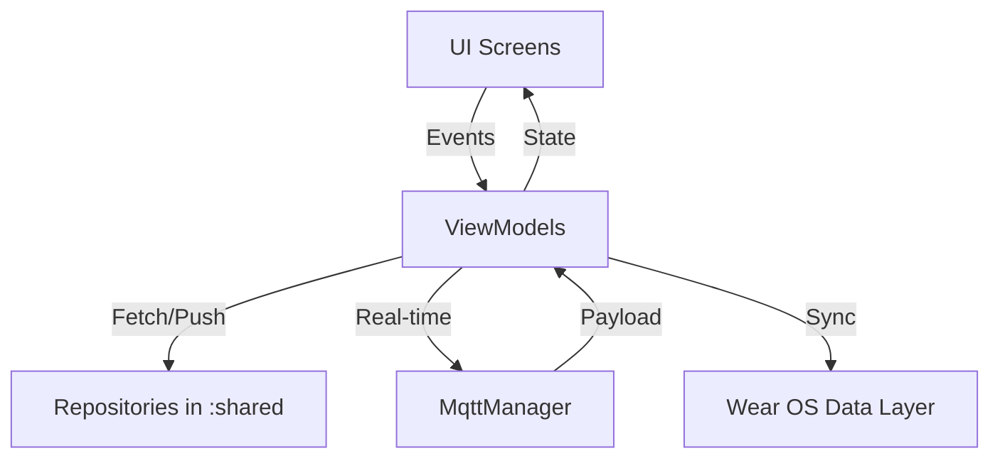

# Módulo :mobile

## Descripción
El módulo `:mobile` es la aplicación principal para smartphones del ecosistema EcoViñedos. Está diseñada para ser la herramienta central de gestión para administradores, enólogos y trabajadores de campo. Permite la visualización de datos en tiempo real de las parcelas, el control de los sistemas de riego, la gestión de la bodega (cava), la configuración de nuevo hardware mediante Bluetooth y la sincronización de datos con dispositivos Wear OS y Smart TV.

Responsabilidades principales:
*   **Gestión Administrativa:** Registro y edición de parcelas, usuarios y eventos turísticos.
*   **Monitoreo Agrícola:** Visualización de telemetría (humedad, temperatura, Brix) mediante gráficos y tableros dinámicos.
*   **Control de Riego:** Activación manual y automática de electroválvulas vía MQTT.
*   **Configuración de Hardware:** Flujo guiado para conectar nuevos nodos IoT a la red WiFi local usando BLE.
*   **Notificaciones:** Alertas proactivas sobre condiciones críticas de los cultivos.
*   **Widget de Escritorio:** Glance Widget para tener acceso rápido al estado de las parcelas.

## Tecnologías y Dependencias
*   **Jetpack Compose:** Framework moderno para la construcción de interfaces declarativas.
*   **Material Design 3:** Guía de diseño para componentes y tematización.
*   **Retrofit & OkHttp:** Cliente para consumo de la API REST central.
*   **Jetpack DataStore:** Persistencia de preferencias de usuario y tokens de sesión.
*   **WorkManager:** Sincronización periódica de notificaciones en segundo plano.
*   **Bluetooth LE (BLE):** Configuración de dispositivos de campo (nodos).
*   **Google Play Services Wearable:** Puente de datos con el reloj inteligente.
*   **Jetpack Glance:** Implementación de App Widgets para la pantalla de inicio.
*   **MQTT Paho:** Comunicación bidireccional de baja latencia con los sensores.

## Estructura del Módulo
```text
mobile/
├── build.gradle.kts
└── src/main/
    ├── AndroidManifest.xml
    └── java/mx/utng/ecoviedos/
        ├── MainActivity.kt         # Actividad principal y Navegador
        ├── data/
        │   ├── local/              # Gestión de sesión (DataStore)
        │   └── remote/             # Lógica de red específica
        └── presentation/           # Capa de presentación (UI)
            ├── admin/              # Módulos de administración y configuración
            ├── auth/               # Login y recuperación de cuenta
            ├── enologo/            # Control de producción y cava
            ├── main/               # Pantallas principales del Dashboard
            └── widget/             # Implementación de Glance Widgets
```

## Arquitectura
El módulo implementa una arquitectura **MVVM (Model-View-ViewModel)** robusta, apoyada en un **Data Layer** compartido con otros módulos.

1.  **UI Layer (Compose):** Pantallas sin estado que observan el `Flow` de datos del ViewModel.
2.  **ViewModel Layer:** Procesa la lógica de vista, maneja errores y expone el estado mediante `StateFlow`.
3.  **Domain/Data Layer:** Delegado principalmente al módulo `:shared` para asegurar consistencia entre plataformas.



## Clases y Componentes Principales

| Clase | Responsabilidad |
| :--- | :--- |
| `MainActivity` | Orquestador de navegación y punto de entrada. |
| `MainViewModel` | Corazón de la app; gestiona el estado global de las parcelas y la conexión MQTT. |
| `AdminViewModel` | Realiza operaciones CRUD de alto nivel para usuarios y parcelas. |
| `EnologoViewModel` | Gestiona los datos específicos de la cava y la producción de vino. |
| `DeviceConfigViewModel` | Maneja el escaneo y conexión BLE con los nodos IoT. |

---

## Código Fuente Completo

### `MainActivity.kt`
**Ubicación:** `mobile/src/main/java/mx/utng/ecoviedos/MainActivity.kt`
```kotlin
package mx.utng.ecoviedos

import android.Manifest
import android.content.Intent
import android.content.pm.PackageManager
import android.os.Build
import android.os.Bundle
import androidx.activity.ComponentActivity
import androidx.core.content.ContextCompat
import androidx.activity.compose.setContent
import androidx.compose.foundation.layout.fillMaxSize
import androidx.compose.material3.MaterialTheme
import androidx.compose.material3.Surface
import androidx.compose.runtime.collectAsState
import androidx.compose.runtime.getValue
import androidx.compose.ui.Modifier
import androidx.lifecycle.viewmodel.compose.viewModel
import androidx.navigation.compose.NavHost
import androidx.navigation.compose.composable
import androidx.navigation.compose.rememberNavController
import androidx.navigation.navArgument
import androidx.work.ExistingPeriodicWorkPolicy
import androidx.work.PeriodicWorkRequestBuilder
import androidx.work.WorkManager
import mx.utng.ecoviedos.data.NotificationWorker
import mx.utng.ecoviedos.presentation.auth.*
import mx.utng.ecoviedos.presentation.main.*
import mx.utng.ecoviedos.presentation.admin.*
import mx.utng.ecoviedos.presentation.enologo.*
import mx.utng.ecoviedos.presentation.theme.EcoViedosTheme

/**
 * Actividad principal de la aplicación móvil EcoViñedos.
 *
 * Esta clase se encarga de:
 * 1. Inicializar el sistema de navegación basado en Jetpack Compose.
 * 2. Gestionar los ciclos de vida de la actividad y los intents entrantes.
 * 3. Solicitar permisos necesarios (notificaciones).
 * 4. Programar tareas en segundo plano mediante [WorkManager].
 */
class MainActivity : ComponentActivity() {

    override fun onCreate(savedInstanceState: Bundle?) {
        super.onCreate(savedInstanceState)
        
        scheduleNotificationWorker()

        if (Build.VERSION.SDK_INT >= Build.VERSION_CODES.TIRAMISU) {
            if (ContextCompat.checkSelfPermission(this, Manifest.permission.POST_NOTIFICATIONS) != PackageManager.PERMISSION_GRANTED) {
                requestPermissions(arrayOf(Manifest.permission.POST_NOTIFICATIONS), 101)
            }
        }

        setContent {
            EcoViedosTheme {
                Surface(modifier = Modifier.fillMaxSize(), color = MaterialTheme.colorScheme.background) {
                    val navController = rememberNavController()
                    val mainViewModel: MainViewModel = viewModel()
                    val adminViewModel: AdminViewModel = viewModel()
                    
                    adminViewModel.setMainViewModel(mainViewModel)

                    val token by mainViewModel.sessionToken.collectAsState(initial = "loading")
                    val userRol by mainViewModel.sessionRol.collectAsState(initial = "")

                    if (token != "loading") {
                        NavHost(
                            navController = navController,
                            startDestination = when {
                                token.isNullOrBlank() -> "login"
                                userRol == "enologo" -> "enologo_panel"
                                else -> "main"
                            }
                        ) {
                            composable("login") {
                                LoginScreen(
                                    onLoginSuccess = { rol ->
                                        if (rol == "enologo") {
                                            navController.navigate("enologo_panel") { popUpTo("login") { inclusive = true } }
                                        } else {
                                            navController.navigate("main") { popUpTo("login") { inclusive = true } }
                                        }
                                    },
                                    onForgotPassword = { navController.navigate("forgot_password") }
                                )
                            }
                            composable("main") {
                                MainScreen(
                                    viewModel = mainViewModel,
                                    onNavigateToAdmin = { navController.navigate("admin") },
                                    onNavigateToParcelDetails = { id -> navController.navigate("parcel_details/$id") },
                                    onNavigateToNotifications = { navController.navigate("notifications") },
                                    onLogout = {
                                        mainViewModel.logout()
                                        navController.navigate("login") { popUpTo("main") { inclusive = true } }
                                    }
                                )
                            }
                            // ... Definición de rutas administrativas ...
                            composable("admin") {
                                AdminPanelScreen(
                                    onNavigateBack = { navController.popBackStack() },
                                    onNavigateToParcelManagement = { navController.navigate("parcel_management") },
                                    onNavigateToTourismManagement = { navController.navigate("tourism_management") },
                                    onNavigateToEnologoMode = { navController.navigate("enologo_panel") },
                                    onNavigateToLinkTv = { navController.navigate("link_tv") },
                                    onNavigateToDeviceConfig = { navController.navigate("device_config") },
                                    onLogout = {
                                        mainViewModel.logout()
                                        navController.navigate("login") { popUpTo("main") { inclusive = true } }
                                    },
                                    userRol = userRol ?: ""
                                )
                            }
                            composable("link_tv") {
                                LinkTvScreen(
                                    onNavigateBack = { navController.popBackStack() },
                                    onNavigateToEnologo = {
                                        navController.navigate("enologo_panel") { popUpTo("admin") { inclusive = false } }
                                    },
                                    mainViewModel = mainViewModel
                                )
                            }
                            composable("enologo_panel") {
                                EnologoMainScreen(
                                    mainViewModel = mainViewModel,
                                    onLogout = {
                                        mainViewModel.logout()
                                        navController.navigate("login") { popUpTo("enologo_panel") { inclusive = true } }
                                    },
                                    onNavigateToLinkSensor = { id, name -> 
                                        navController.navigate("device_config?targetId=$id&targetName=$name&type=CAVA")
                                    }
                                )
                            }
                        }
                    }
                }
            }
        }
    }

    private fun scheduleNotificationWorker() {
        val workRequest = PeriodicWorkRequestBuilder<NotificationWorker>(15, java.util.concurrent.TimeUnit.MINUTES).build()
        WorkManager.getInstance(this).enqueueUniquePeriodicWork("NotificationSync", ExistingPeriodicWorkPolicy.KEEP, workRequest)
    }
}
```

### `MainViewModel.kt`
**Ubicación:** `mobile/src/main/java/mx/utng/ecoviedos/presentation/main/MainViewModel.kt`
```kotlin
package mx.utng.ecoviedos.presentation.main

import android.app.Application
import android.content.Context
import android.util.Log
import androidx.lifecycle.AndroidViewModel
import androidx.lifecycle.viewModelScope
import com.google.android.gms.wearable.Wearable
import kotlinx.coroutines.Dispatchers
import kotlinx.coroutines.flow.*
import kotlinx.coroutines.launch
import mx.utng.ecoviedos.data.WearableDataSender
import mx.utng.ecoviedos.data.local.SessionManager
import mx.utng.ecoviedos.shared.data.mqtt.MqttManager
import mx.utng.ecoviedos.data.repository.ParcelaRepository
import mx.utng.ecoviedos.domain.model.Parcela
import java.util.*

/**
 * ViewModel principal que gestiona el estado global de las parcelas y la comunicación MQTT.
 */
class MainViewModel(application: Application) : AndroidViewModel(application) {
    private val _parcelas = MutableStateFlow<List<Parcela>>(emptyList())
    val parcelas: StateFlow<List<Parcela>> = _parcelas.asStateFlow()

    private val _isRefreshing = MutableStateFlow(false)
    val isRefreshing: StateFlow<Boolean> = _isRefreshing.asStateFlow()

    private val _mqttStatus = MutableStateFlow("Desconectado")
    val mqttStatus: StateFlow<String> = _mqttStatus.asStateFlow()

    private val _isMqttConnected = MutableStateFlow(false)
    val isMqttConnected: StateFlow<Boolean> = _isMqttConnected.asStateFlow()
    
    private val sessionManager = SessionManager(application)
    private val parcelaRepository = ParcelaRepository()
    private val wearableDataSender = WearableDataSender(application)
    private var mqttManager: MqttManager? = null

    val sessionToken: Flow<String?> = sessionManager.token
    val sessionRol: Flow<String?> = sessionManager.rol

    init {
        initializeMqtt()
        viewModelScope.launch {
            sessionToken.collect { token ->
                if (!token.isNullOrBlank()) {
                    cargarParcelas()
                } else {
                    _parcelas.value = emptyList()
                }
            }
        }
    }

    fun cargarParcelas() {
        viewModelScope.launch {
            _isRefreshing.value = true
            try {
                sessionToken.first()?.let { token ->
                    parcelaRepository.obtenerParcelas(token).onSuccess { list ->
                        _parcelas.value = list
                        wearableDataSender.sendParcelas(list)
                    }
                }
            } finally {
                _isRefreshing.value = false
            }
        }
    }

    private fun initializeMqtt() {
        mqttManager = MqttManager(
            context = getApplication(),
            onMessageReceived = { id, hum, temp, humsuel, riego, tiempo ->
                viewModelScope.launch(Dispatchers.Main) {
                    updateParcelaFromSensor(id, hum, temp, humsuel, riego, tiempo)
                }
            },
            onRiegoStatusReceived = { _, _, _ -> },
            onParcelListReceived = { cargarParcelas() },
            onConnectionStatusChanged = { connected, message ->
                _isMqttConnected.value = connected
                _mqttStatus.value = message ?: if (connected) "Conectado" else "Desconectado"
            }
        )
        viewModelScope.launch(Dispatchers.IO) { mqttManager?.connect() }
    }

    private fun updateParcelaFromSensor(id: String, hum: Float, temp: Float, humsuel: Float, riego: Boolean, tiempo: Int) {
        val currentList = _parcelas.value.toMutableList()
        val index = currentList.indexOfFirst { it.id == id }
        if (index != -1) {
            val old = currentList[index]
            currentList[index] = old.copy(
                humedad = hum,
                temperatura = temp,
                humedadSuelo = humsuel,
                riegoActivo = if (old.riegoActivo && !riego) true else riego,
                tiempoRestanteRiego = tiempo,
                lastUpdated = System.currentTimeMillis()
            )
            _parcelas.value = currentList.toList()
        }
    }

    fun toggleRiego(parcelId: String, activo: Boolean, duracionMinutos: Int, modo: String) {
        mqttManager?.toggleRiego(parcelId, activo, duracionMinutos, modo)
    }

    fun logout() {
        viewModelScope.launch {
            mqttManager?.disconnect()
            sessionManager.cerrarSesion()
        }
    }
}
```

### `EnologoViewModel.kt`
**Ubicación:** `mobile/src/main/java/mx/utng/ecoviedos/presentation/enologo/EnologoViewModel.kt`
```kotlin
package mx.utng.ecoviedos.presentation.enologo

import android.app.Application
import android.util.Log
import androidx.lifecycle.AndroidViewModel
import androidx.lifecycle.viewModelScope
import com.google.gson.Gson
import com.google.gson.reflect.TypeToken
import kotlinx.coroutines.Dispatchers
import kotlinx.coroutines.flow.MutableStateFlow
import kotlinx.coroutines.flow.asStateFlow
import kotlinx.coroutines.launch
import mx.utng.ecoviedos.shared.data.mqtt.MqttManager
import mx.utng.ecoviedos.data.remote.*
import mx.utng.ecoviedos.data.repository.EventoRepository

/**
 * ViewModel para el perfil de Enólogo.
 * Gestiona la carga de datos de cavas, secciones y eventos de turismo.
 */
class EnologoViewModel(application: Application) : AndroidViewModel(application) {
    private val eventoRepository = EventoRepository()
    private var mqttManager: MqttManager? = null
    
    private val _eventos = MutableStateFlow<List<EventoResponse>>(emptyList())
    val eventos = _eventos.asStateFlow()

    private val _cavas = MutableStateFlow<List<CavaResponse>>(emptyList())
    val cavas = _cavas.asStateFlow()

    private val _isLoading = MutableStateFlow(false)
    val isLoading = _isLoading.asStateFlow()

    init {
        cargarDatos()
        initializeMqtt()
    }

    private fun initializeMqtt() {
        mqttManager = MqttManager(
            context = getApplication(),
            onMessageReceived = { id, hum, temp, _, _, _ ->
                viewModelScope.launch(Dispatchers.Main) { actualizarSeccionEnTiempoReal(id, hum, temp) }
            },
            onRiegoStatusReceived = { _, _, _ -> },
            onParcelListReceived = { },
            onCavaListReceived = { payload ->
                viewModelScope.launch(Dispatchers.Main) { actualizarListaCavasMqtt(payload) }
            },
            onConnectionStatusChanged = { _, _ -> }
        )
        viewModelScope.launch(Dispatchers.IO) { mqttManager?.connect() }
    }

    fun cargarDatos() {
        viewModelScope.launch {
            _isLoading.value = true
            try {
                eventoRepository.obtenerEventos().onSuccess { _eventos.value = it }
                val response = RetrofitClient.cavaService.obtenerCavas()
                if (response.isSuccessful) { _cavas.value = response.body() ?: emptyList() }
            } catch (e: Exception) {
                Log.e("EnologoViewModel", "Error cargando datos", e)
            } finally {
                _isLoading.value = false
            }
        }
    }

    fun actualizarBotellas(token: String, seccionId: String, cantidad: Int, onComplete: () -> Unit = {}) {
        if (token.isBlank()) return
        viewModelScope.launch {
            try {
                val seccionActual = _cavas.value.flatMap { it.secciones }.find { it._id == seccionId }
                val request = SeccionCavaRequest(
                    botellasActuales = cantidad,
                    nombre = seccionActual?.nombre,
                    tipo = seccionActual?.tipo,
                    capacidadBotellas = seccionActual?.capacidadBotellas,
                    cava = seccionActual?.cava
                )
                val response = RetrofitClient.cavaService.actualizarSeccion("Bearer $token", seccionId, request)
                if (response.isSuccessful) { cargarDatos() }
            } finally {
                onComplete()
            }
        }
    }

    override fun onCleared() {
        super.onCleared()
        mqttManager?.disconnect()
    }
}
```

---

## Explicación de Archivos Relevantes

| Archivo | Responsabilidad |
| :--- | :--- |
| `DeviceConfigScreen.kt` | Flujo de vinculación BLE para conectar placas ESP32 a la red del viñedo. |
| `DashboardScreen.kt` | Vista principal que resume el índice de madurez global y alertas activas. |
| `IrrigationScreen.kt` | Centro de control de válvulas con estimación de consumo hídrico por déficit. |
| `LinkTvScreen.kt` | Módulo de escaneo QR para autorizar a un dispositivo Android TV. |
| `HistoryScreen.kt` | Consulta de bitácora histórica de sensores y resúmenes diarios. |
| `SessionManager.kt` | Encapsula el almacenamiento seguro del token JWT y rol del usuario. |

## Comunicación con Otros Componentes
1.  **Con Wear OS:** Utiliza `WearableDataSender` para enviar objetos JSON serializados de las parcelas al reloj mediante el `MessageClient`.
2.  **Con Smart TV:** Envía un comando POST al backend con el `pairingCode` para establecer el vínculo de sesión.
3.  **Con Hardware IoT:** A través de `MqttManager`, publica en tópicos de `/control` y se suscribe a `/stats`.

## Ejecución
1.  Abre el proyecto en Android Studio (Koala o superior).
2.  Selecciona el módulo **"mobile"** en la configuración de ejecución.
3.  Utiliza un dispositivo físico o emulador con **API 24+**.
4.  Para probar la vinculación, se requiere un dispositivo real con Bluetooth y WiFi activos.

## Recursos
*   **Drawables:** Iconografía personalizada para variedades de uva y estados de riego.
*   **Temas:** Implementación de Modo Oscuro nativo para ahorro de energía en campo.
