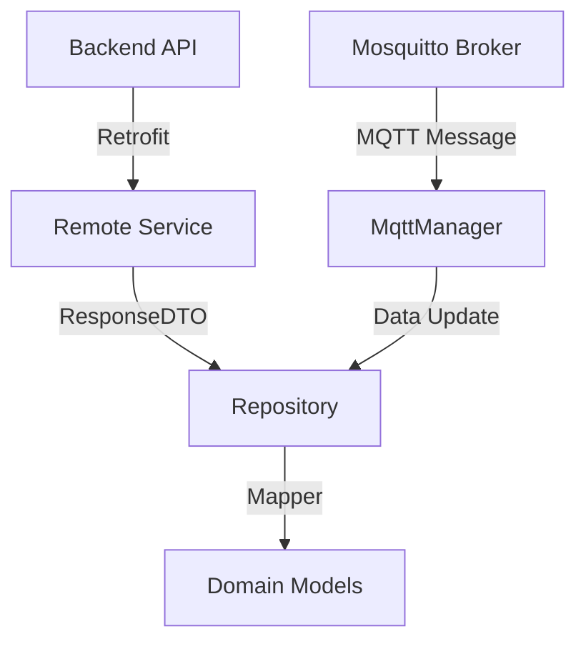

# Módulo :shared

## Descripción
El módulo `:shared` es una librería de Android que centraliza toda la lógica de negocio, modelos de datos y servicios de red del ecosistema EcoViñedos. Su principal responsabilidad es proporcionar una única fuente de verdad para el acceso a datos (tanto vía API REST como MQTT) que es consumida por los módulos `:mobile`, `:tv` y `:wear`.

Este módulo encapsula:
*   **Modelos de Dominio:** Representaciones limpias de las entidades (Parcelas, Usuarios, Eventos).
*   **Servicios de Red (Retrofit):** Interfaces para la comunicación con el Backend.
*   **Repositorios:** Gestión de la lógica de acceso a datos y mapeo entre respuestas de API y modelos de dominio.
*   **Comunicación en Tiempo Real (MQTT):** Cliente compartido para recibir telemetría de sensores IoT.

## Tecnologías y Dependencias
*   **Kotlin:** Lenguaje principal de desarrollo.
*   **Retrofit 2:** Cliente HTTP para consumir la API REST del backend.
*   **Gson:** Serialización y deserialización de JSON.
*   **OkHttp & Logging Interceptor:** Gestión de peticiones HTTP y depuración en logs.
*   **Coroutines:** Manejo de asincronía para llamadas a red.
*   **Paho MQTT Client:** Implementación del protocolo MQTT para datos en tiempo real.
*   **Lifecycle ViewModel:** Lógica de vista compartida (como `TourismViewModel`).

## Estructura del Módulo
```text
shared/
├── build.gradle.kts
└── src/main/java/mx/utng/ecoviedos/
    ├── data/
    │   ├── mqtt/           # Configuración y gestor de MQTT
    │   ├── remote/         # Interfaces Retrofit y modelos de API
    │   └── repository/     # Repositorios de datos y mappers
    ├── domain/
    │   └── model/          # Entidades puras de lógica de negocio
    └── presentation/       # ViewModels compartidos
```

## Arquitectura
El módulo sigue un patrón de **Repository Pattern** combinado con elementos de **arquitectura por capas**:

1.  **Capa de Datos (Data Layer):** Contiene los servicios de red (`remote/`) y los repositorios (`repository/`). Los repositorios se encargan de orquestar las llamadas a Retrofit y transformar las `Response` en modelos de dominio usando Mappers.
2.  **Capa de Dominio (Domain Layer):** Define los modelos (`model/`) que representan la realidad del viñedo, independientes de cómo se reciben por red.
3.  **Comunicación en Tiempo Real:** El `MqttManager` actúa como un bridge que inyecta datos directamente en el flujo de la aplicación sin pasar por HTTP.



## Clases y Componentes Principales

| Clase | Responsabilidad |
| :--- | :--- |
| `RetrofitClient` | Singleton que configura la conexión base con el backend. |
| `ParcelaRepository` | Gestiona el CRUD y estado de las parcelas del viñedo. |
| `MqttManager` | Administra la conexión persistente con el broker y distribuye telemetría. |
| `Parcela` | Modelo central que contiene umbrales, mediciones y estado de riego. |
| `EventoService` | Define los endpoints para la gestión de turismo y eventos. |

---

## Código Fuente Completo

### `build.gradle.kts`
**Ubicación:** `shared/build.gradle.kts`
```kotlin
import org.gradle.kotlin.dsl.dependencies

plugins {
    alias(libs.plugins.android.library)
    alias(libs.plugins.kotlin.compose)
}

android {
    namespace = "mx.utng.ecoviedos.shared"
    compileSdk = 37

    defaultConfig {
        minSdk = 24
        testInstrumentationRunner = "androidx.test.runner.AndroidJUnitRunner"
    }

    compileOptions {
        sourceCompatibility = JavaVersion.VERSION_11
        targetCompatibility = JavaVersion.VERSION_11
    }
}

dependencies {
    implementation(libs.androidx.core.ktx)
    implementation(libs.androidx.appcompat)
    implementation(libs.material)
    
    // Retrofit
    api("com.squareup.retrofit2:retrofit:2.11.0")
    api("com.squareup.retrofit2:converter-gson:2.11.0")
    implementation("com.squareup.okhttp3:logging-interceptor:4.12.0")
    
    // Coroutines
    implementation("org.jetbrains.kotlinx:kotlinx-coroutines-android:1.10.2")

    // MQTT
    api(libs.org.eclipse.paho.client.mqttv3)

    // ViewModel
    api(libs.androidx.lifecycle.runtime.ktx)
    api("androidx.lifecycle:lifecycle-viewmodel-ktx:2.8.7")
    api("androidx.lifecycle:lifecycle-viewmodel-compose:2.8.7")
}
```

### `RetrofitClient.kt`
**Ubicación:** `shared/src/main/java/mx/utng/ecoviedos/data/remote/RetrofitClient.kt`
```kotlin
package mx.utng.ecoviedos.data.remote

import okhttp3.OkHttpClient
import okhttp3.logging.HttpLoggingInterceptor
import retrofit2.Retrofit
import retrofit2.converter.gson.GsonConverterFactory

/**
 * Cliente centralizado para la configuración y provisión de servicios REST mediante Retrofit.
 *
 * Este objeto singleton configura la conexión HTTP base, los interceptores de registro (logging),
 * y crea las instancias de las interfaces de servicio necesarias para la comunicación con el backend.
 */
object RetrofitClient {
    /**
     * URL base del servidor backend alojado en Render.
     */
    private const val BASE_URL = "https://ecovinedos-1.onrender.com"

    /**
     * Interceptor para registrar el cuerpo de las peticiones y respuestas HTTP en Logcat.
     */
    private val loggingInterceptor = HttpLoggingInterceptor().apply {
        level = HttpLoggingInterceptor.Level.BODY
    }

    /**
     * Cliente OkHttp configurado con interceptores de red.
     */
    private val okHttpClient = OkHttpClient.Builder()
        .addInterceptor(loggingInterceptor)
        .build()

    /**
     * Instancia principal de Retrofit encargada de la serialización y deserialización (Gson).
     */
    private val retrofit: Retrofit by lazy {
        Retrofit.Builder()
            .baseUrl(BASE_URL)
            .client(okHttpClient)
            .addConverterFactory(GsonConverterFactory.create())
            .build()
    }

    /** Servicio para la gestión de parcelas y sensores IoT. */
    val parcelaService: ParcelaService by lazy { retrofit.create(ParcelaService::class.java) }
    /** Servicio para la gestión de usuarios, perfiles y autenticación. */
    val usuarioService: UsuarioService by lazy { retrofit.create(UsuarioService::class.java) }
    /** Servicio para el registro de acciones y eventos en bitácora. */
    val bitacoraService: BitacoraService by lazy { retrofit.create(BitacoraService::class.java) }
    /** Servicio para el control y programación de sistemas de riego. */
    val riegoService: RiegoService by lazy { retrofit.create(RiegoService::class.java) }
    /** Servicio para el registro de muestras analíticas (Brix, pH, etc.). */
    val muestraService: MuestraService by lazy { retrofit.create(MuestraService::class.java) }
    /** Servicio para consultar el historial de mediciones de sensores. */
    val historialService: HistorialService by lazy { retrofit.create(HistorialService::class.java) }
    /** Servicio para la gestión de notificaciones push y alertas del sistema. */
    val notificacionService: NotificacionService by lazy { retrofit.create(NotificacionService::class.java) }
    /** Servicio para la gestión de eventos de turismo y actividades. */
    val eventoService: EventoService by lazy { retrofit.create(EventoService::class.java) }
    /** Servicio para la sincronización y vinculación con Android TV. */
    val tvService: TvService by lazy { retrofit.create(TvService::class.java) }
    /** Servicio para el monitoreo y gestión de condiciones en cava/bodega. */
    val cavaService: CavaService by lazy { retrofit.create(CavaService::class.java) }
    /** Servicio para la carga de archivos multimedia al servidor. */
    val uploadService: UploadService by lazy { retrofit.create(UploadService::class.java) }
}
```

### `ApiModels.kt`
**Ubicación:** `shared/src/main/java/mx/utng/ecoviedos/data/remote/ApiModels.kt`
```kotlin
package mx.utng.ecoviedos.data.remote

import com.google.gson.annotations.SerializedName

data class LoginRequest(
    val correo: String,
    @SerializedName("contraseña") val contrasena: String
)

data class LoginResponse(
    val _id: String,
    val nombre: String,
    val correo: String,
    val rol: String,
    val token: String
)

data class ParcelaResponse(
    val _id: String,
    val nombreParcela: String? = null,
    val variedad: String? = null,
    val areaM2: Double? = 0.0,
    val umbralHumedad: Double? = 0.0,
    val umbralTemp: Double? = 0.0,
    val umbralHumedadSuelo: Double? = 0.0,
    val humedadOptimaSuelo: Double? = 0.0,
    val indiceMaduracion: Double? = 0.0,
    val fechaCosecha: String? = null,
    val activa: Boolean? = true,
    val humedad: Double? = 0.0,
    val temperatura: Double? = 0.0,
    val humedadSuelo: Double? = 0.0,
    val brix: Double? = null,
    val ph: Double? = null,
    val acidez: Double? = null,
    val phSuelo: Double? = null,
    val riegoActivo: Boolean? = false,
    val tiempoRestanteRiego: Int? = 0,
    val consumoAguaM2: Double? = 3.0,
    val tipoRiego: String? = "MANUAL",
    val nodoVinculado: String? = null,
    val createdAt: String? = null,
    val updatedAt: String? = null
)

data class ParcelaRequest(
    val nombreParcela: String,
    val variedad: String,
    val areaM2: Double,
    val umbralHumedad: Double,
    val umbralTemp: Double,
    val umbralHumedadSuelo: Double,
    val humedadOptimaSuelo: Double,
    val activa: Boolean,
    val brix: Int? = null,
    val acidez: Float? = null,
    val phSuelo: Float? = null,
    val consumoAguaM2: Double? = 3.0,
    val tipoRiego: String? = "MANUAL",
    val fechaCosecha: String? = null
)

data class UsuarioResponse(
    val _id: String,
    val nombre: String,
    val correo: String,
    val rol: String,
    val telefono: String? = null,
    val fechaRegistro: String? = null
)

data class UsuarioRequest(
    val nombre: String,
    val correo: String,
    @SerializedName("contraseña") val contrasena: String? = null,
    val rol: String,
    val telefono: String? = null
)

data class BitacoraResponse(
    val _id: String,
    val parcela: String, // ID de la parcela
    val usuario: String, // ID del usuario
    val accion: String,
    val descripcion: String?,
    val fecha: String?
)

data class BitacoraRequest(
    val parcela: String,
    val accion: String,
    val descripcion: String?,
    val fecha: String? = null
)

data class RiegoResponse(
    val _id: String,
    val parcela: String,
    val fecha: String?,
    val duracion: Int,
    val litros: Int,
    val estado: String
)

data class RiegoRequest(
    val parcela: String,
    val duracion: Int,
    val litros: Int,
    val estado: String? = "programado"
)

data class MuestraResponse(
    val _id: String,
    val parcela: String,
    val brix: Double,
    val ph: Double,
    val acidez: Double,
    val phSuelo: Double,
    val indiceMaduracion: Double? = null,
    val observaciones: String?,
    val fecha: String?,
    val createdAt: String?
)

data class MuestraRequest(
    val parcelaId: String,
    val brix: Double,
    val ph: Double,
    val acidez: Double,
    val phSuelo: Double,
    val indiceMaduracion: Double? = null,
    val observaciones: String?,
    val fecha: String? = null
)

data class NotificacionResponse(
    val _id: String,
    val tipo: String,
    val titulo: String,
    val mensaje: String,
    val parcela: String?,
    val estado: String,
    val fecha: String
)
```

### `MqttManager.kt`
**Ubicación:** `shared/src/main/java/mx/utng/ecoviedos/data/mqtt/MqttManager.kt`
```kotlin
package mx.utng.ecoviedos.shared.data.mqtt

import android.content.Context
import android.util.Log
import org.eclipse.paho.client.mqttv3.*
import org.eclipse.paho.client.mqttv3.persist.MemoryPersistence
import org.json.JSONObject

/**
 * Gestor centralizado de la comunicación MQTT para el ecosistema EcoViñedos.
 *
 * Esta clase encapsula la conexión con el broker de Mosquitto, la suscripción a tópicos
 * de telemetría y el procesamiento de mensajes de sensores en tiempo real.
 *
 * @param context Contexto de la aplicación necesario para la persistencia.
 * @param onMessageReceived Callback ejecutado al recibir telemetría de una parcela.
 * @param onRiegoStatusReceived Callback ejecutado al recibir cambios en el estado de las válvulas.
 * @param onParcelListReceived Callback para actualizaciones masivas de la lista de parcelas.
 * @param onCavaListReceived Callback para actualizaciones de sensores en bodega/cava.
 * @param onConnectionStatusChanged Notifica cambios en el estado de la conexión al broker.
 */
class MqttManager(
    context: Context,
    private val onMessageReceived: (parcelId: String, humedad: Float, temp: Float, humedadSuelo: Float, riegoActivo: Boolean, tiempoRestante: Int) -> Unit,
    private val onRiegoStatusReceived: (parcelId: String, activo: Boolean, tiempo: Int) -> Unit,
    private val onParcelListReceived: (jsonPayload: String) -> Unit,
    private val onCavaListReceived: (jsonPayload: String) -> Unit = {},
    private val onConnectionStatusChanged: (isConnected: Boolean, message: String?) -> Unit
) {
    private var mqttClient: MqttClient? = null
    private val clientId = "AndroidClient_${System.currentTimeMillis()}"
    private var isConnecting = false

    /**
     * Establece la conexión con el broker MQTT.
     *
     * @param customBrokerUrl URL opcional para pruebas con brokers locales.
     */
    fun connect(customBrokerUrl: String? = null) {
        if (isConnecting) return
        
        val serverUri = if (!customBrokerUrl.isNullOrBlank() && customBrokerUrl.startsWith("ssl://")) {
            customBrokerUrl
        } else {
            MqttConfig.BROKER_URL
        }
        
        try {
            isConnecting = true
            onConnectionStatusChanged(false, "Conectando al broker...")

            mqttClient?.let {
                try {
                    if (it.isConnected) it.disconnect()
                    it.close()
                } catch (e: Exception) { }
            }

            mqttClient = MqttClient(serverUri, clientId, MemoryPersistence())
            val options = MqttConnectOptions().apply {
                if (MqttConfig.USERNAME.isNotEmpty()) {
                    userName = MqttConfig.USERNAME
                    password = MqttConfig.PASSWORD.toCharArray()
                }
                isAutomaticReconnect = true
                isCleanSession = true
                connectionTimeout = 20
                keepAliveInterval = 60
                
                if (serverUri.startsWith("ssl://")) {
                    sslProperties = java.util.Properties()
                }
            }

            mqttClient?.setCallback(object : MqttCallbackExtended {
                override fun connectComplete(reconnect: Boolean, serverURI: String?) {
                    isConnecting = false
                    Log.d("MQTT", "Conectado al broker: $serverURI")
                    onConnectionStatusChanged(true, "Conectado")
                    subscribeToTopics()
                }

                override fun connectionLost(cause: Throwable?) {
                    isConnecting = false
                    Log.e("MQTT", "Conexión perdida: ${cause?.message}")
                    onConnectionStatusChanged(false, "Sin conexión")
                }

                override fun messageArrived(topic: String?, message: MqttMessage?) {
                    val payload = message?.toString() ?: return

                    try {
                        when {
                            topic == MqttConfig.TOPIC_PARCELAS_LISTA -> {
                                onParcelListReceived(payload)
                            }
                            topic == MqttConfig.TOPIC_SECCIONES_LISTA -> {
                                onCavaListReceived(payload)
                            }
                            topic?.startsWith("vinedo/parcela/") == true &&
                                    topic.endsWith("/stats") -> {
                                handleStatsMessage(topic, payload)
                            }
                            topic?.startsWith("vinedo/parcela/") == true &&
                                    (topic.endsWith("/riego") || topic.endsWith("/control")) -> {
                                handleRiegoMessage(topic, payload)
                            }
                        }

                    } catch (e: Exception) {
                        Log.e("MQTT", "Error procesando mensaje: ${e.message}")
                    }
                }

                override fun deliveryComplete(token: IMqttDeliveryToken?) {}
            })

            mqttClient?.connect(options)
            
        } catch (e: MqttException) {
            isConnecting = false
            onConnectionStatusChanged(false, "Error MQTT")
        } catch (e: Exception) {
            isConnecting = false
            onConnectionStatusChanged(false, "Error de red")
        }
    }

    private fun handleStatsMessage(topic: String, payload: String) {
        val parts = topic.split("/")
        if (parts.size >= 3) {
            val parcelId = parts[2]
            try {
                val json = JSONObject(payload)
                val sensores = json.optJSONObject("sensores")
                val hum = sensores?.optDouble("humedad_aire", 0.0)?.toFloat() ?: 0f
                val temp = sensores?.optDouble("temperatura_aire", 0.0)?.toFloat() ?: 0f
                val humSuelo = sensores?.optDouble("humedad_suelo", 0.0)?.toFloat() ?: 0f
                val riego = json.optBoolean("riegoActivo", false)
                val tiempo = json.optInt("tiempoRestante", 0)
                
                onMessageReceived(parcelId, hum, temp, humSuelo, riego, tiempo)
            } catch (e: Exception) {
                Log.e("MQTT", "Error parsing stats: ${e.message}")
            }
        }
    }

    private fun handleRiegoMessage(topic: String, payload: String) {
        val parts = topic.split("/")
        if (parts.size >= 3) {
            val parcelId = parts[2]
            try {
                val json = JSONObject(payload)
                val comando = json.optString("comando", "")
                val estado = json.optString("estado", "")
                val activo = (comando == "ON" || estado == "ACTIVO")
                val duracionInput = json.optInt("duracion", 0)
                
                val tiempoSegundos = if (duracionInput > 0 && duracionInput < 120) duracionInput * 60 else duracionInput
                
                onRiegoStatusReceived(parcelId, activo, tiempoSegundos)
            } catch (e: Exception) {
                Log.e("MQTT", "Error parsing riego: ${e.message}")
            }
        }
    }

    private fun subscribeToTopics() {
        try {
            mqttClient?.let {
                if (it.isConnected) {
                    it.subscribe(MqttConfig.TOPIC_PARCELAS_LISTA, 1)
                    it.subscribe(MqttConfig.TOPIC_SECCIONES_LISTA, 1)
                    it.subscribe(MqttConfig.TOPIC_PARCELA_STATS, 1)
                    it.subscribe("vinedo/parcela/+/riego", 1)
                    it.subscribe("vinedo/parcela/+/control", 1)
                }
            }
        } catch (e: Exception) { }
    }

    /**
     * Publica un comando de riego para una parcela específica.
     */
    fun toggleRiego(parcelId: String, activo: Boolean, duracionMinutos: Int = 1, modo: String = "AUTO") {
        try {
            mqttClient?.let {
                if (it.isConnected) {
                    val topic = String.format(MqttConfig.TOPIC_RIEGO_CONTROL, parcelId)
                    val payload = JSONObject().apply {
                        put("comando", if (activo) "ON" else "OFF")
                        put("duracion", duracionMinutos)
                        put("modo", modo)
                    }.toString()
                    it.publish(topic, MqttMessage(payload.toByteArray()).apply { qos = 1 })
                }
            }
        } catch (e: Exception) { }
    }

    fun disconnect() {
        try {
            mqttClient?.let {
                if (it.isConnected) it.disconnect()
                it.close()
            }
            mqttClient = null
        } catch (e: Exception) { }
    }
}
```

### `ParcelaRepository.kt`
**Ubicación:** `shared/src/main/java/mx/utng/ecoviedos/data/repository/ParcelaRepository.kt`
```kotlin
package mx.utng.ecoviedos.data.repository

import android.util.Log
import mx.utng.ecoviedos.data.remote.ParcelaRequest
import mx.utng.ecoviedos.data.remote.RetrofitClient
import mx.utng.ecoviedos.domain.model.Parcela

/**
 * Repositorio encargado de gestionar los datos de las parcelas en el ecosistema EcoViñedos.
 *
 * Esta clase actúa como mediadora entre la capa de presentación y la API REST,
 * encapsulando la lógica de red y la transformación de modelos de datos a modelos de dominio.
 */
class ParcelaRepository {

    /**
     * Obtiene todas las parcelas registradas asociadas al usuario autenticado.
     *
     * @param token Token de autenticación JWT del usuario.
     * @return [Result] que contiene la lista de objetos [Parcela] (modelo de dominio).
     */
    suspend fun obtenerParcelas(token: String): Result<List<Parcela>> {
        return try {
            val response = RetrofitClient.parcelaService.obtenerParcelas("Bearer $token")
            if (response.isSuccessful && response.body() != null) {
                val parcelas = response.body()!!.map { it.toDomain() }
                Result.success(parcelas)
            } else {
                Result.failure(Exception("Error del servidor: ${response.code()}"))
            }
        } catch (e: Exception) {
            Result.failure(e)
        }
    }

    /**
     * Registra una nueva parcela en el servidor central.
     *
     * @param token Token de autenticación del usuario administrador.
     * @param request Detalles técnicos de la parcela.
     * @return [Result] con el objeto [Parcela] creado.
     */
    suspend fun crearParcela(token: String, request: ParcelaRequest): Result<Parcela> {
        return try {
            val response = RetrofitClient.parcelaService.crearParcela("Bearer $token", request)
            if (response.isSuccessful && response.body() != null) {
                Result.success(response.body()!!.toDomain())
            } else {
                Result.failure(Exception("Error al crear parcela"))
            }
        } catch (e: Exception) {
            Result.failure(e)
        }
    }

    /**
     * Actualiza la información y umbrales de una parcela existente.
     */
    suspend fun actualizarParcela(token: String, id: String, request: ParcelaRequest): Result<Parcela> {
        return try {
            val response = RetrofitClient.parcelaService.actualizarParcela("Bearer $token", id, request)
            if (response.isSuccessful && response.body() != null) {
                Result.success(response.body()!!.toDomain())
            } else {
                Result.failure(Exception("Error al actualizar"))
            }
        } catch (e: Exception) {
            Result.failure(e)
        }
    }

    /**
     * Elimina permanentemente una parcela del sistema.
     */
    suspend fun eliminarParcela(token: String, id: String): Result<Unit> {
        return try {
            val response = RetrofitClient.parcelaService.eliminarParcela("Bearer $token", id)
            if (response.isSuccessful) {
                Result.success(Unit)
            } else {
                Result.failure(Exception("Error al eliminar"))
            }
        } catch (e: Exception) {
            Result.failure(e)
        }
    }
}
```

### `Parcela.kt`
**Ubicación:** `shared/src/main/java/mx/utng/ecoviedos/domain/model/Parcela.kt`
```kotlin
package mx.utng.ecoviedos.domain.model

import java.util.Date

/**
 * Modelo de dominio que representa una Parcela en el sistema EcoViñedos.
 *
 * Contiene tanto la configuración estática como el estado dinámico de los sensores.
 */
data class Parcela(
    val id: String,
    val nombreParcela: String,
    val variedad: String,
    val areaM2: Int,
    val umbralHumedad: Float,
    val umbralTemp: Float,
    val umbralHumedadSuelo: Float,
    val humedadOptimaSuelo: Float,
    val indiceMaduracion: Float,
    val fechaCosecha: Date?,
    val activa: Boolean,
    var humedad: Float = 0f,
    var temperatura: Float = 0f,
    var humedadSuelo: Float = 0f,
    var riegoActivo: Boolean = false,
    var tiempoRestanteRiego: Int = 0,
    val brix: Float? = null,
    val ph: Float? = null,
    val acidez: Float? = null,
    val phSuelo: Float? = null,
    val consumoAguaM2: Float = 3.0f,
    val tipoRiego: String = "MANUAL",
    val nodoVinculado: String? = null,
    var lastUpdated: Long = System.currentTimeMillis()
) {
    /**
     * Determina si la humedad del suelo está por debajo del umbral crítico.
     */
    fun esHumedadCritica(): Boolean {
        return humedadSuelo < umbralHumedadSuelo && !riegoActivo
    }
}
```

---

### `CavaService.kt`
**Ubicación:** `shared/src/main/java/mx/utng/ecoviedos/data/remote/CavaService.kt`
```kotlin
package mx.utng.ecoviedos.data.remote

import retrofit2.Response
import retrofit2.http.*

/**
 * Representa una sección de una cava con sus datos de sensores y capacidad.
 */
data class SeccionCavaResponse(
    val _id: String,
    val cava: String,
    val nombre: String,
    val tipo: String,
    val temperatura: Double,
    val humedad: Double,
    val capacidadBotellas: Int,
    val botellasActuales: Int,
    val sensorId: String?,
    val estado: String,
    val ultimaLectura: String
)

data class CavaResponse(
    val _id: String,
    val nombre: String,
    val ubicacion: String,
    val descripcion: String?,
    val secciones: List<SeccionCavaResponse> = emptyList()
)

data class SeccionCavaRequest(
    val cava: String? = null,
    val nombre: String? = null,
    val tipo: String? = null,
    val capacidadBotellas: Int? = null,
    val botellasActuales: Int? = null,
    val sensorId: String? = null
)

interface CavaService {
    @GET("api/cavas")
    suspend fun obtenerCavas(): Response<List<CavaResponse>>

    @POST("api/cavas/secciones")
    suspend fun crearSeccion(
        @Header("Authorization") token: String,
        @Body request: SeccionCavaRequest
    ): Response<SeccionCavaResponse>

    @PUT("api/cavas/secciones/{id}")
    suspend fun actualizarSeccion(
        @Header("Authorization") token: String,
        @Path("id") id: String,
        @Body request: SeccionCavaRequest
    ): Response<SeccionCavaResponse>
}
```

### `EventoRepository.kt`
**Ubicación:** `shared/src/main/java/mx/utng/ecoviedos/data/repository/EventoRepository.kt`
```kotlin
package mx.utng.ecoviedos.data.repository

import mx.utng.ecoviedos.data.remote.EventoRequest
import mx.utng.ecoviedos.data.remote.EventoResponse
import mx.utng.ecoviedos.data.remote.RetrofitClient

/**
 * Repositorio para la gestión de eventos de turismo y actividades en el viñedo.
 */
class EventoRepository {
    private val service = RetrofitClient.eventoService

    suspend fun obtenerEventos(tipo: String? = null): Result<List<EventoResponse>> {
        return try {
            val response = service.obtenerEventos(tipo)
            if (response.isSuccessful) {
                Result.success(response.body() ?: emptyList())
            } else {
                Result.failure(Exception("Error al obtener eventos"))
            }
        } catch (e: Exception) {
            Result.failure(e)
        }
    }

    suspend fun crearEvento(token: String, request: EventoRequest): Result<EventoResponse> {
        return try {
            val response = service.crearEvento("Bearer $token", request)
            if (response.isSuccessful && response.body() != null) {
                Result.success(response.body()!!)
            } else {
                Result.failure(Exception("Error al crear evento"))
            }
        } catch (e: Exception) {
            Result.failure(e)
        }
    }

    suspend fun actualizarEvento(token: String, id: String, request: EventoRequest): Result<EventoResponse> {
        return try {
            val response = service.actualizarEvento("Bearer $token", id, request)
            if (response.isSuccessful && response.body() != null) {
                Result.success(response.body()!!)
            } else {
                Result.failure(Exception("Error al actualizar evento"))
            }
        } catch (e: Exception) {
            Result.failure(e)
        }
    }
}
```

    }
}

### `TourismViewModel.kt`
**Ubicación:** `shared/src/main/java/mx/utng/ecoviedos/presentation/admin/TourismViewModel.kt`
```kotlin
package mx.utng.ecoviedos.presentation.admin

import androidx.lifecycle.ViewModel
import androidx.lifecycle.viewModelScope
import kotlinx.coroutines.flow.MutableStateFlow
import kotlinx.coroutines.flow.asStateFlow
import kotlinx.coroutines.launch
import mx.utng.ecoviedos.data.remote.EventoRequest
import mx.utng.ecoviedos.data.remote.EventoResponse
import mx.utng.ecoviedos.data.repository.EventoRepository

/**
 * ViewModel compartido para la gestión de actividades y eventos turísticos.
 */
class TourismViewModel : ViewModel() {
    private val repository = EventoRepository()

    private val _eventos = MutableStateFlow<List<EventoResponse>>(emptyList())
    val eventos = _eventos.asStateFlow()

    private val _isLoading = MutableStateFlow(false)
    val isLoading = _isLoading.asStateFlow()

    init {
        cargarEventos()
    }

    fun cargarEventos(tipo: String? = null) {
        viewModelScope.launch {
            _isLoading.value = true
            repository.obtenerEventos(tipo).onSuccess {
                _eventos.value = it
            }
            _isLoading.value = false
        }
    }

    fun crearEvento(token: String, request: EventoRequest, onExito: () -> Unit) {
        viewModelScope.launch {
            _isLoading.value = true
            repository.crearEvento(token, request).onSuccess {
                cargarEventos()
                onExito()
            }
            _isLoading.value = false
        }
    }

    fun actualizarEvento(token: String, id: String, request: EventoRequest, onExito: () -> Unit) {
        viewModelScope.launch {
            _isLoading.value = true
            repository.actualizarEvento(token, id, request).onSuccess {
                cargarEventos()
                onExito()
            }
            _isLoading.value = false
        }
    }
}
```

## Explicación de Archivos Relevantes

| Archivo | Responsabilidad |
| :--- | :--- |
| `ApiModels.kt` | Contiene todas las Data Classes usadas para el intercambio de datos con el Backend (DTOs). |
| `ParcelaService.kt` | Interfaz de Retrofit que define las operaciones CRUD para el recurso de parcelas. |
| `MqttManager.kt` | Corazón de la comunicación en tiempo real. Gestiona la conexión con HiveMQ/Mosquitto. |
| `ParcelaMapper.kt` | Convierte las respuestas de la API (`ParcelaResponse`) en objetos de dominio (`Parcela`). |
| `CavaService.kt` | Gestiona la telemetría y el stock de botellas en las secciones de la bodega. |
| `TourismViewModel.kt` | ViewModel compartido que gestiona el estado de eventos y experiencias turísticas. |

## Comunicación
El módulo `:shared` actúa como la capa de abstracción de datos para toda la arquitectura:
1.  **Hacia afuera:** Expone Repositorios y ViewModels.
2.  **Hacia adentro:** Consume la API REST vía Retrofit y el Broker MQTT vía Paho.
3.  **Hacia el hardware:** El `MqttManager` recibe `JSON` desde los nodos ESP32 y los inyecta en el estado de la aplicación.

## Ejecución
Este módulo no se ejecuta de forma independiente. Se incluye como dependencia en otros módulos mediante:
```kotlin
implementation(project(":shared"))
```

## Pruebas
Las funcionalidades se verifican mediante:
1.  **Logs de Retrofit:** Verificación de cabeceras y payloads en Logcat.
2.  **Monitoreo MQTT:** Uso de herramientas como MQTT Explorer para validar que los mensajes procesados coinciden con los enviados por el hardware.
