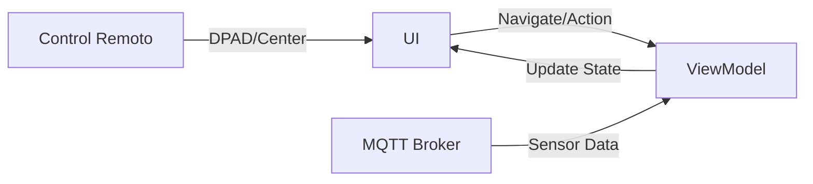

# Módulo :tv

## Descripción
El módulo `:tv` es una aplicación diseñada específicamente para Android TV que funciona como un panel de monitoreo y visualización continua para el personal de la bodega. Su objetivo es proporcionar una experiencia "Leanback" (consumo de contenido a distancia) donde los datos críticos de la cava y las actividades del viñedo sean visibles sin necesidad de interacción constante.

Responsabilidades principales:
*   **Dashboard de Monitoreo:** Visualización en tiempo real de temperatura y humedad promedio.
*   **Detalle de Cava:** Desglose por secciones de las condiciones de almacenamiento de las botellas.
*   **Promoción de Actividades:** Carrusel de experiencias y eventos disponibles en el viñedo.
*   **Vinculación Inteligente:** Proceso de emparejamiento con la aplicación móvil mediante códigos QR dinámicos.

## Tecnologías y Dependencias
*   **Jetpack Compose para TV:** Uso de librerías específicas (`androidx.tv:tv-foundation` y `androidx.tv:tv-material`) para optimizar el manejo del foco y la navegación con control remoto.
*   **Leanback Native support:** Configurado para aparecer en el lanzador de aplicaciones de Android TV.
*   **MQTT (Shared):** Recibe actualizaciones instantáneas de los sensores de la cava.
*   **Retrofit:** Sincronización inicial y consulta de catálogo de eventos.
*   **Coil:** Carga de imágenes de alta resolución para los eventos.
*   **ZXing:** Generación de códigos QR en pantalla para facilitar la vinculación.

## Estructura del Módulo
```text
tv/
├── build.gradle.kts
└── src/main/
    ├── AndroidManifest.xml
    └── java/mx/utng/ecoviedos/tv/
        ├── MainActivity.kt
        └── presentation/
            ├── ActivitiesScreen.kt     # Pantalla de eventos con scroll horizontal
            ├── CavaDetailScreen.kt     # Detalle de sensores por sección
            ├── MainTvScreen.kt         # Orquestador de navegación
            ├── PairingScreen.kt        # Interfaz de vinculación inicial
            ├── TvDashboardScreen.kt    # Panel principal con métricas globales
            ├── TvViewModel.kt          # Gestión de estado y conexión MQTT
            └── QrGenerator.kt          # Utilidad para códigos QR
```

## Arquitectura
Utiliza **MVVM (Model-View-ViewModel)** adaptado para TV:
1.  **UI Layer:** Basada en `androidx.tv.material3`, gestiona el foco automático entre componentes mediante `FocusRequester`.
2.  **ViewModel Layer:** El `TvViewModel` mantiene una conexión persistente con el broker MQTT una vez que el dispositivo está vinculado, permitiendo que la UI sea totalmente reactiva.
3.  **Data Layer:** Consume modelos y servicios definidos en el módulo `:shared`.



---

## Código Fuente Completo

### `AndroidManifest.xml`
**Ubicación:** `tv/src/main/AndroidManifest.xml`
```xml
<?xml version="1.0" encoding="utf-8"?>
<manifest xmlns:android="http://schemas.android.com/apk/res/android"
    xmlns:tools="http://schemas.android.com/tools">

    <uses-feature
        android:name="android.hardware.touchscreen"
        android:required="false" />
    <uses-feature
        android:name="android.software.leanback"
        android:required="false" />

    <uses-permission android:name="android.permission.INTERNET" />
    <uses-permission android:name="android.permission.ACCESS_NETWORK_STATE" />

    <application
        android:allowBackup="true"
        android:banner="@mipmap/ic_launcher"
        android:icon="@mipmap/ic_launcher"
        android:label="@string/app_name"
        android:supportsRtl="true"
        android:theme="@style/Theme.EcoViñedos"
        android:usesCleartextTraffic="true">
        <activity
            android:name=".MainActivity"
            android:exported="true">
            <intent-filter>
                <action android:name="android.intent.action.MAIN" />

                <category android:name="android.intent.category.LAUNCHER" />
                <category android:name="android.intent.category.LEANBACK_LAUNCHER" />
            </intent-filter>
        </activity>
    </application>

</manifest>
```

### `TvDashboardScreen.kt`
**Ubicación:** `tv/src/main/java/mx/utng/ecoviedos/tv/presentation/TvDashboardScreen.kt`
```kotlin
package mx.utng.ecoviedos.tv.presentation

import androidx.compose.foundation.BorderStroke
import androidx.compose.foundation.background
import androidx.compose.foundation.layout.*
import androidx.compose.foundation.shape.RoundedCornerShape
import androidx.compose.material.icons.Icons
import androidx.compose.material.icons.filled.Logout
import androidx.compose.runtime.*
import androidx.compose.ui.Alignment
import androidx.compose.ui.Modifier
import androidx.compose.ui.draw.clip
import androidx.compose.ui.graphics.Color
import androidx.compose.ui.text.font.FontWeight
import androidx.compose.ui.unit.dp
import androidx.tv.material3.*
import kotlinx.coroutines.delay
import java.text.SimpleDateFormat
import java.util.*
import mx.utng.ecoviedos.data.remote.CavaResponse

import androidx.compose.ui.focus.FocusRequester
import androidx.compose.ui.focus.focusRequester
import androidx.compose.ui.focus.onFocusChanged
import mx.utng.ecoviedos.data.remote.EventoResponse
import mx.utng.ecoviedos.presentation.admin.TourismViewModel
import androidx.lifecycle.viewmodel.compose.viewModel

/**
 * Pantalla principal del Dashboard para Android TV.
 *
 * Proporciona una vista general del estado de la bodega, promedios de temperatura
 * y acceso rápido a actividades. Gestiona el foco entre las tarjetas principales.
 *
 * @param cavas Lista de cavas con sus respectivas secciones de sensores.
 * @param onNavigateToCavaDetail Callback para ver el detalle por sección.
 * @param onNavigateToActivities Callback para explorar el carrusel de actividades.
 * @param onLogout Acción para desvincular el dispositivo.
 * @param tourismViewModel ViewModel que provee la lista de eventos reales.
 */
@OptIn(ExperimentalTvMaterial3Api::class)
@Composable
fun TvDashboardScreen(
    cavas: List<CavaResponse>,
    onNavigateToCavaDetail: () -> Unit,
    onNavigateToActivities: () -> Unit,
    onLogout: () -> Unit,
    tourismViewModel: TourismViewModel = viewModel()
) {
    val currentTime = remember { mutableStateOf(SimpleDateFormat("HH:mm", Locale.getDefault()).format(Date())) }
    val eventos by tourismViewModel.eventos.collectAsState()

    // Gestión de Foco
    val focusRequesterCava = remember { FocusRequester() }
    val focusRequesterActivities = remember { FocusRequester() }
    val focusRequesterLogout = remember { FocusRequester() }
    var lastFocusedCard by remember { mutableStateOf("cava") }

    LaunchedEffect(Unit) {
        if (lastFocusedCard == "cava") {
            focusRequesterCava.requestFocus()
        } else {
            focusRequesterActivities.requestFocus()
        }
    }

    val todasLasSecciones = cavas.flatMap { it.secciones }
    val avgTemp = if (todasLasSecciones.isNotEmpty()) todasLasSecciones.map { it.temperatura }.average() else 0.0
    val avgHum = if (todasLasSecciones.isNotEmpty()) todasLasSecciones.map { it.humedad }.average() else 0.0
    val totalBottles = todasLasSecciones.sumOf { it.botellasActuales }

    LaunchedEffect(Unit) {
        while (true) {
            delay(60000)
            currentTime.value = SimpleDateFormat("HH:mm", Locale.getDefault()).format(Date())
        }
    }

    Column(
        modifier = Modifier
            .fillMaxSize()
            .background(Color(0xFF0F100D))
            .padding(24.dp)
    ) {
        // Header con Reloj y Botón de Desvinculación
        Row(
            modifier = Modifier.fillMaxWidth(),
            horizontalArrangement = Arrangement.SpaceBetween,
            verticalAlignment = Alignment.CenterVertically
        ) {
            Column {
                Text(
                    text = "Eco-Viñedos Dolores — Temporada 2026",
                    style = MaterialTheme.typography.headlineSmall,
                    fontWeight = FontWeight.Bold,
                    color = Color.White
                )
                Text(text = "Dashboard Principal", style = MaterialTheme.typography.bodySmall, color = Color.Gray)
            }
            
            Row(verticalAlignment = Alignment.CenterVertically) {
                Button(
                    onClick = onLogout,
                    colors = ButtonDefaults.colors(containerColor = Color.Red.copy(alpha = 0.1f), contentColor = Color.Red),
                    modifier = Modifier
                        .padding(end = 16.dp)
                        .focusRequester(focusRequesterLogout),
                    border = ButtonDefaults.border(
                        focusedBorder = Border(border = BorderStroke(2.dp, Color.Red))
                    )
                ) {
                    Icon(Icons.Default.Logout, contentDescription = "Desvincular")
                    Spacer(Modifier.width(8.dp))
                    Text("Desvincular")
                }

                Box(
                    modifier = Modifier
                        .clip(RoundedCornerShape(50))
                        .background(Color(0xFF2E7D32).copy(alpha = 0.2f))
                        .padding(horizontal = 12.dp, vertical = 6.dp)
                ) {
                    Row(verticalAlignment = Alignment.CenterVertically) {
                        Box(modifier = Modifier.size(8.dp).background(Color(0xFF4CAF50), RoundedCornerShape(50)))
                        Spacer(Modifier.width(8.dp))
                        Text("En vivo", style = MaterialTheme.typography.labelSmall, color = Color(0xFFB4F391))
                    }
                }
                Spacer(Modifier.width(16.dp))
                Text(text = currentTime.value, style = MaterialTheme.typography.bodyMedium, color = Color.Gray)
            }
        }

        Spacer(modifier = Modifier.height(24.dp))

        // Fila de Estadísticas Superiores
        Row(modifier = Modifier.fillMaxWidth(), horizontalArrangement = Arrangement.spacedBy(16.dp)) {
            StatCard("Temp. promedio cava", "${String.format("%.1f", avgTemp)}°C", "Normal", Color(0xFF3897F0), Modifier.weight(1f))
            StatCard("Humedad promedio", "${String.format("%.0f", avgHum)}%", "Normal", Color(0xFF4FC3F7), Modifier.weight(1f))
            StatCard("Botellas en cava", "$totalBottles", "Total secciones", Color(0xFFF9A825), Modifier.weight(1f))
            StatCard("Visitas hoy", "14", "+3 reservas", Color(0xFF4CAF50), Modifier.weight(1f))
        }

        Spacer(modifier = Modifier.height(24.dp))

        // Área de Contenido Principal (Tarjetas con Foco)
        Row(modifier = Modifier.fillMaxWidth().weight(1f), horizontalArrangement = Arrangement.spacedBy(24.dp)) {
            Surface(
                onClick = { 
                    lastFocusedCard = "cava"
                    onNavigateToCavaDetail() 
                },
                modifier = Modifier
                    .fillMaxHeight()
                    .weight(1f)
                    .focusRequester(focusRequesterCava)
                    .onFocusChanged { if(it.isFocused) lastFocusedCard = "cava" },
                shape = ClickableSurfaceDefaults.shape(RoundedCornerShape(16.dp)),
                scale = ClickableSurfaceDefaults.scale(focusedScale = 1.05f),
                colors = ClickableSurfaceDefaults.colors(
                    containerColor = Color(0xFF1A1C18),
                    focusedContainerColor = Color(0xFF2A2D26)
                ),
                border = ClickableSurfaceDefaults.border(
                    focusedBorder = Border(border = BorderStroke(2.dp, Color(0xFF3897F0)))
                )
            ) {
                Column(modifier = Modifier.padding(20.dp)) {
                    Text("Estado de la Bodega", style = MaterialTheme.typography.headlineSmall, color = Color(0xFF3897F0), fontWeight = FontWeight.Bold)
                    Spacer(Modifier.height(16.dp))
                    
                    if (cavas.isEmpty()) {
                        Text("No hay datos de cava", color = Color.Gray)
                    } else {
                        todasLasSecciones.take(5).forEach { seccion ->
                            CavaItem(
                                seccion.nombre, 
                                if(seccion.estado == "OPTIMO") "Óptimo" else "Revisar", 
                                if(seccion.estado == "OPTIMO") Color(0xFF4CAF50) else Color(0xFFF9A825)
                            )
                        }
                    }

                    Spacer(modifier = Modifier.weight(1f))
                    Text("Maduración por variedad", style = MaterialTheme.typography.labelLarge, color = Color.Gray)
                    Spacer(Modifier.height(12.dp))
                    
                    VarietyProgress("Merlot", 0.85f, "82°Bx", Color(0xFF3897F0))
                    VarietyProgress("Viognier", 0.70f, "71°Bx", Color(0xFF4CAF50))
                }
            }

            Surface(
                onClick = { 
                    lastFocusedCard = "activities"
                    onNavigateToActivities() 
                },
                modifier = Modifier
                    .fillMaxHeight()
                    .weight(1.5f)
                    .focusRequester(focusRequesterActivities)
                    .onFocusChanged { if(it.isFocused) lastFocusedCard = "activities" },
                shape = ClickableSurfaceDefaults.shape(RoundedCornerShape(16.dp)),
                scale = ClickableSurfaceDefaults.scale(focusedScale = 1.05f),
                colors = ClickableSurfaceDefaults.colors(
                    containerColor = Color(0xFF1A1C18),
                    focusedContainerColor = Color(0xFF2A2D26)
                ),
                border = ClickableSurfaceDefaults.border(
                    focusedBorder = Border(border = BorderStroke(2.dp, Color(0xFF3897F0)))
                )
            ) {
                Column(modifier = Modifier.padding(20.dp)) {
                    Text("Actividades y Experiencias", style = MaterialTheme.typography.headlineSmall, color = Color.White, fontWeight = FontWeight.Bold)
                    Spacer(Modifier.height(16.dp))
                    
                    if (eventos.isEmpty()) {
                        PromotionCardSummary("Cargando eventos...", "", Color(0xFF1565C0))
                    } else {
                        Column(verticalArrangement = Arrangement.spacedBy(12.dp)) {
                            eventos.take(3).forEach { evento ->
                                PromotionCardSummary(evento.titulo, "$${evento.precio} MXN", if(evento.tipo == "TOURISM") Color(0xFF2E7D32) else Color(0xFF1565C0))
                            }
                        }
                    }
                }
            }
        }
    }
}

@OptIn(ExperimentalTvMaterial3Api::class)
@Composable
fun PromotionCardSummary(title: String, price: String, bgColor: Color) {
    Box(
        modifier = Modifier
            .fillMaxWidth()
            .height(80.dp)
            .clip(RoundedCornerShape(12.dp))
            .background(bgColor.copy(alpha = 0.8f))
            .padding(12.dp)
    ) {
        Row(
            modifier = Modifier.fillMaxSize(),
            horizontalArrangement = Arrangement.SpaceBetween,
            verticalAlignment = Alignment.CenterVertically
        ) {
            Text(
                text = title, 
                style = MaterialTheme.typography.titleMedium, 
                color = Color.White, 
                fontWeight = FontWeight.Bold,
                maxLines = 1,
                overflow = androidx.compose.ui.text.style.TextOverflow.Ellipsis,
                modifier = Modifier.weight(1f)
            )
            Spacer(Modifier.width(8.dp))
            Text(text = price, style = MaterialTheme.typography.labelLarge, color = Color(0xFFB4F391), fontWeight = FontWeight.Bold)
        }
    }
}
```

### `TvViewModel.kt`
**Ubicación:** `tv/src/main/java/mx/utng/ecoviedos/tv/presentation/TvViewModel.kt`
```kotlin
package mx.utng.ecoviedos.tv.presentation

import android.app.Application
import android.provider.Settings
import androidx.lifecycle.AndroidViewModel
import androidx.lifecycle.viewModelScope
import kotlinx.coroutines.Job
import kotlinx.coroutines.delay
import kotlinx.coroutines.flow.MutableStateFlow
import kotlinx.coroutines.flow.asStateFlow
import kotlinx.coroutines.launch
import android.util.Log
import com.google.gson.Gson
import com.google.gson.reflect.TypeToken
import kotlinx.coroutines.Dispatchers
import mx.utng.ecoviedos.shared.data.mqtt.MqttManager
import mx.utng.ecoviedos.data.remote.PairCodeRequest
import mx.utng.ecoviedos.data.remote.RetrofitClient
import mx.utng.ecoviedos.data.remote.SeccionCavaResponse

sealed class TvUiState {
    data object Loading : TvUiState()
    data class NotLinked(val pairingCode: String) : TvUiState()
    data class Linked(val cavas: List<mx.utng.ecoviedos.data.remote.CavaResponse>) : TvUiState()
    data class Error(val message: String) : TvUiState()
}

/**
 * ViewModel responsable de la lógica de sesión y monitoreo para Smart TV.
 */
class TvViewModel(application: Application) : AndroidViewModel(application) {
    private val _uiState = MutableStateFlow<TvUiState>(TvUiState.Loading)
    val uiState = _uiState.asStateFlow()

    private var pairingJob: Job? = null
    private var mqttManager: MqttManager? = null

    private val deviceId: String = android.provider.Settings.Secure.getString(
        application.contentResolver,
        android.provider.Settings.Secure.ANDROID_ID
    ) ?: "tv_emulator_id"

    init {
        startPairingProcess()
    }

    private fun startPairingProcess() {
        pairingJob?.cancel()
        pairingJob = viewModelScope.launch {
            while (true) {
                try {
                    val response = RetrofitClient.tvService.checkStatus(deviceId)
                    if (response.isSuccessful) {
                        val session = response.body()
                        if (session?.isLinked == true) {
                            cargarDatosCava()
                            break 
                        } else if (session != null) {
                            _uiState.value = TvUiState.NotLinked(session.pairingCode)
                        }
                    } else if (response.code() == 404) {
                        getNewPairingCode()
                    }
                } catch (e: Exception) {
                    _uiState.value = TvUiState.Error("Error: ${e.localizedMessage}")
                }
                delay(5000)
            }
        }
    }

    private fun initializeMqtt() {
        mqttManager?.disconnect()
        mqttManager = MqttManager(
            context = getApplication(),
            onMessageReceived = { id, hum, temp, _, _, _ ->
                viewModelScope.launch(Dispatchers.Main) {
                    actualizarSeccionEnTiempoReal(id, hum, temp)
                }
            },
            onRiegoStatusReceived = { _, _, _ -> },
            onParcelListReceived = { },
            onCavaListReceived = { payload ->
                viewModelScope.launch(Dispatchers.Main) {
                    actualizarListaCavasMqtt(payload)
                }
            },
            onConnectionStatusChanged = { _, _ -> }
        )
        viewModelScope.launch(Dispatchers.IO) {
            mqttManager?.connect()
        }
    }

    private fun actualizarSeccionEnTiempoReal(id: String, hum: Float, temp: Float) {
        val state = _uiState.value
        if (state is TvUiState.Linked) {
            val updatedCavas = state.cavas.map { cava ->
                val index = cava.secciones.indexOfFirst { it._id == id }
                if (index != -1) {
                    val updatedSecciones = cava.secciones.toMutableList()
                    updatedSecciones[index] = updatedSecciones[index].copy(
                        humedad = hum.toDouble(),
                        temperatura = temp.toDouble()
                    )
                    cava.copy(secciones = updatedSecciones)
                } else cava
            }
            _uiState.value = TvUiState.Linked(updatedCavas)
        }
    }

    private fun cargarDatosCava() {
        viewModelScope.launch {
            try {
                val response = RetrofitClient.cavaService.obtenerCavas()
                if (response.isSuccessful && response.body() != null) {
                    _uiState.value = TvUiState.Linked(response.body()!!)
                    initializeMqtt()
                }
            } catch (e: Exception) { }
        }
    }

    fun desvincularTv() {
        viewModelScope.launch {
            try {
                _uiState.value = TvUiState.Loading
                mqttManager?.disconnect()
                mqttManager = null
                RetrofitClient.tvService.unlinkTV(PairCodeRequest(deviceId))
                startPairingProcess()
            } catch (e: Exception) {
                startPairingProcess()
            }
        }
    }
}
```

---

## Flujo de Funcionamiento
El módulo opera mediante un ciclo de vida persistente:
1.  **Arranque:** La TV solicita un código de vinculación al servidor enviando su `ANDROID_ID`.
2.  **Vinculación:** El usuario escanea el QR con el móvil. El servidor actualiza la sesión a `isLinked: true`.
3.  **Monitoreo Activo:** Al detectar el vínculo, el `TvViewModel` inicializa el `MqttManager`.
4.  **Actualización:** Cada mensaje MQTT de un sensor en la bodega actualiza el estado de la UI instantáneamente sin recargar la pantalla.

## Ejecución
1.  En Android Studio, selecciona la configuración de ejecución **"tv"**.
2.  Utiliza un emulador de **Android TV (1080p)** o un dispositivo físico como Chromecast con Google TV.
3.  Asegúrate de que el dispositivo tenga acceso a internet para contactar con el broker MQTT y la API.

## Recursos
*   **Banner:** `tv/src/main/res/mipmap/ic_launcher` (Aparece en la fila de Apps de Android TV).
*   **Tema:** Basado en `androidx.tv.material3.MaterialTheme` con esquema de colores oscuros para evitar fatiga visual en pantallas grandes.
