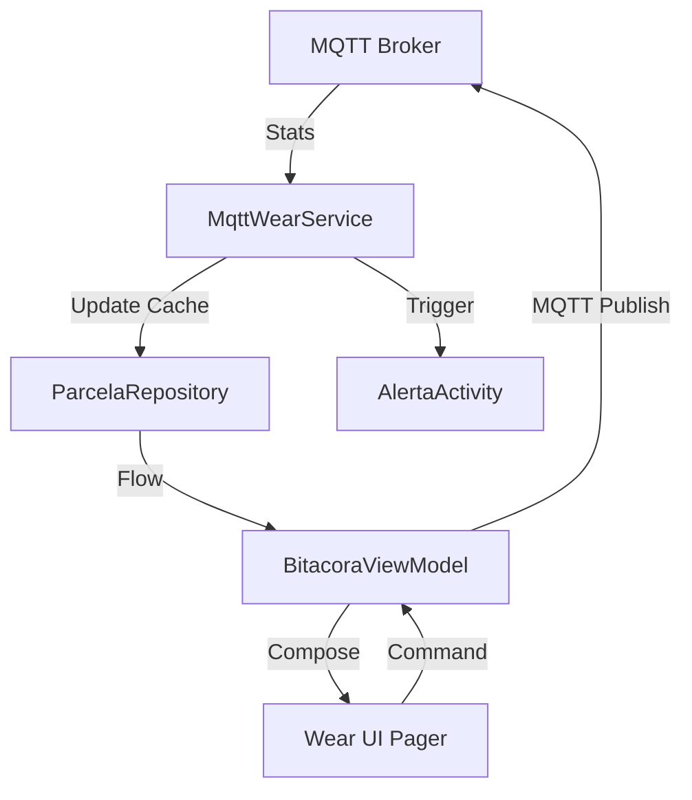

# Módulo :wear

## Descripción
El módulo `:wear` es la extensión del ecosistema EcoViñedos para relojes inteligentes con Wear OS. Su función es proporcionar al trabajador de campo un acceso rápido a las métricas de las parcelas, recibir alertas críticas de humedad de forma inmediata y permitir el control básico de los sistemas de riego desde la muñeca.

Responsabilidades principales:
*   **Alertas Críticas en Tiempo Real:** Interrupción de la pantalla para avisar sobre niveles de humedad peligrosos.
*   **Monitoreo de Telemetría:** Visualización simplificada de humedad de suelo y temperatura.
*   **Servicio Persistente:** Mantiene la conexión MQTT activa incluso cuando la interfaz de usuario está cerrada.
*   **Sincronización con Móvil:** Recibe la lista de parcelas y configuraciones mediante el Google Play Services Data Layer.

## Tecnologías y Dependencias
*   **Wear Compose:** Uso de componentes especializados para pantallas circulares y limitadas.
*   **Foreground Service:** Mantiene la escucha de sensores IoT en segundo plano.
*   **Google Play Services Wearable:** Comunicación bidireccional con el smartphone.
*   **MQTT (Shared):** Cliente adaptado para el consumo eficiente en dispositivos Wearable.
*   **Splash Screen API:** Transición fluida al iniciar la aplicación.
*   **SharedPreferences:** Caché local para persistencia de la última parcela seleccionada y lista de parcelas.

## Estructura del Módulo
```text
wear/
├── build.gradle.kts
└── src/main/
    ├── AndroidManifest.xml
    └── java/mx/utng/ecoviedos/
        ├── data/
        │   ├── mqtt/               # Servicio de monitoreo en segundo plano
        │   ├── ParcelaRepository.kt # Caché y acceso a datos locales
        │   └── WearableDataService.kt # Listener de mensajes del móvil
        ├── domain/model/           # Modelos de datos específicos
        └── presentation/
            ├── AlertaActivity.kt   # Actividad que despierta el reloj
            ├── MainActivity.kt     # Navegador principal (Pager)
            └── screens/            # Pantallas de métricas, alertas y éxito
```

## Arquitectura
El módulo utiliza una arquitectura de **Servicio de Fondo + MVVM**:
1.  **MqttWearService:** Un Foreground Service que es el corazón del módulo. Recibe datos vía MQTT, detecta condiciones críticas y dispara la `AlertaActivity`.
2.  **BitacoraViewModel:** Gestiona la lógica de la UI, comandos de riego manual y navegación entre páginas.
3.  **Data Layer:** Los repositorios sincronizan el estado entre el Service y la UI usando `StateFlow`.



---

## Código Fuente Completo

### `AndroidManifest.xml`
**Ubicación:** `wear/src/main/AndroidManifest.xml`
```xml
<?xml version="1.0" encoding="utf-8"?>
<manifest xmlns:android="http://schemas.android.com/apk/res/android">

    <uses-permission android:name="android.permission.WAKE_LOCK" />
    <uses-permission android:name="android.permission.INTERNET" />
    <uses-permission android:name="android.permission.ACCESS_NETWORK_STATE" />
    <uses-permission android:name="android.permission.RECORD_AUDIO"/>
    <uses-permission android:name="android.permission.POST_NOTIFICATIONS" />
    <uses-permission android:name="android.permission.USE_FULL_SCREEN_INTENT" />
    <uses-permission android:name="android.permission.FOREGROUND_SERVICE" />
    <uses-permission android:name="android.permission.FOREGROUND_SERVICE_DATA_SYNC" />

    <uses-feature android:name="android.hardware.type.watch" />

    <application
        android:allowBackup="true"
        android:icon="@mipmap/ic_launcher"
        android:label="@string/app_name"
        android:supportsRtl="true"
        android:theme="@android:style/Theme.DeviceDefault"
        android:usesCleartextTraffic="true">
        <uses-library
            android:name="com.google.android.wearable"
            android:required="true" />
        <uses-library
            android:name="wear-sdk"
            android:required="false" />

        <meta-data
            android:name="com.google.android.wearable.standalone"
            android:value="false" />

        <service
            android:name=".data.WearableDataService"
            android:exported="true">
            <intent-filter>
                <action android:name="com.google.android.gms.wearable.MESSAGE_RECEIVED" />
                <data android:scheme="wear" android:host="*" android:pathPrefix="/parcelas_message" />
            </intent-filter>
        </service>

        <service
            android:name=".data.mqtt.MqttWearService"
            android:foregroundServiceType="dataSync"
            android:exported="false" />

        <activity
            android:name=".presentation.MainActivity"
            android:exported="true"
            android:launchMode="singleTop"
            android:taskAffinity=""
            android:theme="@style/MainActivityTheme.Starting">
            <intent-filter>
                <action android:name="android.intent.action.MAIN" />
                <category android:name="android.intent.category.LAUNCHER" />
            </intent-filter>
        </activity>

        <activity
            android:name=".presentation.AlertaActivity"
            android:exported="false"
            android:showWhenLocked="true"
            android:turnScreenOn="true"
            android:theme="@android:style/Theme.DeviceDefault" />
    </application>
</manifest>
```

### `MqttWearService.kt`
**Ubicación:** `wear/src/main/java/mx/utng/ecoviedos/data/mqtt/MqttWearService.kt`
```kotlin
package mx.utng.ecoviedos.data.mqtt

import android.app.*
import android.content.Context
import android.content.Intent
import android.os.IBinder
import android.util.Log
import androidx.core.app.NotificationCompat
import mx.utng.ecoviedos.data.ParcelaRepository
import mx.utng.ecoviedos.domain.model.Parcela
import mx.utng.ecoviedos.presentation.AlertaActivity
import mx.utng.ecoviedos.presentation.MainActivity

/**
 * Servicio en primer plano (Foreground Service) que mantiene la conexión MQTT.
 *
 * Su responsabilidad es monitorear los sensores IoT del viñedo de forma ininterrumpida,
 * actualizar el repositorio local y disparar alertas visuales si se detecta humedad crítica.
 */
class MqttWearService : Service() {
    private var mqttManager: MqttManager? = null
    private val CHANNEL_ID = "mqtt_service_channel"
    private val NOTIFICATION_ID = 1001

    override fun onCreate() {
        super.onCreate()
        createNotificationChannel()
        startForeground(NOTIFICATION_ID, createNotification())
        initializeMqtt()
    }

    private fun createNotificationChannel() {
        if (android.os.Build.VERSION.SDK_INT >= android.os.Build.VERSION_CODES.O) {
            val channel = NotificationChannel(
                CHANNEL_ID,
                "Servicio de Monitoreo",
                NotificationManager.IMPORTANCE_LOW
            )
            val manager = getSystemService(NotificationManager::class.java)
            manager.createNotificationChannel(channel)
        }
    }

    private fun createNotification(): Notification {
        val intent = Intent(this, MainActivity::class.java)
        val pendingIntent = PendingIntent.getActivity(this, 0, intent, PendingIntent.FLAG_IMMUTABLE)

        return NotificationCompat.Builder(this, CHANNEL_ID)
            .setContentTitle("EcoViñedos")
            .setContentText("Monitoreando parcelas en tiempo real")
            .setSmallIcon(android.R.drawable.ic_menu_info_details)
            .setContentIntent(pendingIntent)
            .build()
    }

    private fun initializeMqtt() {
        mqttManager = MqttManager(
            context = this,
            onSensorsUpdated = { id, hum, temp, humsuel, riego, tiempo ->
                updateParcelaLocalmente(id, hum, temp, humsuel, riego, tiempo)
            },
            onRiegoStatusReceived = { id, activo, tiempo ->
                updateRiegoLocalmente(id, activo, tiempo)
            },
            onStatusChanged = { Log.d("MqttWearService", "MQTT Status: $it") }
        )
        mqttManager?.connect()
    }

    private fun updateParcelaLocalmente(id: String, hum: Float, temp: Float, humsuel: Float, riego: Boolean, tiempo: Int) {
        val currentParcelas = ParcelaRepository.parcelas.value.toMutableList()
        val index = currentParcelas.indexOfFirst { it.id == id }
        if (index != -1) {
            val oldParcela = currentParcelas[index]
            val nuevaRiegoActivo = if (oldParcela.riegoActivo && !riego) true else riego
            
            val updatedParcela = oldParcela.copy(
                humedad = hum,
                temperatura = temp,
                humedadSuelo = humsuel,
                riegoActivo = nuevaRiegoActivo,
                tiempoRestanteRiego = if (nuevaRiegoActivo && !riego) oldParcela.tiempoRestanteRiego else tiempo
            )
            currentParcelas[index] = updatedParcela
            ParcelaRepository.updateParcelas(currentParcelas.toList(), this)
            
            if (updatedParcela.esHumedadCritica()) {
                showUrgentAlert(updatedParcela)
            }
        }
    }

    private fun showUrgentAlert(parcela: Parcela) {
        val alertChannelId = "critical_alerts"
        val notificationManager = getSystemService(Context.NOTIFICATION_SERVICE) as NotificationManager
        
        if (android.os.Build.VERSION.SDK_INT >= android.os.Build.VERSION_CODES.O) {
            val channel = NotificationChannel(alertChannelId, "Alertas Críticas", NotificationManager.IMPORTANCE_HIGH).apply {
                enableLights(true)
                lightColor = android.graphics.Color.RED
                enableVibration(true)
            }
            notificationManager.createNotificationChannel(channel)
        }

        val fullScreenIntent = Intent(this, AlertaActivity::class.java).apply {
            putExtra("parcela_id", parcela.id)
            putExtra("parcela", parcela.nombreParcela)
            putExtra("variedad", parcela.variedad)
            putExtra("humedad", "${parcela.humedadSuelo.toInt()}%")
            flags = Intent.FLAG_ACTIVITY_NEW_TASK or Intent.FLAG_ACTIVITY_CLEAR_TOP
        }
        
        val fullScreenPendingIntent = PendingIntent.getActivity(
            this, parcela.id.hashCode(), fullScreenIntent, 
            PendingIntent.FLAG_UPDATE_CURRENT or PendingIntent.FLAG_IMMUTABLE
        )

        val notification = NotificationCompat.Builder(this, alertChannelId)
            .setSmallIcon(android.R.drawable.stat_sys_warning)
            .setContentTitle("¡Humedad Crítica!")
            .setContentText("Parcela ${parcela.nombreParcela} requiere riego.")
            .setPriority(NotificationCompat.PRIORITY_HIGH)
            .setCategory(NotificationCompat.CATEGORY_ALARM)
            .setAutoCancel(true)
            .setFullScreenIntent(fullScreenPendingIntent, true)
            .build()

        notificationManager.notify(parcela.id.hashCode(), notification)
    }

    override fun onStartCommand(intent: Intent?, flags: Int, startId: Int): Int = START_STICKY
    override fun onBind(intent: Intent?): IBinder? = null

    override fun onDestroy() {
        mqttManager?.disconnect()
        super.onDestroy()
    }
}
```

### `AlertaActivity.kt`
**Ubicación:** `wear/src/main/java/mx/utng/ecoviedos/presentation/AlertaActivity.kt`
```kotlin
package mx.utng.ecoviedos.presentation

import android.content.Intent
import android.os.Bundle
import androidx.activity.ComponentActivity
import androidx.activity.compose.setContent
import androidx.compose.foundation.layout.*
import androidx.compose.material.icons.Icons
import androidx.compose.material.icons.filled.Opacity
import androidx.compose.material.icons.filled.Visibility
import androidx.compose.runtime.Composable
import androidx.compose.ui.Alignment
import androidx.compose.ui.Modifier
import androidx.compose.ui.graphics.Color
import androidx.compose.ui.text.font.FontWeight
import androidx.compose.ui.text.style.TextAlign
import androidx.compose.ui.unit.dp
import androidx.compose.ui.unit.sp
import androidx.wear.compose.material3.*
import mx.utng.ecoviedos.presentation.theme.AppTheme

/**
 * Actividad de máxima prioridad que aparece cuando una parcela requiere riego urgente.
 *
 * Utiliza flags de ventana para despertar la pantalla e interrumpir el estado actual del reloj.
 */
class AlertaActivity : ComponentActivity() {

    override fun onCreate(savedInstanceState: Bundle?) {
        super.onCreate(savedInstanceState)
        
        window.addFlags(android.view.WindowManager.LayoutParams.FLAG_KEEP_SCREEN_ON or
                       android.view.WindowManager.LayoutParams.FLAG_SHOW_WHEN_LOCKED or
                       android.view.WindowManager.LayoutParams.FLAG_TURN_SCREEN_ON)

        val parcelaId = intent.getStringExtra("parcela_id") ?: ""
        val nombre = intent.getStringExtra("parcela") ?: "Parcela desconocida"
        val variedad = intent.getStringExtra("variedad") ?: ""
        val humedad = intent.getStringExtra("humedad") ?: "0%"

        setContent {
            AppTheme {
                AlertUI(
                    nombre = nombre,
                    variedad = variedad,
                    humedad = humedad,
                    onVerParcela = {
                        val mainIntent = Intent(this, MainActivity::class.java).apply {
                            putExtra("navigate_to_parcel", parcelaId)
                            flags = Intent.FLAG_ACTIVITY_NEW_TASK or Intent.FLAG_ACTIVITY_CLEAR_TOP
                        }
                        startActivity(mainIntent)
                        finish()
                    },
                    onCerrar = { finish() }
                )
            }
        }
    }
}

@Composable
fun AlertUI(nombre: String, variedad: String, humedad: String, onVerParcela: () -> Unit, onCerrar: () -> Unit) {
    Box(modifier = Modifier.fillMaxSize().padding(8.dp), contentAlignment = Alignment.Center) {
        Column(horizontalAlignment = Alignment.CenterHorizontally, verticalArrangement = Arrangement.spacedBy(4.dp)) {
            Icon(Icons.Default.Opacity, contentDescription = null, tint = Color.Red, modifier = Modifier.size(24.dp))
            Text("ALERTA URGENTE", color = Color.Red, style = MaterialTheme.typography.labelMedium, fontWeight = FontWeight.Bold)
            Text(nombre, style = MaterialTheme.typography.titleMedium, textAlign = TextAlign.Center, fontWeight = FontWeight.Bold)
            if (variedad.isNotBlank()) Text(variedad, style = MaterialTheme.typography.labelSmall, color = Color.Gray)
            Text("Humedad: $humedad", color = Color.White, fontSize = 14.sp)
            Spacer(modifier = Modifier.height(8.dp))
            Row(modifier = Modifier.fillMaxWidth(), horizontalArrangement = Arrangement.SpaceEvenly) {
                Button(onClick = onCerrar, colors = ButtonDefaults.buttonColors(containerColor = Color.DarkGray), modifier = Modifier.size(42.dp)) { Text("X") }
                Button(onClick = onVerParcela, colors = ButtonDefaults.buttonColors(containerColor = Color(0xFFB4F391)), modifier = Modifier.size(42.dp)) {
                    Icon(Icons.Default.Visibility, contentDescription = "Ver", tint = Color.Black, modifier = Modifier.size(18.dp))
                }
            }
        }
    }
}
```

---

    }
}

### `BitacoraViewModel.kt`
**Ubicación:** `wear/src/main/java/mx/utng/ecoviedos/presentation/screens/BitacoraViewModel.kt`
```kotlin
package mx.utng.ecoviedos.presentation.screens

import android.app.Application
import android.content.Context
import androidx.lifecycle.AndroidViewModel
import androidx.lifecycle.viewModelScope
import kotlinx.coroutines.Dispatchers
import kotlinx.coroutines.Job
import kotlinx.coroutines.delay
import kotlinx.coroutines.flow.MutableStateFlow
import kotlinx.coroutines.flow.StateFlow
import kotlinx.coroutines.flow.asStateFlow
import kotlinx.coroutines.launch
import mx.utng.ecoviedos.data.ParcelaRepository
import mx.utng.ecoviedos.data.mqtt.MqttManager
import mx.utng.ecoviedos.domain.model.Parcela
import java.util.Date

/**
 * ViewModel central para la App de Wear OS.
 *
 * Gestiona la selección de parcelas, temporizadores de riego locales y comandos
 * de activación de válvulas hacia el broker MQTT.
 */
class BitacoraViewModel(
    application: Application
) : AndroidViewModel(application) {

    private val _uiState = MutableStateFlow(BitacoraUiState())
    val uiState: StateFlow<BitacoraUiState> = _uiState.asStateFlow()

    private val _selectedParcelId = MutableStateFlow("")
    val selectedParcelId: StateFlow<String> = _selectedParcelId.asStateFlow()

    private val _showAllParcels = MutableStateFlow(false)
    val showAllParcels: StateFlow<Boolean> = _showAllParcels.asStateFlow()

    private val prefs = application.getSharedPreferences("parcela_cache", Context.MODE_PRIVATE)
    private var irrigationTimerJob: Job? = null
    
    private val mqttManager = MqttManager(
        context = application,
        onSensorsUpdated = { _, _, _, _, _, _ -> },
        onRiegoStatusReceived = { _, _, _ -> },
        onStatusChanged = { }
    )

    init {
        viewModelScope.launch {
            _selectedParcelId.value = prefs.getString("last_parcel_id", "") ?: ""
            
            ParcelaRepository.parcelas.collect { parcelas ->
                if (parcelas.isNotEmpty() && _selectedParcelId.value.isBlank()) {
                    _selectedParcelId.value = parcelas.first().id
                }
                _uiState.value = _uiState.value.copy(parcelas = parcelas)
                startIrrigationTimer()
            }
        }
        viewModelScope.launch(Dispatchers.IO) { mqttManager.connect() }
    }

    private fun startIrrigationTimer() {
        irrigationTimerJob?.cancel()
        irrigationTimerJob = viewModelScope.launch(Dispatchers.Default) {
            while (true) {
                delay(1000)
                val currentParcelas = _uiState.value.parcelas
                if (currentParcelas.any { it.riegoActivo }) {
                    val updatedList = currentParcelas.map { parcela ->
                        if (parcela.riegoActivo) {
                            val nextTime = parcela.tiempoRestanteRiego - 1
                            if (nextTime <= 0 && parcela.tipoRiego == "AUTO") {
                                parcela.copy(tiempoRestanteRiego = 0, riegoActivo = false)
                            } else {
                                parcela.copy(tiempoRestanteRiego = nextTime)
                            }
                        } else parcela
                    }
                    _uiState.value = _uiState.value.copy(parcelas = updatedList)
                }
            }
        }
    }

    fun seleccionarParcela(idParcela: String) {
        _selectedParcelId.value = idParcela
        prefs.edit().putString("last_parcel_id", idParcela).apply()
    }

    fun toggleShowAllParcels() {
        _showAllParcels.value = !_showAllParcels.value
    }

    fun activarRiego(idParcela: String) {
        mqttManager.activarRiego(idParcela, "ON", 10)
    }

    fun detenerRiego(idParcela: String) {
        mqttManager.activarRiego(idParcela, "OFF", 0)
    }

    override fun onCleared() {
        super.onCleared()
        mqttManager.disconnect()
    }
}
```

    }
}

### `ParcelaRepository.kt` (Wear Cache)
**Ubicación:** `wear/src/main/java/mx/utng/ecoviedos/data/ParcelaRepository.kt`
```kotlin
package mx.utng.ecoviedos.data

import android.content.Context
import com.google.gson.Gson
import com.google.gson.reflect.TypeToken
import kotlinx.coroutines.flow.MutableStateFlow
import kotlinx.coroutines.flow.StateFlow
import mx.utng.ecoviedos.domain.model.Parcela
import java.util.Date

/**
 * Gestor de persistencia local para el reloj.
 *
 * Almacena la lista de parcelas recibida del móvil o MQTT en SharedPreferences
 * para permitir una carga instantánea al abrir la aplicación sin esperar sincronización.
 */
object ParcelaRepository {
    private val _parcelas = MutableStateFlow<List<Parcela>>(emptyList())
    val parcelas: StateFlow<List<Parcela>> = _parcelas

    fun init(context: Context) {
        val prefs = context.getSharedPreferences("parcela_cache", Context.MODE_PRIVATE)
        val json = prefs.getString("parcelas_list", null)
        if (!json.isNullOrBlank()) {
            try {
                val type = object : TypeToken<List<Parcela>>() {}.type
                _parcelas.value = Gson().fromJson(json, type)
            } catch (e: Exception) {}
        }
    }

    fun updateParcelas(newList: List<Parcela>, context: Context? = null) {
        _parcelas.value = newList
        context?.let {
            val prefs = it.getSharedPreferences("parcela_cache", Context.MODE_PRIVATE)
            prefs.edit().putString("parcelas_list", Gson().toJson(newList)).apply()
        }
    }
}
```

## Explicación de Archivos Relevantes

| Archivo | Responsabilidad |
| :--- | :--- |
| `MqttWearService.kt` | Mantiene la conexión MQTT y detecta niveles críticos de humedad. |
| `AlertaActivity.kt` | Interfaz de usuario que se dispara automáticamente en emergencias. |
| `ParcelaRepository.kt` | Gestiona el almacenamiento local (`parcelas_list`) y la caché de la última selección. |
| `WearableDataService.kt` | Escucha mensajes del teléfono (usualmente actualizaciones masivas de configuración). |
| `MyParcelsScreen.kt` | Lista de parcelas filtrada por aquellas que tienen un nodo IoT configurado. |
| `ParcelDetailScreen.kt` | Muestra la humedad del suelo de forma prominente para lectura rápida. |

## Flujo de Funcionamiento
1.  **Sincronización:** El móvil envía la lista de parcelas al reloj. `WearableDataService` las guarda en caché.
2.  **Monitoreo:** `MqttWearService` se conecta al broker y recibe lecturas cada 10-15 segundos.
3.  **Alerta:** Si la humedad del suelo baja del umbral (ej. 40%), se lanza `AlertaActivity`.
4.  **Acción:** El trabajador activa el riego manual desde el reloj. El comando se envía vía MQTT.

## Ejecución
1.  Utiliza un emulador de **Wear OS 4 (Round)**.
2.  Asegúrate de que el emulador del teléfono y el del reloj estén emparejados.
3.  Ejecuta el módulo `:wear`. Verás una notificación persistente indicando que el monitoreo está activo.

## Comunicación
El reloj se comunica principalmente vía **MQTT directo** (Broker HiveMQ) para la telemetría de sensores, y utiliza el **Data Layer** de Google para recibir metadatos pesados desde el smartphone del administrador.
